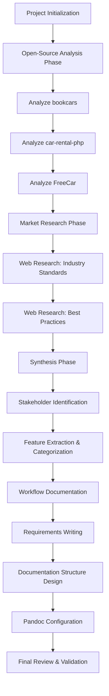

# Design Document: Car Rental System Planning & Analysis

## Overview

This design document outlines the comprehensive approach for the planning and analysis phase of a car rental system graduation project. The planning phase serves as the foundation for a full-stack implementation by systematically analyzing existing solutions, researching industry standards, identifying stakeholders, documenting workflows, and producing academic-quality requirements documentation.

The design follows a structured, research-driven methodology that combines:
- **Comparative Analysis**: Examining three distinct open-source implementations (bookcars, car-rental-php, FreeCar) to extract proven patterns and features
- **Market Research**: Investigating industry standards, emerging trends, and competitive features through web-based research
- **Stakeholder-Centric Design**: Identifying all user types and their needs across the rental ecosystem
- **Workflow Documentation**: Creating visual representations of user journeys and system processes
- **Academic Rigor**: Producing modular, well-structured documentation suitable for graduation project submission

The output will be a comprehensive requirements specification that abstracts away technology choices while capturing essential features, architectural patterns, and business logic needed for a modern car rental platform.

## Architecture

### High-Level Process Flow

The planning phase follows a sequential, iterative process:



### Analysis Methodology

#### Project Analysis Approach (Hybrid)

For each open-source project, the analysis combines two perspectives:

1. **Feature Analysis**: What capabilities does the system provide?
   - User-facing features (search, booking, payment)
   - Administrative features (fleet management, reporting)
   - Integration features (payment gateways, notifications)

2. **Architectural Pattern Analysis**: How is the system structured?
   - Technology stack (abstracted to patterns, not specific to tech)
   - Service decomposition (monolithic vs microservices)
   - Data modeling approaches
   - Authentication and authorization patterns
   - API design patterns

This hybrid approach ensures we capture both "what" the system does and "how" it's organized, providing richer insights for the graduation project.

#### Research Integration Strategy

Market research complements project analysis by:
- Validating features found in open-source projects
- Identifying missing features from industry leaders
- Understanding emerging trends (EV rentals, subscription models, AI-driven pricing)
- Documenting compliance requirements (PCI-DSS, GDPR, insurance regulations)

### Documentation Architecture

#### Modular Structure Principle

Documentation will be organized into focused, single-purpose files rather than monolithic documents:

**Rationale**:
- **Maintainability**: Easier to update specific sections without navigating large files
- **Collaboration**: Multiple team members can work on different sections
- **Reusability**: Individual sections can be referenced or reused independently
- **Academic Standards**: Aligns with structured thesis/project documentation practices
- **Pandoc Compatibility**: Modular files can be combined in different orders for different outputs

**Structure Emergence**:
Rather than imposing a rigid template upfront, the documentation structure will emerge organically from the analysis findings. This ensures the organization reflects actual content rather than forcing content into predetermined categories.

#### Pandoc Integration

All documentation will be markdown-based with pandoc compatibility:
- YAML frontmatter for metadata
- Consistent heading hierarchy
- Mermaid diagrams for visual workflows
- Cross-references between documents
- Build script for PDF generation

## Components and Interfaces

### Component 1: Project Analyzer

**Purpose**: Systematically analyze each open-source car rental project to extract features and architectural patterns.

**Inputs**:
- Project source code repository
- README and documentation files
- Database schemas (if available)
- Configuration files

**Processing Logic**:
1. **Repository Exploration**: Navigate project structure to identify key components
2. **README Analysis**: Extract high-level features and architecture description
3. **Code Structure Analysis**: Identify service boundaries, data models, API endpoints
4. **Feature Extraction**: List all user-facing and administrative capabilities
5. **Pattern Identification**: Document architectural decisions (monolithic vs microservices, authentication approach, data storage patterns)
6. **Technology Abstraction**: Convert technology-specific implementations to generic patterns

**Outputs**:
- Project analysis report (markdown)
- Feature list (technology-agnostic)
- Architectural pattern summary
- Lessons learned and best practices

**Analysis Sequence**:
1. **bookcars** (Node.js/TypeScript, MongoDB, Multi-platform)
2. **car-rental-php** (PHP, MySQL, Monolithic)
3. **FreeCar** (Go, Microservices, Cloud-native)

This sequence progresses from full-featured modern platform → simple educational project → advanced cloud-native architecture.

### Component 2: Market Researcher

**Purpose**: Conduct web-based research to identify industry standards, competitive features, and best practices.

**Research Areas**:

1. **Industry Standards**:
   - ACRISS car classification codes
   - Payment gateway integration standards
   - Insurance and liability requirements
   - Data protection regulations (GDPR, CCPA)

2. **Competitive Features**:
   - Leading platforms (Enterprise, Hertz, Turo, Zipcar)
   - Emerging trends (subscription models, peer-to-peer, EV focus)
   - Mobile-first experiences
   - Dynamic pricing strategies

3. **User Experience Best Practices**:
   - Booking flow optimization
   - Search and filter patterns
   - Mobile app design patterns
   - Accessibility standards

4. **Operational Excellence**:
   - Fleet management approaches
   - Maintenance scheduling
   - Multi-location operations
   - Supplier/vendor integration

**Research Process**:
1. Formulate search queries based on requirements
2. Execute web searches using available tools
3. Review and filter results for relevance and authority
4. Extract key insights while respecting content licensing
5. Cite sources with URLs
6. Synthesize findings into structured markdown

**Outputs**:
- Market research report (markdown)
- Industry standards summary
- Competitive feature matrix
- Best practices catalog

### Component 3: Stakeholder Analyzer

**Purpose**: Identify all stakeholders in the car rental ecosystem and document their needs, goals, and pain points.

**Stakeholder Categories**:

1. **Primary Users** (direct system interaction):
   - Individual customers (leisure, business)
   - Corporate clients (bulk bookings, contracts)
   - Subscription users (recurring rentals)
   - Mobile app users
   - Web users

2. **Operational Staff**:
   - System administrators
   - Fleet managers
   - Customer support agents
   - Maintenance coordinators
   - Location managers

3. **Business Stakeholders**:
   - Suppliers (in multi-supplier model)
   - Insurance providers
   - Payment processors
   - Marketing teams
   - Finance/accounting teams

4. **External Integrations**:
   - Mapping services (Google Maps, etc.)
   - Payment gateways (Stripe, PayPal)
   - SMS/email providers
   - Analytics platforms

**Analysis Framework**:
For each stakeholder:
- **Role**: Title and primary responsibility
- **Goals**: What they want to achieve
- **Pain Points**: Current challenges and frustrations
- **Key Interactions**: How they use the system
- **Success Metrics**: How to measure their satisfaction
- **Priority**: Primary vs secondary stakeholder

**Outputs**:
- Stakeholder analysis document (markdown)
- Stakeholder-feature mapping matrix
- Priority classification

### Component 4: Workflow Documenter

**Purpose**: Create comprehensive documentation of user scenarios and system workflows with visual diagrams.

**Workflow Types**:

1. **Core Rental Workflows**:
   - Vehicle search and filtering
   - Booking creation and modification
   - Payment processing
   - Vehicle pickup
   - Vehicle return
   - Damage reporting

2. **Administrative Workflows**:
   - Fleet management (add/remove vehicles)
   - Pricing updates
   - Location management
   - User management
   - Report generation

3. **Exceptional Workflows**:
   - Booking cancellation
   - Booking modification
   - Late return handling
   - Damage claim processing
   - Customer dispute resolution

**Documentation Format**:

Each workflow includes:
- **Scenario Name**: Descriptive title
- **Stakeholder**: Who performs this workflow
- **Goal**: What they want to accomplish
- **Preconditions**: Required state before starting
- **Steps**: Numbered sequence of actions
- **Postconditions**: Expected state after completion
- **Exceptions**: Error cases and alternative paths
- **Mermaid Diagram**: Visual representation

**Diagram Types**:
- **Flowcharts**: For decision-based processes
- **Sequence Diagrams**: For multi-actor interactions
- **State Diagrams**: For entity lifecycle (booking states, vehicle states)

**Outputs**:
- Workflow documentation (markdown with embedded Mermaid)
- Diagram collection
- Cross-references to requirements

### Component 5: Feature Cataloger

**Purpose**: Create a comprehensive, categorized inventory of all features for the target car rental system.

**Feature Sources**:
1. Features extracted from bookcars analysis
2. Features extracted from car-rental-php analysis
3. Features extracted from FreeCar analysis
4. Features identified through market research
5. Features derived from stakeholder needs

**Categorization Scheme**:

1. **User-Facing Features**:
   - Search and discovery
   - Booking management
   - Payment and billing
   - Account management
   - Notifications and communication

2. **Mobile-Specific Features**:
   - Push notifications
   - Offline mode
   - Location services
   - Camera integration (license scanning)
   - Mobile payments (Apple Pay, Google Pay)

3. **Administrative Features**:
   - Fleet management
   - User management
   - Supplier management (multi-supplier mode)
   - Location management
   - Pricing management

4. **Operational Features**:
   - Vehicle tracking
   - Maintenance scheduling
   - Availability management
   - Reporting and analytics
   - Audit logging

5. **Integration Features**:
   - Payment gateway integration
   - Mapping services integration
   - Email/SMS notifications
   - Insurance provider integration
   - Analytics integration

6. **Security Features**:
   - Authentication (email, social login)
   - Authorization (role-based access)
   - Data encryption
   - Audit trails
   - Fraud detection

**Feature Documentation Format**:
For each feature:
- **Feature Name**: Clear, descriptive title
- **Description**: What the feature does
- **Stakeholder Benefit**: Who benefits and how
- **Priority**: Must-have, Should-have, Nice-to-have
- **Source**: Which project(s) or research identified this
- **Related Requirements**: Cross-reference to requirements document

**Deduplication Strategy**:
- Identify duplicate features across sources
- Merge similar features with different names
- Maintain cross-references to original sources
- Note variations in implementation approaches

**Outputs**:
- Feature catalog (markdown)
- Feature-stakeholder mapping
- Feature priority matrix
- Feature-requirement traceability

### Component 6: Requirements Writer

**Purpose**: Transform analysis findings into a formal, EARS-compliant requirements document for the target car rental system.

**Requirements Organization**:

1. **Functional Requirements**:
   - User management and authentication
   - Vehicle search and filtering
   - Booking management
   - Payment processing
   - Fleet management
   - Location management
   - Reporting and analytics
   - Notifications

2. **Non-Functional Requirements**:
   - Performance (response times, throughput)
   - Scalability (concurrent users, data volume)
   - Security (authentication, authorization, encryption)
   - Usability (accessibility, mobile-first)
   - Reliability (uptime, error handling)
   - Maintainability (code quality, documentation)

3. **Integration Requirements**:
   - Payment gateway integration
   - Mapping services integration
   - Email/SMS services integration
   - Analytics integration

4. **Compliance Requirements**:
   - Data protection (GDPR, CCPA)
   - Payment security (PCI-DSS)
   - Accessibility (WCAG)
   - Insurance regulations

**EARS Pattern Application**:

Each requirement follows one of the EARS patterns:
- **Ubiquitous**: THE System SHALL [capability]
- **Event-driven**: WHEN [trigger], THE System SHALL [response]
- **State-driven**: WHILE [condition], THE System SHALL [response]
- **Unwanted event**: IF [error condition], THEN THE System SHALL [response]
- **Optional feature**: WHERE [option], THE System SHALL [response]

**Requirements Traceability**:
- Link requirements to stakeholder needs
- Link requirements to features
- Link requirements to workflows
- Link requirements to source projects

**Outputs**:
- Requirements document (markdown, EARS-compliant)
- Requirements traceability matrix
- Glossary of terms

### Component 7: Documentation Structurer

**Purpose**: Organize all documentation artifacts into a professional, maintainable Docusaurus documentation site suitable for academic submission and web publishing.

**Architecture Decision: Docusaurus Documentation Site**

The documentation will be structured as a Docusaurus project (using Bun as package manager) for several key advantages:
- **Professional Presentation**: Modern, searchable documentation website
- **Modular Structure**: Natural organization into sections and subsections
- **Version Control**: Built-in versioning support for documentation iterations
- **Export Capabilities**: Can generate static site and PDF outputs
- **Academic Quality**: Professional appearance suitable for graduation project submission
- **Collaboration**: Easy for team members to contribute and review
- **Extensibility**: Can add interactive elements, diagrams, and code examples

**Project Structure**:

```
car-rental-planning/                    # Root project directory
├── cloned-opensource-projects/         # Subdirectory for reference projects
│   ├── bookcars/
│   ├── car-rental-php/
│   └── FreeCar/
├── docs/                               # Docusaurus documentation root
│   ├── intro.md                        # Landing page
│   ├── methodology/
│   │   ├── _category_.json
│   │   ├── overview.md
│   │   ├── analysis-approach.md
│   │   └── research-methodology.md
│   ├── analysis/
│   │   ├── _category_.json
│   │   ├── overview.md
│   │   ├── bookcars/
│   │   │   ├── _category_.json
│   │   │   ├── overview.md
│   │   │   ├── architecture.md
│   │   │   ├── features-user.md
│   │   │   ├── features-admin.md
│   │   │   ├── features-mobile.md
│   │   │   ├── data-models.md
│   │   │   ├── authentication.md
│   │   │   ├── payment-integration.md
│   │   │   └── lessons-learned.md
│   │   ├── car-rental-php/
│   │   │   ├── _category_.json
│   │   │   ├── overview.md
│   │   │   ├── architecture.md
│   │   │   ├── features.md
│   │   │   ├── database-schema.md
│   │   │   └── lessons-learned.md
│   │   ├── freecar/
│   │   │   ├── _category_.json
│   │   │   ├── overview.md
│   │   │   ├── microservices-architecture.md
│   │   │   ├── service-breakdown.md
│   │   │   ├── features-api.md
│   │   │   ├── features-miniprogram.md
│   │   │   ├── cloud-native-patterns.md
│   │   │   └── lessons-learned.md
│   │   └── comparative-analysis.md
│   ├── research/
│   │   ├── _category_.json
│   │   ├── overview.md
│   │   ├── industry-standards/
│   │   │   ├── _category_.json
│   │   │   ├── acriss-codes.md
│   │   │   ├── payment-standards.md
│   │   │   └── compliance-regulations.md
│   │   ├── market-trends/
│   │   │   ├── _category_.json
│   │   │   ├── subscription-models.md
│   │   │   ├── ev-rentals.md
│   │   │   ├── mobile-first.md
│   │   │   └── ai-pricing.md
│   │   ├── competitive-analysis/
│   │   │   ├── _category_.json
│   │   │   ├── enterprise-hertz.md
│   │   │   ├── turo-zipcar.md
│   │   │   └── feature-matrix.md
│   │   └── best-practices/
│   │       ├── _category_.json
│   │       ├── ux-patterns.md
│   │       ├── booking-flows.md
│   │       ├── fleet-management.md
│   │       └── operational-excellence.md
│   ├── stakeholders/
│   │   ├── _category_.json
│   │   ├── overview.md
│   │   ├── primary-users/
│   │   │   ├── _category_.json
│   │   │   ├── individual-customers.md
│   │   │   ├── corporate-clients.md
│   │   │   └── subscription-users.md
│   │   ├── operational-staff/
│   │   │   ├── _category_.json
│   │   │   ├── administrators.md
│   │   │   ├── fleet-managers.md
│   │   │   └── support-agents.md
│   │   ├── business-stakeholders/
│   │   │   ├── _category_.json
│   │   │   ├── suppliers.md
│   │   │   ├── insurance-providers.md
│   │   │   └── payment-processors.md
│   │   └── stakeholder-mapping.md
│   ├── workflows/
│   │   ├── _category_.json
│   │   ├── overview.md
│   │   ├── core-rental/
│   │   │   ├── _category_.json
│   │   │   ├── vehicle-search.md
│   │   │   ├── booking-creation.md
│   │   │   ├── payment-processing.md
│   │   │   ├── vehicle-pickup.md
│   │   │   └── vehicle-return.md
│   │   ├── administrative/
│   │   │   ├── _category_.json
│   │   │   ├── fleet-management.md
│   │   │   ├── pricing-updates.md
│   │   │   ├── user-management.md
│   │   │   └── reporting.md
│   │   └── exceptional/
│   │       ├── _category_.json
│   │       ├── cancellations.md
│   │       ├── modifications.md
│   │       └── damage-claims.md
│   ├── features/
│   │   ├── _category_.json
│   │   ├── overview.md
│   │   ├── user-facing/
│   │   │   ├── _category_.json
│   │   │   ├── search-discovery.md
│   │   │   ├── booking-management.md
│   │   │   ├── payment-billing.md
│   │   │   └── account-management.md
│   │   ├── mobile-specific/
│   │   │   ├── _category_.json
│   │   │   ├── push-notifications.md
│   │   │   ├── offline-mode.md
│   │   │   └── mobile-payments.md
│   │   ├── administrative/
│   │   │   ├── _category_.json
│   │   │   ├── fleet-management.md
│   │   │   ├── user-management.md
│   │   │   └── pricing-management.md
│   │   ├── operational/
│   │   │   ├── _category_.json
│   │   │   ├── vehicle-tracking.md
│   │   │   ├── maintenance-scheduling.md
│   │   │   └── analytics-reporting.md
│   │   ├── integration/
│   │   │   ├── _category_.json
│   │   │   ├── payment-gateways.md
│   │   │   ├── mapping-services.md
│   │   │   └── notification-services.md
│   │   ├── security/
│   │   │   ├── _category_.json
│   │   │   ├── authentication.md
│   │   │   ├── authorization.md
│   │   │   └── data-protection.md
│   │   └── feature-prioritization.md
│   ├── requirements/
│   │   ├── _category_.json
│   │   ├── overview.md
│   │   ├── functional/
│   │   │   ├── _category_.json
│   │   │   ├── user-management.md
│   │   │   ├── vehicle-search.md
│   │   │   ├── booking-management.md
│   │   │   ├── payment-processing.md
│   │   │   ├── fleet-management.md
│   │   │   └── reporting-analytics.md
│   │   ├── non-functional/
│   │   │   ├── _category_.json
│   │   │   ├── performance.md
│   │   │   ├── scalability.md
│   │   │   ├── security.md
│   │   │   ├── usability.md
│   │   │   └── reliability.md
│   │   ├── integration/
│   │   │   ├── _category_.json
│   │   │   ├── payment-gateways.md
│   │   │   ├── mapping-services.md
│   │   │   └── notification-services.md
│   │   └── compliance/
│   │       ├── _category_.json
│   │       ├── data-protection.md
│   │       ├── payment-security.md
│   │       └── accessibility.md
│   └── appendices/
│       ├── _category_.json
│       ├── glossary.md
│       ├── references.md
│       ├── traceability-matrix.md
│       └── methodology-details.md
├── static/
│   └── img/
│       ├── diagrams/
│       └── screenshots/
├── docusaurus.config.js
├── sidebars.js
├── package.json
└── bun.lockb
```

**Docusaurus Configuration**:

The `docusaurus.config.js` will include:
- Project metadata (title, tagline, authors)
- Theme configuration (colors, fonts)
- Navbar with main sections
- Footer with links and copyright
- Search functionality
- PDF export plugin configuration
- Mermaid diagram support

**Category Configuration**:

Each `_category_.json` file defines section metadata:
```json
{
  "label": "Section Name",
  "position": 1,
  "link": {
    "type": "generated-index",
    "description": "Section description"
  }
}
```

**File Organization Principles**:

1. **Modular by Project**: Each open-source project gets its own subdirectory with multiple focused files
2. **Modular by Topic**: Research, stakeholders, workflows, features, and requirements are broken into logical subsections
3. **File Size**: Target 150-300 lines per file, maximum 400 lines
4. **Single Responsibility**: Each file covers one specific topic or aspect
5. **Clear Hierarchy**: 3-level maximum depth (section → subsection → document)

**Naming Conventions**:
- Use kebab-case for all file and directory names
- Use descriptive, self-explanatory names
- Keep names under 40 characters
- Use `_category_.json` for section metadata
- Use `overview.md` for section introductions

**Cross-Referencing**:
- Use Docusaurus-style relative links: `[Link Text](../other-section/document.md)`
- Maintain bidirectional references in related documents
- Use "See also" sections for related content
- Create index pages with links to subsections

**Metadata Standards**:
Each markdown file includes frontmatter:
```yaml
---
sidebar_position: 1
title: Document Title
description: Brief description for SEO and previews
tags: [tag1, tag2, tag3]
---
```

**Build and Export**:
- `bun run start`: Development server with hot reload
- `bun run build`: Production build for static hosting
- `bun run serve`: Preview production build
- PDF export via plugin for academic submission

**Outputs**:
- Professional Docusaurus documentation site
- Modular, maintainable file structure
- Searchable, navigable documentation
- Exportable to PDF for submission
- Version-controlled documentation source

### Component 8: Docusaurus Configurator & PDF Exporter

**Purpose**: Configure Docusaurus for professional documentation presentation and enable PDF export for academic submission.

**Docusaurus Setup**:

1. **Project Initialization**:
   - Use Bun as package manager for faster builds
   - Initialize with `bunx create-docusaurus@latest car-rental-planning classic --typescript`
   - Move generated files to project root
   - Configure to use `docs/` directory for content

2. **Configuration (`docusaurus.config.js`)**:
   ```javascript
   module.exports = {
     title: 'Car Rental System Planning & Analysis',
     tagline: 'Graduation Project Documentation',
     url: 'https://your-domain.com',
     baseUrl: '/',
     organizationName: 'your-org',
     projectName: 'car-rental-planning',
     
     themeConfig: {
       navbar: {
         title: 'Car Rental Planning',
         items: [
           {to: '/docs/intro', label: 'Documentation', position: 'left'},
           {to: '/docs/analysis/overview', label: 'Analysis', position: 'left'},
           {to: '/docs/requirements/overview', label: 'Requirements', position: 'left'},
         ],
       },
       footer: {
         style: 'dark',
         copyright: `Copyright © ${new Date().getFullYear()} Car Rental Planning Project`,
       },
     },
     
     presets: [
       [
         '@docusaurus/preset-classic',
         {
           docs: {
             sidebarPath: require.resolve('./sidebars.js'),
             editUrl: 'https://github.com/your-repo/edit/main/',
           },
           theme: {
             customCss: require.resolve('./src/css/custom.css'),
           },
         },
       ],
     ],
     
     markdown: {
       mermaid: true,
     },
     themes: ['@docusaurus/theme-mermaid'],
   };
   ```

3. **Sidebar Configuration (`sidebars.js`)**:
   ```javascript
   module.exports = {
     docs: [
       'intro',
       {
         type: 'category',
         label: 'Methodology',
         items: ['methodology/overview', 'methodology/analysis-approach', 'methodology/research-methodology'],
       },
       {
         type: 'category',
         label: 'Project Analysis',
         items: [
           'analysis/overview',
           {
             type: 'category',
             label: 'BookCars',
             items: ['analysis/bookcars/overview', 'analysis/bookcars/architecture', /* ... */],
           },
           {
             type: 'category',
             label: 'Car Rental PHP',
             items: ['analysis/car-rental-php/overview', /* ... */],
           },
           {
             type: 'category',
             label: 'FreeCar',
             items: ['analysis/freecar/overview', /* ... */],
           },
           'analysis/comparative-analysis',
         ],
       },
       // ... other sections
     ],
   };
   ```

**PDF Export Configuration**:

1. **Plugin Installation**:
   ```bash
   bun add docusaurus-prince-pdf
   ```

2. **PDF Plugin Configuration**:
   ```javascript
   plugins: [
     [
       'docusaurus-prince-pdf',
       {
         princeArgs: [
           '--pdf-title="Car Rental System Planning & Analysis"',
           '--pdf-author="Your Name"',
           '--pdf-subject="Graduation Project Documentation"',
         ],
         output: 'car-rental-planning.pdf',
       },
     ],
   ],
   ```

3. **PDF Styling** (`src/css/pdf.css`):
   - Academic-standard margins (1 inch)
   - Professional fonts (Times New Roman for body, Arial for headings)
   - Page numbers in footer
   - Chapter breaks on new pages
   - Table of contents with page numbers
   - Proper heading hierarchy

**Mermaid Diagram Support**:

1. **Configuration**:
   - Enable Mermaid theme in `docusaurus.config.js`
   - Configure diagram styling in custom CSS
   - Ensure diagrams render in both web and PDF

2. **Diagram Types Supported**:
   - Flowcharts for decision-based workflows
   - Sequence diagrams for multi-actor interactions
   - State diagrams for entity lifecycles
   - Class diagrams for data models
   - ER diagrams for database schemas

**Build Commands**:

```json
{
  "scripts": {
    "start": "docusaurus start",
    "build": "docusaurus build",
    "serve": "docusaurus serve",
    "pdf": "docusaurus-prince-pdf -u http://localhost:3000",
    "validate": "docusaurus validate",
    "clear": "docusaurus clear"
  }
}
```

**Build Process**:

1. **Development**: `bun run start`
   - Hot reload for live editing
   - Instant preview of changes
   - Mermaid diagrams render in real-time

2. **Validation**: `bun run validate`
   - Check markdown syntax
   - Validate internal links
   - Verify frontmatter completeness
   - Check for broken references

3. **Production Build**: `bun run build`
   - Generate static site
   - Optimize assets
   - Minify CSS/JS
   - Generate search index

4. **PDF Generation**: `bun run pdf`
   - Start local server
   - Crawl all documentation pages
   - Render Mermaid diagrams
   - Generate single PDF with TOC
   - Include page numbers and headers

**Quality Checks**:

1. **Pre-build Validation**:
   - All markdown files have valid frontmatter
   - All internal links resolve correctly
   - All Mermaid diagrams have valid syntax
   - No files exceed 400-line limit
   - All images referenced exist

2. **Post-build Validation**:
   - Static site builds without errors
   - All pages accessible
   - Search functionality works
   - PDF generates successfully
   - PDF contains all sections with proper formatting

**Outputs**:
- Configured Docusaurus project
- Professional documentation website
- Exportable PDF for academic submission
- Build scripts and documentation
- Validation tools for quality assurance

## Data Models

### Analysis Data Model

**Project Analysis Record**:
```
ProjectAnalysis:
  - project_name: string
  - repository_url: string
  - technology_stack: list<string>
  - architecture_type: enum(monolithic, microservices, serverless)
  - features: list<Feature>
  - architectural_patterns: list<Pattern>
  - data_models: list<DataModel>
  - lessons_learned: list<string>
  - analysis_date: date
```

**Feature Record**:
```
Feature:
  - feature_id: string
  - name: string
  - description: string
  - category: enum(user_facing, admin, operational, integration, security)
  - source_project: string
  - technology_agnostic_description: string
  - stakeholder_benefit: string
  - priority: enum(must_have, should_have, nice_to_have)
```

**Architectural Pattern Record**:
```
ArchitecturalPattern:
  - pattern_name: string
  - description: string
  - use_case: string
  - advantages: list<string>
  - disadvantages: list<string>
  - source_project: string
```

### Stakeholder Data Model

**Stakeholder Record**:
```
Stakeholder:
  - stakeholder_id: string
  - role: string
  - category: enum(primary_user, operational_staff, business, external)
  - goals: list<string>
  - pain_points: list<string>
  - key_interactions: list<string>
  - success_metrics: list<string>
  - priority: enum(primary, secondary)
  - related_features: list<feature_id>
```

### Workflow Data Model

**Workflow Record**:
```
Workflow:
  - workflow_id: string
  - name: string
  - stakeholder: stakeholder_id
  - goal: string
  - preconditions: list<string>
  - steps: list<WorkflowStep>
  - postconditions: list<string>
  - exceptions: list<Exception>
  - diagram_type: enum(flowchart, sequence, state)
  - mermaid_code: string
  - related_requirements: list<requirement_id>
```

**Workflow Step**:
```
WorkflowStep:
  - step_number: integer
  - action: string
  - actor: string
  - system_response: string
  - decision_point: boolean
```

### Requirements Data Model

**Requirement Record**:
```
Requirement:
  - requirement_id: string (e.g., "REQ-001")
  - title: string
  - user_story: string
  - acceptance_criteria: list<AcceptanceCriterion>
  - category: enum(functional, non_functional, integration, compliance)
  - priority: enum(must_have, should_have, nice_to_have)
  - source: list<string> (stakeholder, feature, workflow)
  - traceability: Traceability
```

**Acceptance Criterion**:
```
AcceptanceCriterion:
  - criterion_id: string
  - ears_pattern: enum(ubiquitous, event_driven, state_driven, unwanted_event, optional, complex)
  - statement: string
  - testable: boolean
```

**Traceability**:
```
Traceability:
  - stakeholders: list<stakeholder_id>
  - features: list<feature_id>
  - workflows: list<workflow_id>
  - source_projects: list<string>
```

### Documentation Structure Model

**Document Record**:
```
Document:
  - document_id: string
  - file_path: string
  - title: string
  - section: string
  - subsection: string
  - word_count: integer
  - last_modified: date
  - status: enum(draft, review, final)
  - dependencies: list<document_id>
  - cross_references: list<document_id>
```

## Correctness Properties

*A property is a characteristic or behavior that should hold true across all valid executions of a system—essentially, a formal statement about what the system should do. Properties serve as the bridge between human-readable specifications and machine-verifiable correctness guarantees.*

Before defining the correctness properties, let me analyze the acceptance criteria from the requirements document to determine which are testable as properties, examples, or edge cases.


### Correctness Properties

Based on the prework analysis and property reflection, the following properties ensure the planning system produces correct, complete, and well-structured documentation:

**Property 1: Dual-aspect project analysis**
*For any* open-source project analyzed, the analysis document SHALL contain both a features section and an architectural patterns section.
**Validates: Requirements 1.1**

**Property 2: Technology abstraction in feature extraction**
*For any* feature extracted from an open-source project, the feature description SHALL NOT contain technology-specific implementation terms (e.g., "MongoDB", "React", "Express") but SHALL use generic terms (e.g., "NoSQL database", "frontend framework", "web server").
**Validates: Requirements 1.5**

**Property 3: Multi-platform research coverage**
*For any* market research document, the industry features section SHALL reference at least three distinct car rental platforms.
**Validates: Requirements 2.1**

**Property 4: Dual-segment UX research**
*For any* user experience research section, the document SHALL address both premium user needs and budget-conscious user needs.
**Validates: Requirements 2.3**

**Property 5: Compliance documentation completeness**
*For any* compliance research section, the document SHALL identify at least one regulation from each category: data protection, payment security, and accessibility.
**Validates: Requirements 2.5**

**Property 6: Complete stakeholder documentation**
*For any* stakeholder documented, the stakeholder record SHALL include all required fields: goals, pain points, key interactions, and priority classification (primary/secondary).
**Validates: Requirements 3.4, 3.5**

**Property 7: Complete user scenario documentation**
*For any* user scenario documented, the scenario SHALL include all five required elements: stakeholder role, goal, preconditions, steps, and outcome.
**Validates: Requirements 4.1**

**Property 8: Workflow diagram correspondence**
*For any* workflow documented, the document SHALL contain syntactically valid Mermaid diagram code.
**Validates: Requirements 4.2**

**Property 9: Appropriate diagram type selection**
*For any* workflow with multiple decision points (≥3), the Mermaid diagram SHALL use flowchart type; for any workflow with multiple actors (≥2), the diagram SHALL use sequence diagram type.
**Validates: Requirements 4.6**

**Property 10: Multi-source feature catalog**
*For any* feature catalog, features SHALL be sourced from at least two different origins: open-source projects and market research.
**Validates: Requirements 5.2**

**Property 11: Complete feature documentation**
*For any* feature in the catalog, the feature record SHALL include all four required fields: name, description, stakeholder benefit, and priority level.
**Validates: Requirements 5.3**

**Property 12: Feature categorization**
*For any* feature in the catalog, the feature SHALL be assigned to exactly one primary category, and the catalog SHALL contain at least five distinct categories.
**Validates: Requirements 5.4**

**Property 13: Feature deduplication**
*For any* two features in the catalog with identical or highly similar names (Levenshtein distance < 3), they SHALL either be merged into one feature or include explicit cross-references explaining the distinction.
**Validates: Requirements 5.6**

**Property 14: EARS pattern compliance**
*For any* requirement in the requirements document, the acceptance criteria SHALL follow one of the six EARS patterns: ubiquitous, event-driven, state-driven, unwanted event, optional, or complex.
**Validates: Requirements 6.1**

**Property 15: Complete requirements structure**
*For any* requirement in the requirements document, it SHALL contain: (1) the word "SHALL", (2) an acceptance criteria section, and (3) a functional area classification.
**Validates: Requirements 6.2, 6.3, 6.4**

**Property 16: Requirements traceability**
*For any* requirement in the requirements document, it SHALL include at least one traceability link to either a stakeholder, a feature, or a workflow.
**Validates: Requirements 6.6**

**Property 17: File size constraint**
*For any* documentation file created, the line count SHALL NOT exceed 500 lines.
**Validates: Requirements 7.2**

**Property 18: Naming convention compliance**
*For any* documentation file created, the filename SHALL use kebab-case format and SHALL NOT exceed 50 characters.
**Validates: Requirements 7.3**

**Property 19: Consistent document formatting**
*For any* two documentation files in the same section, they SHALL use the same heading hierarchy depth (e.g., both start with H1 or both start with H2) and the same list formatting style.
**Validates: Requirements 7.5**

**Property 20: Document metadata completeness**
*For any* documentation file created, it SHALL include YAML frontmatter with all required fields: title, date, version, authors, and status.
**Validates: Requirements 7.6**

**Property 21: Pandoc-compatible markdown**
*For any* documentation file created, it SHALL be syntactically valid markdown that pandoc can process without errors.
**Validates: Requirements 1.6, 2.6, 3.6, 4.7, 5.7, 6.7**

**Property 22: Complete pandoc configuration**
*For any* pandoc configuration file, it SHALL specify: (1) document metadata fields, (2) at least two styling parameters (fonts, margins, or colors), and (3) table of contents depth.
**Validates: Requirements 8.2, 8.3, 8.5**

**Property 23: Mermaid rendering in PDF**
*For any* workflow document containing Mermaid code, the generated PDF SHALL contain a rendered image of the diagram (not raw Mermaid syntax).
**Validates: Requirements 8.4**

**Property 24: Research source citation**
*For any* research finding incorporated into documentation, it SHALL include a source citation with a valid URL, and no text block SHALL contain more than 30 consecutive words from the source.
**Validates: Requirements 9.4, 9.5**

**Property 25: Comprehensive scope coverage**
*For any* scope area (mobile, web, admin, payments, fleet, analytics, integrations, notifications, i18n), that scope area SHALL appear in at least one requirement in the requirements document, at least one stakeholder in the stakeholder analysis, and at least one feature in the feature catalog.
**Validates: Requirements 10.10**

## Error Handling

### Analysis Phase Errors

**Missing or Inaccessible Project Files**:
- **Error**: Cannot access project repository or key files (README, source code)
- **Handling**: Log the error, document what was accessible, proceed with partial analysis, flag the project for manual review
- **User Notification**: Inform user which files were inaccessible and how it impacts analysis completeness

**Invalid Project Structure**:
- **Error**: Project doesn't follow expected structure (no clear separation of concerns, no documentation)
- **Handling**: Adapt analysis approach, focus on available artifacts, document structural observations as architectural anti-patterns
- **User Notification**: Note structural challenges in analysis report

**Technology Stack Identification Failure**:
- **Error**: Cannot determine primary technologies used
- **Handling**: Examine file extensions, package managers, configuration files; if still unclear, document as "mixed/unclear stack"
- **User Notification**: Include uncertainty in analysis report

### Research Phase Errors

**Web Search Failures**:
- **Error**: Search returns no results or only low-quality results
- **Handling**: Reformulate query with different terms, try alternative search approaches, document search limitations
- **User Notification**: Note research gaps in final report

**Source Accessibility Issues**:
- **Error**: Cannot access cited sources (404, paywall, authentication required)
- **Handling**: Find alternative sources, use cached versions if available, document inaccessible sources
- **User Notification**: Mark sources as "inaccessible at time of research"

**Content Licensing Violations**:
- **Error**: Accidentally exceeding verbatim reproduction limits
- **Handling**: Automatically detect and paraphrase content exceeding 30-word limit, add compliance notes
- **User Notification**: Log compliance actions taken

### Documentation Phase Errors

**Markdown Syntax Errors**:
- **Error**: Generated markdown contains syntax errors
- **Handling**: Validate markdown before writing, auto-correct common errors (unescaped characters, malformed links)
- **User Notification**: Report validation errors with line numbers

**Mermaid Diagram Syntax Errors**:
- **Error**: Generated Mermaid code is invalid
- **Handling**: Validate Mermaid syntax before embedding, provide fallback text description if diagram fails
- **User Notification**: Include error message and suggest manual correction

**Broken Cross-References**:
- **Error**: Links between documents point to non-existent files or sections
- **Handling**: Validate all internal links, auto-correct relative paths, flag unresolvable references
- **User Notification**: List broken links in validation report

**File Size Violations**:
- **Error**: Generated file exceeds 500-line limit
- **Handling**: Automatically split into multiple files at logical section boundaries, update cross-references
- **User Notification**: Inform user of automatic file splitting

### Build Phase Errors

**Pandoc Conversion Failures**:
- **Error**: Pandoc cannot process markdown files
- **Handling**: Identify problematic files through binary search, isolate errors, provide detailed error messages
- **User Notification**: Report which files failed and why

**Mermaid Rendering Failures**:
- **Error**: Cannot render Mermaid diagrams to images
- **Handling**: Fall back to including Mermaid source code in PDF, suggest manual diagram generation
- **User Notification**: List diagrams that failed to render

**Missing Dependencies**:
- **Error**: Required tools not installed (pandoc, mermaid-cli, LaTeX)
- **Handling**: Check for dependencies at build start, provide installation instructions
- **User Notification**: Clear error message with installation commands

### Data Consistency Errors

**Traceability Gaps**:
- **Error**: Requirement references non-existent stakeholder or feature
- **Handling**: Validate all traceability links, flag orphaned references
- **User Notification**: Generate traceability validation report

**Duplicate Features**:
- **Error**: Same feature appears multiple times with different names
- **Handling**: Use fuzzy matching to detect duplicates, prompt for merge or differentiation
- **User Notification**: List potential duplicates for manual review

**Inconsistent Terminology**:
- **Error**: Same concept referred to by different terms across documents
- **Handling**: Build glossary during analysis, flag terminology inconsistencies
- **User Notification**: Suggest standardized terms

## Testing Strategy

The planning and analysis system will be validated through a dual testing approach combining unit tests for specific scenarios and property-based tests for universal correctness properties.

### Unit Testing Approach

Unit tests will focus on:

1. **Specific Example Validation**:
   - Verify bookcars analysis contains multi-platform architecture documentation (Req 1.2)
   - Verify car-rental-php analysis contains PHP and database schema documentation (Req 1.3)
   - Verify FreeCar analysis contains Go microservices documentation (Req 1.4)
   - Verify analysis sequence is correct: bookcars → car-rental-php → FreeCar (Req 1.7)
   - Verify specific stakeholder types are documented (Req 3.1, 3.2, 3.3)
   - Verify specific workflow types are documented (Req 4.3, 4.4, 4.5)
   - Verify all scope areas have requirements (Req 10.1-10.9)

2. **Edge Cases**:
   - Empty or minimal project repositories
   - Projects with non-standard structures
   - Missing README files
   - Inaccessible web sources
   - Malformed markdown in generated files

3. **Error Conditions**:
   - File system errors (permissions, disk space)
   - Network errors during web research
   - Invalid Mermaid syntax generation
   - Pandoc conversion failures

4. **Integration Points**:
   - File system operations (read, write, directory creation)
   - Web search API integration
   - Markdown parsing and validation
   - Pandoc invocation and PDF generation

### Property-Based Testing Approach

Property-based tests will validate universal correctness properties across all inputs. Each property test will run a minimum of 100 iterations with randomized inputs.

**Test Configuration**:
- Testing framework: To be determined based on implementation language
- Minimum iterations: 100 per property test
- Tagging format: `Feature: car-rental-planning, Property {N}: {property description}`

**Property Test Implementations**:

1. **Property 1: Dual-aspect project analysis**
   - Generator: Random project structures with varying features and architectures
   - Test: Verify analysis output contains both feature and architecture sections
   - Tag: `Feature: car-rental-planning, Property 1: Dual-aspect project analysis`

2. **Property 2: Technology abstraction**
   - Generator: Features with technology-specific terms embedded
   - Test: Verify extracted features contain no technology-specific terms from blocklist
   - Tag: `Feature: car-rental-planning, Property 2: Technology abstraction in feature extraction`

3. **Property 3: Multi-platform research coverage**
   - Generator: Market research documents with varying platform mentions
   - Test: Verify at least 3 distinct platforms are referenced
   - Tag: `Feature: car-rental-planning, Property 3: Multi-platform research coverage`

4. **Property 4: Dual-segment UX research**
   - Generator: UX research sections with varying user segment coverage
   - Test: Verify both premium and budget segments are addressed
   - Tag: `Feature: car-rental-planning, Property 4: Dual-segment UX research`

5. **Property 5: Compliance documentation completeness**
   - Generator: Compliance sections with varying regulation coverage
   - Test: Verify at least one regulation from each category (data protection, payment security, accessibility)
   - Tag: `Feature: car-rental-planning, Property 5: Compliance documentation completeness`

6. **Property 6: Complete stakeholder documentation**
   - Generator: Random stakeholder records with varying field completeness
   - Test: Verify all required fields present (goals, pain points, interactions, priority)
   - Tag: `Feature: car-rental-planning, Property 6: Complete stakeholder documentation`

7. **Property 7: Complete user scenario documentation**
   - Generator: Random user scenarios with varying field completeness
   - Test: Verify all five elements present (role, goal, preconditions, steps, outcome)
   - Tag: `Feature: car-rental-planning, Property 7: Complete user scenario documentation`

8. **Property 8: Workflow diagram correspondence**
   - Generator: Random workflows with Mermaid code
   - Test: Verify Mermaid syntax is valid (can be parsed without errors)
   - Tag: `Feature: car-rental-planning, Property 8: Workflow diagram correspondence`

9. **Property 9: Appropriate diagram type selection**
   - Generator: Workflows with varying numbers of decision points and actors
   - Test: Verify flowchart used for ≥3 decisions, sequence diagram for ≥2 actors
   - Tag: `Feature: car-rental-planning, Property 9: Appropriate diagram type selection`

10. **Property 10: Multi-source feature catalog**
    - Generator: Feature catalogs with varying source distributions
    - Test: Verify features from at least 2 different source types
    - Tag: `Feature: car-rental-planning, Property 10: Multi-source feature catalog`

11. **Property 11: Complete feature documentation**
    - Generator: Random feature records with varying field completeness
    - Test: Verify all four fields present (name, description, benefit, priority)
    - Tag: `Feature: car-rental-planning, Property 11: Complete feature documentation`

12. **Property 12: Feature categorization**
    - Generator: Feature catalogs with varying categorization schemes
    - Test: Verify each feature has exactly one category, catalog has ≥5 categories
    - Tag: `Feature: car-rental-planning, Property 12: Feature categorization`

13. **Property 13: Feature deduplication**
    - Generator: Feature catalogs with intentionally similar feature names
    - Test: Verify similar features (Levenshtein distance < 3) are merged or cross-referenced
    - Tag: `Feature: car-rental-planning, Property 13: Feature deduplication`

14. **Property 14: EARS pattern compliance**
    - Generator: Random requirements with varying acceptance criteria formats
    - Test: Verify each criterion matches one of six EARS patterns
    - Tag: `Feature: car-rental-planning, Property 14: EARS pattern compliance`

15. **Property 15: Complete requirements structure**
    - Generator: Random requirements with varying structural completeness
    - Test: Verify SHALL keyword, acceptance criteria section, functional area present
    - Tag: `Feature: car-rental-planning, Property 15: Complete requirements structure`

16. **Property 16: Requirements traceability**
    - Generator: Random requirements with varying traceability links
    - Test: Verify at least one link to stakeholder, feature, or workflow
    - Tag: `Feature: car-rental-planning, Property 16: Requirements traceability`

17. **Property 17: File size constraint**
    - Generator: Documentation files with varying line counts
    - Test: Verify line count ≤ 500
    - Tag: `Feature: car-rental-planning, Property 17: File size constraint`

18. **Property 18: Naming convention compliance**
    - Generator: Random filenames with varying formats
    - Test: Verify kebab-case format and length ≤ 50 characters
    - Tag: `Feature: car-rental-planning, Property 18: Naming convention compliance`

19. **Property 19: Consistent document formatting**
    - Generator: Pairs of documentation files in same section
    - Test: Verify same heading hierarchy depth and list formatting style
    - Tag: `Feature: car-rental-planning, Property 19: Consistent document formatting`

20. **Property 20: Document metadata completeness**
    - Generator: Random documentation files with varying frontmatter
    - Test: Verify all five metadata fields present (title, date, version, authors, status)
    - Tag: `Feature: car-rental-planning, Property 20: Document metadata completeness`

21. **Property 21: Pandoc-compatible markdown**
    - Generator: Random markdown files with varying syntax
    - Test: Verify pandoc can parse without errors
    - Tag: `Feature: car-rental-planning, Property 21: Pandoc-compatible markdown`

22. **Property 22: Complete pandoc configuration**
    - Generator: Random pandoc config files with varying completeness
    - Test: Verify metadata, ≥2 styling params, TOC depth present
    - Tag: `Feature: car-rental-planning, Property 22: Complete pandoc configuration`

23. **Property 23: Mermaid rendering in PDF**
    - Generator: Workflow documents with Mermaid diagrams
    - Test: Verify generated PDF contains rendered images, not raw syntax
    - Tag: `Feature: car-rental-planning, Property 23: Mermaid rendering in PDF`

24. **Property 24: Research source citation**
    - Generator: Research findings with varying citation formats
    - Test: Verify URL present and no text block exceeds 30 consecutive words from source
    - Tag: `Feature: car-rental-planning, Property 24: Research source citation`

25. **Property 25: Comprehensive scope coverage**
    - Generator: Documentation sets with varying scope area coverage
    - Test: Verify each scope area appears in requirements, stakeholders, and features
    - Tag: `Feature: car-rental-planning, Property 25: Comprehensive scope coverage`

### Testing Balance

The testing strategy balances unit tests and property tests:

- **Unit tests** handle specific examples (e.g., "bookcars analysis contains X"), edge cases (empty projects), and error conditions (network failures)
- **Property tests** handle universal rules (e.g., "all features must have 4 fields"), ensuring comprehensive coverage across all possible inputs
- Together, they provide confidence that the system produces correct, complete, and well-structured documentation

### Continuous Validation

Throughout the planning phase, validation will occur at multiple checkpoints:

1. **After each project analysis**: Validate analysis document structure and completeness
2. **After market research**: Validate research document citations and content compliance
3. **After stakeholder analysis**: Validate stakeholder record completeness
4. **After workflow documentation**: Validate Mermaid syntax and scenario completeness
5. **After feature catalog creation**: Validate feature records and deduplication
6. **After requirements writing**: Validate EARS compliance and traceability
7. **Before PDF generation**: Validate all markdown syntax and cross-references
8. **After PDF generation**: Validate PDF output quality and diagram rendering

This multi-stage validation ensures errors are caught early and documentation quality remains high throughout the process.
