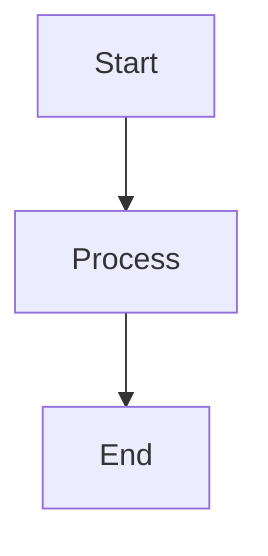

# Car Rental System Documentation

Comprehensive requirements engineering and system design documentation for a modern car rental management platform. This project includes stakeholder analysis, workflow documentation, competitive analysis, and best practices research.

## 🚗 About

This documentation site is built with [Docusaurus](https://docusaurus.io/) and serves as a complete requirements specification and analysis for a car rental system. It includes:

- **Stakeholder Analysis**: Detailed profiles of primary users, operational staff, and business stakeholders
- **Workflow Documentation**: Core rental workflows, administrative processes, and exceptional scenarios
- **Competitive Analysis**: In-depth analysis of BookCars, FreeCar, and Car Rental PHP platforms
- **Market Research**: Industry standards, best practices, and emerging trends
- **Requirements Engineering**: Functional and non-functional requirements with use cases

## 🌐 Live Site

Visit the documentation at: [https://azsce.github.io/car-rental-system-docs/](https://azsce.github.io/car-rental-system-docs/)

## 🚀 Getting Started

### Prerequisites

- Node.js 20.0 or higher
- npm, yarn, or bun

### Installation

```bash
npm install
# or
bun install
```

### Local Development

```bash
npm start
# or
bun start
```

This command starts a local development server and opens up a browser window. Most changes are reflected live without having to restart the server.

### Build

```bash
npm run build
# or
bun run build
```

This command generates static content into the `build` directory and can be served using any static contents hosting service.

### Serve Production Build

```bash
npm run serve
# or
bun run serve
```

## 📁 Project Structure

```
car-rental-system-docs/
├── docs/                          # Documentation files
│   ├── analysis/                  # Competitive analysis
│   │   ├── bookcars/             # BookCars platform analysis
│   │   ├── car-rental-php/       # Car Rental PHP analysis
│   │   └── freecar/              # FreeCar platform analysis
│   ├── research/                  # Market research
│   │   ├── best-practices/       # Industry best practices
│   │   ├── competitive-analysis/ # Competitor analysis
│   │   ├── industry-standards/   # Standards and compliance
│   │   └── market-trends/        # Emerging trends
│   ├── stakeholders/             # Stakeholder documentation
│   │   ├── primary-users/        # End users
│   │   ├── operational-staff/    # Internal staff
│   │   └── business-stakeholders/# Business partners
│   └── workflows/                # Process workflows
│       ├── core-rental/          # Main rental processes
│       ├── administrative/       # Admin workflows
│       └── exceptional/          # Exception handling
├── src/                          # React components
│   ├── components/               # Custom components
│   ├── css/                      # Custom styles
│   └── pages/                    # Custom pages
├── static/                       # Static assets
│   └── img/                      # Images and icons
├── cloned-opensource-projects/   # Reference implementations
│   ├── bookcars/                 # Multi-platform Node.js solution
│   ├── car-rental-php/           # PHP monolithic implementation
│   └── FreeCar/                  # Go microservices architecture
├── docusaurus.config.ts          # Docusaurus configuration
└── sidebars.ts                   # Sidebar configuration
```

## 🎨 Features

- **Mermaid Diagrams**: Interactive diagrams for workflows and architecture
- **Dark Mode**: Automatic dark mode support
- **Search**: Built-in documentation search
- **Mobile Responsive**: Optimized for all devices
- **SEO Optimized**: Meta tags and social cards
- **PDF Export**: Generate PDF documentation (requires Prince XML)

## 📝 Documentation Standards

### File Organization

- **Modular Structure**: Each document should be 150-400 lines maximum
- **Naming Convention**: Use kebab-case for all files and directories
- **Category Files**: Each section includes a `_category_.json` for metadata

### Markdown Format

All documentation files should include frontmatter:

```yaml
---
sidebar_position: 1
title: Document Title
description: Brief description for SEO and previews
tags: [tag1, tag2, tag3]
---
```

### Mermaid Diagrams

Use Mermaid for visual diagrams:



## 🚢 Deployment

The site automatically deploys to GitHub Pages when changes are pushed to the `main` branch via GitHub Actions.

### Setup GitHub Pages

1. Go to repository Settings → Pages
2. Under "Build and deployment", select "GitHub Actions" as the source
3. Push to `main` branch to trigger deployment

See [DEPLOYMENT.md](./DEPLOYMENT.md) for detailed deployment instructions.

## 📊 Analyzed Projects

### 1. BookCars
- **Technology**: Node.js, TypeScript, MongoDB, React
- **Architecture**: Multi-platform (admin, frontend, backend, mobile)
- **Highlights**: JWT authentication, PayPal integration, mobile apps

### 2. Car-Rental-PHP
- **Technology**: PHP, MySQL
- **Architecture**: Monolithic MVC
- **Highlights**: Simple architecture, educational value

### 3. FreeCar
- **Technology**: Go, Microservices
- **Architecture**: Cloud-native with service mesh
- **Highlights**: Kubernetes deployment, Consul service discovery

## 🛠️ Built With

- [Docusaurus](https://docusaurus.io/) - Documentation framework
- [React](https://reactjs.org/) - UI library
- [Mermaid](https://mermaid.js.org/) - Diagram generation
- [TypeScript](https://www.typescriptlang.org/) - Type safety
- [GitHub Pages](https://pages.github.com/) - Hosting

## 📜 Scripts Reference

| Script | Description |
|--------|-------------|
| `npm start` | Start development server with hot reload |
| `npm run build` | Build production static site |
| `npm run serve` | Serve production build locally |
| `npm run clear` | Clear Docusaurus cache |
| `npm run typecheck` | Run TypeScript type checking |
| `npm run pdf` | Generate PDF export (requires Prince XML) |

## 🤝 Contributing

This is a graduation project documentation. For questions or suggestions, please open an issue.

## 📄 License

This project is part of a graduation project and is for educational purposes.

## 📧 Contact

For more information, visit the [GitHub repository](https://github.com/azsce/car-rental-system-docs).

---

**Built with Docusaurus** | **Deployed on GitHub Pages**
