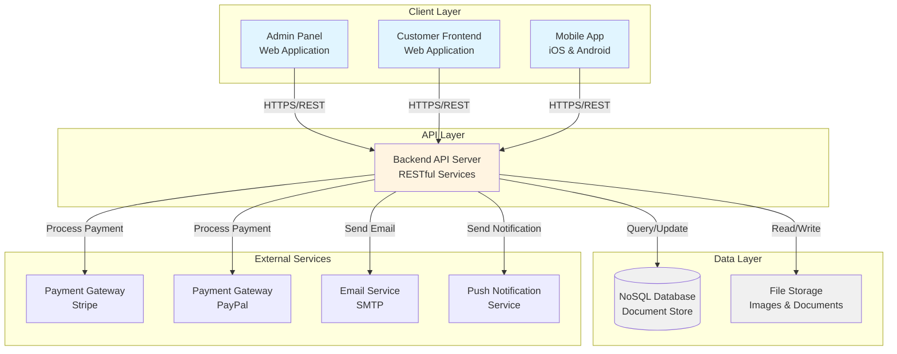
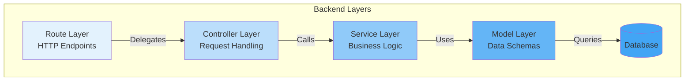
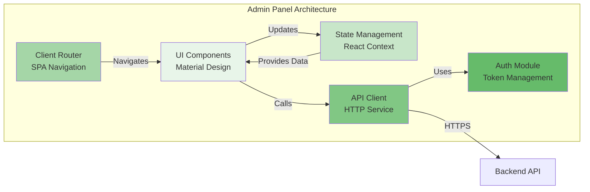
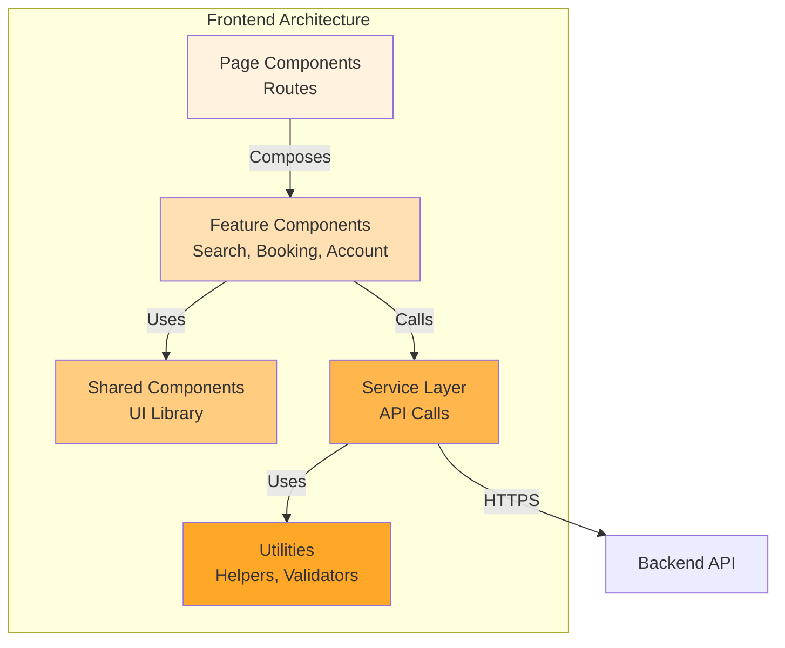
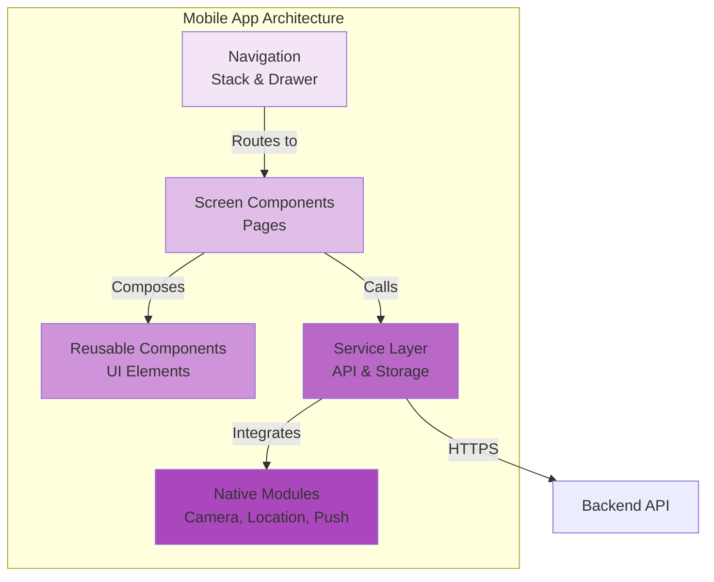
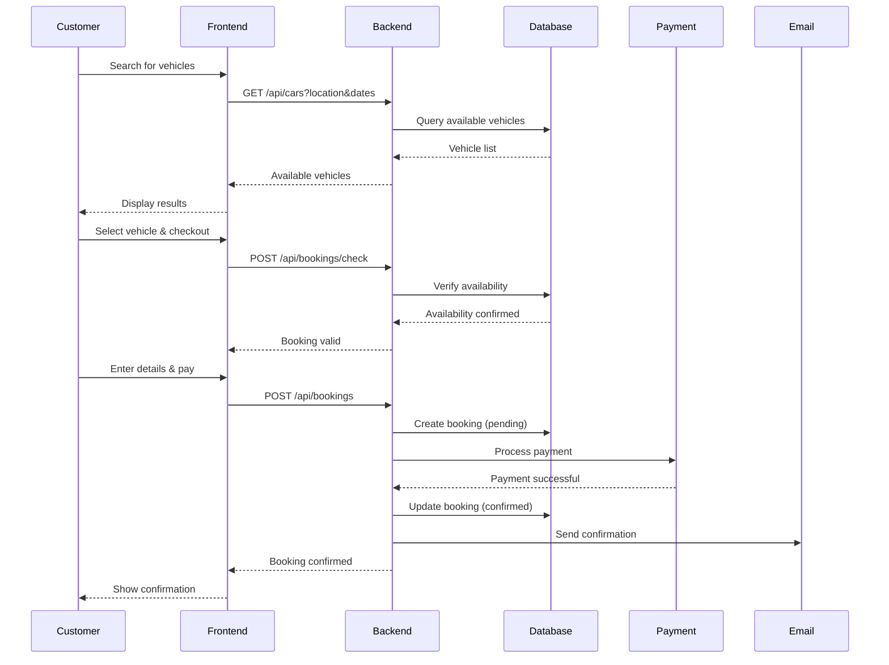
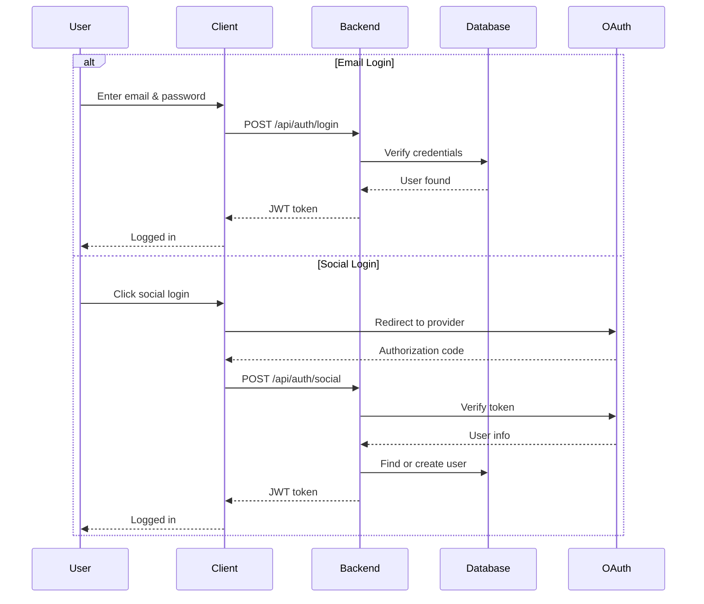
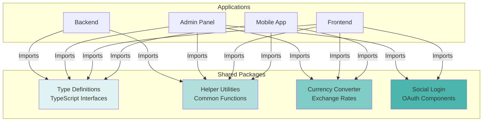
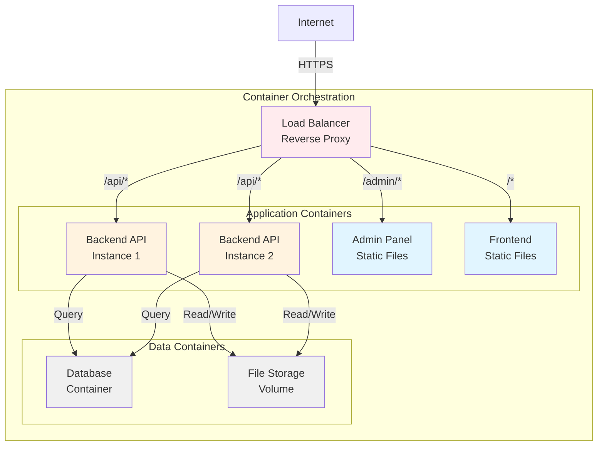
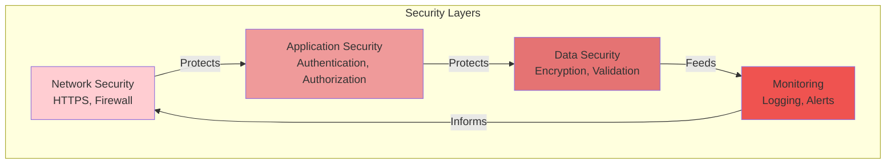

# BookCars Architecture

## Architectural Overview

BookCars implements a **multi-platform, service-oriented architecture** with clear separation between presentation layers (admin, frontend, mobile) and business logic (backend API). This architectural pattern provides several key advantages:

- **Independent Scaling**: Each component can be scaled independently based on load
- **Technology Flexibility**: Frontend technologies can evolve without backend changes
- **Parallel Development**: Teams can work on different components simultaneously
- **Deployment Independence**: Components can be deployed and updated separately
- **Security Isolation**: Public-facing and administrative interfaces are physically separated

The architecture follows a **client-server model** where multiple client applications (admin panel, customer frontend, mobile app) communicate with a centralized backend API that manages all business logic and data persistence.

## High-Level Architecture

## Component Architecture

### 1. Backend API Server

The backend serves as the **single source of truth** for all business logic and data operations. It exposes a RESTful API consumed by all client applications.

#### Core Responsibilities

- **Authentication & Authorization**: User login, token generation, role-based access control
- **Business Logic**: Booking calculations, availability checking, pricing computation
- **Data Management**: CRUD operations for all entities (users, vehicles, bookings, locations)
- **Payment Processing**: Integration with payment gateways, transaction management
- **Notification Delivery**: Email and push notification orchestration
- **File Management**: Upload, storage, and retrieval of vehicle images and documents
- **Validation**: Server-side validation of all inputs and business rules
- **Error Handling**: Centralized error handling and logging

#### Architectural Patterns

**Layered Architecture**: The backend follows a traditional layered pattern:

**Middleware Pipeline**: Requests flow through a series of middleware functions:

1. **Security Middleware**: Helmet for HTTP headers, CORS configuration
2. **Compression Middleware**: Response compression for bandwidth optimization
3. **Body Parsing**: JSON and multipart form data parsing
4. **Authentication Middleware**: JWT token validation
5. **Authorization Middleware**: Role-based access checks
6. **Route Handlers**: Business logic execution
7. **Error Handling Middleware**: Centralized error response formatting

#### API Design Principles

- **RESTful Conventions**: Standard HTTP methods (GET, POST, PUT, DELETE)
- **Resource-Based URLs**: `/api/cars`, `/api/bookings`, `/api/users`
- **Stateless**: No server-side session storage (JWT-based authentication)
- **JSON Communication**: All requests and responses use JSON format
- **Versioning Ready**: API structure supports future versioning
- **Consistent Error Format**: Standardized error response structure

### 2. Admin Panel

The admin panel is a **single-page web application** providing comprehensive management capabilities for system administrators and suppliers.

#### Core Features

**Supplier Management**:
- Create, update, and delete supplier accounts
- Configure supplier contracts and commission rates
- Set search result visibility limits per supplier
- View supplier performance metrics

**Fleet Management**:
- Add, edit, and remove vehicles from the fleet
- Upload and manage vehicle images
- Configure vehicle specifications and features
- Set vehicle availability schedules
- Define pricing rates (hourly, daily, weekly, monthly)

**Location Management**:
- Manage hierarchical location structure (countries, locations, parking spots)
- Configure location details and operating hours
- Set up map coordinates for visual representation

**Booking Management**:
- View all bookings across suppliers
- Update booking status
- Process cancellations and modifications
- Handle damage claims and disputes

**User Management**:
- View and manage customer accounts
- Handle user verification and support requests
- Manage admin and supplier user roles

**Payment Management**:
- View payment transactions
- Process refunds
- Reconcile payments with bookings
- Generate financial reports

**Analytics & Reporting**:
- Revenue reports by supplier, location, and time period
- Booking statistics and trends
- Fleet utilization metrics
- Customer behavior analytics

#### Technical Architecture

**Component Structure**:
- **Layout Components**: Navigation, header, sidebar, footer
- **Page Components**: Dashboard, suppliers, vehicles, bookings, users
- **Feature Components**: Data grids, forms, dialogs, charts
- **Shared Components**: Buttons, inputs, date pickers, file uploaders
- **Utility Components**: Error boundaries, loading indicators, toast notifications

### 3. Customer Frontend

The customer frontend is a **public-facing web application** optimized for vehicle search, booking, and account management.

#### Core Features

**Vehicle Search**:
- Location-based search with pickup/drop-off selection
- Date and time range selection
- Real-time availability checking
- Filter by vehicle type, features, price range
- Sort by price, rating, or popularity

**Vehicle Details**:
- Comprehensive vehicle information
- Image gallery with multiple views
- Specifications and features list
- Pricing breakdown
- Supplier information and ratings
- Customer reviews

**Booking Process**:
- Multi-step checkout flow
- Customer information collection
- Additional options selection (insurance, GPS, child seats)
- Price summary with transparent breakdown
- Payment method selection
- Booking confirmation

**Account Management**:
- User registration and login
- Social login integration (Google, Facebook, Apple)
- Profile management
- Booking history
- Saved payment methods
- Notification preferences

**Additional Features**:
- Multi-language interface
- Currency selection and conversion
- Responsive design for all devices
- Accessibility features
- SEO optimization

#### Technical Architecture

The frontend follows a **component-based architecture** with clear separation of concerns:

### 4. Mobile Application

The mobile app provides a **native mobile experience** for iOS and Android platforms using a cross-platform framework.

#### Core Features

**Mobile-Optimized Search**:
- Location services integration for nearby vehicle search
- Touch-optimized interface
- Swipe gestures for navigation
- Quick filters and sorting

**Booking Management**:
- View active and past bookings
- Booking details with QR codes
- Push notifications for booking updates
- One-tap actions (cancel, modify, contact support)

**Mobile-Specific Features**:
- Camera integration for document scanning
- Offline mode for viewing booking history
- Native payment integrations (Apple Pay, Google Pay)
- Push notifications
- Deep linking for email/SMS links
- Biometric authentication (Face ID, Touch ID)

**Account Features**:
- Profile management
- Payment method storage
- Notification settings
- Language and currency preferences

#### Technical Architecture

**Platform-Specific Optimizations**:
- iOS: Native navigation patterns, iOS design guidelines
- Android: Material Design components, Android navigation patterns
- Performance: Lazy loading, image optimization, efficient re-rendering
- Offline: Local storage for critical data, sync on reconnection

## Data Flow Architecture

### Booking Creation Flow

This diagram illustrates the complete flow of creating a booking from the customer frontend:

### Authentication Flow

## Shared Packages Architecture

BookCars uses a **monorepo structure** with shared packages to promote code reuse and consistency:

### Package Responsibilities

**Type Definitions Package**:
- Shared TypeScript interfaces for all entities (User, Vehicle, Booking, Location)
- API request/response types
- Enum definitions
- Utility types

**Helper Utilities Package**:
- Date formatting and manipulation
- String utilities (validation, formatting)
- Number formatting (currency, percentages)
- Business logic helpers (price calculation, availability checking)
- Validation functions

**Currency Converter Package**:
- Real-time exchange rate fetching
- Currency conversion logic
- Currency formatting by locale
- Supported currency list

**Social Login Package**:
- OAuth integration components
- Provider-specific authentication flows
- Token management
- User profile extraction

## Deployment Architecture

BookCars supports containerized deployment for consistency and scalability:

### Container Structure

**Backend Container**:
- Application server runtime
- Application code and dependencies
- Environment configuration
- Health check endpoint
- Logging configuration

**Admin Panel Container**:
- Web server (nginx)
- Static HTML, CSS, JavaScript files
- Optimized and minified assets
- Caching headers

**Frontend Container**:
- Web server (nginx)
- Static HTML, CSS, JavaScript files
- Optimized and minified assets
- Caching headers
- SEO metadata

**Database Container**:
- Database server
- Data volume mount
- Backup configuration
- Replication setup (production)

## Security Architecture

Security is implemented at multiple layers:

### Security Measures

**Network Layer**:
- HTTPS enforcement for all communications
- TLS 1.2+ with strong cipher suites
- CORS configuration restricting origins
- Rate limiting to prevent abuse
- DDoS protection

**Application Layer**:
- JWT-based authentication
- Role-based authorization (admin, supplier, customer)
- Password hashing with strong algorithms
- Session management with secure cookies
- CSRF token validation
- XSS prevention through input sanitization
- SQL injection prevention (parameterized queries)

**Data Layer**:
- Encryption at rest for sensitive data
- Encryption in transit (HTTPS)
- Input validation on all endpoints
- Output encoding to prevent XSS
- Secure file upload validation
- Database access controls

**Monitoring Layer**:
- Error tracking and alerting
- Security event logging
- Failed login attempt tracking
- Suspicious activity detection
- Performance monitoring

## Scalability Considerations

The architecture supports horizontal scaling at multiple levels:

### Backend Scaling
- **Stateless Design**: No server-side sessions enable load balancing across instances
- **Database Connection Pooling**: Efficient database connection management
- **Caching Strategy**: Redis or similar for session and query caching
- **Async Operations**: Non-blocking I/O for high concurrency

### Frontend Scaling
- **CDN Distribution**: Static assets served from edge locations
- **Code Splitting**: Lazy loading of route-based chunks
- **Image Optimization**: Responsive images and lazy loading
- **Browser Caching**: Aggressive caching of static assets

### Database Scaling
- **Indexing**: Strategic indexes on frequently queried fields
- **Query Optimization**: Efficient query patterns and aggregations
- **Replication**: Read replicas for query distribution
- **Sharding**: Horizontal partitioning for large datasets (future)

## Design Patterns & Best Practices

### Backend Patterns

**Repository Pattern**: Data access abstraction through model layer
**Service Layer Pattern**: Business logic encapsulation in service classes
**Middleware Pattern**: Request processing pipeline
**Factory Pattern**: Object creation for complex entities
**Singleton Pattern**: Database connection management

### Frontend Patterns

**Component Composition**: Building complex UIs from simple components
**Container/Presenter Pattern**: Separation of logic and presentation
**Higher-Order Components**: Cross-cutting concerns (authentication, error handling)
**Custom Hooks**: Reusable stateful logic
**Context API**: Global state management

### Mobile Patterns

**Screen Components**: Full-screen views with navigation
**Presentational Components**: Reusable UI elements
**Service Layer**: API abstraction
**Async Storage**: Persistent local data
**Navigation Patterns**: Stack and drawer navigation

## Conclusion

BookCars' multi-platform architecture demonstrates a mature approach to building scalable car rental systems. The clear separation between client applications and backend API, combined with shared packages for code reuse, creates a maintainable and extensible codebase. The architecture supports independent scaling, parallel development, and technology evolution while maintaining a cohesive user experience across web and mobile platforms.

Key architectural strengths include:
- **Separation of Concerns**: Clear boundaries between components
- **Scalability**: Horizontal scaling capabilities at all layers
- **Security**: Multi-layered security approach
- **Maintainability**: Modular design with shared packages
- **Flexibility**: Support for multiple deployment scenarios
- **Developer Experience**: Modern tooling and development workflows

This architecture provides a solid foundation for both small-scale deployments and large-scale marketplace operations, making BookCars adaptable to various business requirements and growth trajectories.
