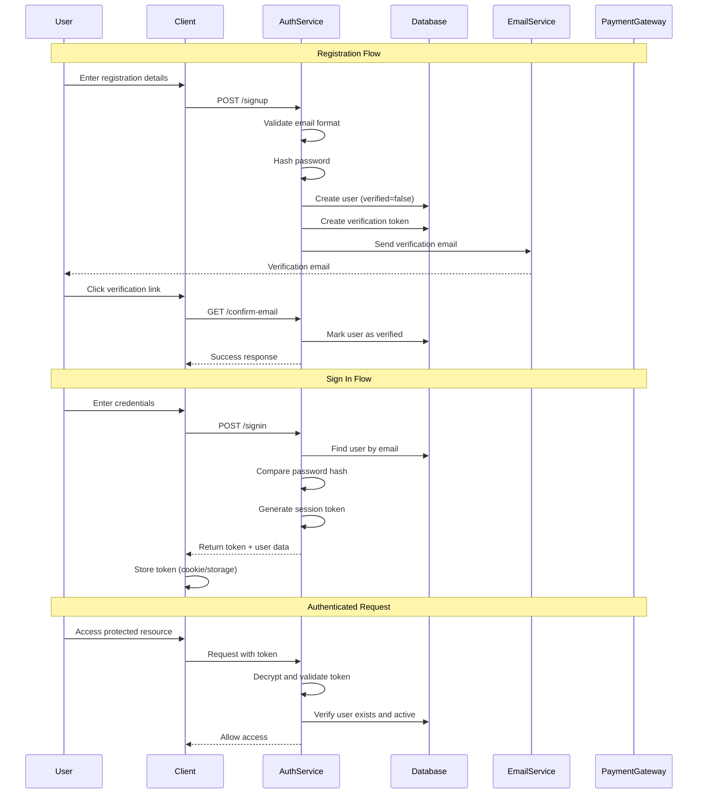
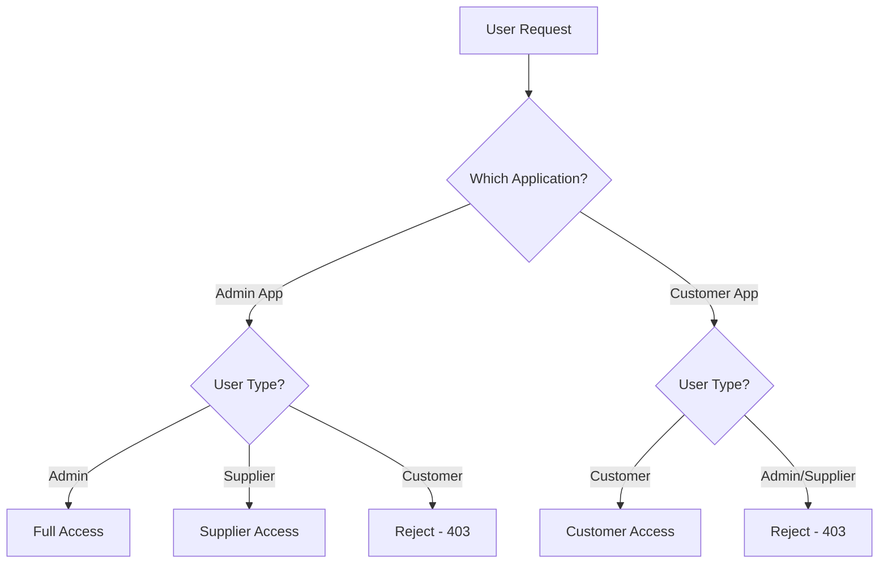
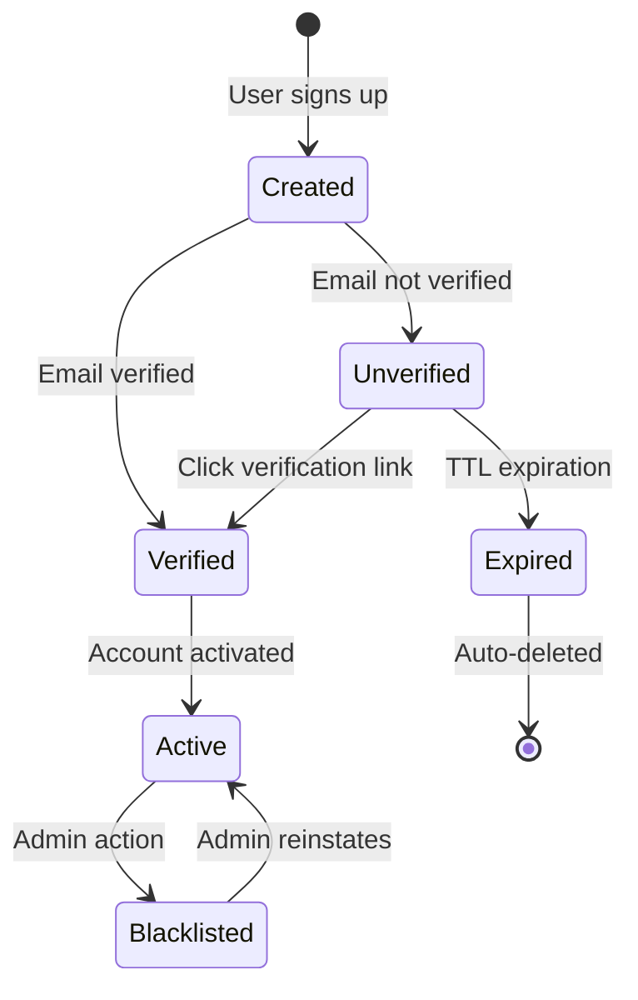

# BookCars Authentication Patterns

This document describes the authentication and authorization patterns used in BookCars, abstracted from specific technology implementations to focus on universal security patterns applicable to any car rental system.

## Overview

BookCars implements a comprehensive authentication system with the following characteristics:

- **Multi-channel authentication**: Email/password and social login (Facebook, Google, Apple)
- **Token-based sessions**: Stateless authentication using encrypted tokens
- **Role-based access control (RBAC)**: Three distinct user roles with different permissions
- **Multi-platform support**: Web (admin and customer) and mobile applications
- **Email verification**: Two-factor verification via email confirmation
- **Secure credential storage**: Password hashing with industry-standard algorithms
- **Session management**: Configurable session duration with "stay connected" option

## Authentication Architecture

### High-Level Flow

## Authentication Methods

### 1. Email/Password Authentication

Traditional credential-based authentication with email verification.

#### Registration Process

1. **User Input Collection**:
   - Email address (validated for format)
   - Password (minimum length requirement)
   - Full name
   - Phone number (optional)
   - Preferred language

2. **Server-Side Processing**:
   - Validate email format and uniqueness
   - Hash password using secure algorithm (bcrypt with salt)
   - Create user record with `verified=false` and `active=true`
   - Generate unique verification token
   - Store token with user reference and expiration

3. **Email Verification**:
   - Send verification email with unique link
   - Link contains user ID, email, and token
   - User clicks link to verify email
   - Server validates token and marks user as verified
   - Token is deleted after successful verification

4. **Account Activation**:
   - For admin-created accounts: User receives activation link
   - User sets password via activation link
   - Account becomes active and verified simultaneously

#### Sign-In Process

1. **Credential Submission**:
   - User provides email and password
   - Optional "stay connected" flag for extended sessions

2. **Validation**:
   - Retrieve user by email (case-insensitive)
   - Verify user type matches application (admin vs. customer)
   - Compare submitted password with stored hash
   - Check user is not blacklisted

3. **Session Creation**:
   - Generate encrypted session token containing user ID
   - Set token expiration based on "stay connected" preference
   - Return token to client

4. **Token Storage**:
   - **Web applications**: Store in HTTP-only, signed, secure, SameSite cookie
   - **Mobile applications**: Return token in response body for local storage

#### Password Reset Flow

1. User requests password reset via email
2. System generates reset token (similar to verification token)
3. User receives email with reset link
4. User clicks link and sets new password
5. Password is hashed and stored
6. All existing tokens are invalidated

### 2. Social Login Authentication

OAuth-based authentication via third-party providers.

#### Supported Providers

- **Facebook**: OAuth 2.0 flow
- **Google**: OAuth 2.0 flow
- **Apple**: Sign in with Apple

#### Social Sign-In Flow

1. **Client-Side OAuth**:
   - User initiates social login on client
   - Client handles OAuth flow with provider
   - Client receives access token from provider

2. **Token Validation**:
   - Client sends access token to backend
   - Backend validates token with provider's API
   - Backend verifies email matches token claims

3. **User Lookup or Creation**:
   - Search for existing user by email
   - If user exists: Sign in existing user
   - If user doesn't exist: Create new user with:
     - Email from OAuth provider
     - Full name from OAuth provider
     - Avatar URL from OAuth provider
     - `verified=true` (email verified by provider)
     - `active=true`
     - No password (social login only)

4. **Session Creation**:
   - Generate session token (same as email/password flow)
   - Return token to client

#### Social Login Security

- **Token Validation**: Backend validates OAuth access tokens with provider APIs
- **Email Verification**: Social providers handle email verification
- **No Password Storage**: Social login users have no password in system
- **Account Linking**: Users can have both email/password and social login

## Authorization Patterns

### Role-Based Access Control (RBAC)

BookCars implements three distinct user roles:

#### 1. Admin Role

**Permissions**:
- Full system access
- User management (create, update, delete users)
- Supplier management
- Location management
- Vehicle approval and management
- Booking oversight
- System settings configuration
- Analytics and reporting

**Access Restrictions**:
- Can only access admin application
- Cannot access customer-facing application

#### 2. Supplier Role

**Permissions**:
- Manage own vehicles (create, update, delete)
- Manage own locations
- View and manage own bookings
- Update own profile and business settings
- View own analytics and reports
- Manage pricing and availability

**Access Restrictions**:
- Can only access admin application
- Cannot manage other suppliers' data
- Cannot access system-wide settings
- Cannot manage users (except own staff)

#### 3. User/Customer Role

**Permissions**:
- Search and browse vehicles
- Create bookings
- Manage own bookings (view, modify, cancel)
- Update own profile
- View booking history
- Submit reviews and ratings

**Access Restrictions**:
- Can only access customer-facing application
- Cannot access admin application
- Cannot view other users' data

### Authorization Enforcement

#### Application-Level Separation

#### Token-Based Authorization

1. **Token Contains User ID**: Session token includes encrypted user ID
2. **User Lookup**: On each request, user is retrieved from database
3. **Role Verification**: User's role is checked against required permissions
4. **Application Context**: Token validation considers which application is making request

#### Resource-Level Authorization

- **Supplier Data Isolation**: Suppliers can only access their own vehicles, locations, and bookings
- **User Data Privacy**: Users can only access their own profile and bookings
- **Admin Override**: Admins can access all data for oversight

## Session Management

### Token Structure

Session tokens contain:
- **User ID**: Unique identifier for user lookup
- **Expiration**: Token validity period
- **Signature**: Cryptographic signature for tampering detection

### Token Lifecycle

#### Token Generation

1. Create payload with user ID
2. Set expiration time:
   - **Standard session**: Configurable duration (e.g., 24 hours)
   - **Extended session**: Maximum allowed duration (e.g., 400 days)
3. Encrypt payload with secret key
4. Sign token to prevent tampering

#### Token Validation

1. **Decrypt token**: Extract payload using secret key
2. **Verify signature**: Ensure token hasn't been tampered with
3. **Check expiration**: Ensure token is still valid
4. **Validate user**: Verify user exists and is active in database
5. **Check role**: Verify user role matches application context

#### Token Storage

**Web Applications** (Admin and Customer):
- Store in HTTP-only cookies (prevents XSS attacks)
- Signed cookies (prevents tampering)
- Secure flag (HTTPS only)
- SameSite=Strict (prevents CSRF attacks)
- Configurable expiration

**Mobile Applications**:
- Token returned in response body
- Client stores in secure local storage
- Client includes token in request headers
- No cookie-based storage

### Session Duration

- **Default Session**: 24 hours (configurable)
- **Extended Session**: 400 days maximum (browser limitation)
- **"Stay Connected" Option**: User can choose extended session
- **Token Refresh**: Not implemented (user must re-authenticate after expiration)

## Security Patterns

### 1. Password Security

**Hashing Algorithm**:
- Industry-standard password hashing (bcrypt)
- Automatic salt generation
- Configurable work factor for computational cost
- One-way hashing (passwords cannot be decrypted)

**Password Requirements**:
- Minimum length: 6 characters
- No maximum length restriction
- No complexity requirements (allows passphrases)

**Password Storage**:
- Never store plaintext passwords
- Hash generated during registration/password change
- Original password discarded after hashing

### 2. Email Verification

**Purpose**:
- Confirm email ownership
- Prevent fake account creation
- Enable password reset functionality

**Token Generation**:
- Cryptographically random token
- Unique per user
- Stored with user reference
- Time-limited validity

**Verification Flow**:
- Token sent via email link
- User clicks link to verify
- Server validates token and marks email as verified
- Token deleted after successful verification

### 3. Protection Against Common Attacks

#### Cross-Site Scripting (XSS)

- **HTTP-only cookies**: Tokens not accessible via JavaScript
- **Input validation**: Email and other inputs validated
- **Output encoding**: User-generated content properly encoded

#### Cross-Site Request Forgery (CSRF)

- **SameSite cookies**: Cookies not sent with cross-origin requests
- **Signed cookies**: Cookies cannot be forged
- **Token validation**: Every request validates token signature

#### Man-in-the-Middle (MITM)

- **HTTPS enforcement**: Secure flag on cookies requires HTTPS
- **Token encryption**: Session tokens are encrypted
- **Certificate validation**: Client validates server certificates

#### Brute Force Attacks

- **Password hashing**: Computational cost slows down attacks
- **Account lockout**: Blacklisting mechanism for suspicious accounts
- **Rate limiting**: (Implementation recommended but not detailed in code)

#### Session Hijacking

- **Token expiration**: Limited session duration
- **Secure storage**: HTTP-only, secure cookies
- **Token rotation**: (Implementation recommended for enhanced security)

### 4. Multi-Factor Authentication (MFA)

**Email Verification as Second Factor**:
- Email verification serves as lightweight MFA
- Users must verify email before full account access
- Password reset requires email access

**Future Enhancements**:
- SMS verification
- Authenticator app support (TOTP)
- Biometric authentication for mobile

## Account Management

### Account States

#### State Definitions

1. **Created**: User record exists in database
2. **Unverified**: Email not yet verified (limited access)
3. **Verified**: Email confirmed (full access)
4. **Active**: Account is active and usable
5. **Blacklisted**: Account suspended (no access)
6. **Expired**: Temporary account expired (auto-deleted)

### Account Lifecycle

#### User-Initiated Registration

1. User signs up with email/password
2. Account created with `verified=false`, `active=true`
3. Verification email sent
4. User verifies email
5. Account becomes fully active

#### Admin-Created Accounts

1. Admin creates user account
2. Account created with `verified=false`, `active=false`
3. Activation email sent with password setup link
4. User sets password and activates account
5. Account becomes verified and active

#### Social Login Registration

1. User signs in with social provider
2. Account created with `verified=true`, `active=true`
3. No email verification needed (provider verified)
4. Account immediately active

#### Temporary Accounts

1. Account created during checkout process
2. Account has expiration timestamp (TTL)
3. If payment not completed, account auto-expires
4. If payment completed, expiration removed

### Account Blacklisting

**Reasons for Blacklisting**:
- Fraudulent activity
- Terms of service violations
- Payment disputes
- Admin discretion

**Effects of Blacklisting**:
- User cannot sign in
- Existing sessions invalidated
- Bookings may be cancelled
- Data retained for audit purposes

**Reinstatement**:
- Admin can remove blacklist flag
- User regains full access
- Previous data and bookings restored

## Mobile vs. Web Authentication

### Key Differences

| Aspect | Web Applications | Mobile Applications |
|--------|------------------|---------------------|
| Token Storage | HTTP-only cookies | Local secure storage |
| Token Transmission | Automatic (cookies) | Manual (headers) |
| CSRF Protection | SameSite cookies | Not applicable |
| Token Refresh | Re-authentication | Re-authentication |
| Biometric Support | Limited | Native support |
| Session Persistence | Cookie expiration | App-managed |

### Mobile-Specific Considerations

1. **Token in Response Body**: Mobile apps receive token in JSON response
2. **Header-Based Authentication**: Token sent in custom header (e.g., `X-Access-Token`)
3. **Secure Storage**: Apps should use platform-specific secure storage (Keychain, Keystore)
4. **Push Notifications**: Mobile apps register push tokens for notifications
5. **Biometric Authentication**: Apps can implement fingerprint/face recognition

## Integration with Payment Gateways

### Customer ID Synchronization

When users make payments:
1. Payment gateway creates customer record
2. Customer ID stored in user entity
3. Future payments use existing customer ID
4. Enables saved payment methods and faster checkout

### Temporary User Creation

For guest checkout:
1. Temporary user created during payment flow
2. User has expiration timestamp
3. If payment succeeds, user becomes permanent
4. If payment fails/expires, user auto-deleted

## Best Practices Observed

### 1. Defense in Depth

Multiple layers of security:
- Password hashing
- Token encryption
- HTTP-only cookies
- HTTPS enforcement
- Email verification
- Role-based access control

### 2. Principle of Least Privilege

- Users have minimum necessary permissions
- Suppliers isolated to own data
- Customers cannot access admin functions
- Admins have oversight but not unlimited power

### 3. Secure by Default

- New accounts require email verification
- Cookies have secure flags enabled
- Passwords must be hashed
- Tokens have expiration

### 4. Audit Trail

- User creation timestamps
- Verification timestamps
- Last update timestamps
- Token creation tracking

### 5. Graceful Degradation

- Social login failure falls back to email/password
- Email verification can be resent
- Password reset available if forgotten
- Account recovery mechanisms

## Recommendations for Implementation

### Essential Security Measures

1. **Use HTTPS Everywhere**: Enforce HTTPS for all communications
2. **Implement Rate Limiting**: Prevent brute force attacks on login endpoints
3. **Add CAPTCHA**: Protect registration and login from bots
4. **Enable Account Lockout**: Temporarily lock accounts after failed login attempts
5. **Implement Token Refresh**: Use short-lived access tokens with refresh tokens
6. **Add Security Headers**: Implement CSP, HSTS, X-Frame-Options, etc.
7. **Log Security Events**: Track login attempts, password changes, role changes
8. **Implement 2FA**: Add optional two-factor authentication for enhanced security

### Compliance Considerations

1. **GDPR Compliance**:
   - User consent for data processing
   - Right to data deletion
   - Data portability
   - Privacy policy and terms

2. **PCI DSS** (if storing payment data):
   - Never store full credit card numbers
   - Use payment gateway tokenization
   - Encrypt sensitive data
   - Regular security audits

3. **Password Storage**:
   - Use approved hashing algorithms (bcrypt, Argon2)
   - Never store plaintext passwords
   - Implement password history to prevent reuse

## Summary

BookCars implements a robust authentication system with:

- **Multiple authentication methods**: Email/password and social login
- **Strong security**: Password hashing, token encryption, secure cookies
- **Role-based access control**: Three distinct user roles with appropriate permissions
- **Multi-platform support**: Separate handling for web and mobile applications
- **Email verification**: Two-factor verification for account security
- **Session management**: Configurable session duration with secure token handling

The authentication patterns are well-designed for a modern car rental platform, balancing security with user experience. The system provides a solid foundation that can be enhanced with additional security measures like 2FA, rate limiting, and advanced fraud detection as the platform scales.
