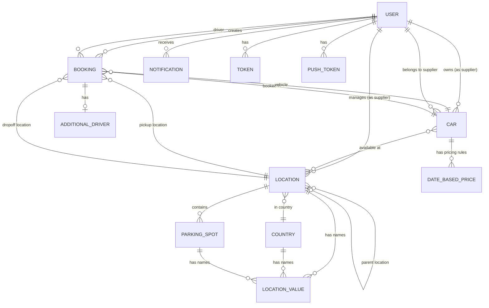

# BookCars Data Models

This document describes the core data entities in BookCars, their attributes, relationships, and design patterns. Technology-specific implementation details are abstracted to focus on universal data modeling concepts applicable to any car rental system.

## Overview

BookCars employs a document-oriented data model with the following key characteristics:

- **Entity-based design**: Clear separation of concerns with distinct entities for users, vehicles, bookings, locations, and suppliers
- **Reference relationships**: Entities reference each other by identifiers, supporting both embedded and referenced data patterns
- **Temporal data**: Extensive use of timestamps and date ranges for booking management and audit trails
- **Flexible schemas**: Support for optional fields and extensible structures (e.g., multimedia arrays, contracts)
- **Multi-tenancy**: Supplier-based data isolation for multi-supplier marketplace model

## Core Entities

### 1. User Entity

The User entity represents all system actors including customers, suppliers, and administrators.

#### Attributes

**Identity & Authentication**:
- `email`: Unique identifier, validated format, case-insensitive
- `password`: Hashed credential (optional for social login users)
- `fullName`: Display name for the user
- `phone`: Mobile phone number with validation
- `verified`: Email verification status
- `verifiedAt`: Timestamp of email verification
- `active`: Account activation status

**Profile Information**:
- `birthDate`: Date of birth (required for age verification in rentals)
- `avatar`: Profile image reference
- `bio`: User biography or description
- `location`: Geographic location or address
- `language`: Preferred language (ISO 639-1 two-letter code)

**User Type & Permissions**:
- `type`: Enumeration of user roles (Admin, Supplier, User/Customer)
- `blacklisted`: Flag for suspended or banned users
- `supplier`: Reference to parent supplier (for supplier staff accounts)

**Notification Preferences**:
- `enableEmailNotifications`: Opt-in/opt-out for email communications

**Business Logic Fields**:
- `payLater`: Whether user can book with deferred payment
- `customerId`: External payment gateway customer identifier
- `contracts`: Array of legal contracts (language-specific documents)
- `licenseRequired`: Whether driver's license verification is mandatory
- `license`: Driver's license document reference

**Supplier-Specific Fields**:
- `minimumRentalDays`: Minimum rental period enforced by supplier
- `priceChangeRate`: Percentage for dynamic pricing adjustments
- `supplierCarLimit`: Maximum number of vehicles supplier can list
- `notifyAdminOnNewCar`: Flag for admin notification preferences

**Temporal Management**:
- `expireAt`: Auto-deletion timestamp for temporary/unverified accounts
- `createdAt`: Account creation timestamp
- `updatedAt`: Last modification timestamp

#### Relationships

- **One-to-Many with Booking**: A user (as driver) can have multiple bookings
- **One-to-Many with Car**: A supplier can own multiple vehicles
- **One-to-Many with Location**: A supplier can manage multiple locations
- **Self-referential**: Supplier users can have associated staff users

#### Design Patterns

1. **Role-based Access Control (RBAC)**: Single user entity with type discrimination
2. **Soft Delete via Blacklisting**: Users are marked as blacklisted rather than deleted
3. **TTL (Time-To-Live) Expiration**: Temporary users auto-expire if not verified
4. **Multi-language Support**: Language preference stored per user
5. **External Integration**: Customer ID field for payment gateway synchronization

### 2. Vehicle (Car) Entity

The Vehicle entity represents rental vehicles with comprehensive specifications and pricing.

#### Attributes

**Basic Information**:
- `name`: Vehicle model/name (e.g., "Toyota Camry 2024")
- `licensePlate`: Vehicle registration number
- `supplier`: Reference to owning supplier
- `minimumAge`: Minimum driver age requirement
- `locations`: Array of location references where vehicle is available

**Pricing Structure** (Multi-tier pricing model):
- `dailyPrice`: Standard daily rental rate
- `discountedDailyPrice`: Promotional daily rate (optional)
- `hourlyPrice`: Hourly rental rate (optional)
- `discountedHourlyPrice`: Promotional hourly rate (optional)
- `biWeeklyPrice`: Two-week rental rate (optional)
- `discountedBiWeeklyPrice`: Promotional bi-weekly rate (optional)
- `weeklyPrice`: Weekly rental rate (optional)
- `discountedWeeklyPrice`: Promotional weekly rate (optional)
- `monthlyPrice`: Monthly rental rate (optional)
- `discountedMonthlyPrice`: Promotional monthly rate (optional)

**Date-Based Pricing**:
- `isDateBasedPrice`: Flag for seasonal/dynamic pricing
- `dateBasedPrices`: Array of date range pricing rules

**Financial Terms**:
- `deposit`: Security deposit amount
- `cancellation`: Cancellation fee or free cancellation period
- `amendments`: Modification fee or free amendment period
- `theftProtection`: Theft protection insurance cost
- `collisionDamageWaiver`: CDW insurance cost
- `fullInsurance`: Comprehensive insurance cost
- `additionalDriver`: Fee for adding extra drivers

**Vehicle Specifications**:
- `type`: Fuel/power type (Diesel, Gasoline, Electric, Hybrid, Plug-in Hybrid)
- `gearbox`: Transmission type (Manual, Automatic)
- `aircon`: Air conditioning availability (boolean)
- `seats`: Number of passenger seats
- `doors`: Number of doors
- `range`: Vehicle size category (Mini, Midi, Maxi, Scooter, Bus, Truck, Caravan)
- `multimedia`: Array of entertainment features (Touchscreen, Bluetooth, Android Auto, Apple CarPlay)
- `co2`: Carbon emissions rating

**Operational Fields**:
- `available`: Whether vehicle is available for booking
- `fullyBooked`: Whether vehicle has no availability in near future
- `comingSoon`: Whether vehicle is not yet available but will be soon
- `fuelPolicy`: Fuel return policy (Like-for-Like, Free Tank, Full-to-Full, Full-to-Empty)
- `mileage`: Mileage limit or unlimited

**Media & Ratings**:
- `image`: Primary vehicle image reference
- `rating`: Customer rating (1-5 scale)
- `trips`: Total number of completed rentals

**Payment Integration**:
- `blockOnPay`: Whether to block vehicle during payment processing

#### Relationships

- **Many-to-One with Supplier**: Each vehicle belongs to one supplier
- **Many-to-Many with Location**: Vehicle can be available at multiple locations
- **One-to-Many with Booking**: Vehicle can have multiple bookings over time
- **One-to-Many with DateBasedPrice**: Vehicle can have multiple seasonal pricing rules

#### Design Patterns

1. **Flexible Pricing Model**: Multiple pricing tiers (hourly, daily, weekly, monthly) with optional discounts
2. **Seasonal Pricing**: Date-based pricing overrides for peak/off-peak seasons
3. **Availability States**: Three-state availability (available, fully booked, coming soon)
4. **Rich Specifications**: Comprehensive vehicle attributes for detailed filtering
5. **Insurance Bundling**: Multiple insurance options as add-ons
6. **Multi-location Inventory**: Single vehicle can be listed at multiple pickup locations

### 3. Booking Entity

The Booking entity represents a rental reservation with full lifecycle management.

#### Attributes

**Core Booking Information**:
- `supplier`: Reference to vehicle supplier
- `car`: Reference to rented vehicle
- `driver`: Reference to primary driver (user)
- `pickupLocation`: Reference to pickup location
- `dropOffLocation`: Reference to drop-off location
- `from`: Rental start date/time
- `to`: Rental end date/time

**Booking Status**:
- `status`: Enumeration of booking states:
  - `Void`: Cancelled before payment
  - `Pending`: Awaiting payment
  - `Deposit`: Partial payment received
  - `Paid`: Payment completed
  - `PaidInFull`: Full payment including deposit
  - `Reserved`: Confirmed reservation
  - `Cancelled`: Cancelled after payment

**Selected Options** (Boolean flags):
- `cancellation`: Free cancellation selected
- `amendments`: Free amendments selected
- `theftProtection`: Theft protection insurance selected
- `collisionDamageWaiver`: CDW insurance selected
- `fullInsurance`: Full insurance selected
- `additionalDriver`: Additional driver option selected

**Additional Driver**:
- `_additionalDriver`: Reference to additional driver details entity

**Financial Information**:
- `price`: Total booking price
- `isDeposit`: Whether booking is deposit-only
- `isPayedInFull`: Whether full payment is completed

**Payment Gateway Integration**:
- `sessionId`: Payment session identifier (for Stripe)
- `paymentIntentId`: Payment intent identifier (for Stripe)
- `customerId`: Customer identifier in payment gateway
- `paypalOrderId`: PayPal order identifier

**Operational Fields**:
- `cancelRequest`: Whether customer has requested cancellation
- `expireAt`: Auto-deletion timestamp for abandoned bookings

**Audit Trail**:
- `createdAt`: Booking creation timestamp
- `updatedAt`: Last modification timestamp

#### Relationships

- **Many-to-One with Supplier**: Each booking belongs to one supplier
- **Many-to-One with Car**: Each booking is for one vehicle
- **Many-to-One with Driver**: Each booking has one primary driver
- **Many-to-One with Pickup Location**: Each booking has one pickup location
- **Many-to-One with Drop-off Location**: Each booking has one drop-off location
- **One-to-One with Additional Driver**: Optional additional driver details

#### Design Patterns

1. **State Machine**: Clear booking status progression (Pending → Paid → Reserved → Cancelled)
2. **Temporal Reservation**: Date range defines rental period
3. **Option Selection**: Boolean flags for add-on services
4. **Payment Gateway Abstraction**: Support for multiple payment providers (Stripe, PayPal)
5. **Partial Payment Support**: Deposit vs. full payment tracking
6. **TTL Expiration**: Abandoned bookings auto-expire to free inventory
7. **Cancellation Workflow**: Separate cancel request flag for approval workflow

### 4. Location Entity

The Location entity represents rental pickup/drop-off locations with geographic data.

#### Attributes

**Geographic Information**:
- `country`: Reference to country entity
- `latitude`: Geographic latitude coordinate
- `longitude`: Geographic longitude coordinate
- `values`: Array of localized name values (multi-language support)

**Media**:
- `image`: Location image reference

**Parking Management**:
- `parkingSpots`: Array of specific parking spot locations within the location

**Multi-tenancy**:
- `supplier`: Reference to supplier (for supplier-specific locations)
- `parentLocation`: Reference to parent location (for hierarchical locations)

#### Relationships

- **Many-to-One with Country**: Each location belongs to one country
- **Many-to-Many with Car**: Locations can have multiple vehicles, vehicles can be at multiple locations
- **One-to-Many with Booking**: Location can be pickup or drop-off for multiple bookings
- **One-to-Many with LocationValue**: Location has multiple language-specific names
- **One-to-Many with ParkingSpot**: Location can have multiple parking spots
- **Self-referential**: Locations can have parent-child relationships

#### Design Patterns

1. **Internationalization (i18n)**: Localized names via values array
2. **Geolocation**: Latitude/longitude for mapping and distance calculations
3. **Hierarchical Structure**: Parent-child relationships for location grouping
4. **Parking Spot Granularity**: Detailed parking spot tracking within locations
5. **Multi-tenancy**: Supplier-specific locations for marketplace model

### 5. Additional Driver Entity

Represents additional drivers for a booking (separate from primary driver).

#### Attributes

- `fullName`: Driver's full name
- `email`: Driver's email address
- `phone`: Driver's phone number
- `birthDate`: Driver's date of birth (for age verification)

#### Relationships

- **One-to-One with Booking**: Each additional driver record belongs to one booking

#### Design Patterns

1. **Lightweight Entity**: Minimal information capture for secondary drivers
2. **No User Account Required**: Additional drivers don't need system accounts
3. **Age Verification**: Birth date captured for minimum age compliance

## Supporting Entities

### Country Entity

Represents countries for location organization.

**Attributes**:
- `name`: Country name
- `values`: Array of localized country names
- `supplier`: Reference to supplier (for supplier-specific countries)

### LocationValue Entity

Represents localized names for locations.

**Attributes**:
- `language`: Language code (ISO 639-1)
- `value`: Localized name string

### ParkingSpot Entity

Represents specific parking spots within a location.

**Attributes**:
- `longitude`: Parking spot longitude
- `latitude`: Parking spot latitude
- `name`: Parking spot identifier
- `values`: Array of localized parking spot names

### DateBasedPrice Entity

Represents seasonal or date-range-specific pricing rules.

**Attributes**:
- `startDate`: Price rule start date
- `endDate`: Price rule end date
- `dailyPrice`: Daily price for this date range

### Token Entity

Represents email verification and password reset tokens.

**Attributes**:
- `user`: Reference to user
- `token`: Unique token string
- `createdAt`: Token creation timestamp (for expiration)

### PushToken Entity

Represents mobile push notification tokens.

**Attributes**:
- `user`: Reference to user
- `token`: Push notification token from mobile platform

### Notification Entity

Represents in-app notifications.

**Attributes**:
- `user`: Reference to recipient user
- `message`: Notification message text
- `booking`: Optional reference to related booking
- `car`: Optional reference to related vehicle
- `isRead`: Whether notification has been read
- `createdAt`: Notification timestamp

### NotificationCounter Entity

Tracks unread notification counts per user.

**Attributes**:
- `user`: Reference to user
- `count`: Number of unread notifications

## Data Relationships Diagram

## Key Design Principles

### 1. Multi-Tenancy Support

The data model supports a multi-supplier marketplace:
- Suppliers own vehicles and manage locations
- Data isolation via supplier references
- Supplier-specific business rules (minimum rental days, pricing rates)

### 2. Internationalization (i18n)

Multi-language support is built into the core entities:
- User language preferences
- Localized location names via LocationValue arrays
- Language-specific contracts and documents

### 3. Temporal Data Management

Extensive use of timestamps and date ranges:
- Booking date ranges for rental periods
- Date-based pricing for seasonal rates
- TTL expiration for temporary records
- Audit trails with createdAt/updatedAt timestamps

### 4. Flexible Pricing Models

Multiple pricing strategies supported:
- Multi-tier pricing (hourly, daily, weekly, monthly)
- Discount pricing alongside standard pricing
- Date-based seasonal pricing
- Add-on pricing (insurance, additional drivers)

### 5. Payment Gateway Abstraction

Support for multiple payment providers:
- Generic fields (sessionId, customerId)
- Provider-specific fields (paymentIntentId for Stripe, paypalOrderId for PayPal)
- Deposit vs. full payment tracking

### 6. State Management

Clear state machines for entity lifecycles:
- Booking status progression
- User verification and activation states
- Vehicle availability states

### 7. Soft Deletes and Expiration

Data retention strategies:
- Blacklisting instead of hard deletes for users
- TTL-based auto-expiration for temporary records
- Audit trail preservation

## Data Integrity Considerations

### Validation Rules

1. **Email Validation**: Email format validation at data layer
2. **Phone Validation**: Mobile phone format validation
3. **Age Validation**: Minimum age requirements for drivers
4. **Date Range Validation**: Booking end date must be after start date
5. **Price Validation**: Prices must be non-negative
6. **Reference Integrity**: Foreign key relationships must reference valid entities

### Indexing Strategy

Key indexes for performance:
- User email (unique index for authentication)
- Booking date ranges (for availability queries)
- Vehicle locations (for location-based searches)
- Supplier references (for multi-tenant data isolation)
- Status fields (for filtering by state)

### Concurrency Considerations

1. **Booking Conflicts**: Multiple users booking same vehicle for overlapping dates
2. **Inventory Updates**: Real-time availability calculations
3. **Payment Processing**: Handling concurrent payment attempts
4. **Price Changes**: Ensuring consistent pricing during booking flow

## Scalability Patterns

### Data Partitioning

Potential partitioning strategies:
- **By Supplier**: Shard data by supplier ID for multi-tenant isolation
- **By Geographic Region**: Partition locations and vehicles by country/region
- **By Time**: Archive old bookings to separate storage

### Caching Strategies

Cacheable data:
- Vehicle listings (with TTL for availability updates)
- Location data (relatively static)
- User profiles (invalidate on update)
- Pricing rules (invalidate on price changes)

### Read Replicas

Read-heavy operations:
- Vehicle search and filtering
- Location lookups
- Booking history queries

## Summary

BookCars employs a well-structured data model that balances flexibility with data integrity. Key strengths include:

- **Multi-tenancy**: Clean supplier-based data isolation
- **Internationalization**: Built-in multi-language support
- **Flexible Pricing**: Multiple pricing tiers and seasonal rates
- **Payment Abstraction**: Support for multiple payment gateways
- **Temporal Management**: Comprehensive date/time handling for bookings
- **Scalability**: Design patterns that support growth

This data model provides a solid foundation for a modern car rental platform, supporting both B2C and B2B use cases with supplier marketplace capabilities.
