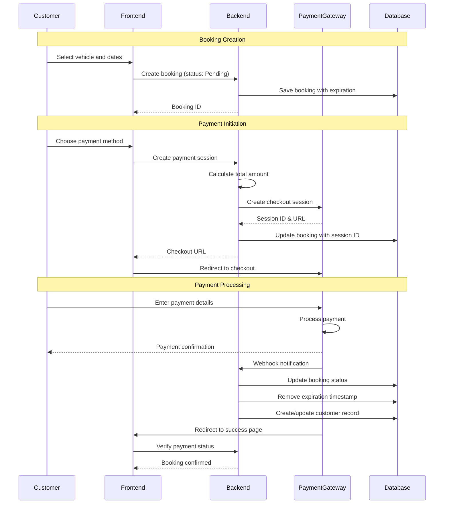
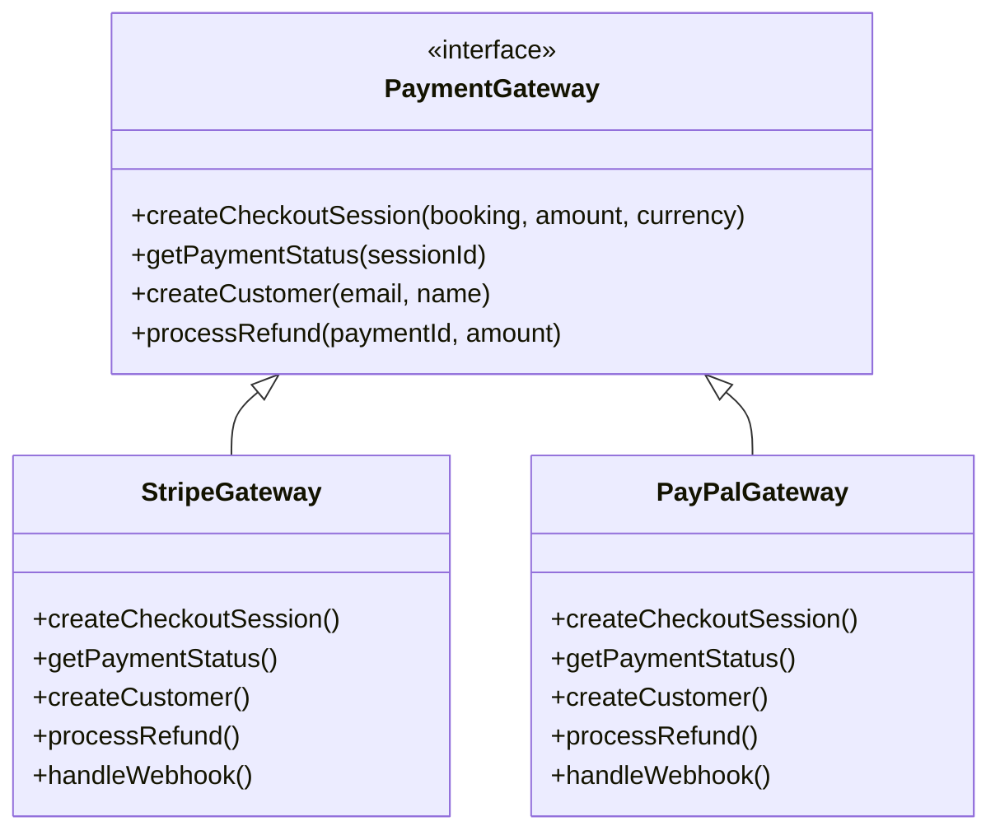
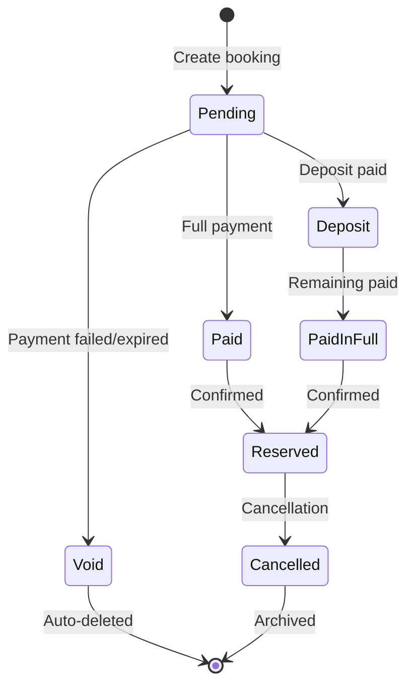

# BookCars Payment Integration Patterns

This document describes the payment gateway integration patterns used in BookCars, focusing on architectural patterns and integration strategies rather than technology-specific implementation details.

## Overview

BookCars implements a multi-gateway payment architecture supporting two major payment providers:

- **Stripe**: Credit/debit card processing with hosted checkout
- **PayPal**: Alternative payment method with PayPal account or card processing

### Key Characteristics

- **Dual-gateway support**: Customers can choose between payment methods
- **Hosted checkout**: Payment forms hosted by payment providers (PCI compliance)
- **Session-based payments**: Temporary booking records during payment flow
- **Deposit and full payment**: Support for partial and complete payment options
- **Customer tokenization**: Saved customer records for repeat payments
- **Webhook integration**: Real-time payment status updates
- **Currency flexibility**: Multi-currency support via payment gateways
- **Guest checkout**: Payment without prior account creation

## Payment Architecture

### High-Level Payment Flow

## Payment Gateway Abstraction

### Gateway Selection Strategy

BookCars allows customers to choose their preferred payment method:

1. **Stripe**: Default option for card payments
2. **PayPal**: Alternative for PayPal account holders or card payments via PayPal

### Common Payment Interface

Both gateways implement similar patterns:

## Stripe Integration Patterns

### Checkout Session Flow

#### 1. Session Creation

**Input Parameters**:
- Booking amount
- Currency code (ISO 4217, e.g., USD, EUR, GBP)
- Customer email
- Customer name
- Booking description
- Locale (for checkout page language)

**Process**:
1. Backend creates Stripe checkout session
2. Session configured with:
   - Payment amount and currency
   - Customer information
   - Success and cancel URLs
   - Payment method types (card)
   - Billing address collection settings
3. Stripe returns session ID and checkout URL
4. Backend stores session ID in booking record
5. Frontend redirects customer to Stripe checkout page

#### 2. Hosted Checkout Page

**Stripe-Hosted Features**:
- PCI-compliant payment form
- Card validation and error handling
- 3D Secure authentication (SCA compliance)
- Multiple payment method support
- Mobile-responsive design
- Localized interface

**Security Benefits**:
- No card data touches application servers
- PCI compliance handled by Stripe
- Reduced security audit scope
- Built-in fraud detection

#### 3. Payment Completion

**Success Flow**:
1. Customer completes payment on Stripe
2. Stripe redirects to success URL
3. Frontend displays confirmation
4. Stripe sends webhook to backend
5. Backend updates booking status to "Paid"
6. Backend removes booking expiration timestamp
7. Confirmation email sent to customer

**Failure Flow**:
1. Payment fails or customer cancels
2. Stripe redirects to cancel URL
3. Frontend displays error message
4. Booking remains in "Pending" status
5. Booking expires after timeout period

### Customer Tokenization

**Purpose**: Enable faster checkout for returning customers

**Process**:
1. During first payment, Stripe creates customer record
2. Customer ID stored in user entity
3. Payment methods can be saved to customer
4. Future payments use existing customer ID
5. Saved payment methods displayed at checkout

**Benefits**:
- One-click checkout for returning customers
- Subscription billing support
- Payment method management
- Reduced friction in booking flow

### Payment Intent Pattern

**Payment Intent**: Represents a single payment attempt

**Lifecycle**:
1. **Created**: Payment intent initialized
2. **Processing**: Payment being processed
3. **Requires Action**: Customer authentication needed (3D Secure)
4. **Succeeded**: Payment completed successfully
5. **Canceled**: Payment canceled by customer or system

**Stored Data**:
- Payment Intent ID: Unique identifier for payment
- Customer ID: Stripe customer record
- Session ID: Checkout session identifier

### Webhook Integration

**Purpose**: Receive real-time payment status updates

**Webhook Events**:
- `checkout.session.completed`: Payment successful
- `checkout.session.expired`: Session expired without payment
- `payment_intent.succeeded`: Payment processed successfully
- `payment_intent.payment_failed`: Payment failed
- `charge.refunded`: Refund processed

**Webhook Handler**:
1. Receive webhook POST request from Stripe
2. Verify webhook signature (security)
3. Parse event type and data
4. Update booking status in database
5. Trigger business logic (emails, notifications)
6. Return 200 OK to acknowledge receipt

**Security**:
- Webhook signature verification prevents spoofing
- HTTPS endpoint required
- Idempotency handling for duplicate events

## PayPal Integration Patterns

### Order-Based Flow

PayPal uses an order-based payment model:

#### 1. Order Creation

**Input Parameters**:
- Booking ID (as invoice ID)
- Payment amount
- Currency code
- Item name and description
- Country code (for address validation)

**Process**:
1. Backend authenticates with PayPal API (OAuth 2.0)
2. Backend creates PayPal order with:
   - Payment intent: CAPTURE (immediate payment)
   - Purchase units with amount and items
   - Application context (branding, shipping preferences)
   - Payer address requirements
3. PayPal returns order ID
4. Backend stores order ID in booking record
5. Frontend initializes PayPal button with order ID

#### 2. PayPal Checkout

**Client-Side Integration**:
- PayPal JavaScript SDK loaded on frontend
- PayPal button rendered on checkout page
- Customer clicks PayPal button
- PayPal modal opens for authentication
- Customer logs in to PayPal or pays as guest
- Customer approves payment

**Configuration**:
- **Shipping preference**: NO_SHIPPING (car rental doesn't require shipping)
- **User action**: PAY_NOW (skip review page for faster checkout)
- **Payment method preference**: IMMEDIATE_PAYMENT_REQUIRED
- **Billing address**: Minimal collection (country only)

#### 3. Order Capture

**Process**:
1. Customer approves payment in PayPal modal
2. Frontend receives approval
3. Frontend calls backend to capture payment
4. Backend calls PayPal API to capture order
5. PayPal processes payment and returns status
6. Backend updates booking status
7. Confirmation displayed to customer

### PayPal Authentication

**OAuth 2.0 Flow**:
1. Backend requests access token from PayPal
2. Credentials: Client ID and Client Secret
3. PayPal returns access token with expiration
4. Token used for all API requests
5. Token refreshed when expired

**Security**:
- Credentials stored securely (environment variables)
- Tokens short-lived (typically 9 hours)
- HTTPS required for all API calls

### Sandbox vs. Production

**Dual Environment Support**:
- **Sandbox**: Testing environment with fake money
- **Production**: Live environment with real transactions

**Configuration**:
- Environment flag determines API endpoint
- Separate credentials for sandbox and production
- Easy switching for testing and deployment

## Payment Flow Patterns

### 1. Deposit Payment

**Use Case**: Customer pays partial amount upfront, remainder later

**Flow**:
1. Customer selects "Pay Deposit" option
2. System calculates deposit amount (e.g., 20% of total)
3. Payment session created for deposit amount
4. Customer completes payment
5. Booking status updated to "Deposit"
6. Remaining balance due at pickup or later date

**Benefits**:
- Lower upfront cost for customers
- Secures booking with minimal commitment
- Reduces cancellation risk

### 2. Full Payment

**Use Case**: Customer pays entire amount upfront

**Flow**:
1. Customer selects "Pay in Full" option
2. System calculates total amount (vehicle + add-ons)
3. Payment session created for full amount
4. Customer completes payment
5. Booking status updated to "Paid in Full"
6. No additional payment required

**Benefits**:
- Simplified checkout process
- Guaranteed revenue for supplier
- No payment collection at pickup

### 3. Pay Later

**Use Case**: Customer books without immediate payment

**Flow**:
1. Customer selects "Pay Later" option (if enabled)
2. Booking created with status "Reserved"
3. No payment session created
4. Payment collected at pickup or via invoice
5. Booking confirmed without payment

**Restrictions**:
- Only available for approved customers
- Supplier must enable "Pay Later" option
- May require credit check or deposit

### 4. Guest Checkout

**Use Case**: Customer pays without creating account

**Flow**:
1. Customer proceeds to checkout without signing in
2. System creates temporary user account
3. User account has expiration timestamp (TTL)
4. Payment session created and linked to temporary user
5. If payment succeeds:
   - User account becomes permanent
   - Expiration timestamp removed
   - User can set password later
6. If payment fails or expires:
   - User account auto-deleted
   - Booking auto-deleted

**Benefits**:
- Reduced friction in checkout flow
- No forced account creation
- Automatic cleanup of abandoned checkouts

## Booking and Payment Lifecycle

### Booking States

#### State Definitions

1. **Pending**: Booking created, awaiting payment
2. **Void**: Payment failed or session expired
3. **Deposit**: Partial payment received
4. **Paid**: Full payment received
5. **PaidInFull**: All payments completed (deposit + remaining)
6. **Reserved**: Booking confirmed and reserved
7. **Cancelled**: Booking cancelled by customer or supplier

### Expiration and Cleanup

**Temporary Booking Pattern**:
- Bookings created with expiration timestamp
- Default expiration: 30 minutes (configurable)
- If payment not completed, booking auto-expires
- Database automatically deletes expired bookings (TTL index)

**Benefits**:
- Prevents inventory blocking by abandoned carts
- Automatic cleanup without manual intervention
- Reduces database clutter

**Implementation**:
- Expiration timestamp stored in booking record
- Database TTL index monitors expiration field
- Expired records automatically deleted
- No cron jobs or scheduled tasks needed

## Multi-Currency Support

### Currency Handling

**Supported Currencies**:
- Any currency supported by payment gateway
- Common currencies: USD, EUR, GBP, CAD, AUD, JPY, etc.
- Currency code in ISO 4217 format (3-letter code)

**Currency Selection**:
1. System detects customer location (IP geolocation)
2. Default currency based on location
3. Customer can manually select currency
4. Prices converted to selected currency
5. Payment processed in selected currency

**Exchange Rates**:
- Real-time exchange rates from payment gateway
- Rates updated automatically
- No manual rate management needed

### Price Formatting

**Gateway-Specific Formatting**:
- **Stripe**: Amounts in smallest currency unit (cents)
  - Example: $10.00 = 1000 cents
- **PayPal**: Amounts as decimal strings
  - Example: $10.00 = "10.00"

**Conversion Logic**:
- Backend handles currency unit conversion
- Frontend displays human-readable amounts
- Payment gateway receives correctly formatted amounts

## Security and Compliance

### PCI DSS Compliance

**Hosted Checkout Approach**:
- Payment forms hosted by payment providers
- No card data enters application servers
- No card data stored in application database
- Reduced PCI compliance scope (SAQ A)

**Benefits**:
- Lower compliance burden
- Reduced security audit costs
- Built-in security features
- Automatic security updates

### Data Protection

**Sensitive Data Handling**:
- **Never stored**: Full card numbers, CVV codes
- **Tokenized**: Payment methods via gateway tokens
- **Encrypted**: Customer IDs and session IDs
- **Minimal collection**: Only necessary payment data

**GDPR Compliance**:
- Customer consent for payment processing
- Right to data deletion (except legal retention)
- Data portability for payment history
- Privacy policy disclosure

### Fraud Prevention

**Gateway-Provided Features**:
- **Stripe Radar**: Machine learning fraud detection
- **PayPal Fraud Protection**: Risk assessment and blocking
- **3D Secure**: Strong customer authentication (SCA)
- **Address Verification**: AVS checks for card payments

**Application-Level Measures**:
- User account verification (email)
- Booking pattern analysis
- Blacklist management
- Rate limiting on payment attempts

## Refund and Cancellation Patterns

### Refund Processing

**Refund Initiation**:
1. Customer requests cancellation
2. Admin/supplier approves refund
3. System calculates refund amount (based on cancellation policy)
4. Backend calls payment gateway refund API
5. Gateway processes refund to original payment method
6. Booking status updated to "Cancelled"
7. Customer notified of refund

**Partial Refunds**:
- Cancellation fees deducted from refund
- Deposit may be non-refundable
- Refund amount calculated based on policy

**Refund Timeline**:
- Stripe: 5-10 business days
- PayPal: Instant to PayPal balance, 3-5 days to bank

### Cancellation Policies

**Free Cancellation**:
- Customer selects free cancellation option at booking
- Additional fee charged for this option
- Full refund if cancelled within policy period

**Standard Cancellation**:
- Cancellation fee based on time before pickup
- Example: 50% refund if cancelled 48+ hours before
- No refund if cancelled within 24 hours

**No Cancellation**:
- Lower price, no cancellation allowed
- No refund under any circumstances
- Booking modification may be allowed

## Integration Best Practices

### 1. Idempotency

**Problem**: Duplicate payment processing due to network issues or retries

**Solution**:
- Use idempotency keys for payment requests
- Gateway deduplicates requests with same key
- Prevents double charging customers

### 2. Webhook Reliability

**Problem**: Webhooks may fail or be delayed

**Solution**:
- Implement webhook retry logic
- Poll payment status as backup
- Handle duplicate webhook events
- Log all webhook events for debugging

### 3. Error Handling

**Payment Failures**:
- Display user-friendly error messages
- Log detailed errors for debugging
- Provide alternative payment methods
- Allow retry without recreating booking

**Gateway Downtime**:
- Detect gateway availability
- Display maintenance message
- Queue payments for later processing
- Notify customers of delays

### 4. Testing Strategy

**Sandbox Testing**:
- Use gateway test environments
- Test all payment scenarios (success, failure, cancellation)
- Test webhook handling
- Test refund processing

**Test Cards/Accounts**:
- Use gateway-provided test credentials
- Test different card types and scenarios
- Test 3D Secure authentication
- Test declined payments

### 5. Monitoring and Logging

**Key Metrics**:
- Payment success rate
- Average payment processing time
- Failed payment reasons
- Refund volume and reasons

**Logging**:
- Log all payment requests and responses
- Log webhook events
- Log errors and exceptions
- Maintain audit trail for compliance

## Recommendations for Enhancement

### 1. Additional Payment Methods

**Potential Additions**:
- Apple Pay and Google Pay (mobile wallets)
- Bank transfers (ACH, SEPA)
- Buy Now, Pay Later (Klarna, Affirm)
- Cryptocurrency payments
- Local payment methods (Alipay, WeChat Pay)

### 2. Subscription Billing

**Use Case**: Subscription-based car rental services

**Implementation**:
- Recurring payment setup
- Automatic billing on schedule
- Subscription management (pause, cancel, upgrade)
- Prorated billing for changes

### 3. Split Payments

**Use Case**: Corporate bookings with split billing

**Implementation**:
- Multiple payment sources for single booking
- Partial payment by company, partial by employee
- Invoice generation for corporate portion

### 4. Dynamic Pricing Integration

**Use Case**: Real-time price adjustments based on demand

**Implementation**:
- Price calculation at checkout time
- Price lock during payment session
- Surge pricing during peak periods
- Discount codes and promotions

### 5. Payment Analytics

**Insights**:
- Revenue by payment method
- Conversion rate by gateway
- Average transaction value
- Payment failure analysis
- Refund rate tracking

## Summary

BookCars implements a robust payment integration architecture with:

- **Multi-gateway support**: Stripe and PayPal for customer choice
- **Hosted checkout**: PCI-compliant payment processing
- **Flexible payment options**: Deposit, full payment, and pay later
- **Guest checkout**: Frictionless booking without account creation
- **Automatic cleanup**: TTL-based expiration for abandoned bookings
- **Multi-currency**: Support for international customers
- **Security-first**: Tokenization, encryption, and fraud prevention
- **Webhook integration**: Real-time payment status updates

The payment integration patterns are well-designed for a modern car rental platform, balancing security, user experience, and operational efficiency. The architecture provides a solid foundation that can be extended with additional payment methods and advanced features as the platform scales.

### Key Strengths

1. **PCI Compliance**: Hosted checkout eliminates card data handling
2. **User Experience**: Multiple payment options and guest checkout
3. **Reliability**: Webhook integration with fallback polling
4. **Scalability**: Gateway-managed infrastructure handles volume
5. **Flexibility**: Easy to add new payment methods
6. **Security**: Tokenization and fraud prevention built-in

### Areas for Enhancement

1. **Payment Method Diversity**: Add mobile wallets and local payment methods
2. **Subscription Support**: Enable recurring billing for subscription models
3. **Advanced Analytics**: Deeper insights into payment performance
4. **Fraud Detection**: Application-level fraud scoring
5. **Payment Orchestration**: Intelligent routing between gateways for optimization

This payment integration architecture demonstrates industry best practices and provides a strong foundation for a scalable, secure car rental platform.
