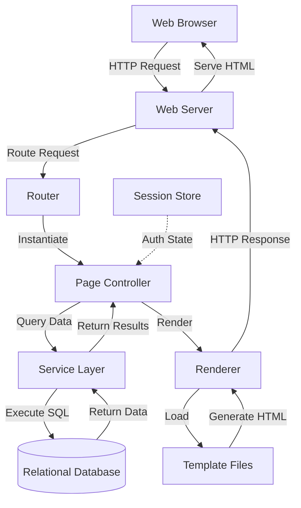
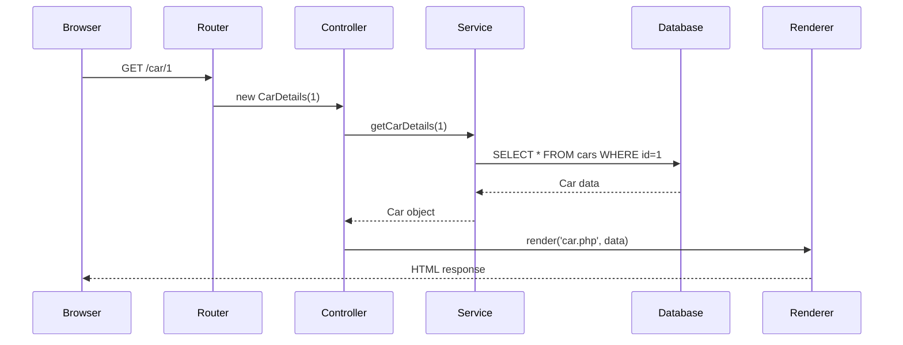
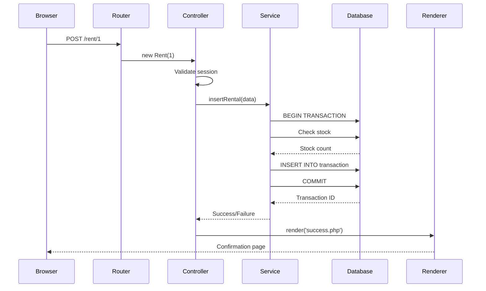

# Car Rental PHP - Architecture Analysis

## Architectural Overview

The car-rental-php project implements a **monolithic, server-side rendered web application** following an MVC-inspired pattern. All components—routing, business logic, data access, and presentation—reside within a single codebase and execute on a single application server. This architecture prioritizes simplicity and ease of understanding over scalability and distributed system benefits.

## High-Level Architecture Diagram



## Architectural Pattern: MVC-Inspired Monolith

### Model-View-Controller Adaptation

The project loosely follows MVC principles with some adaptations:

**Model Layer** (Data Access):
- Service classes (`UserService`, `RentalService`)
- Database singleton for connection management
- Direct SQL queries using prepared statements
- No ORM or active record pattern

**View Layer** (Presentation):
- Template files (HTML with embedded server-side code)
- Renderer class for template loading and variable injection
- Component-based templates (header, footer)
- Server-side HTML generation

**Controller Layer** (Request Handling):
- Router class for URL-to-controller mapping
- Page controller classes (one per route)
- Request processing and response coordination
- Session management for authentication state

### Architectural Characteristics

**Monolithic Structure**:
- Single deployment unit
- Shared memory space
- Direct function calls (no network overhead)
- Tight coupling between layers

**Synchronous Processing**:
- Request-response cycle completes before returning
- No asynchronous operations or background jobs
- Database queries block until completion

**Stateful Sessions**:
- Server-side session storage
- Session-based authentication
- User state persists across requests

## Component Architecture

### 1. Entry Point and Routing

**Entry Point** (`public/index.php`):
```
HTTP Request → index.php → Router::route()
```

The entry point is minimal, delegating all logic to the Router.

**Router Component** (`classes/Router.php`):
- Parses incoming URL to extract route segments
- Maps routes to page controller classes
- Instantiates appropriate controller
- Invokes render method

**Routing Strategy**:
- Simple switch-case based routing
- URL pattern: `/{route}/{optional-id}`
- No route parameters or query string handling
- Static route definitions (no dynamic routing)

**Supported Routes**:
- `/` → Homepage (vehicle listing)
- `/register` → User registration
- `/signin` → User authentication
- `/logout` → Session termination
- `/profile` → User profile view
- `/car/{id}` → Vehicle details
- `/rent/{id}` → Rental booking
- `/rentals` → Rental history
- `/*` → 404 Not Found

### 2. Page Controllers

**Base Controller** (`BasicPage.php`):
- Abstract base class for all page controllers
- Defines `render()` method contract
- Provides common functionality

**Controller Responsibilities**:
1. Validate user authentication (check session)
2. Retrieve data from service layer
3. Process form submissions (POST requests)
4. Prepare data for view rendering
5. Invoke renderer with template and data

**Controller Pattern**:
```
PageController extends BasicPage {
    render() {
        // 1. Check authentication
        // 2. Fetch data from services
        // 3. Process user input
        // 4. Render template with data
    }
}
```

**Example Controllers**:
- `Homepage`: Lists all available vehicles
- `Register`: Handles user registration form
- `Signin`: Authenticates users and creates sessions
- `Profile`: Displays user information
- `CarDetails`: Shows vehicle details and pricing
- `Rent`: Processes rental bookings
- `Rentals`: Lists user's rental history (or all rentals for admins)

### 3. Service Layer (Data Access)

**Database Singleton** (`Database.php`):
- Implements singleton pattern for connection management
- Single database connection per request
- PDO-based database abstraction
- Prepared statements for SQL injection prevention

**Service Classes**:

**UserService** (`UserService.php`):
- User authentication and authorization
- User registration and profile management
- Admin role checking
- Address management (embedded in user operations)

**RentalService** (`RentalService.php`):
- Vehicle listing and details
- Rental transaction creation
- Rental history retrieval
- Inventory management (stock updates via triggers)

**Data Access Pattern**:
```
Service Method → Prepare SQL → Bind Parameters → Execute → Return Results
```

**Key Characteristics**:
- Static methods (no service instantiation)
- Direct SQL queries (no query builder)
- Manual parameter binding
- Transaction support for multi-step operations
- Database triggers for inventory updates

### 4. Rendering Layer

**Renderer Component** (`Renderer.php`):
- Template loading and variable injection
- Layout composition (header + content + footer)
- Variable scoping for templates
- Global injection mechanism

**Rendering Process**:
1. Inject global variables (user session data)
2. Load header component
3. Open container div
4. Include content template with local variables
5. Close container div
6. Load footer component

**Template Structure**:
- Templates reside in `templates/` directory
- Components in `templates/components/`
- Server-side code embedded in HTML
- Direct variable access in templates

### 5. Authentication and Authorization

**Authentication Mechanism**:
- Session-based authentication
- Username/email and password credentials
- Password hashing using native hashing functions
- Session variables store user ID and admin status

**Authorization Pattern**:
- Role-based access control (user vs. admin)
- Admin flag stored in separate table
- Page controllers check authentication before rendering
- Redirect to signin for unauthenticated access

**Session Management**:
- Server-side session storage
- Session ID in cookie
- User ID and admin status in session variables
- Logout destroys session

## Data Flow Patterns

### Read Operation Flow



### Write Operation Flow



## Database Architecture

### Schema Design

The database follows a normalized relational design:

**Core Entities**:
- `user`: User accounts and profiles
- `address`: User addresses (1:1 with user)
- `admins`: Admin role assignments
- `cars`: Vehicle inventory
- `car_rates`: Pricing information (1:1 with cars)
- `transaction`: Rental bookings

**Relationship Patterns**:
- User → Address (1:1, foreign key)
- User → Admin (1:0..1, optional admin role)
- User → Transaction (1:N, rental history)
- Car → Transaction (1:N, rental records)
- Car → CarRates (1:1, pricing)

### Database Triggers

**Inventory Management**:
- `STOCK_UPDATE_DECREASE`: Decrements stock on rental creation
- `STOCK_UPDATE_INCREASE`: Increments stock on rental deletion

This approach automates inventory tracking without application-level logic.

## Architectural Strengths

### Simplicity
- Easy to understand entire system
- Minimal abstraction layers
- Direct data access patterns
- Straightforward debugging

### Development Speed
- Rapid prototyping
- No complex build processes
- Immediate feedback loop
- Low setup overhead

### Deployment Simplicity
- Single application server
- Single database instance
- No service orchestration
- Simple backup and restore

## Architectural Limitations

### Scalability Constraints
- Single server bottleneck
- No horizontal scaling capability
- Shared database connection pool
- Session state tied to single server

### Maintainability Challenges
- Tight coupling between layers
- No dependency injection
- Static method dependencies
- Limited testability

### Security Concerns
- Basic authentication mechanism
- No CSRF protection
- Limited input validation
- Hardcoded database credentials

### Extensibility Issues
- Difficult to add new features without modifying core
- No plugin or module system
- Tight coupling makes refactoring risky
- No API layer for external integrations

## Architectural Patterns Demonstrated

### Singleton Pattern
- Database connection management
- Ensures single connection per request

### Front Controller Pattern
- Router as single entry point
- Centralized request handling

### Template View Pattern
- Separation of HTML from logic
- Variable injection into templates

### Service Layer Pattern
- Business logic encapsulation
- Data access abstraction

### Transaction Script Pattern
- Procedural service methods
- Direct database operations

## Comparison to Modern Architectures

### vs. Microservices
- **Monolith**: Single deployment, tight coupling, simple operations
- **Microservices**: Distributed deployment, loose coupling, complex operations

### vs. Multi-Platform (like BookCars)
- **Monolith**: Single web interface, server-side rendering
- **Multi-Platform**: Separate admin/frontend/mobile, API-driven

### vs. Serverless
- **Monolith**: Always-running server, stateful sessions
- **Serverless**: Event-driven functions, stateless execution

## Conclusion

The car-rental-php architecture demonstrates a classic monolithic web application pattern with MVC-inspired organization. Its simplicity makes it ideal for educational purposes and understanding core rental system mechanics. However, the tight coupling, limited scalability, and basic security make it unsuitable for production use without significant refactoring. For a graduation project, this architecture provides a valuable contrast to more complex, distributed approaches, highlighting the trade-offs between simplicity and scalability.
