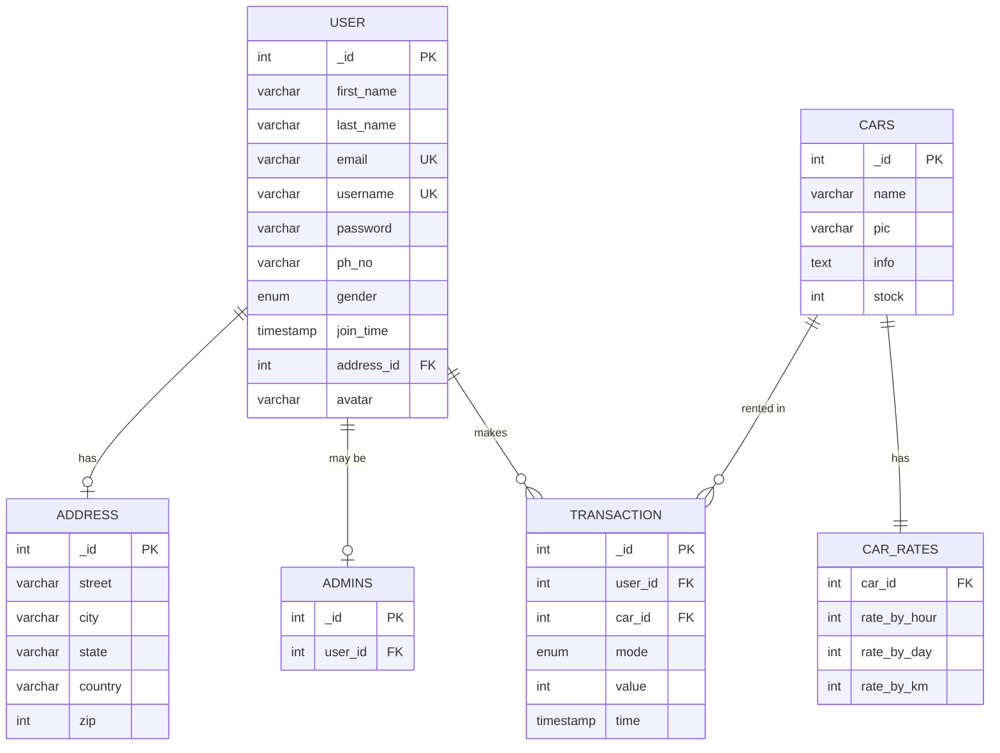

# Car Rental PHP - Database Schema Analysis

## Introduction

The car-rental-php system uses a normalized relational database design that efficiently models the core entities and relationships in a car rental system. The schema demonstrates fundamental database design principles including normalization, referential integrity, and automated data management through triggers. This document provides a comprehensive analysis of the database structure, relationships, and design decisions.

## Entity-Relationship Diagram



## Database Design Principles

### Normalization

The schema follows **Third Normal Form (3NF)** principles:

**First Normal Form (1NF)**:
- All tables have primary keys
- All columns contain atomic values
- No repeating groups

**Second Normal Form (2NF)**:
- All non-key attributes depend on the entire primary key
- No partial dependencies

**Third Normal Form (3NF)**:
- No transitive dependencies
- Address separated from user (address details don't depend on user)
- Car rates separated from cars (rates don't depend on car identity alone)

### Referential Integrity

The schema enforces data consistency through foreign key constraints:
- Cascading deletes for dependent records
- Cascading updates for key changes
- NULL handling for optional relationships

### Data Types

Appropriate data types optimize storage and enforce constraints:
- Integer IDs for efficient indexing
- VARCHAR with appropriate lengths for text
- ENUM for constrained choices
- TIMESTAMP for temporal data
- TEXT for long-form content

## Core Entities

### 1. User Entity

**Purpose**: Stores user account information and authentication credentials.

**Table**: `user`

**Attributes**:
- `_id` (INT, PRIMARY KEY, AUTO_INCREMENT): Unique user identifier
- `first_name` (VARCHAR(50), NOT NULL): User's first name
- `last_name` (VARCHAR(50), NOT NULL): User's last name
- `email` (VARCHAR(50), NOT NULL, UNIQUE): Email address for login and communication
- `username` (VARCHAR(30), NOT NULL, UNIQUE): Username for login
- `password` (VARCHAR(255), NOT NULL): Hashed password
- `ph_no` (VARCHAR(10), NULLABLE): Phone number (optional)
- `gender` (ENUM('m', 'f', 'u'), DEFAULT 'u'): Gender (male, female, unspecified)
- `join_time` (TIMESTAMP, DEFAULT NOW()): Account creation timestamp
- `address_id` (INT, FOREIGN KEY, NULLABLE): Reference to address table
- `avatar` (VARCHAR(500), DEFAULT URL): Profile picture URL

**Constraints**:
- Unique email (prevents duplicate accounts)
- Unique username (prevents duplicate accounts)
- Foreign key to address with SET NULL on delete
- Default avatar URL for new users
- Automatic timestamp on creation

**Indexes**:
- Primary key on `_id`
- Unique index on `email`
- Unique index on `username`

**Design Decisions**:
- Password stored as VARCHAR(255) to accommodate hashed values
- Gender as ENUM with 'unspecified' default respects privacy
- Phone number optional (not all users provide it)
- Avatar defaults to generic image
- Address relationship allows NULL (address can be deleted independently)

### 2. Address Entity

**Purpose**: Stores physical address information for users.

**Table**: `address`

**Attributes**:
- `_id` (INT, PRIMARY KEY, AUTO_INCREMENT): Unique address identifier
- `street` (VARCHAR(100), NOT NULL): Street address
- `city` (VARCHAR(100), NOT NULL): City name
- `state` (VARCHAR(100), NOT NULL): State/province
- `country` (VARCHAR(100), NOT NULL): Country name
- `zip` (INT, NOT NULL): Postal/ZIP code

**Constraints**:
- All fields required (complete address needed)
- Primary key for unique identification

**Design Decisions**:
- Separated from user table (3NF compliance)
- Allows address reuse (though not implemented in current logic)
- ZIP as integer (assumes numeric postal codes)
- Generous VARCHAR lengths for international addresses

**Relationship to User**:
- One-to-one relationship (each user has one address)
- Optional relationship (user can exist without address initially)
- SET NULL on delete (user remains if address deleted)

### 3. Admins Entity

**Purpose**: Tracks which users have administrative privileges.

**Table**: `admins`

**Attributes**:
- `_id` (INT, PRIMARY KEY, AUTO_INCREMENT): Unique admin record identifier
- `user_id` (INT, FOREIGN KEY, NOT NULL): Reference to user table

**Constraints**:
- Foreign key to user with CASCADE on delete/update
- User must exist to be admin

**Design Decisions**:
- Separate table for role management (extensible for future roles)
- Cascade delete ensures no orphaned admin records
- Simple boolean-style role (user is admin or not)
- Allows checking admin status via JOIN or EXISTS query

**Relationship to User**:
- One-to-zero-or-one relationship (user may be admin)
- Cascade delete (admin record removed if user deleted)

### 4. Cars Entity

**Purpose**: Stores vehicle inventory information.

**Table**: `cars`

**Attributes**:
- `_id` (INT, PRIMARY KEY, AUTO_INCREMENT): Unique vehicle identifier
- `name` (VARCHAR(50), NOT NULL): Vehicle name/model
- `pic` (VARCHAR(200), NULLABLE): Vehicle image URL
- `info` (TEXT, NULLABLE): Detailed vehicle description
- `stock` (INT, NOT NULL): Available inventory count

**Constraints**:
- Name required (must identify vehicle)
- Stock required (inventory tracking essential)
- Picture and info optional (can be added later)

**Design Decisions**:
- Stock as integer allows multiple units of same vehicle
- TEXT for info allows detailed descriptions
- Image stored as URL (not binary data)
- No vehicle type/category (simplified model)

**Stock Management**:
- Decremented automatically on rental creation (via trigger)
- Incremented automatically on rental deletion (via trigger)
- Checked before allowing bookings

### 5. Car Rates Entity

**Purpose**: Stores pricing information for vehicles.

**Table**: `car_rates`

**Attributes**:
- `car_id` (INT, FOREIGN KEY, NOT NULL): Reference to cars table
- `rate_by_hour` (INT, NOT NULL, DEFAULT 100): Hourly rental rate
- `rate_by_day` (INT, NOT NULL, DEFAULT 2000): Daily rental rate
- `rate_by_km` (INT, NOT NULL, DEFAULT 20): Per-kilometer rate

**Constraints**:
- Foreign key to cars with CASCADE on delete/update
- All rates required with defaults
- No primary key (car_id serves as unique identifier)

**Design Decisions**:
- Separated from cars table (3NF - rates are independent attribute set)
- One-to-one relationship with cars
- Three pricing modes for flexibility
- Default rates ensure data completeness
- Integer rates (assumes currency without decimals or cents stored separately)

**Relationship to Cars**:
- One-to-one relationship (each car has one rate set)
- Cascade delete (rates removed if car deleted)
- Mandatory relationship (every car must have rates)

### 6. Transaction Entity

**Purpose**: Records rental bookings and transaction history.

**Table**: `transaction`

**Attributes**:
- `_id` (INT, PRIMARY KEY, AUTO_INCREMENT): Unique transaction identifier
- `user_id` (INT, FOREIGN KEY, NOT NULL): User who made the booking
- `car_id` (INT, FOREIGN KEY, NOT NULL): Vehicle being rented
- `mode` (ENUM('km', 'day', 'hour'), NOT NULL): Rental pricing mode
- `value` (INT, NOT NULL): Quantity (hours, days, or kilometers)
- `time` (TIMESTAMP, NOT NULL, DEFAULT NOW()): Booking timestamp

**Constraints**:
- Foreign keys to user and car with CASCADE on delete/update
- Mode must be one of three options
- All fields required
- Automatic timestamp on creation

**Design Decisions**:
- Named "transaction" (represents rental transaction)
- Mode as ENUM enforces valid pricing modes
- Value stores quantity regardless of mode (flexible)
- Timestamp captures when booking was made
- No end date/time (simplified model)
- No payment information (not implemented)

**Relationships**:
- Many-to-one with user (user can have many rentals)
- Many-to-one with car (car can be rented many times)
- Cascade delete (transactions removed if user or car deleted)

## Relationships and Cardinality

### User ↔ Address (1:1)

**Relationship Type**: One-to-one (optional)

**Implementation**:
- User table has `address_id` foreign key
- Foreign key allows NULL
- ON DELETE SET NULL (user remains if address deleted)
- ON UPDATE CASCADE (address ID updates propagate)

**Business Logic**:
- User can exist without address initially
- Address can be deleted without deleting user
- Each user has at most one address
- Address not shared between users (in current implementation)

### User ↔ Admins (1:0..1)

**Relationship Type**: One-to-zero-or-one

**Implementation**:
- Admins table has `user_id` foreign key
- ON DELETE CASCADE (admin record removed if user deleted)
- ON UPDATE CASCADE (user ID updates propagate)

**Business Logic**:
- User may or may not be admin
- Admin status tracked in separate table
- Deleting user removes admin status
- Extensible for future role types

### User ↔ Transaction (1:N)

**Relationship Type**: One-to-many

**Implementation**:
- Transaction table has `user_id` foreign key
- ON DELETE CASCADE (transactions removed if user deleted)
- ON UPDATE CASCADE (user ID updates propagate)

**Business Logic**:
- User can have zero or many rental transactions
- Each transaction belongs to exactly one user
- Deleting user removes all their transactions
- Transaction history tied to user account

### Cars ↔ Car Rates (1:1)

**Relationship Type**: One-to-one (mandatory)

**Implementation**:
- Car_rates table has `car_id` foreign key
- ON DELETE CASCADE (rates removed if car deleted)
- ON UPDATE CASCADE (car ID updates propagate)

**Business Logic**:
- Every car must have pricing information
- Each car has exactly one rate set
- Rates deleted when car is deleted
- Rates cannot exist without car

### Cars ↔ Transaction (1:N)

**Relationship Type**: One-to-many

**Implementation**:
- Transaction table has `car_id` foreign key
- ON DELETE CASCADE (transactions removed if car deleted)
- ON UPDATE CASCADE (car ID updates propagate)

**Business Logic**:
- Car can be rented zero or many times
- Each transaction involves exactly one car
- Deleting car removes all its rental history
- Transaction history tied to vehicle

## Database Triggers

### Stock Update Decrease Trigger

**Trigger Name**: `STOCK_UPDATE_DECREASE`

**Event**: AFTER INSERT on `transaction`

**Purpose**: Automatically decrement vehicle stock when rental is created.

**Logic**:
```sql
UPDATE cars 
SET stock = stock - 1 
WHERE _id = NEW.car_id
```

**Business Rules**:
- Executes after successful transaction insertion
- Reduces stock by 1 for rented vehicle
- Ensures inventory accuracy
- Atomic operation (part of transaction)

**Benefits**:
- Automatic inventory management
- No application-level stock tracking needed
- Guaranteed consistency
- Prevents manual stock update errors

### Stock Update Increase Trigger

**Trigger Name**: `STOCK_UPDATE_INCREASE`

**Event**: AFTER DELETE on `transaction`

**Purpose**: Automatically increment vehicle stock when rental is cancelled.

**Logic**:
```sql
UPDATE cars 
SET stock = stock + 1 
WHERE _id = OLD.car_id
```

**Business Rules**:
- Executes after successful transaction deletion
- Increases stock by 1 for returned vehicle
- Restores inventory availability
- Atomic operation (part of transaction)

**Benefits**:
- Automatic inventory restoration
- Supports rental cancellation
- Maintains stock accuracy
- Simplifies cancellation logic

## Data Integrity Mechanisms

### Primary Keys

All tables have auto-incrementing integer primary keys:
- Ensures unique record identification
- Efficient indexing and joins
- Sequential ID generation
- Consistent key strategy across schema

### Foreign Keys

Foreign key constraints enforce referential integrity:
- Prevent orphaned records
- Cascade deletes maintain consistency
- Cascade updates propagate changes
- SET NULL preserves parent records when appropriate

### Unique Constraints

Unique indexes prevent duplicate data:
- Email uniqueness (one account per email)
- Username uniqueness (one account per username)
- Enforced at database level (not just application)

### NOT NULL Constraints

Required fields enforced at database level:
- Prevents incomplete records
- Ensures data completeness
- Complements application validation

### Default Values

Sensible defaults reduce data entry requirements:
- Gender defaults to 'unspecified'
- Timestamps default to current time
- Avatar defaults to generic image
- Rates have default values

### ENUM Constraints

ENUM types restrict values to valid options:
- Gender: 'm', 'f', 'u'
- Transaction mode: 'km', 'day', 'hour'
- Prevents invalid data entry
- Self-documenting valid values

## Query Patterns

### Common Queries

**User Authentication**:
```sql
SELECT _id, password 
FROM user 
WHERE username = ? OR email = ?
```

**Vehicle Listing**:
```sql
SELECT * FROM cars
```

**Vehicle Details with Pricing**:
```sql
SELECT * 
FROM cars 
JOIN car_rates ON cars._id = car_rates.car_id 
WHERE cars._id = ?
```

**User Rental History**:
```sql
SELECT t.*, c.name, c.pic, cr.*, u.first_name, u.last_name
FROM transaction t
JOIN cars c ON t.car_id = c._id
JOIN car_rates cr ON c._id = cr.car_id
JOIN user u ON t.user_id = u._id
WHERE u._id = ?
```

**Admin Check**:
```sql
SELECT _id 
FROM admins 
WHERE user_id = ?
```

**Stock Availability**:
```sql
SELECT stock 
FROM cars 
WHERE _id = ?
```

### Join Patterns

The schema supports efficient joins:
- User + Address (1:1 join)
- Cars + Car_rates (1:1 join)
- Transaction + User + Cars + Car_rates (multi-table join for rental history)
- User + Admins (left join for admin check)

## Schema Strengths

### Normalization Benefits
- Eliminates data redundancy
- Reduces update anomalies
- Improves data consistency
- Simplifies maintenance

### Referential Integrity
- Prevents orphaned records
- Maintains data consistency
- Enforces business rules at database level
- Automatic cascade operations

### Trigger Automation
- Automatic inventory management
- Reduces application complexity
- Guarantees consistency
- Atomic stock updates

### Simplicity
- Easy to understand
- Straightforward relationships
- Minimal complexity
- Clear entity boundaries

## Schema Limitations

### Missing Features

**Temporal Data**:
- No rental start/end dates
- No booking duration tracking
- No historical pricing
- No audit trail

**Payment Information**:
- No payment records
- No transaction amounts
- No payment methods
- No refund tracking

**Vehicle Details**:
- No vehicle categories/types
- No vehicle specifications
- No vehicle locations
- No maintenance records

**Advanced Features**:
- No booking status (pending, confirmed, completed)
- No cancellation reasons
- No damage reports
- No insurance records
- No user reviews/ratings

### Scalability Concerns

**Performance**:
- No partitioning strategy
- No read replicas
- Single database instance
- No caching layer

**Data Growth**:
- Unbounded transaction history
- No archival strategy
- No data retention policies

### Data Type Limitations

**ZIP Code**:
- Integer type assumes numeric codes
- Doesn't support alphanumeric postal codes
- Limits international support

**Rates**:
- Integer rates lack decimal precision
- No currency specification
- Assumes single currency

**Stock**:
- Integer stock doesn't support fractional units
- No reservation/hold mechanism
- No stock location tracking

## Schema Evolution Considerations

### Potential Enhancements

**Add Booking Status**:
```sql
ALTER TABLE transaction 
ADD COLUMN status ENUM('pending', 'confirmed', 'completed', 'cancelled') 
DEFAULT 'pending'
```

**Add Rental Dates**:
```sql
ALTER TABLE transaction 
ADD COLUMN start_date DATETIME,
ADD COLUMN end_date DATETIME
```

**Add Vehicle Categories**:
```sql
CREATE TABLE vehicle_categories (
    _id INT PRIMARY KEY AUTO_INCREMENT,
    name VARCHAR(50) NOT NULL,
    description TEXT
);

ALTER TABLE cars 
ADD COLUMN category_id INT,
ADD FOREIGN KEY (category_id) REFERENCES vehicle_categories(_id)
```

**Add Payment Records**:
```sql
CREATE TABLE payments (
    _id INT PRIMARY KEY AUTO_INCREMENT,
    transaction_id INT NOT NULL,
    amount DECIMAL(10,2) NOT NULL,
    payment_method VARCHAR(50),
    payment_time TIMESTAMP DEFAULT NOW(),
    FOREIGN KEY (transaction_id) REFERENCES transaction(_id) ON DELETE CASCADE
)
```

## Conclusion

The car-rental-php database schema demonstrates solid relational database design principles with proper normalization, referential integrity, and automated data management. While simplified for educational purposes, it effectively models the core entities and relationships in a car rental system. The schema's clarity makes it an excellent reference for understanding fundamental rental system data structures, though production systems would require additional tables for payments, booking status, vehicle categories, and temporal tracking. The use of triggers for inventory management showcases database-level automation that reduces application complexity and ensures data consistency.
