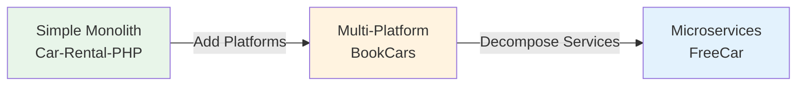

# Comparative Analysis: Three Approaches to Car Rental Systems

## Executive Summary

This comparative analysis synthesizes findings from three distinct car rental system implementations: BookCars (multi-platform monolith), Car-Rental-PHP (simple monolith), and FreeCar (cloud-native microservices). Each project represents a different point on the complexity-scalability spectrum, offering valuable insights for graduation project architecture decisions.

**Key Finding**: There is no universally "best" architecture. The optimal choice depends on team size, operational expertise, scalability requirements, and business objectives. This analysis provides a framework for making informed architectural decisions based on project-specific constraints and goals.

## Architectural Comparison

### Architecture Spectrum

The three projects represent distinct architectural philosophies:

### Architectural Characteristics Matrix

| Characteristic | Car-Rental-PHP | BookCars | FreeCar |
|---|---|---|---|
| **Architecture Style** | Monolithic | Multi-Platform Monolith | Microservices |
| **Deployment Units** | 1 (Single app) | 4 (Backend, Admin, Frontend, Mobile) | 6+ (Gateway + Services) |
| **Technology Stack** | Single (PHP) | Unified (Node.js/TypeScript) | Polyglot (Go, various DBs) |
| **Database Strategy** | Single relational DB | Single NoSQL DB | Database per service |
| **Scaling Approach** | Vertical only | Horizontal per platform | Horizontal per service |
| **Communication** | Direct function calls | HTTP REST API | RPC + Message Queue |
| **State Management** | Server sessions | JWT tokens | JWT + distributed cache |
| **Deployment Complexity** | Very Low | Medium | High |
| **Operational Overhead** | Minimal | Moderate | Significant |
| **Development Speed** | Very Fast | Fast | Moderate |
| **Team Size Suitability** | 1-2 developers | 3-8 developers | 8+ developers |
| **Learning Curve** | Low | Medium | Steep |

### Detailed Architectural Comparison

#### 1. System Decomposition

**Car-Rental-PHP** (Monolithic):
- Single codebase with all functionality
- MVC-inspired organization (Router → Controller → Service → Database)
- No service boundaries
- Tight coupling between components

**BookCars** (Multi-Platform):
- Four separate applications sharing common backend
- Clear separation: Admin, Frontend, Mobile, Backend API
- Shared packages for code reuse (types, utilities, helpers)
- Platform-specific optimizations

**FreeCar** (Microservices):
- Six independent services (Gateway, User, Car, Trip, Profile, Blob)
- Domain-driven service boundaries
- Service mesh with discovery and observability
- Complete operational independence

**Key Insight**: Decomposition should follow business domains, not technical layers. FreeCar's service boundaries (User, Car, Trip) align with business capabilities, while BookCars' boundaries (Admin, Frontend, Mobile) align with user interfaces.

#### 2. Data Management Strategies

**Car-Rental-PHP**:
- Single MySQL database
- Normalized schema (3NF)
- Database triggers for inventory management
- Direct SQL with prepared statements
- Strong consistency guaranteed

**BookCars**:
- Single MongoDB database
- Document-oriented schema
- Application-level business logic
- Mongoose ODM for data access
- Strong consistency within database

**FreeCar**:
- Polyglot persistence (MySQL + MongoDB + Redis + MinIO)
- Database per service pattern
- Event-driven data synchronization
- Mix of strong and eventual consistency
- Service owns its data exclusively

**Trade-offs**:
- **Single Database**: Simple, consistent, but bottleneck at scale
- **Shared Database**: Moderate complexity, good performance, some coupling
- **Database per Service**: Maximum independence, but complex queries and eventual consistency

#### 3. Communication Patterns

**Car-Rental-PHP**:
- Direct function calls within process
- No network overhead
- Synchronous only
- Immediate consistency

**BookCars**:
- HTTP REST API between clients and backend
- JSON request/response format
- Synchronous request-response
- Stateless API design

**FreeCar**:
- Synchronous RPC for critical operations
- Asynchronous messaging for events
- API Gateway for client requests
- Service-to-service direct communication

**Performance Implications**:
- **In-Process**: Microseconds latency, no serialization
- **HTTP REST**: Milliseconds latency, JSON serialization
- **RPC + Messaging**: Optimized for performance, but complex

## Feature Completeness Comparison

### Core Features Matrix

| Feature Category | Car-Rental-PHP | BookCars | FreeCar |
|---|---|---|---|
| **User Management** | ✓ Basic | ✓✓ Comprehensive | ✓✓ Advanced |
| **Vehicle Search** | ✓ Simple list | ✓✓ Advanced filters | ✓✓ Real-time |
| **Booking Management** | ✓ Basic CRUD | ✓✓ Full lifecycle | ✓✓ State machine |
| **Payment Processing** | ✗ Not implemented | ✓✓ Multi-gateway | ✓ Integrated |
| **Multi-Language** | ✗ Single language | ✓✓ 3 languages | ✓ Configurable |
| **Multi-Currency** | ✗ Single currency | ✓✓ Real-time conversion | ✓ Supported |
| **Mobile App** | ✗ Web only | ✓✓ Native iOS/Android | ✓✓ Mini-program |
| **Admin Panel** | ✓ Basic view | ✓✓ Comprehensive | ✓✓ Advanced |
| **Notifications** | ✗ None | ✓✓ Email + Push | ✓✓ Multi-channel |
| **Analytics** | ✗ None | ✓ Basic reporting | ✓✓ Real-time metrics |
| **Multi-Supplier** | ✗ Single operator | ✓✓ Marketplace mode | ✓ Supported |
| **Real-Time Tracking** | ✗ None | ✗ None | ✓✓ GPS integration |
| **Offline Mode** | ✗ None | ✓ Mobile only | ✓ Mobile only |

**Legend**: ✗ Not available | ✓ Basic implementation | ✓✓ Comprehensive implementation

### Feature Analysis by Category

#### User-Facing Features

**Car-Rental-PHP**:
- Basic registration and login
- Simple vehicle browsing
- Minimal booking flow
- No payment integration
- No notifications

**BookCars**:
- Multi-channel authentication (email, social login)
- Advanced search with filters
- Comprehensive booking workflow
- Multiple payment gateways (Stripe, PayPal)
- Email and push notifications
- Multi-language interface
- Currency conversion

**FreeCar**:
- Modern authentication with tokens
- Real-time vehicle search
- Mobile-first booking experience
- Integrated payment processing
- Push notifications
- Real-time vehicle tracking
- Mini-program interface

**Winner**: BookCars for feature breadth, FreeCar for modern UX

#### Administrative Features

**Car-Rental-PHP**:
- View all rentals (admin only)
- No fleet management
- No user management
- No reporting

**BookCars**:
- Comprehensive fleet management
- Multi-supplier management
- User administration
- Location hierarchy management
- Pricing configuration
- Basic reporting and analytics
- Booking management

**FreeCar**:
- Real-time fleet monitoring
- Advanced analytics dashboards
- User verification workflows
- System configuration
- Operational metrics
- Service health monitoring

**Winner**: BookCars for operational completeness, FreeCar for observability

#### Integration Features

**Car-Rental-PHP**:
- No external integrations
- No API endpoints
- No third-party services

**BookCars**:
- Payment gateways (Stripe, PayPal)
- Email service (SMTP)
- Push notification service
- Social login providers (Google, Facebook, Apple)
- Map integration (implied)

**FreeCar**:
- Payment gateway integration
- Message queue for events
- Object storage service
- OCR for license verification
- Distributed tracing
- Metrics monitoring
- Service mesh integration

**Winner**: FreeCar for integration sophistication

## Scalability & Performance Comparison

### Scalability Characteristics

| Aspect | Car-Rental-PHP | BookCars | FreeCar |
|---|---|---|---|
| **Horizontal Scaling** | ✗ Not supported | ✓ Per platform | ✓✓ Per service |
| **Vertical Scaling** | ✓ Limited | ✓ Moderate | ✓ Unlimited |
| **Load Balancing** | ✗ Single server | ✓ Per platform | ✓✓ Service mesh |
| **Caching Strategy** | ✗ None | ✓ Application-level | ✓✓ Multi-layer |
| **Database Scaling** | ✗ Single instance | ✓ Replication | ✓✓ Per service |
| **Session Management** | Server-side | JWT (stateless) | Distributed cache |
| **Concurrent Users** | < 100 | 1,000 - 10,000 | 10,000+ |
| **Geographic Distribution** | Single region | Multi-region capable | Cloud-native |

### Performance Characteristics

**Car-Rental-PHP**:
- **Latency**: Very low (in-process calls)
- **Throughput**: Limited by single server
- **Bottleneck**: Database connections
- **Optimization**: Database indexing, query optimization

**BookCars**:
- **Latency**: Low (HTTP REST)
- **Throughput**: Moderate (horizontal scaling per platform)
- **Bottleneck**: Shared database
- **Optimization**: Caching, pagination, image optimization

**FreeCar**:
- **Latency**: Moderate (network calls between services)
- **Throughput**: High (independent service scaling)
- **Bottleneck**: Inter-service communication
- **Optimization**: RPC, caching, async messaging, circuit breakers

### Scalability Recommendations

**For Small Scale** (< 1,000 users):
- Car-Rental-PHP approach is sufficient
- Vertical scaling handles growth
- Operational simplicity prioritized

**For Medium Scale** (1,000 - 10,000 users):
- BookCars approach recommended
- Horizontal scaling per platform
- Moderate operational complexity

**For Large Scale** (10,000+ users):
- FreeCar approach necessary
- Independent service scaling
- Significant operational investment required

## Security Comparison

### Security Features Matrix

| Security Aspect | Car-Rental-PHP | BookCars | FreeCar |
|---|---|---|---|
| **Authentication** | Session-based | JWT + Social login | JWT + Service auth |
| **Authorization** | Role-based (basic) | Role-based (RBAC) | Fine-grained RBAC |
| **Password Security** | Hashed | Hashed + salted | Hashed + salted |
| **HTTPS/TLS** | Recommended | Enforced | Enforced |
| **CSRF Protection** | ✗ None | ✓ Implemented | ✓ Implemented |
| **XSS Prevention** | ✗ Basic | ✓ Sanitization | ✓ Sanitization |
| **SQL Injection** | ✓ Prepared statements | ✓ ODM protection | ✓ ORM protection |
| **Rate Limiting** | ✗ None | ✗ Not mentioned | ✓✓ Gateway-level |
| **Audit Logging** | ✗ None | ✓ Basic | ✓✓ Comprehensive |
| **Data Encryption** | ✗ None | ✓ In transit | ✓✓ At rest + transit |
| **PCI Compliance** | N/A (no payments) | ✓ Hosted checkout | ✓ Compliant |

### Security Analysis

**Car-Rental-PHP**:
- Basic security suitable for educational use
- Missing modern security features (CSRF, XSS prevention)
- No encryption at rest
- Session-based auth limits scalability
- **Verdict**: Not production-ready

**BookCars**:
- Production-grade security for most features
- JWT enables stateless scaling
- Hosted checkout simplifies PCI compliance
- Multi-channel authentication
- **Verdict**: Production-ready with minor enhancements

**FreeCar**:
- Enterprise-grade security
- Service-to-service authentication
- Comprehensive audit logging
- Rate limiting and circuit breakers
- **Verdict**: Production-ready for high-security environments

## Development & Operational Comparison

### Development Experience

| Aspect | Car-Rental-PHP | BookCars | FreeCar |
|---|---|---|---|
| **Setup Time** | < 1 hour | 2-4 hours | 1-2 days |
| **Learning Curve** | Low | Medium | Steep |
| **Development Speed** | Very Fast | Fast | Moderate |
| **Debugging Ease** | Easy | Moderate | Difficult |
| **Testing Complexity** | Low | Medium | High |
| **Code Reusability** | Low | High (shared packages) | Moderate |
| **Documentation** | Minimal | Comprehensive | Extensive |
| **Community Support** | Limited | Active | Active |

### Operational Complexity

**Car-Rental-PHP**:
- **Deployment**: Single server, simple process
- **Monitoring**: Basic server monitoring
- **Logging**: Single log file
- **Backup**: Database backup only
- **Updates**: Replace files, restart server
- **Team Size**: 1-2 developers

**BookCars**:
- **Deployment**: 4 applications, containerized
- **Monitoring**: Per-application monitoring
- **Logging**: Centralized logging recommended
- **Backup**: Database + file storage
- **Updates**: Per-application deployment
- **Team Size**: 3-8 developers

**FreeCar**:
- **Deployment**: 6+ services, Kubernetes orchestration
- **Monitoring**: Distributed tracing, metrics, logs
- **Logging**: Centralized with correlation IDs
- **Backup**: Per-service database backups
- **Updates**: Rolling deployments per service
- **Team Size**: 8+ developers + DevOps team

### Cost Comparison

**Infrastructure Costs** (estimated monthly for 1,000 active users):

**Car-Rental-PHP**:
- Single VPS: $20-50/month
- Database: Included
- Total: ~$50/month

**BookCars**:
- Application servers (4): $100-200/month
- Database cluster: $50-100/month
- CDN: $20-50/month
- Total: ~$200-350/month

**FreeCar**:
- Kubernetes cluster: $200-400/month
- Databases (multiple): $150-300/month
- Message queue: $50-100/month
- Object storage: $20-50/month
- Monitoring stack: $100-200/month
- Total: ~$520-1,050/month

**Operational Costs** (team time):

**Car-Rental-PHP**:
- Deployment: 1 hour/month
- Monitoring: 2 hours/month
- Maintenance: 4 hours/month
- Total: ~7 hours/month

**BookCars**:
- Deployment: 4 hours/month
- Monitoring: 8 hours/month
- Maintenance: 12 hours/month
- Total: ~24 hours/month

**FreeCar**:
- Deployment: 8 hours/month
- Monitoring: 20 hours/month
- Maintenance: 32 hours/month
- Total: ~60 hours/month

## Common Patterns Across Projects

Despite architectural differences, all three projects demonstrate certain universal patterns:

### 1. User Authentication & Authorization

All projects implement:
- User registration and login
- Password hashing (never plaintext)
- Role-based access control (user vs. admin)
- Session or token-based authentication

**Lesson**: Authentication is non-negotiable. Even educational projects must demonstrate proper security practices.

### 2. Vehicle Inventory Management

All projects provide:
- Vehicle listing and details
- Availability tracking
- Pricing information
- Vehicle specifications

**Lesson**: Core rental functionality is consistent regardless of architecture. The difference is in how it's implemented and scaled.

### 3. Booking Lifecycle

All projects handle:
- Booking creation
- Booking status tracking
- Booking history
- Booking modifications/cancellations

**Lesson**: Booking workflow is the heart of any rental system. State management and consistency are critical.

### 4. Multi-Tier Pricing

All projects support:
- Multiple pricing modes (hourly, daily, etc.)
- Price calculation based on duration
- Transparent pricing display

**Lesson**: Flexible pricing is essential for revenue optimization and customer choice.

## Unique Innovations

### Car-Rental-PHP Innovations

**Database Triggers for Inventory**:
- Automatic stock updates on booking creation/deletion
- Eliminates application-level tracking bugs
- Guarantees consistency at database level

**Lesson**: Sometimes database-level automation is simpler and more reliable than application logic.

### BookCars Innovations

**Multi-Supplier Marketplace Mode**:
- Single platform supports both single-supplier and multi-supplier models
- Supplier-specific configuration and data isolation
- Scalable from small agency to marketplace

**Lesson**: Design for flexibility from the start. Supporting multiple business models increases market applicability.

**Monorepo with Shared Packages**:
- Code reuse across admin, frontend, mobile, and backend
- Type safety with shared TypeScript interfaces
- Atomic updates across all platforms

**Lesson**: Shared packages reduce duplication and ensure consistency in multi-platform systems.

**Guest Checkout with Temporary Accounts**:
- Reduces friction in booking process
- Automatic cleanup of abandoned bookings
- Converts to permanent account on payment success

**Lesson**: Reduce barriers to conversion. Guest checkout significantly improves booking rates.

### FreeCar Innovations

**Observability-First Architecture**:
- Distributed tracing from day one
- Comprehensive metrics and monitoring
- Centralized logging with correlation IDs

**Lesson**: In distributed systems, observability isn't optional—it's essential for debugging and operations.

**Service Mesh Patterns**:
- Service discovery for dynamic scaling
- Circuit breakers for fault tolerance
- Rate limiting at gateway level

**Lesson**: Resilience patterns must be built into architecture, not added later.

**Polyglot Persistence**:
- Relational DB for users (ACID requirements)
- Document DB for vehicles/trips (flexible schema)
- Object storage for files
- Cache for sessions and rate limiting

**Lesson**: Choose the right database for each service's needs. One size doesn't fit all.

## Recommendations for Graduation Project

### Decision Framework

Choose your architecture based on these factors:

#### Choose Simple Monolith (Car-Rental-PHP style) if:
- Team size: 1-2 developers
- Timeline: < 2 months
- Focus: Learning fundamentals
- Scale: < 100 concurrent users
- Operational expertise: Limited
- Goal: Demonstrate understanding of core concepts

#### Choose Multi-Platform (BookCars style) if:
- Team size: 3-8 developers
- Timeline: 3-6 months
- Focus: Full-stack capabilities
- Scale: 1,000 - 10,000 users
- Operational expertise: Moderate
- Goal: Production-ready system with mobile support

#### Choose Microservices (FreeCar style) if:
- Team size: 8+ developers
- Timeline: 6+ months
- Focus: Cloud-native architecture
- Scale: 10,000+ users
- Operational expertise: Advanced
- Goal: Demonstrate distributed systems mastery

### Hybrid Approach: Modular Monolith

For most graduation projects, we recommend a **modular monolith** approach:

**Structure**:
- Single deployment unit (like Car-Rental-PHP)
- Clear module boundaries (like FreeCar services)
- API-first design (like BookCars)
- Shared database with logical separation

**Benefits**:
- Simplicity of monolith
- Flexibility to extract services later
- Clear architectural boundaries
- Moderate operational complexity

**Implementation**:
1. Start with single application
2. Organize code into modules (User, Vehicle, Booking, Payment)
3. Define interfaces between modules
4. Use dependency injection for loose coupling
5. Separate database schemas per module (same DB, different schemas)
6. Build REST API for frontend/mobile consumption

**Evolution Path**:
- Phase 1: Modular monolith
- Phase 2: Extract 2-3 services if needed (User, Core, Files)
- Phase 3: Full microservices if justified

### Essential Features for Graduation Project

Based on analysis of all three projects, prioritize these features:

**Must-Have** (MVP):
1. User registration and authentication
2. Vehicle search and filtering
3. Booking creation and management
4. Payment processing (even if simulated)
5. Admin panel for fleet management
6. Basic reporting

**Should-Have** (Phase 2):
7. Email notifications
8. Multi-language support
9. Mobile-responsive design
10. Advanced search filters
11. Booking modifications/cancellations

**Nice-to-Have** (Phase 3):
12. Native mobile app
13. Real-time tracking
14. Advanced analytics
15. Multi-supplier support
16. Loyalty program

### Technology Stack Recommendations

**Backend**:
- **Framework**: Express.js (Node.js), Spring Boot (Java), Django (Python), or Laravel (PHP)
- **Database**: PostgreSQL (relational) or MongoDB (document)
- **Authentication**: JWT with refresh tokens
- **API**: RESTful with OpenAPI documentation

**Frontend**:
- **Framework**: React, Vue, or Angular
- **State Management**: Context API, Redux, or Vuex
- **UI Library**: Material-UI, Ant Design, or Tailwind CSS
- **Build Tool**: Vite or Webpack

**Mobile** (if included):
- **Framework**: React Native or Flutter (cross-platform)
- **Alternative**: Progressive Web App (PWA)

**DevOps**:
- **Containerization**: Docker
- **CI/CD**: GitHub Actions or GitLab CI
- **Hosting**: Cloud provider (AWS, GCP, Azure) or Heroku/Vercel for simplicity

### Architecture Principles

Regardless of chosen architecture, follow these principles:

1. **API-First Design**: Separate frontend from backend
2. **Stateless Services**: Use JWT, not server sessions
3. **Database Normalization**: Start with 3NF, denormalize only when measured performance requires it
4. **Security by Default**: HTTPS, input validation, output encoding, CSRF protection
5. **Observability**: Logging, monitoring, error tracking from day one
6. **Documentation**: API docs, architecture diagrams, setup instructions
7. **Testing**: Unit tests for business logic, integration tests for critical paths
8. **Version Control**: Git with meaningful commits and branching strategy

## Lessons Learned Summary

### From Car-Rental-PHP

**Strengths**:
- Simplicity enables rapid development
- Easy to understand and debug
- Low operational overhead
- Database triggers for critical business rules

**Limitations**:
- Doesn't scale horizontally
- Limited feature set
- Basic security
- No mobile support

**Key Lesson**: Start simple. Don't over-engineer early. Complexity should be justified by requirements.

### From BookCars

**Strengths**:
- Multi-platform support (web + mobile)
- Comprehensive feature set
- Production-ready security
- Flexible supplier management
- Shared packages for code reuse

**Limitations**:
- Shared database can become bottleneck
- Moderate operational complexity
- Requires team coordination across platforms

**Key Lesson**: Multi-platform architecture with shared backend provides excellent balance of features, scalability, and maintainability for most use cases.

### From FreeCar

**Strengths**:
- Exceptional scalability
- Independent service deployment
- Comprehensive observability
- Fault isolation
- Technology flexibility

**Limitations**:
- High operational complexity
- Steep learning curve
- Distributed debugging challenges
- Eventual consistency complexity
- Significant infrastructure costs

**Key Lesson**: Microservices enable massive scale but require significant operational investment. Only adopt when benefits clearly outweigh costs.

## Conclusion

The three projects analyzed represent a spectrum of architectural approaches, each with distinct trade-offs:

- **Car-Rental-PHP**: Simplicity and speed over scalability
- **BookCars**: Balance of features, scalability, and maintainability
- **FreeCar**: Maximum scalability and resilience at the cost of complexity

For graduation projects, **BookCars' multi-platform approach** offers the best balance:
- Demonstrates full-stack capabilities
- Supports web and mobile platforms
- Production-ready feature set
- Manageable operational complexity
- Clear path to scale if needed

However, the optimal choice depends on your specific context:
- **Team size**: Larger teams can handle more complexity
- **Timeline**: Shorter timelines favor simpler architectures
- **Learning goals**: What do you want to demonstrate?
- **Operational expertise**: Do you have DevOps skills?
- **Scale requirements**: How many users do you need to support?

**Final Recommendation**: Start with a modular monolith inspired by BookCars' organization but with Car-Rental-PHP's deployment simplicity. Design clear module boundaries that could become microservices later (FreeCar-style) if needed. This approach provides:
- Fast initial development
- Clear architectural boundaries
- Flexibility to evolve
- Manageable complexity
- Production-ready result

The best architecture is the one that delivers your requirements with the least complexity necessary. Don't build microservices because they're trendy—build them because your specific requirements demand them.
