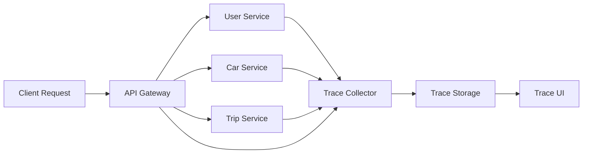
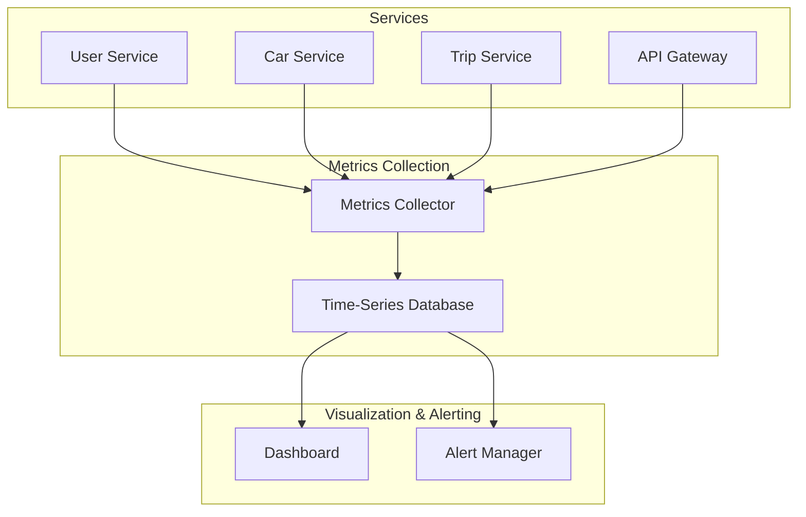
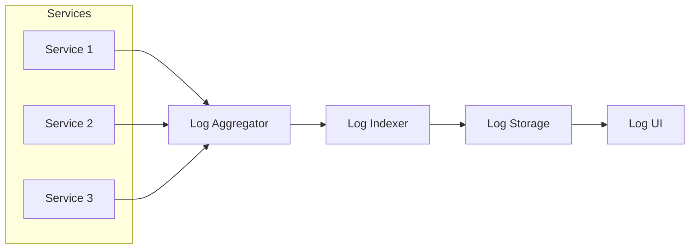
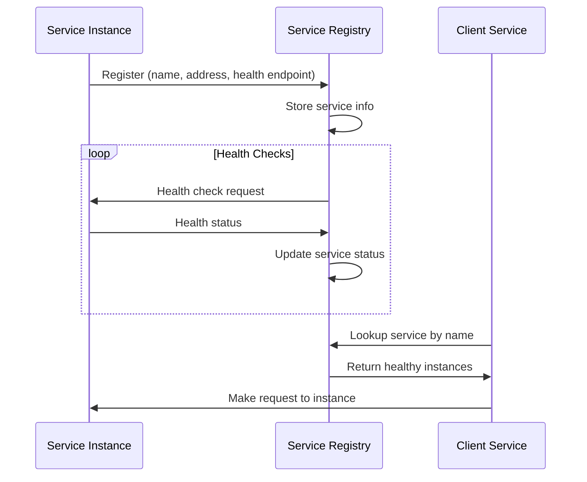
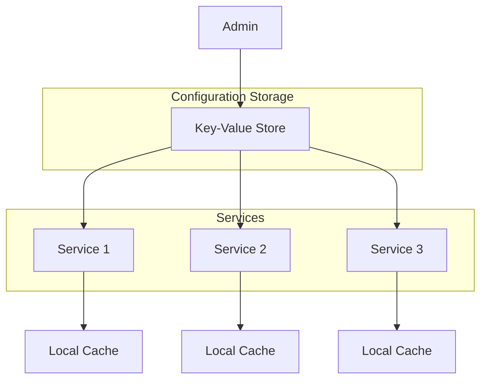
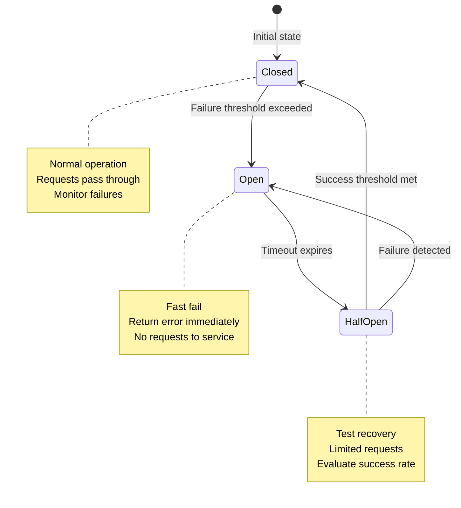
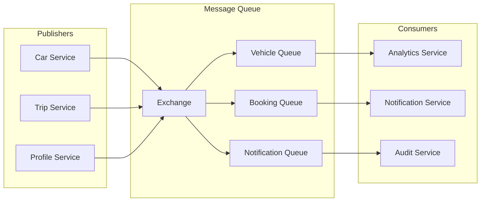
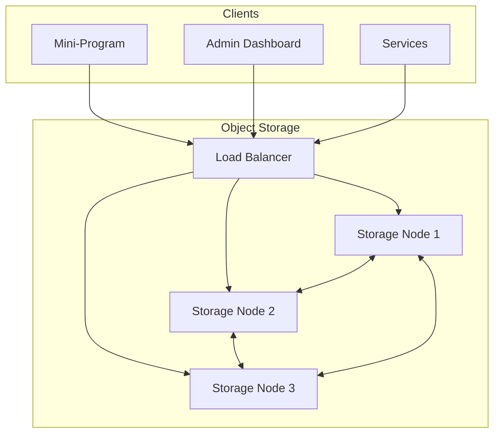

# FreeCar Cloud-Native Patterns

## Overview

FreeCar exemplifies cloud-native architecture principles through comprehensive implementation of modern distributed system patterns. This document analyzes the key cloud-native patterns that enable FreeCar to achieve scalability, resilience, and operational excellence.

## Observability Patterns

### 1. Distributed Tracing

**Purpose**: Track requests as they flow through multiple microservices to understand system behavior and diagnose issues.

**Implementation Pattern**:



**Key Components**:

**Trace Context Propagation**:
- Each request assigned unique trace ID
- Trace ID propagated via request headers
- Parent-child span relationships maintained
- Baggage items for cross-cutting concerns

**Span Creation**:
- Each service operation creates span
- Span includes operation name, start/end time
- Tags for metadata (service name, endpoint, user ID)
- Logs for events within span
- Error status and stack traces

**Trace Collection**:
- Services send spans to trace collector
- Asynchronous sending to avoid blocking
- Batch sending for efficiency
- Retry logic for failed sends
- Sampling for high-volume systems

**Trace Analysis**:
- Visualize complete request flow
- Identify slow operations (latency analysis)
- Detect error propagation
- Understand service dependencies
- Measure end-to-end latency

**Benefits**:
- **Root Cause Analysis**: Quickly identify where failures occur
- **Performance Optimization**: Find bottlenecks in request flow
- **Dependency Mapping**: Understand service relationships
- **Latency Attribution**: Determine which service adds latency

**Use Cases in FreeCar**:
- Trace booking creation across User, Car, and Trip services
- Debug payment processing failures
- Analyze search query performance
- Monitor verification workflow latency

---

### 2. Metrics Collection & Monitoring

**Purpose**: Collect, aggregate, and visualize system and application metrics for real-time monitoring and alerting.

**Metrics Architecture**:



**Metric Types**:

**System Metrics**:
- CPU usage per service
- Memory consumption
- Disk I/O
- Network bandwidth
- Container resource limits

**Application Metrics**:
- Request rate (requests per second)
- Error rate (errors per second)
- Response time (p50, p95, p99 percentiles)
- Active connections
- Database connection pool usage

**Business Metrics**:
- Bookings created per hour
- Revenue per hour
- Active trips count
- User registrations
- Verification approval rate

**Custom Metrics**:
- Vehicle availability rate
- Search-to-booking conversion
- Average trip duration
- Popular vehicle categories
- Peak usage hours

**Metric Collection Pattern**:
- Services expose metrics endpoint
- Metrics collector scrapes endpoints periodically
- Metrics stored in time-series database
- Retention policies for historical data
- Aggregation for long-term storage

**Alerting Strategy**:
- Threshold-based alerts (CPU > 80%)
- Rate-of-change alerts (error rate spike)
- Anomaly detection (unusual patterns)
- Alert routing to on-call teams
- Alert escalation policies
- Alert acknowledgment and resolution

**Dashboard Design**:
- Service health overview
- Request rate and latency graphs
- Error rate trends
- Resource utilization
- Business KPI tracking
- Custom dashboards per team

**Benefits**:
- **Proactive Monitoring**: Detect issues before users notice
- **Capacity Planning**: Understand resource needs
- **Performance Tracking**: Monitor SLA compliance
- **Business Insights**: Track key business metrics

---

### 3. Centralized Logging

**Purpose**: Aggregate logs from all services into a central location for searching, analysis, and debugging.

**Logging Architecture**:



**Structured Logging**:
- JSON format for machine readability
- Consistent field names across services
- Severity levels (DEBUG, INFO, WARN, ERROR)
- Timestamp with timezone
- Service name and version
- Correlation IDs for request tracking

**Log Enrichment**:
- Trace ID from distributed tracing
- User ID for user-specific logs
- Request ID for request correlation
- Environment (dev, staging, prod)
- Hostname and container ID

**Log Aggregation**:
- Services write logs to stdout/stderr
- Container runtime captures logs
- Log shipper forwards to aggregator
- Buffering for reliability
- Compression for bandwidth

**Log Indexing & Search**:
- Full-text search across all logs
- Filter by service, level, time range
- Search by correlation ID
- Regex pattern matching
- Saved searches and queries

**Log Retention**:
- Hot storage for recent logs (7-30 days)
- Cold storage for historical logs (90+ days)
- Archival to object storage
- Compliance-driven retention policies

**Benefits**:
- **Unified View**: Single place to search all logs
- **Correlation**: Link logs across services via IDs
- **Debugging**: Trace issues through log timeline
- **Audit Trail**: Compliance and security auditing

---

## Service Discovery & Configuration

### 4. Service Registry Pattern

**Purpose**: Enable services to dynamically discover and communicate with each other without hardcoded addresses.

**Service Discovery Flow**:



**Service Registration**:
- Services register on startup
- Provide service name, address, port
- Include metadata (version, tags, capabilities)
- Register health check endpoint
- Heartbeat mechanism for liveness

**Health Checking**:
- Registry performs periodic health checks
- HTTP, TCP, or gRPC health checks
- Configurable check interval
- Failure threshold before marking unhealthy
- Automatic deregistration of failed services

**Service Discovery**:
- Clients query registry by service name
- Registry returns list of healthy instances
- Client-side load balancing
- Caching of service addresses
- Watch for service changes

**Load Balancing Strategies**:
- Round-robin distribution
- Least connections
- Random selection
- Weighted distribution
- Locality-aware routing

**Benefits**:
- **Dynamic Scaling**: New instances automatically discovered
- **Fault Tolerance**: Unhealthy instances removed
- **Zero-Downtime Deployments**: Gradual instance replacement
- **Environment Agnostic**: Same code works in any environment

---

### 5. Centralized Configuration Management

**Purpose**: Manage configuration for all services from a central location with dynamic updates.

**Configuration Architecture**:



**Configuration Storage**:
- Hierarchical key-value structure
- Environment-specific configurations
- Service-specific configurations
- Global shared configurations
- Versioned configuration history

**Configuration Distribution**:
- Services fetch config on startup
- Watch for configuration changes
- Push notifications for updates
- Polling fallback mechanism
- Local caching for resilience

**Dynamic Configuration Updates**:
- Update config without restart
- Hot reload of configuration
- Gradual rollout of changes
- Rollback capability
- Configuration validation

**Secure Credential Management**:
- Encrypted storage of secrets
- Access control per service
- Credential rotation
- Audit logging of access
- Integration with secret management systems

**Configuration Hierarchy**:
```
/freecar
  /global
    /database
      connection_timeout: 30s
    /cache
      ttl: 3600
  /services
    /user_srv
      /database
        host: user-db.internal
        port: 3306
      /auth
        token_expiry: 24h
    /car_srv
      /database
        host: car-db.internal
        port: 27017
```

**Benefits**:
- **Centralized Management**: Single source of truth
- **Environment Consistency**: Same config structure across environments
- **Dynamic Updates**: Change config without deployment
- **Security**: Encrypted secrets and access control

---

## Resilience & Fault Tolerance Patterns

### 6. Circuit Breaker Pattern

**Purpose**: Prevent cascading failures by detecting service failures and temporarily blocking requests.

**Circuit Breaker States**:



**Circuit Breaker Configuration**:
- **Failure Threshold**: Number of failures before opening (e.g., 5)
- **Timeout**: Duration before testing recovery (e.g., 30s)
- **Success Threshold**: Successes needed to close (e.g., 3)
- **Request Volume Threshold**: Minimum requests before evaluation

**Implementation Pattern**:
```
CircuitBreaker:
  - state: closed | open | half-open
  - failureCount: integer
  - successCount: integer
  - lastFailureTime: timestamp
  - requestCount: integer
  
  execute(request):
    if state == open:
      if now - lastFailureTime > timeout:
        state = half-open
        successCount = 0
      else:
        return error("Circuit open")
    
    try:
      response = makeRequest(request)
      onSuccess()
      return response
    catch error:
      onFailure()
      throw error
  
  onSuccess():
    if state == half-open:
      successCount++
      if successCount >= successThreshold:
        state = closed
        failureCount = 0
  
  onFailure():
    failureCount++
    lastFailureTime = now
    if failureCount >= failureThreshold:
      state = open
```

**Fallback Strategies**:
- Return cached response
- Return default value
- Return degraded response
- Fail gracefully with error message
- Queue request for later retry

**Benefits**:
- **Prevent Cascading Failures**: Stop calling failing services
- **Fast Failure**: Immediate error response
- **Automatic Recovery**: Test service recovery
- **Resource Protection**: Prevent resource exhaustion

**Use Cases in FreeCar**:
- Protect against payment gateway failures
- Handle OCR service unavailability
- Manage database connection failures
- Deal with third-party API outages

---

### 7. Rate Limiting & Throttling

**Purpose**: Control request rate to prevent system overload and ensure fair resource usage.

**Rate Limiting Strategies**:

**Token Bucket Algorithm**:
```
TokenBucket:
  - capacity: maximum tokens
  - tokens: current tokens
  - refillRate: tokens per second
  - lastRefill: timestamp
  
  allowRequest():
    refillTokens()
    if tokens >= 1:
      tokens -= 1
      return true
    return false
  
  refillTokens():
    elapsed = now - lastRefill
    tokensToAdd = elapsed * refillRate
    tokens = min(tokens + tokensToAdd, capacity)
    lastRefill = now
```

**Sliding Window Algorithm**:
- Track requests in time windows
- Count requests in current + previous window
- Smooth rate limiting
- More accurate than fixed windows

**Rate Limit Scopes**:
- **Per User**: Limit requests per user ID
- **Per IP**: Limit requests per IP address
- **Per API Key**: Limit requests per API key
- **Per Endpoint**: Different limits per endpoint
- **Global**: System-wide rate limit

**Rate Limit Tiers**:
- **Free Tier**: 100 requests/hour
- **Basic Tier**: 1,000 requests/hour
- **Premium Tier**: 10,000 requests/hour
- **Enterprise**: Custom limits

**Rate Limit Response**:
- HTTP 429 (Too Many Requests)
- Retry-After header with wait time
- Rate limit headers (X-RateLimit-Limit, X-RateLimit-Remaining)
- Clear error message

**Distributed Rate Limiting**:
- Centralized counter in cache (Redis)
- Atomic increment operations
- Expiring keys for time windows
- Consistent across service instances

**Benefits**:
- **Prevent Abuse**: Stop malicious users
- **Fair Usage**: Ensure all users get resources
- **System Protection**: Prevent overload
- **Cost Control**: Limit expensive operations

---

### 8. Retry & Timeout Patterns

**Purpose**: Handle transient failures gracefully and prevent indefinite waiting.

**Retry Strategy**:

**Exponential Backoff**:
```
RetryPolicy:
  - maxAttempts: 3
  - initialDelay: 100ms
  - maxDelay: 10s
  - multiplier: 2
  - jitter: true
  
  execute(operation):
    attempt = 0
    delay = initialDelay
    
    while attempt < maxAttempts:
      try:
        return operation()
      catch error:
        if not isRetryable(error):
          throw error
        
        attempt++
        if attempt >= maxAttempts:
          throw error
        
        sleep(delay + randomJitter())
        delay = min(delay * multiplier, maxDelay)
```

**Retryable vs Non-Retryable Errors**:
- **Retryable**: Network timeouts, 503 Service Unavailable, connection refused
- **Non-Retryable**: 400 Bad Request, 401 Unauthorized, 404 Not Found

**Idempotency**:
- Ensure operations can be safely retried
- Use idempotency keys for critical operations
- Detect duplicate requests
- Return cached response for duplicates

**Timeout Strategy**:
- **Connection Timeout**: Time to establish connection (e.g., 5s)
- **Request Timeout**: Time for complete request/response (e.g., 30s)
- **Idle Timeout**: Time between data packets (e.g., 10s)

**Cascading Timeout Prevention**:
- Set shorter timeouts for downstream services
- Timeout budget decreases down the call chain
- Prevent timeout accumulation

**Benefits**:
- **Transient Failure Handling**: Recover from temporary issues
- **Improved Reliability**: Higher success rate
- **Prevent Hanging**: Fail fast on unresponsive services
- **Resource Management**: Free up resources on timeout

---

## Message Queue Patterns

### 9. Asynchronous Messaging

**Purpose**: Decouple services through event-driven communication for non-critical operations.

**Message Queue Architecture**:



**Message Publishing**:
- Publish events after state changes
- Include event type and payload
- Add metadata (timestamp, publisher, correlation ID)
- Confirm message delivery
- Handle publish failures

**Message Consumption**:
- Subscribe to relevant queues
- Process messages asynchronously
- Acknowledge successful processing
- Reject and requeue failed messages
- Dead letter queue for poison messages

**Event Types in FreeCar**:
- **Vehicle Events**: vehicle.created, vehicle.updated, vehicle.available, vehicle.unavailable
- **Booking Events**: booking.created, booking.confirmed, booking.started, booking.completed, booking.cancelled
- **User Events**: user.registered, user.verified, user.suspended
- **Payment Events**: payment.processed, payment.failed, refund.processed

**Message Patterns**:

**Publish-Subscribe**:
- One publisher, multiple subscribers
- Each subscriber gets copy of message
- Broadcast notifications

**Work Queue**:
- Multiple workers consume from queue
- Each message processed by one worker
- Load distribution

**Topic-Based Routing**:
- Messages routed by topic/pattern
- Subscribers filter by topic
- Flexible routing

**Benefits**:
- **Loose Coupling**: Services don't need to know about each other
- **Scalability**: Add consumers to handle load
- **Reliability**: Messages persisted until processed
- **Temporal Decoupling**: Services don't need to be online simultaneously

---

## Object Storage Patterns

### 10. Distributed Object Storage

**Purpose**: Store and serve large binary files (images, documents) with high availability and scalability.

**Object Storage Architecture**:



**Storage Organization**:
- Bucket-based organization
- Hierarchical key structure
- Metadata storage
- Versioning support
- Lifecycle policies

**Upload Patterns**:

**Direct Upload**:
- Client uploads directly to storage
- Pre-signed URL for security
- Reduces server load
- Faster uploads

**Server-Mediated Upload**:
- Client uploads to service
- Service validates and processes
- Service uploads to storage
- More control, higher latency

**Multipart Upload**:
- Split large files into parts
- Upload parts in parallel
- Resume failed uploads
- Efficient for large files

**Access Control**:
- Bucket policies
- Object-level permissions
- Pre-signed URLs with expiration
- Public vs private objects
- CORS configuration

**Performance Optimization**:
- CDN integration for fast delivery
- Caching frequently accessed objects
- Compression for bandwidth savings
- Lazy loading for images
- Progressive image loading

**Benefits**:
- **Scalability**: Handle petabytes of data
- **Durability**: Replicated across nodes
- **Availability**: High uptime guarantees
- **Cost-Effective**: Pay for what you use

---

## Container Orchestration Patterns

### 11. Kubernetes Deployment

**Purpose**: Automate deployment, scaling, and management of containerized services.

**Kubernetes Resources**:

**Deployment**:
- Desired state for service
- Number of replicas
- Container image and version
- Resource limits (CPU, memory)
- Rolling update strategy

**Service**:
- Stable network endpoint
- Load balancing across pods
- Service discovery
- Internal and external access

**ConfigMap & Secret**:
- Configuration management
- Environment variables
- Secure credential storage
- Volume mounts

**Ingress**:
- HTTP/HTTPS routing
- TLS termination
- Path-based routing
- Host-based routing

**Deployment Strategies**:

**Rolling Update**:
- Gradual replacement of old pods
- Zero-downtime deployment
- Automatic rollback on failure
- Configurable update speed

**Blue-Green Deployment**:
- Deploy new version alongside old
- Switch traffic to new version
- Quick rollback if issues
- Higher resource usage

**Canary Deployment**:
- Route small percentage to new version
- Monitor metrics and errors
- Gradually increase traffic
- Rollback if problems detected

**Auto-Scaling**:
- Horizontal Pod Autoscaler (HPA)
- Scale based on CPU/memory
- Scale based on custom metrics
- Minimum and maximum replicas

**Benefits**:
- **Automated Operations**: Self-healing, auto-scaling
- **Resource Efficiency**: Optimal resource utilization
- **Portability**: Run anywhere Kubernetes runs
- **Declarative Configuration**: Infrastructure as code

---

## Conclusion

FreeCar's cloud-native patterns demonstrate production-ready distributed system design:

**Observability**:
- Distributed tracing for request flow visibility
- Metrics collection for monitoring and alerting
- Centralized logging for debugging and auditing

**Service Management**:
- Service discovery for dynamic communication
- Centralized configuration for consistency
- Container orchestration for automation

**Resilience**:
- Circuit breakers for fault isolation
- Rate limiting for system protection
- Retry and timeout for transient failures

**Scalability**:
- Asynchronous messaging for decoupling
- Object storage for file management
- Kubernetes for elastic scaling

These patterns provide a comprehensive blueprint for building modern, cloud-native car rental systems that can scale to meet growing demand while maintaining reliability and operational excellence.
