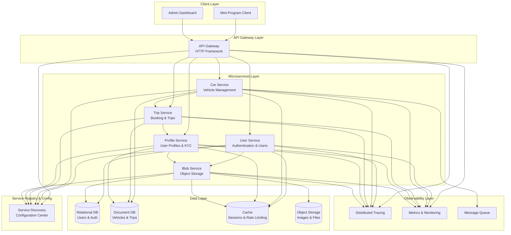
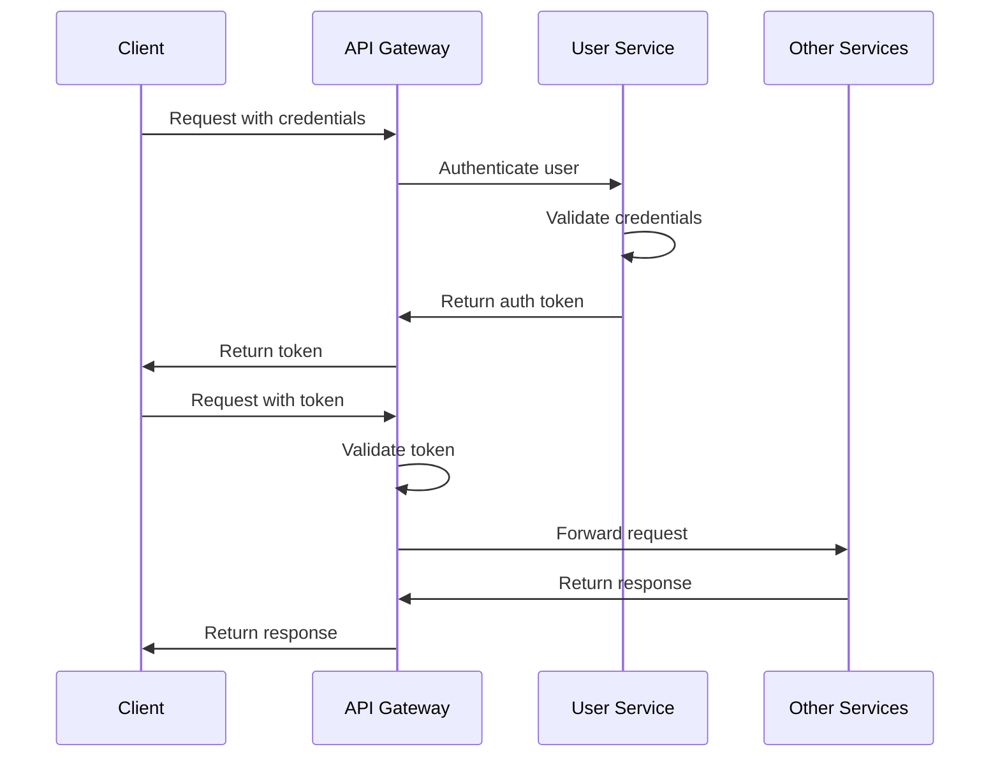

# FreeCar Microservices Architecture

## Architectural Overview

FreeCar implements a true microservices architecture where the system is decomposed into small, independent services that communicate through well-defined APIs. This architecture enables independent scaling, deployment, and technology choices for each service while maintaining system cohesion through standardized communication patterns.

## Service Mesh Architecture

## Core Architectural Patterns

### 1. API Gateway Pattern

**Purpose**: Provide a single entry point for all client requests, handling cross-cutting concerns before routing to appropriate microservices.

**Responsibilities**:
- **Request Routing**: Direct requests to appropriate backend services
- **Authentication**: Validate tokens and user identity
- **Rate Limiting**: Prevent abuse and ensure fair usage
- **Request/Response Transformation**: Adapt client requests to service APIs
- **Protocol Translation**: Convert HTTP to RPC for backend services
- **Load Balancing**: Distribute requests across service instances
- **Circuit Breaking**: Prevent cascading failures

**Benefits**:
- Clients interact with single endpoint
- Centralized security and authentication
- Simplified client logic
- Backend services can evolve independently
- Cross-cutting concerns handled in one place

### 2. Service Discovery Pattern

**Purpose**: Enable services to find and communicate with each other dynamically without hardcoded addresses.

**Implementation**:
- **Service Registration**: Services register themselves on startup
- **Health Checking**: Continuous health monitoring of services
- **Service Lookup**: Services query registry to find dependencies
- **Configuration Management**: Centralized configuration storage
- **Dynamic Updates**: Services discover new instances automatically

**Benefits**:
- No hardcoded service addresses
- Automatic failover to healthy instances
- Easy horizontal scaling
- Centralized configuration management
- Zero-downtime deployments

### 3. Database per Service Pattern

**Purpose**: Each microservice owns its data and database, ensuring loose coupling and independent evolution.

**Implementation**:
- **User Service**: Relational database for user accounts and authentication
- **Car Service**: Document database for vehicle inventory and tracking
- **Trip Service**: Document database for booking and trip records
- **Profile Service**: Document database for user profiles and verification
- **Blob Service**: Object storage for images and files

**Benefits**:
- Services can choose optimal database for their needs
- No shared database bottlenecks
- Independent schema evolution
- Fault isolation (database failure affects one service)
- Technology flexibility (polyglot persistence)

**Challenges**:
- Data consistency across services
- Complex queries spanning multiple services
- Increased operational complexity

### 4. Asynchronous Messaging Pattern

**Purpose**: Decouple services through event-driven communication for non-critical operations.

**Use Cases**:
- **Vehicle Status Updates**: Car service publishes availability changes
- **Booking Notifications**: Trip service publishes booking events
- **Audit Logging**: Services publish audit events
- **Analytics Events**: Services publish business events for analytics

**Benefits**:
- Loose coupling between services
- Better fault tolerance (messages queued if service down)
- Improved scalability (async processing)
- Event sourcing capabilities
- Temporal decoupling (services don't need to be online simultaneously)

### 5. Circuit Breaker Pattern

**Purpose**: Prevent cascading failures by detecting service failures and temporarily blocking requests.

**States**:
- **Closed**: Normal operation, requests pass through
- **Open**: Service failing, requests immediately fail
- **Half-Open**: Testing if service recovered

**Benefits**:
- Prevents resource exhaustion
- Faster failure detection
- Graceful degradation
- System stability during partial failures

## Service Communication Patterns

### Synchronous RPC Communication

**When Used**:
- Real-time operations requiring immediate response
- Critical path operations (authentication, booking creation)
- Operations requiring strong consistency

**Example Flows**:
- API Gateway → User Service (authentication)
- Trip Service → Car Service (check availability)
- Trip Service → Profile Service (verify user eligibility)

**Characteristics**:
- Low latency
- Strong consistency
- Tight coupling (caller waits for response)
- Failure propagation risk

### Asynchronous Message-Based Communication

**When Used**:
- Non-critical operations
- Event notifications
- Background processing
- Operations tolerating eventual consistency

**Example Flows**:
- Car Service → Message Queue (vehicle status change)
- Trip Service → Message Queue (booking completed)
- Profile Service → Message Queue (verification completed)

**Characteristics**:
- Loose coupling
- Better fault tolerance
- Eventual consistency
- Higher latency acceptable

## Observability Architecture

### Distributed Tracing

**Purpose**: Track requests as they flow through multiple microservices.

**Implementation**:
- Each request assigned unique trace ID
- Each service operation creates span
- Spans linked to form complete trace
- Traces visualized in tracing UI

**Benefits**:
- Identify performance bottlenecks
- Debug distributed transactions
- Understand service dependencies
- Measure end-to-end latency

### Metrics Collection

**Purpose**: Monitor service health, performance, and business metrics.

**Metrics Types**:
- **System Metrics**: CPU, memory, disk, network
- **Application Metrics**: Request rate, error rate, latency
- **Business Metrics**: Bookings created, revenue, active users

**Benefits**:
- Real-time system health visibility
- Proactive alerting on issues
- Capacity planning data
- Performance optimization insights

### Centralized Logging

**Purpose**: Aggregate logs from all services for debugging and analysis.

**Implementation**:
- Services write structured logs
- Logs collected and indexed centrally
- Correlation IDs link related logs
- Search and analysis capabilities

**Benefits**:
- Single place to search logs
- Correlate logs across services
- Debug distributed issues
- Audit trail for compliance

## Deployment Architecture

### Container-Based Deployment

**Approach**:
- Each service packaged as container image
- Services deployed to container orchestration platform
- Automated scaling based on load
- Rolling updates for zero-downtime deployments

**Benefits**:
- Consistent deployment across environments
- Easy horizontal scaling
- Resource isolation
- Simplified dependency management

### Kubernetes Orchestration

**Capabilities**:
- **Service Discovery**: Built-in DNS for service communication
- **Load Balancing**: Automatic traffic distribution
- **Health Checks**: Automatic restart of failed containers
- **Auto-Scaling**: Scale based on CPU/memory/custom metrics
- **Rolling Updates**: Zero-downtime deployments
- **Configuration Management**: ConfigMaps and Secrets

## Security Architecture

### Authentication Flow

### Security Layers

1. **API Gateway Security**:
   - Token validation
   - Rate limiting
   - Request sanitization
   - CORS handling

2. **Service-Level Security**:
   - Service-to-service authentication
   - Authorization checks
   - Input validation
   - Output sanitization

3. **Data Security**:
   - Encryption at rest
   - Encryption in transit
   - Secure credential storage
   - Audit logging

## Scalability Patterns

### Horizontal Scaling

**Approach**:
- Deploy multiple instances of each service
- Load balancer distributes traffic
- Stateless services enable easy scaling
- Database read replicas for read-heavy services

**Scaling Strategies**:
- **User Service**: Scale based on authentication requests
- **Car Service**: Scale based on search queries
- **Trip Service**: Scale based on booking operations
- **Gateway**: Scale based on total traffic

### Caching Strategy

**Cache Layers**:
- **API Gateway**: Cache frequent queries
- **Service Level**: Cache database queries
- **Database Level**: Query result caching

**Cache Invalidation**:
- Time-based expiration
- Event-based invalidation (via message queue)
- Manual invalidation for critical updates

## Resilience Patterns

### Fault Tolerance

**Mechanisms**:
- **Circuit Breakers**: Prevent cascading failures
- **Timeouts**: Prevent indefinite waiting
- **Retries**: Handle transient failures
- **Fallbacks**: Provide degraded functionality

### Data Consistency

**Approaches**:
- **Strong Consistency**: For critical operations (payments, bookings)
- **Eventual Consistency**: For non-critical operations (analytics, notifications)
- **Saga Pattern**: For distributed transactions
- **Compensating Transactions**: For rollback scenarios

## Advantages of This Architecture

1. **Independent Scalability**: Scale services based on individual load
2. **Technology Flexibility**: Different services can use different tech stacks
3. **Fault Isolation**: Service failures don't cascade
4. **Team Autonomy**: Teams can own and deploy services independently
5. **Faster Development**: Parallel development on different services
6. **Easier Maintenance**: Smaller codebases easier to understand
7. **Better Observability**: Comprehensive monitoring and tracing

## Challenges & Trade-offs

1. **Operational Complexity**: More services to deploy and monitor
2. **Network Latency**: Inter-service calls add latency
3. **Data Consistency**: Distributed transactions are complex
4. **Testing Complexity**: Integration testing across services
5. **Debugging Difficulty**: Issues span multiple services
6. **Infrastructure Cost**: More resources needed for service mesh

## Lessons for Graduation Projects

FreeCar's architecture demonstrates:
- How to decompose a monolith into microservices
- Importance of observability from day one
- Service mesh patterns for production systems
- Trade-offs between complexity and scalability
- Cloud-native design principles in practice

For graduation projects, consider:
- Start with fewer, larger services (avoid over-decomposition)
- Invest in observability early
- Use API gateway for cross-cutting concerns
- Plan for eventual consistency
- Implement circuit breakers for resilience
