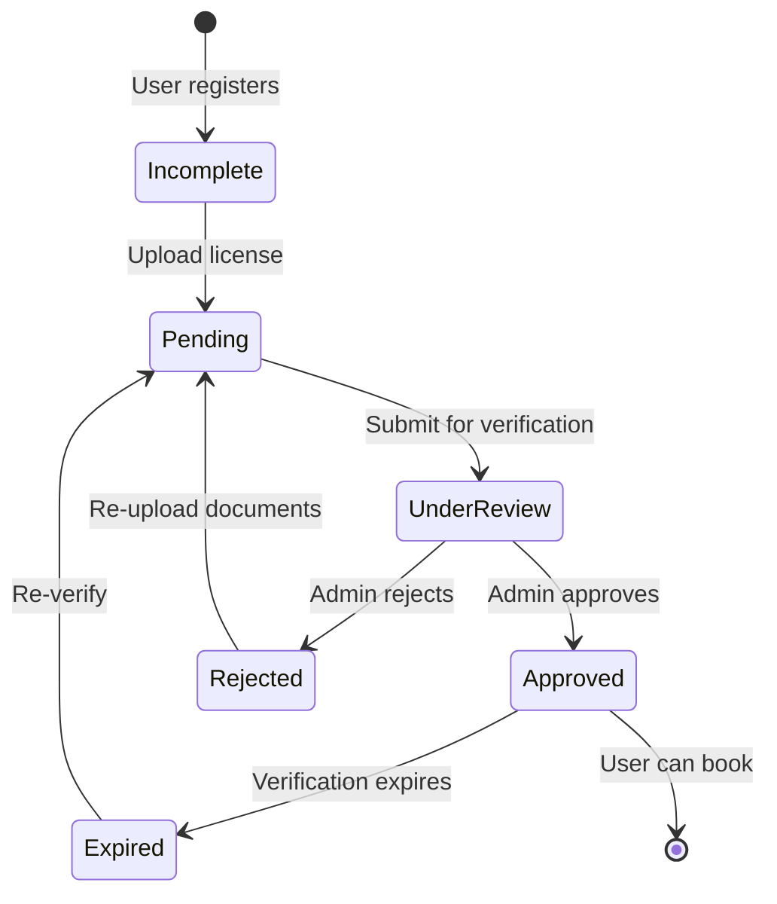
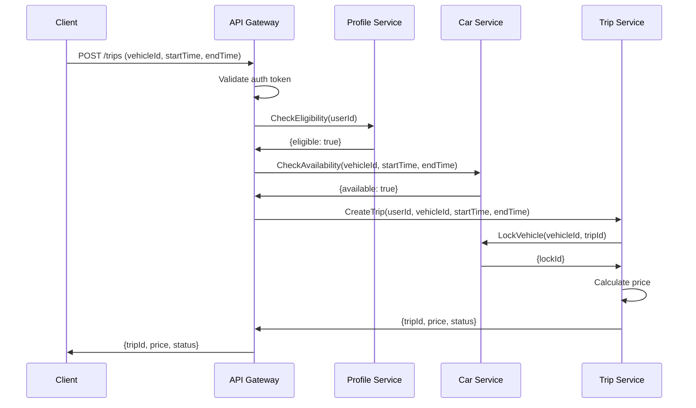
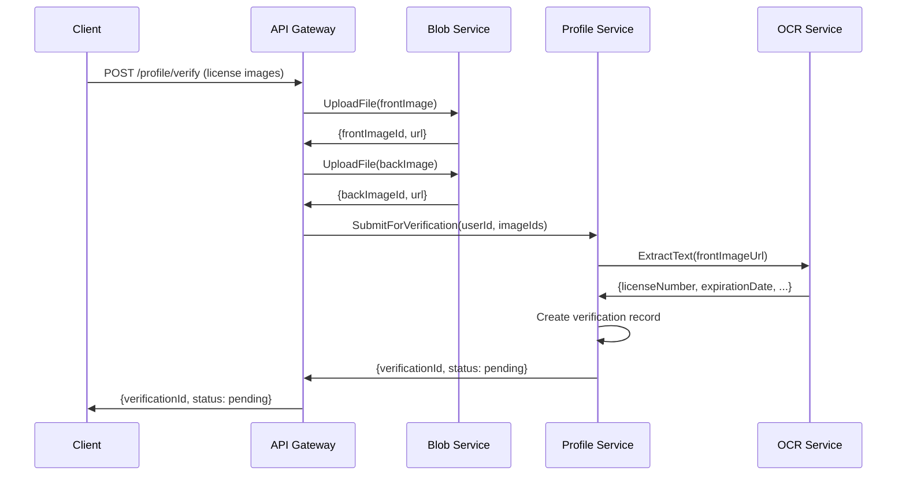

# FreeCar Service Breakdown

## Overview

FreeCar decomposes the car rental system into six core microservices, each with clear boundaries and responsibilities. This document provides a detailed analysis of each service, abstracting away implementation specifics to focus on architectural patterns and business logic.

## Service Decomposition Strategy

The services are organized around business domains following Domain-Driven Design (DDD) principles:
- **User Service**: Identity and access management domain
- **Car Service**: Vehicle inventory and tracking domain
- **Trip Service**: Booking and rental lifecycle domain
- **Profile Service**: User verification and KYC domain
- **Blob Service**: File and media management domain
- **API Gateway**: Cross-cutting concerns and routing

---

## 1. API Gateway Service

### Purpose
Single entry point for all client requests, handling authentication, routing, and cross-cutting concerns before forwarding to backend microservices.

### Core Responsibilities

**Request Management**:
- Route incoming HTTP requests to appropriate microservices
- Transform HTTP requests to RPC calls for backend services
- Aggregate responses from multiple services when needed
- Handle request/response format conversion

**Security & Authentication**:
- Validate authentication tokens on all requests
- Extract user identity from tokens
- Enforce rate limiting per user/IP
- Implement CORS policies
- Sanitize and validate input

**Cross-Cutting Concerns**:
- Centralized logging of all requests
- Distributed tracing context propagation
- Metrics collection (request count, latency, errors)
- Circuit breaking for backend services
- Request timeout management

### Key APIs (Abstracted)

**User Management Routes**:
- `POST /auth/login` - User authentication
- `POST /auth/register` - User registration
- `GET /user/profile` - Get user profile
- `PUT /user/profile` - Update user profile

**Vehicle Routes**:
- `GET /cars` - Search available vehicles
- `GET /cars/:id` - Get vehicle details
- `GET /cars/:id/availability` - Check vehicle availability

**Booking Routes**:
- `POST /trips` - Create new booking
- `GET /trips` - List user bookings
- `GET /trips/:id` - Get booking details
- `PUT /trips/:id` - Update booking
- `POST /trips/:id/cancel` - Cancel booking

**Profile Routes**:
- `POST /profile/verify` - Submit verification documents
- `GET /profile/status` - Get verification status

**File Upload Routes**:
- `POST /upload` - Upload images/documents
- `GET /files/:id` - Retrieve uploaded files

### Data Dependencies
- No direct database access
- Calls User, Car, Trip, Profile, and Blob services via RPC
- Maintains connection pool to backend services
- Caches service discovery information

### Technology Patterns
- High-performance HTTP framework for handling concurrent requests
- RPC client libraries for backend communication
- Token-based authentication (modern secure token format)
- Service discovery client for dynamic routing
- Circuit breaker library for fault tolerance

---

## 2. User Service

### Purpose
Manage user authentication, authorization, and account management for the car rental platform.

### Core Responsibilities

**Authentication**:
- User login with credentials
- Social login integration (WeChat mini-program)
- Token generation and validation
- Session management
- Password reset and recovery

**User Management**:
- User registration and account creation
- Profile information management
- Account status management (active, suspended, deleted)
- User preferences and settings

**Authorization**:
- Role-based access control (customer, admin, fleet manager)
- Permission management
- Access token generation with embedded claims

**Integration**:
- Third-party authentication providers
- Blob service for profile pictures
- Email/SMS services for notifications

### Key APIs (Abstracted)

**Authentication APIs**:
- `Login(credentials)` → `{token, userId, expiresAt}`
- `ValidateToken(token)` → `{userId, roles, valid}`
- `RefreshToken(refreshToken)` → `{newToken, expiresAt}`
- `Logout(token)` → `{success}`

**User Management APIs**:
- `CreateUser(userData)` → `{userId}`
- `GetUser(userId)` → `{userDetails}`
- `UpdateUser(userId, updates)` → `{success}`
- `DeleteUser(userId)` → `{success}`
- `ListUsers(filters, pagination)` → `{users[], total}`

**Password Management APIs**:
- `ChangePassword(userId, oldPassword, newPassword)` → `{success}`
- `ResetPassword(email)` → `{resetToken}`
- `ConfirmPasswordReset(resetToken, newPassword)` → `{success}`

### Data Model (Abstracted)

**User Entity**:
```
User:
  - userId: unique identifier
  - email: string (unique)
  - phoneNumber: string (unique, optional)
  - passwordHash: encrypted password
  - displayName: string
  - avatarUrl: string (reference to Blob service)
  - role: enum (customer, admin, fleet_manager)
  - status: enum (active, suspended, deleted)
  - createdAt: timestamp
  - updatedAt: timestamp
  - lastLoginAt: timestamp
```

**Session Entity**:
```
Session:
  - sessionId: unique identifier
  - userId: foreign key to User
  - token: encrypted token
  - expiresAt: timestamp
  - deviceInfo: string
  - ipAddress: string
  - createdAt: timestamp
```

### Database Strategy
- **Primary Database**: Relational database for ACID guarantees
- **Cache Layer**: In-memory cache for active sessions and frequently accessed users
- **Encryption**: Passwords hashed with salt, tokens encrypted

### Service Dependencies
- **Blob Service**: For profile picture storage
- **Notification Service** (if separate): For email/SMS notifications
- **Third-party Auth**: Social login providers

---

## 3. Car Service

### Purpose
Manage vehicle inventory, availability, real-time tracking, and vehicle lifecycle operations.

### Core Responsibilities

**Vehicle Management**:
- Vehicle registration and deregistration
- Vehicle information management (make, model, year, features)
- Vehicle categorization and classification
- Vehicle status tracking (available, rented, maintenance, retired)

**Availability Management**:
- Real-time availability checking
- Reservation locking (prevent double-booking)
- Location-based vehicle search
- Calendar management for vehicle bookings

**Real-Time Tracking**:
- Vehicle location updates (GPS coordinates)
- Vehicle status monitoring (locked, unlocked, in-use)
- Geofencing and boundary alerts
- WebSocket connections for real-time updates

**Fleet Operations**:
- Maintenance scheduling
- Vehicle condition reporting
- Mileage tracking
- Fuel/battery level monitoring

### Key APIs (Abstracted)

**Vehicle Management APIs**:
- `CreateVehicle(vehicleData)` → `{vehicleId}`
- `GetVehicle(vehicleId)` → `{vehicleDetails}`
- `UpdateVehicle(vehicleId, updates)` → `{success}`
- `DeleteVehicle(vehicleId)` → `{success}`
- `ListVehicles(filters, pagination)` → `{vehicles[], total}`

**Availability APIs**:
- `CheckAvailability(vehicleId, startTime, endTime)` → `{available, conflicts[]}`
- `SearchAvailableVehicles(location, startTime, endTime, filters)` → `{vehicles[]}`
- `LockVehicle(vehicleId, tripId, duration)` → `{lockId, expiresAt}`
- `UnlockVehicle(lockId)` → `{success}`

**Tracking APIs**:
- `UpdateLocation(vehicleId, coordinates, timestamp)` → `{success}`
- `GetLocation(vehicleId)` → `{coordinates, timestamp}`
- `UpdateStatus(vehicleId, status)` → `{success}`
- `SubscribeToUpdates(vehicleId)` → `{websocketConnection}`

**Fleet Management APIs**:
- `ScheduleMaintenance(vehicleId, maintenanceType, scheduledDate)` → `{maintenanceId}`
- `ReportCondition(vehicleId, conditionReport)` → `{reportId}`
- `UpdateMileage(vehicleId, mileage)` → `{success}`

### Data Model (Abstracted)

**Vehicle Entity**:
```
Vehicle:
  - vehicleId: unique identifier
  - vin: vehicle identification number (unique)
  - make: string (e.g., "Toyota", "Tesla")
  - model: string
  - year: integer
  - category: enum (economy, standard, luxury, suv, electric)
  - licensePlate: string (unique)
  - color: string
  - seats: integer
  - transmission: enum (automatic, manual)
  - fuelType: enum (gasoline, diesel, electric, hybrid)
  - features: array of strings (GPS, bluetooth, backup camera)
  - status: enum (available, rented, maintenance, retired)
  - location: {latitude, longitude, address}
  - mileage: integer (kilometers)
  - fuelLevel: float (percentage)
  - images: array of URLs (references to Blob service)
  - pricePerHour: decimal
  - pricePerDay: decimal
  - createdAt: timestamp
  - updatedAt: timestamp
```

**Availability Lock Entity**:
```
AvailabilityLock:
  - lockId: unique identifier
  - vehicleId: foreign key to Vehicle
  - tripId: reference to Trip (in Trip service)
  - lockedAt: timestamp
  - expiresAt: timestamp
  - status: enum (active, expired, released)
```

**Location History Entity**:
```
LocationHistory:
  - historyId: unique identifier
  - vehicleId: foreign key to Vehicle
  - coordinates: {latitude, longitude}
  - timestamp: timestamp
  - speed: float (optional)
  - heading: float (optional)
```

### Database Strategy
- **Primary Database**: Document database for flexible vehicle schema
- **Cache Layer**: In-memory cache for availability and location data
- **Time-Series Storage**: Location history for analytics

### Service Dependencies
- **Trip Service**: Notified when vehicle status changes
- **Message Queue**: Publishes vehicle status events
- **Blob Service**: For vehicle images

### Real-Time Communication
- WebSocket server for live location updates
- Push notifications for vehicle status changes
- Event-driven updates via message queue

---

## 4. Trip Service

### Purpose
Manage the complete booking lifecycle from reservation to trip completion, including billing and payment processing.

### Core Responsibilities

**Booking Management**:
- Trip creation and reservation
- Booking modification and cancellation
- Trip status tracking (pending, confirmed, active, completed, cancelled)
- Booking validation and business rules enforcement

**Trip Lifecycle**:
- Trip start (vehicle pickup)
- Trip progress monitoring
- Trip end (vehicle return)
- Trip extension handling

**Billing & Pricing**:
- Price calculation based on duration and vehicle
- Dynamic pricing adjustments
- Discount and promotion application
- Invoice generation

**Payment Integration**:
- Payment processing coordination
- Refund handling
- Payment status tracking

### Key APIs (Abstracted)

**Booking APIs**:
- `CreateTrip(userId, vehicleId, startTime, endTime)` → `{tripId, price, status}`
- `GetTrip(tripId)` → `{tripDetails}`
- `UpdateTrip(tripId, updates)` → `{success, newPrice}`
- `CancelTrip(tripId, reason)` → `{success, refundAmount}`
- `ListTrips(userId, filters, pagination)` → `{trips[], total}`

**Lifecycle APIs**:
- `StartTrip(tripId, pickupLocation, odometerReading)` → `{success, startTime}`
- `EndTrip(tripId, returnLocation, odometerReading)` → `{success, finalPrice}`
- `ExtendTrip(tripId, newEndTime)` → `{success, additionalPrice}`

**Billing APIs**:
- `CalculatePrice(vehicleId, startTime, endTime, discountCode)` → `{price, breakdown}`
- `GenerateInvoice(tripId)` → `{invoice}`
- `ProcessPayment(tripId, paymentMethod)` → `{paymentId, status}`
- `ProcessRefund(tripId, amount, reason)` → `{refundId, status}`

### Data Model (Abstracted)

**Trip Entity**:
```
Trip:
  - tripId: unique identifier
  - userId: reference to User (in User service)
  - vehicleId: reference to Vehicle (in Car service)
  - status: enum (pending, confirmed, active, completed, cancelled)
  - startTime: timestamp (scheduled)
  - endTime: timestamp (scheduled)
  - actualStartTime: timestamp (actual pickup)
  - actualEndTime: timestamp (actual return)
  - pickupLocation: {latitude, longitude, address}
  - returnLocation: {latitude, longitude, address}
  - startOdometer: integer (kilometers)
  - endOdometer: integer (kilometers)
  - basePrice: decimal
  - discounts: array of {type, amount}
  - additionalCharges: array of {type, amount, reason}
  - totalPrice: decimal
  - paymentStatus: enum (pending, paid, refunded, failed)
  - paymentId: reference to payment transaction
  - cancellationReason: string (optional)
  - createdAt: timestamp
  - updatedAt: timestamp
```

**Invoice Entity**:
```
Invoice:
  - invoiceId: unique identifier
  - tripId: foreign key to Trip
  - userId: reference to User
  - lineItems: array of {description, amount}
  - subtotal: decimal
  - tax: decimal
  - total: decimal
  - generatedAt: timestamp
  - paidAt: timestamp (optional)
```

### Database Strategy
- **Primary Database**: Document database for flexible trip schema
- **Transaction Support**: Ensure payment and trip status consistency
- **Archival**: Move completed trips to archive after retention period

### Service Dependencies
- **Car Service**: Check availability, lock vehicle, update status
- **Profile Service**: Verify user eligibility before booking
- **User Service**: Validate user identity
- **Payment Service** (if separate): Process payments and refunds

### Business Rules
- User must have verified profile to book
- Vehicle must be available for requested time period
- Minimum booking duration (e.g., 1 hour)
- Maximum booking duration (e.g., 30 days)
- Cancellation policy enforcement (free cancellation window)
- Late return penalty calculation

---

## 5. Profile Service

### Purpose
Manage user profiles, driver license verification, and KYC (Know Your Customer) compliance.

### Core Responsibilities

**Profile Management**:
- User profile creation and updates
- Personal information storage
- Preference management
- Profile completeness tracking

**Document Verification**:
- Driver license upload and storage
- OCR-based license information extraction
- Document authenticity verification
- Verification status tracking

**KYC Compliance**:
- Identity verification workflow
- Age verification (minimum age requirement)
- License validity checking
- Verification approval/rejection

**User Eligibility**:
- Determine if user can book vehicles
- Track verification history
- Manage verification expiration

### Key APIs (Abstracted)

**Profile APIs**:
- `CreateProfile(userId, profileData)` → `{profileId}`
- `GetProfile(userId)` → `{profileDetails}`
- `UpdateProfile(userId, updates)` → `{success}`
- `GetProfileCompleteness(userId)` → `{percentage, missingFields[]}`

**Verification APIs**:
- `UploadLicense(userId, frontImage, backImage)` → `{uploadId}`
- `SubmitForVerification(userId)` → `{verificationId, status}`
- `GetVerificationStatus(userId)` → `{status, reason, expiresAt}`
- `ApproveVerification(verificationId, adminId)` → `{success}`
- `RejectVerification(verificationId, adminId, reason)` → `{success}`

**Eligibility APIs**:
- `CheckEligibility(userId)` → `{eligible, reasons[]}`
- `GetVerificationHistory(userId)` → `{verifications[]}`

### Data Model (Abstracted)

**Profile Entity**:
```
Profile:
  - profileId: unique identifier
  - userId: reference to User (in User service)
  - firstName: string
  - lastName: string
  - dateOfBirth: date
  - phoneNumber: string
  - address: {street, city, state, zipCode, country}
  - emergencyContact: {name, phoneNumber, relationship}
  - preferences: {language, currency, notifications}
  - completeness: float (percentage)
  - createdAt: timestamp
  - updatedAt: timestamp
```

**License Verification Entity**:
```
LicenseVerification:
  - verificationId: unique identifier
  - userId: reference to User
  - licenseNumber: string (extracted via OCR)
  - licenseState: string
  - expirationDate: date
  - dateOfBirth: date (from license)
  - frontImageUrl: string (reference to Blob service)
  - backImageUrl: string (reference to Blob service)
  - ocrData: object (raw OCR results)
  - status: enum (pending, approved, rejected, expired)
  - submittedAt: timestamp
  - reviewedAt: timestamp (optional)
  - reviewedBy: reference to admin user (optional)
  - rejectionReason: string (optional)
  - expiresAt: timestamp (verification expiration, not license)
```

### Database Strategy
- **Primary Database**: Document database for flexible profile schema
- **Cache Layer**: Cache verification status for frequent eligibility checks
- **Sensitive Data**: Encrypt personally identifiable information

### Service Dependencies
- **Blob Service**: Store license images
- **OCR Service**: Extract text from license images
- **User Service**: Link profiles to user accounts
- **Notification Service**: Send verification status updates

### Verification Workflow



---

## 6. Blob Service

### Purpose
Centralized file and media management service for storing and retrieving images, documents, and other binary data.

### Core Responsibilities

**File Upload**:
- Accept file uploads from clients
- Validate file types and sizes
- Generate unique file identifiers
- Store files in object storage

**File Retrieval**:
- Serve files via URLs
- Generate temporary signed URLs for secure access
- Support different file formats and sizes

**Image Processing**:
- Thumbnail generation
- Image resizing and optimization
- Format conversion
- Compression

**Storage Management**:
- Organize files by type and owner
- Track file metadata
- Implement retention policies
- Handle file deletion

### Key APIs (Abstracted)

**Upload APIs**:
- `UploadFile(file, metadata)` → `{fileId, url}`
- `UploadMultiple(files[], metadata)` → `{fileIds[], urls[]}`
- `GetUploadUrl(fileName, fileType)` → `{uploadUrl, fileId}` (for direct client upload)

**Retrieval APIs**:
- `GetFile(fileId)` → `{fileData, contentType}`
- `GetFileUrl(fileId, expiresIn)` → `{url, expiresAt}`
- `GetThumbnail(fileId, size)` → `{thumbnailData}`

**Management APIs**:
- `DeleteFile(fileId)` → `{success}`
- `GetFileMetadata(fileId)` → `{metadata}`
- `ListFiles(ownerId, filters, pagination)` → `{files[], total}`

### Data Model (Abstracted)

**File Metadata Entity**:
```
FileMetadata:
  - fileId: unique identifier
  - fileName: string (original name)
  - fileType: string (MIME type)
  - fileSize: integer (bytes)
  - ownerId: reference to User
  - ownerType: enum (user, vehicle, trip, profile)
  - category: enum (profile_picture, vehicle_image, license, document)
  - storageKey: string (object storage key)
  - url: string (public URL)
  - thumbnailUrl: string (optional)
  - checksum: string (for integrity verification)
  - uploadedAt: timestamp
  - expiresAt: timestamp (optional, for temporary files)
```

### Database Strategy
- **Primary Database**: Relational database for file metadata
- **Object Storage**: Distributed object storage for actual files
- **Cache Layer**: Cache frequently accessed file URLs

### Service Dependencies
- **Object Storage**: MinIO or similar for file storage
- **Image Processing Library**: For thumbnail generation and optimization
- **User Service**: Validate file ownership

### Storage Organization
```
/storage
  /users
    /{userId}
      /profile-pictures
      /documents
  /vehicles
    /{vehicleId}
      /images
  /licenses
    /{userId}
      /front
      /back
  /trips
    /{tripId}
      /damage-reports
```

---

## Service Interaction Patterns

### Example: Create Booking Flow



### Example: License Verification Flow



## Service Sizing & Scaling Considerations

**User Service**:
- **Load Pattern**: Spiky during peak hours (morning, evening)
- **Scaling Strategy**: Horizontal scaling with session affinity
- **Bottleneck**: Database writes during registration spikes

**Car Service**:
- **Load Pattern**: High read load (searches), moderate write load (status updates)
- **Scaling Strategy**: Read replicas for searches, cache for availability
- **Bottleneck**: Real-time location updates at scale

**Trip Service**:
- **Load Pattern**: Moderate, predictable load
- **Scaling Strategy**: Horizontal scaling, database sharding by user
- **Bottleneck**: Payment processing integration

**Profile Service**:
- **Load Pattern**: Low, bursty during verification submissions
- **Scaling Strategy**: Minimal scaling needed, OCR processing queue
- **Bottleneck**: OCR service rate limits

**Blob Service**:
- **Load Pattern**: High during peak upload times
- **Scaling Strategy**: CDN for file serving, async processing for thumbnails
- **Bottleneck**: Object storage bandwidth

## Conclusion

FreeCar's service decomposition demonstrates thoughtful domain-driven design with clear service boundaries. Each service has well-defined responsibilities, minimal coupling, and can scale independently. The architecture balances complexity with maintainability, providing a solid foundation for a production car rental platform.

For graduation projects, this service breakdown offers insights into:
- How to decompose a monolith into microservices
- Defining clear service boundaries and APIs
- Managing inter-service dependencies
- Balancing service granularity (not too fine, not too coarse)
