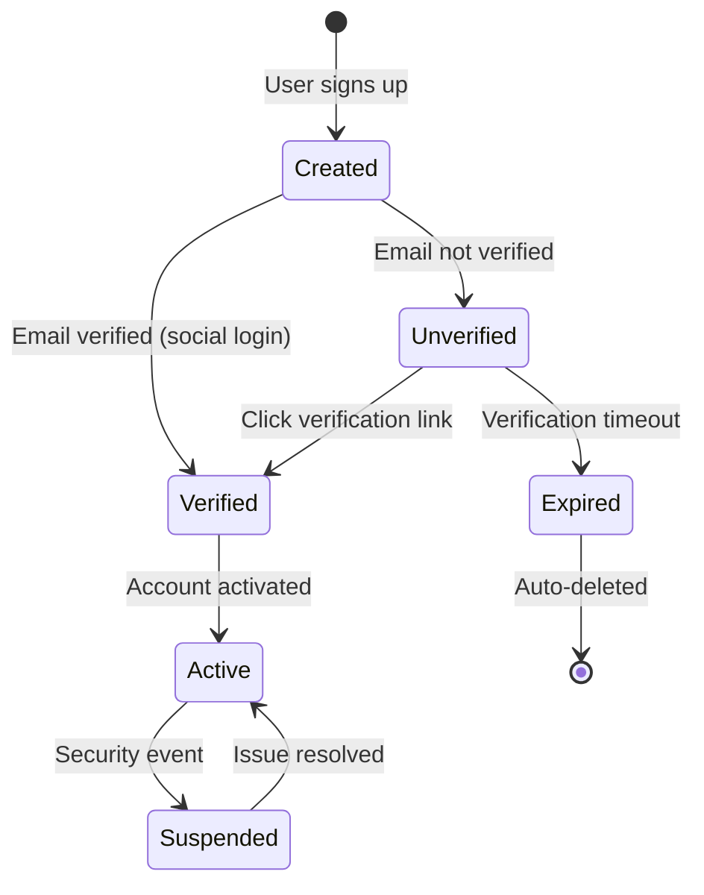

# Authentication Features

## Overview

Authentication is the foundation of platform security, verifying user identity before granting access to the car rental system. Modern authentication must balance security with user experience, supporting multiple authentication methods while protecting against sophisticated attacks. This document outlines authentication features synthesized from proven patterns in production systems and enhanced with next-generation capabilities.

## Core Authentication Methods

### Email/Password Authentication

**Description**: Traditional credential-based authentication with secure password storage and email verification.

**Key Capabilities**:
- **Registration with Email Verification**: Users create accounts with email and password, receiving verification links to confirm email ownership
- **Secure Password Hashing**: Passwords hashed using industry-standard algorithms (bcrypt, Argon2) with automatic salt generation
- **Password Requirements**: Configurable minimum length (6+ characters recommended), support for passphrases
- **Password Reset Flow**: Secure token-based password reset via email with time-limited validity
- **Account Activation**: Admin-created accounts receive activation links for password setup
- **Session Management**: Encrypted session tokens with configurable expiration (24 hours standard, up to 400 days for "stay connected")

**Stakeholder Benefits**:
- **Users**: Familiar authentication method, works offline after initial login, no third-party dependencies
- **Administrators**: Full control over authentication flow, audit trail of account creation and verification
- **Security Teams**: Strong password hashing protects against database breaches, email verification prevents fake accounts

**Priority**: Must-have (foundational authentication method)

**Source**: `docs/analysis/bookcars/authentication.md`

---

### Social Login Authentication

**Description**: OAuth-based authentication via trusted third-party providers, enabling one-click sign-in without password management.

**Supported Providers**:
- **Facebook**: OAuth 2.0 flow with profile data access
- **Google**: OAuth 2.0 flow with email and profile information
- **Apple**: Sign in with Apple for iOS ecosystem integration
- **Future**: LinkedIn (business travelers), WeChat (Asian markets), Twitter/X

**Key Capabilities**:
- **Client-Side OAuth Flow**: Users authenticate with provider in secure popup/redirect
- **Token Validation**: Backend validates OAuth access tokens with provider APIs
- **Automatic Account Creation**: New users automatically created with verified email from provider
- **Account Linking**: Users can link social accounts to existing email/password accounts
- **Profile Data Import**: Name, email, avatar automatically populated from provider
- **No Password Storage**: Social-only users have no password in system

**Stakeholder Benefits**:
- **Users**: Faster registration and login, no password to remember, trusted provider authentication
- **Business**: Reduced friction in signup flow, higher conversion rates, access to verified user data
- **Support Teams**: Fewer password reset requests, reduced account recovery burden

**Priority**: Must-have (critical for conversion optimization)

**Source**: `docs/analysis/bookcars/authentication.md`

---

## Advanced Authentication Methods

### Biometric Authentication

**Description**: Facial recognition and fingerprint authentication for secure, frictionless identity verification at pickup locations and in mobile applications.

**Key Capabilities**:
- **Facial Recognition Kiosks**: Self-service kiosks at pickup locations with facial recognition cameras
- **Mobile FaceID/TouchID Integration**: Native biometric authentication in iOS and Android apps
- **Liveness Detection**: AI-powered checks to prevent photo or video spoofing (blink detection, head turn verification)
- **Verification Against ID**: Compare biometric scan to photo on driver's license or passport
- **Express Checkout**: Complete vehicle pickup in under 30 seconds with biometric verification
- **Secure Biometric Storage**: Biometric templates stored as encrypted hashes, never as raw images

**Stakeholder Benefits**:
- **Users**: Fastest possible checkout experience, no need to present physical ID repeatedly, contactless verification
- **Fleet Managers**: Reduced counter staffing needs, faster vehicle turnover, improved operational efficiency
- **Security Teams**: Strong identity verification, difficult to spoof, audit trail with biometric confirmation

**Priority**: Should-have (competitive differentiator for premium experience)

**Source**: `docs/research/advanced-features.md` (Section 3: Contactless Operations)

---

### Digital KYC and Document Scanning

**Description**: Automated identity verification using optical character recognition (OCR) and AI-powered document validation.

**Key Capabilities**:
- **License and Passport Scanning**: Mobile camera captures driver's license or passport
- **OCR Data Extraction**: Automatically extract name, date of birth, license number, expiration date
- **Liveness Checks**: User performs actions (blink, head turn) to prove they're physically present
- **Photo Spoofing Prevention**: AI detects printed photos, video replays, and masks
- **Government Database Verification**: Cross-reference extracted data with issuing authority databases
- **Automated Approval**: Instant verification for valid documents, flagging for manual review when needed
- **Document Storage**: Encrypted storage of scanned documents for compliance and dispute resolution

**Stakeholder Benefits**:
- **Users**: Complete verification from home, no need to visit physical location, faster approval process
- **Operations**: Reduced manual verification workload, 24/7 automated processing, consistent verification standards
- **Compliance**: Audit trail of verification steps, meets KYC regulatory requirements, fraud prevention

**Priority**: Should-have (enables fully digital onboarding)

**Source**: `docs/research/advanced-features.md` (Section 3: Digital KYC and Document Scanning)

---

### Decentralized Identity (DID)

**Description**: Blockchain-based portable identity and reputation system enabling cross-platform trust and user-controlled personal data.

**Key Capabilities**:
- **Self-Sovereign Identity**: Users control their own identity data, stored in personal digital wallet
- **Verifiable Credentials**: Government IDs, driver's licenses, and platform reputation issued as cryptographically signed credentials
- **Cross-Platform Reputation**: Composite reputation score from multiple platforms (Turo, Zipcar, traditional rentals)
- **Selective Disclosure**: Users choose which credentials to share (e.g., "over 25" without revealing exact age)
- **Portable Trust**: New platforms can verify user's history without accessing raw data from other platforms
- **Blockchain Anchoring**: Credential issuance and revocation recorded on blockchain for tamper-proof verification

**Stakeholder Benefits**:
- **Users**: Own and control personal data, build portable reputation across platforms, privacy-preserving verification
- **Platform**: Access to verified trust signals without liability of storing sensitive data, reduced fraud risk
- **Ecosystem**: Interoperability between platforms, lower barriers to entry for new users, industry-wide trust network

**Priority**: Nice-to-have (emerging technology, future-proofing)

**Source**: `docs/research/advanced-features.md` (Section 4: Blockchain and Decentralized Trust)

---

## Multi-Platform Authentication

### Web Application Authentication

**Token Storage**: HTTP-only, signed, secure, SameSite cookies
- Prevents XSS attacks (JavaScript cannot access tokens)
- Prevents CSRF attacks (cookies not sent with cross-origin requests)
- Automatic transmission with every request
- Configurable expiration aligned with session duration

**Session Persistence**: "Stay connected" option for extended sessions (up to 400 days)

**Source**: `docs/analysis/bookcars/authentication.md`

---

### Mobile Application Authentication

**Token Storage**: Secure local storage (iOS Keychain, Android Keystore)
- Token returned in API response body (not cookies)
- Client includes token in request headers (e.g., `X-Access-Token`)
- Platform-specific secure storage APIs
- Biometric protection for token access

**Offline Support**: Cached authentication state for offline functionality
- Digital keys stored locally for vehicle access without network
- Essential trip information cached
- Automatic re-authentication when network restored

**Source**: `docs/analysis/bookcars/authentication.md`, `docs/research/advanced-features.md` (Section 3: PWA Strategy)

---

## Authentication Security Features

### Token-Based Session Management

**Token Structure**:
- **User ID**: Encrypted identifier for user lookup
- **Expiration**: Validity period (24 hours standard, configurable)
- **Signature**: Cryptographic signature preventing tampering
- **Encryption**: Payload encrypted with secret key

**Token Lifecycle**:
1. **Generation**: Create payload, set expiration, encrypt, sign
2. **Validation**: Decrypt, verify signature, check expiration, validate user exists and is active
3. **Invalidation**: Token expires automatically, or can be revoked for security events

**Source**: `docs/analysis/bookcars/authentication.md`

---

### Multi-Factor Authentication (MFA)

**Email Verification as Second Factor**:
- Email verification serves as lightweight MFA
- Users must verify email before full account access
- Password reset requires email access

**Future Enhancements**:
- **SMS Verification**: One-time codes sent via text message
- **Authenticator Apps**: TOTP (Time-based One-Time Password) support for Google Authenticator, Authy
- **Hardware Keys**: FIDO2/WebAuthn support for YubiKey and similar devices
- **Biometric MFA**: Combine password with fingerprint or facial recognition

**Source**: `docs/analysis/bookcars/authentication.md`

---

### Protection Against Authentication Attacks

**Brute Force Protection**:
- Password hashing with computational cost (bcrypt work factor)
- Account lockout after failed login attempts
- Rate limiting on authentication endpoints
- CAPTCHA for suspicious login patterns

**Session Hijacking Prevention**:
- Token expiration limits session duration
- Secure storage (HTTP-only cookies, encrypted local storage)
- Token rotation on sensitive actions (recommended enhancement)
- IP address and user agent validation (optional)

**Credential Stuffing Defense**:
- Monitor for unusual login patterns (many failures from single IP)
- Integration with breach databases (Have I Been Pwned API)
- Force password reset for compromised credentials
- Multi-factor authentication for high-risk accounts

**Source**: `docs/analysis/bookcars/authentication.md`

---

## Account Lifecycle Management

### Account States

**State Definitions**:
- **Created**: User record exists in database
- **Unverified**: Email not yet verified (limited access)
- **Verified**: Email confirmed (full access)
- **Active**: Account is active and usable
- **Suspended**: Account temporarily disabled (security investigation, payment dispute)
- **Expired**: Temporary account expired (auto-deleted)

**Source**: `docs/analysis/bookcars/authentication.md`

---

### Temporary Accounts

**Guest Checkout Accounts**:
- Created during payment flow for users who don't want to register
- Have expiration timestamp (e.g., 24 hours)
- If payment succeeds, expiration removed and account becomes permanent
- If payment fails or expires, account auto-deleted
- Enables frictionless checkout while maintaining data hygiene

**Source**: `docs/analysis/bookcars/authentication.md`

---

## Integration Considerations

### Payment Gateway Customer Sync

When users make payments:
- Payment gateway (Stripe, PayPal) creates customer record
- Customer ID stored in user entity
- Future payments use existing customer ID
- Enables saved payment methods and faster checkout
- Single sign-on between platform and payment provider

**Source**: `docs/analysis/bookcars/authentication.md`

---

### Super-App Integration

**WeChat Mini-Programs** (China):
- WeChat ID as primary authentication
- No separate registration required
- WeChat Pay integration for payments
- QR code scanning for vehicle access

**Grab Partner Apps** (Southeast Asia):
- Grab ID authentication
- GrabPay ecosystem connectivity
- Cross-platform identity syncing

**Source**: `docs/research/advanced-features.md` (Section 6: Regional Adaptations)

---

## Implementation Recommendations

### Essential Security Measures

1. **Use HTTPS Everywhere**: Enforce HTTPS for all authentication communications
2. **Implement Rate Limiting**: Prevent brute force attacks on login endpoints (e.g., 5 attempts per 15 minutes)
3. **Add CAPTCHA**: Protect registration and login from bots (reCAPTCHA v3 for invisible protection)
4. **Enable Account Lockout**: Temporarily lock accounts after failed login attempts (e.g., 30-minute lockout after 5 failures)
5. **Implement Token Refresh**: Use short-lived access tokens (15 minutes) with refresh tokens (30 days)
6. **Add Security Headers**: Implement CSP, HSTS, X-Frame-Options, X-Content-Type-Options
7. **Log Security Events**: Track login attempts, password changes, role changes, suspicious activities
8. **Implement 2FA**: Add optional two-factor authentication for enhanced security

### Compliance Considerations

**GDPR Compliance**:
- User consent for data processing
- Right to data deletion (account deletion with data purge)
- Data portability (export authentication history)
- Privacy policy and terms acceptance

**Password Storage**:
- Use approved hashing algorithms (bcrypt with work factor 10+, or Argon2)
- Never store plaintext passwords
- Implement password history to prevent reuse (last 5 passwords)

**Source**: `docs/analysis/bookcars/authentication.md`, `docs/research/industry-standards/compliance-regulations.md`

---

## Summary

Authentication features form the security foundation of the car rental platform, progressing from proven patterns (email/password, social login) to cutting-edge capabilities (biometric authentication, decentralized identity). The platform must support multiple authentication methods to serve diverse user preferences while maintaining strong security through token-based sessions, multi-factor authentication, and protection against common attacks. Advanced features like biometric authentication and digital KYC enable frictionless user experiences, while decentralized identity positions the platform for future interoperability in the mobility ecosystem.

**Key Priorities**:
- **Must-have**: Email/password authentication, social login, token-based sessions
- **Should-have**: Biometric authentication, digital KYC, multi-factor authentication
- **Nice-to-have**: Decentralized identity, hardware key support, advanced fraud detection
