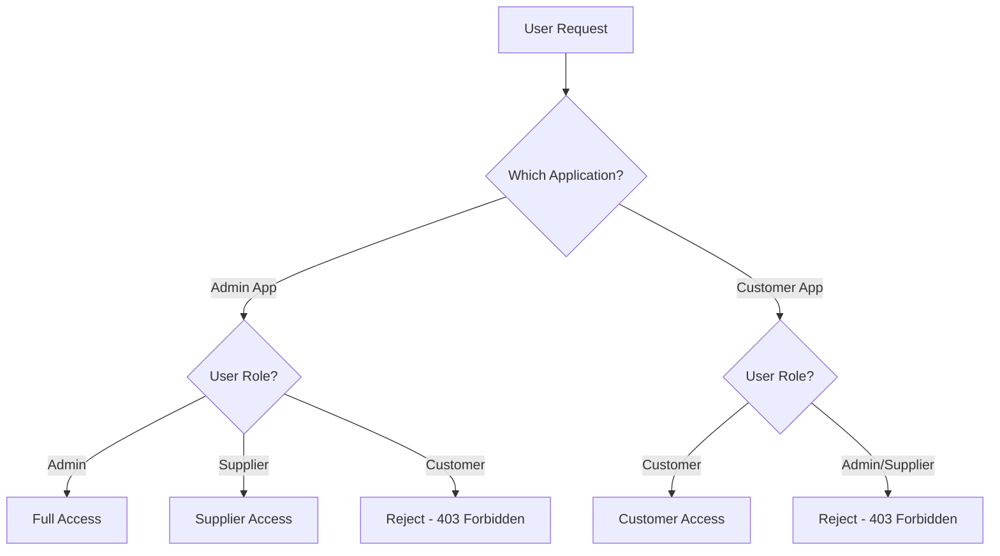

# Authorization Features

## Overview

Authorization determines what authenticated users are allowed to do within the car rental platform. While authentication verifies identity, authorization enforces access policies, ensuring users can only access resources and perform actions appropriate to their role. This document outlines authorization features synthesized from proven role-based access control (RBAC) patterns and enhanced with fine-grained permission management.

## Role-Based Access Control (RBAC)

### Core User Roles

The platform implements distinct user roles with clearly defined permissions and access boundaries.

---

#### Admin Role

**Description**: System administrators with full platform access for oversight, configuration, and user management.

**Permissions**:
- **User Management**: Create, update, delete users across all roles; manage user verification and blacklisting
- **Supplier Management**: Create and manage supplier accounts; approve supplier applications; configure supplier settings
- **Location Management**: Create, update, delete rental locations; configure location-specific settings
- **Vehicle Management**: Approve vehicles for listing; override vehicle status; manage vehicle categories
- **Booking Oversight**: View all bookings across suppliers; cancel bookings for policy violations; resolve disputes
- **System Configuration**: Manage platform settings, pricing rules, payment gateways, notification templates
- **Analytics and Reporting**: Access system-wide analytics; generate comprehensive reports; export data
- **Audit Logs**: View all system activity logs; investigate security incidents

**Access Restrictions**:
- Can only access admin application (separate from customer-facing app)
- Cannot access customer-facing application
- Cannot impersonate users without audit trail

**Stakeholder Benefits**:
- **Platform Operators**: Complete control over platform operations, ability to resolve issues quickly
- **Compliance Teams**: Full visibility for audits and regulatory compliance
- **Security Teams**: Comprehensive access for security investigations and incident response

**Priority**: Must-have (essential for platform operations)

**Source**: `docs/analysis/bookcars/authentication.md`

---

#### Supplier Role

**Description**: Vehicle suppliers (rental companies, fleet owners) who manage their own inventory, locations, and bookings.

**Permissions**:
- **Vehicle Management**: Create, update, delete own vehicles; set vehicle availability and pricing
- **Location Management**: Manage own rental locations; configure location hours and services
- **Booking Management**: View and manage bookings for own vehicles; approve or reject booking requests
- **Profile Management**: Update own business profile, contact information, payment details
- **Pricing Control**: Set base rates, seasonal pricing, discounts for own vehicles
- **Analytics**: View own performance metrics, revenue reports, utilization statistics
- **Staff Management**: Create and manage staff accounts within own organization (optional)

**Access Restrictions**:
- Can only access admin application (supplier portal)
- Cannot access customer-facing application
- Cannot view or manage other suppliers' data (strict data isolation)
- Cannot access system-wide settings or configurations
- Cannot manage users outside own organization

**Stakeholder Benefits**:
- **Suppliers**: Autonomy to manage own business, real-time control over inventory and pricing
- **Platform**: Scalable multi-supplier model without manual intervention
- **Customers**: Diverse vehicle selection from multiple suppliers

**Priority**: Must-have (enables multi-supplier business model)

**Source**: `docs/analysis/bookcars/authentication.md`

---

#### User/Customer Role

**Description**: End customers who search, book, and rent vehicles through the platform.

**Permissions**:
- **Vehicle Search**: Browse and search available vehicles; view vehicle details and pricing
- **Booking Creation**: Create new bookings; select vehicles, dates, locations, add-ons
- **Booking Management**: View own bookings; modify bookings (subject to policies); cancel bookings
- **Profile Management**: Update own profile information, contact details, payment methods
- **Booking History**: View past bookings; download receipts and invoices
- **Reviews and Ratings**: Submit reviews for completed rentals; rate vehicles and service
- **Support Requests**: Create support tickets; communicate with customer service

**Access Restrictions**:
- Can only access customer-facing application (web and mobile)
- Cannot access admin application or supplier portal
- Cannot view other users' data (strict privacy enforcement)
- Cannot access vehicles or bookings not associated with own account

**Stakeholder Benefits**:
- **Customers**: Simple, focused interface for rental needs; privacy protection
- **Platform**: Clear separation of concerns, reduced security risk
- **Support Teams**: Easier troubleshooting with clear user boundaries

**Priority**: Must-have (core user type)

**Source**: `docs/analysis/bookcars/authentication.md`

---

### Application-Level Separation

**Description**: Enforce role-based access at the application level, preventing unauthorized access to admin or customer interfaces.



**Key Capabilities**:
- **Separate Application Endpoints**: Admin and customer apps use different base URLs or subdomains
- **Role Verification on Every Request**: Token validation includes role check against application context
- **Automatic Rejection**: Users attempting to access wrong application receive 403 Forbidden error
- **Audit Logging**: All unauthorized access attempts logged for security monitoring

**Stakeholder Benefits**:
- **Security Teams**: Clear security boundaries, easier to audit and monitor
- **Developers**: Simplified permission logic, reduced complexity
- **Users**: Cannot accidentally access wrong interface

**Priority**: Must-have (fundamental security architecture)

**Source**: `docs/analysis/bookcars/authentication.md`

---

## Resource-Level Authorization

### Supplier Data Isolation

**Description**: Strict data isolation ensuring suppliers can only access their own vehicles, locations, and bookings.

**Key Capabilities**:
- **Ownership Verification**: Every resource (vehicle, location, booking) has supplier_id field
- **Query Filtering**: Database queries automatically filtered by supplier_id for supplier users
- **API Endpoint Protection**: API endpoints verify resource ownership before allowing access
- **Cross-Supplier Prevention**: Attempts to access other suppliers' resources return 404 Not Found (not 403, to avoid information disclosure)

**Example Scenarios**:
- Supplier A cannot view Supplier B's vehicles, even if they know the vehicle ID
- Supplier A cannot modify Supplier B's pricing or availability
- Supplier A cannot see Supplier B's booking details or customer information

**Stakeholder Benefits**:
- **Suppliers**: Confidence that business data is protected from competitors
- **Platform**: Enables multi-supplier model without data leakage risks
- **Compliance**: Meets data protection requirements for business information

**Priority**: Must-have (critical for multi-supplier model)

**Source**: `docs/analysis/bookcars/authentication.md`

---

### User Data Privacy

**Description**: Strict privacy controls ensuring users can only access their own profile and booking data.

**Key Capabilities**:
- **User ID Verification**: Every request validated against authenticated user's ID
- **Profile Access Control**: Users can only view and edit own profile information
- **Booking Access Control**: Users can only view and manage own bookings
- **Payment Method Protection**: Users can only view and manage own saved payment methods
- **Booking History Privacy**: Users cannot view other users' booking history or personal information

**Example Scenarios**:
- User A cannot view User B's profile, even if they know the user ID
- User A cannot see User B's booking details or payment information
- User A cannot modify User B's bookings or account settings

**Stakeholder Benefits**:
- **Users**: Privacy protection, confidence in data security
- **Platform**: GDPR and CCPA compliance, reduced liability
- **Legal Teams**: Clear privacy boundaries for regulatory compliance

**Priority**: Must-have (legal requirement)

**Source**: `docs/analysis/bookcars/authentication.md`

---

### Admin Override with Audit Trail

**Description**: Administrators can access all data for oversight and support, but all access is logged for accountability.

**Key Capabilities**:
- **Full Data Access**: Admins can view any user, supplier, vehicle, or booking data
- **Audit Logging**: Every admin access to user/supplier data logged with timestamp, admin ID, reason
- **Justification Required**: Admins must provide reason for accessing sensitive data (support ticket ID, investigation reference)
- **Access Alerts**: Users notified when admin accesses their data (optional, configurable)
- **Audit Reports**: Regular reports of admin data access for compliance review

**Stakeholder Benefits**:
- **Users**: Transparency and accountability for admin access
- **Admins**: Ability to provide support and resolve issues
- **Compliance**: Audit trail for regulatory requirements

**Priority**: Should-have (balances support needs with privacy)

**Source**: Best practice from `docs/research/industry-standards/compliance-regulations.md`

---

## Permission Management

### Fine-Grained Permissions

**Description**: Beyond basic roles, implement granular permissions for specific actions and resources.

**Permission Categories**:

**User Management Permissions**:
- `users:create` - Create new user accounts
- `users:read` - View user profiles and data
- `users:update` - Modify user information
- `users:delete` - Delete user accounts
- `users:verify` - Verify user email addresses
- `users:blacklist` - Blacklist/suspend user accounts

**Vehicle Management Permissions**:
- `vehicles:create` - Add new vehicles to inventory
- `vehicles:read` - View vehicle details
- `vehicles:update` - Modify vehicle information
- `vehicles:delete` - Remove vehicles from inventory
- `vehicles:approve` - Approve vehicles for listing (admin only)
- `vehicles:price` - Set vehicle pricing

**Booking Management Permissions**:
- `bookings:create` - Create new bookings
- `bookings:read` - View booking details
- `bookings:update` - Modify bookings
- `bookings:cancel` - Cancel bookings
- `bookings:override` - Override booking policies (admin only)

**Stakeholder Benefits**:
- **Developers**: Flexible permission system, easy to extend
- **Admins**: Granular control over user capabilities
- **Compliance**: Principle of least privilege enforcement

**Priority**: Should-have (enables flexible role management)

**Source**: Best practice from `docs/analysis/bookcars/authentication.md`

---

### Role Hierarchies

**Description**: Define role hierarchies where higher-level roles inherit permissions from lower-level roles.

**Example Hierarchy**:
```
Super Admin
  ├─ Admin
  │   ├─ Support Agent
  │   └─ Content Manager
  └─ Supplier Admin
      ├─ Supplier Manager
      └─ Supplier Staff
```

**Key Capabilities**:
- **Permission Inheritance**: Child roles automatically inherit parent role permissions
- **Permission Addition**: Child roles can have additional permissions beyond parent
- **Permission Restriction**: Child roles can have subset of parent permissions (optional)
- **Dynamic Role Assignment**: Users can be assigned multiple roles with combined permissions

**Stakeholder Benefits**:
- **Admins**: Easier role management, consistent permission sets
- **Developers**: Simplified permission checking logic
- **Organizations**: Flexible organizational structures

**Priority**: Nice-to-have (advanced role management)

**Source**: Best practice from industry standards

---

## Authorization Enforcement

### Token-Based Authorization

**Description**: Authorization decisions based on information in encrypted session tokens.

**Token Contents**:
- **User ID**: Unique identifier for user lookup
- **Role**: User's primary role (admin, supplier, customer)
- **Permissions**: Optional list of specific permissions (for fine-grained control)
- **Supplier ID**: For supplier users, their associated supplier organization
- **Expiration**: Token validity period

**Authorization Flow**:
1. **Request Received**: API endpoint receives request with session token
2. **Token Validation**: Decrypt and verify token signature
3. **User Lookup**: Retrieve user from database to verify active status
4. **Role Check**: Verify user's role matches required role for endpoint
5. **Permission Check**: Verify user has required permissions for action
6. **Resource Ownership**: Verify user owns resource (for resource-level authorization)
7. **Allow or Deny**: Grant access or return 403 Forbidden

**Source**: `docs/analysis/bookcars/authentication.md`

---

### Middleware-Based Enforcement

**Description**: Authorization middleware intercepts requests before they reach business logic.

**Middleware Types**:

**Authentication Middleware**:
- Validates session token
- Retrieves user from database
- Attaches user object to request context

**Authorization Middleware**:
- Checks user role against required role
- Verifies user has required permissions
- Returns 403 Forbidden if unauthorized

**Resource Ownership Middleware**:
- Extracts resource ID from request (URL parameter, body)
- Retrieves resource from database
- Verifies user owns resource or has admin override
- Returns 404 Not Found if not owned (prevents information disclosure)

**Stakeholder Benefits**:
- **Developers**: Consistent authorization logic, reusable middleware
- **Security Teams**: Centralized authorization enforcement, easier to audit
- **Platform**: Reduced risk of authorization bugs

**Priority**: Must-have (architectural best practice)

**Source**: Best practice from `docs/analysis/bookcars/authentication.md`

---

## Special Authorization Scenarios

### Temporary Access Grants

**Description**: Grant temporary elevated permissions for specific tasks or time periods.

**Use Cases**:
- **Support Access**: Grant support agent temporary access to user account for troubleshooting
- **Delegation**: User delegates booking management to assistant or family member
- **Emergency Access**: Grant temporary admin access during incident response

**Key Capabilities**:
- **Time-Limited**: Access automatically expires after specified duration
- **Scope-Limited**: Access limited to specific resources or actions
- **Audit Trail**: All temporary access grants logged with justification
- **Revocable**: Access can be revoked before expiration

**Priority**: Nice-to-have (advanced access management)

**Source**: Best practice from industry standards

---

### API Key Authorization

**Description**: Alternative authorization method for programmatic access and integrations.

**Key Capabilities**:
- **API Key Generation**: Users can generate API keys for programmatic access
- **Scope Definition**: API keys can be scoped to specific permissions (read-only, booking creation, etc.)
- **Rate Limiting**: API keys subject to rate limits based on user tier
- **Key Rotation**: Users can rotate API keys without disrupting service
- **Key Revocation**: Compromised keys can be immediately revoked

**Use Cases**:
- Corporate clients integrating booking into travel management systems
- Third-party applications building on platform API
- Automated booking systems and bots

**Priority**: Should-have (enables B2B integrations)

**Source**: Best practice from `docs/analysis/freecar/features-api.md`

---

## Implementation Recommendations

### Essential Authorization Measures

1. **Implement RBAC from Day One**: Define clear roles and permissions before building features
2. **Enforce at Multiple Layers**: Check authorization at API gateway, middleware, and business logic
3. **Default Deny**: Deny access by default, explicitly grant permissions
4. **Principle of Least Privilege**: Grant minimum permissions necessary for each role
5. **Audit All Access**: Log all authorization decisions, especially denials
6. **Test Authorization Logic**: Include authorization tests in test suite
7. **Document Permissions**: Maintain clear documentation of roles and permissions

### Compliance Considerations

**GDPR Compliance**:
- Implement data access controls to protect personal information
- Provide audit trail of who accessed user data and when
- Enable users to control who can access their data

**Principle of Least Privilege**:
- Users have minimum necessary permissions
- Suppliers isolated to own data
- Customers cannot access admin functions
- Admins have oversight but not unlimited power

**Source**: `docs/research/industry-standards/compliance-regulations.md`

---

## Summary

Authorization features enforce access control policies across the car rental platform, ensuring users can only access resources and perform actions appropriate to their role. The platform implements role-based access control with three core roles (Admin, Supplier, Customer), each with clearly defined permissions and access boundaries. Resource-level authorization ensures strict data isolation between suppliers and privacy protection for users. Advanced features like fine-grained permissions, role hierarchies, and temporary access grants enable flexible access management while maintaining security. Authorization enforcement through token-based validation and middleware ensures consistent policy enforcement across all platform components.

**Key Priorities**:
- **Must-have**: RBAC with three core roles, application-level separation, resource-level authorization
- **Should-have**: Fine-grained permissions, API key authorization, admin audit trail
- **Nice-to-have**: Role hierarchies, temporary access grants, delegation features
