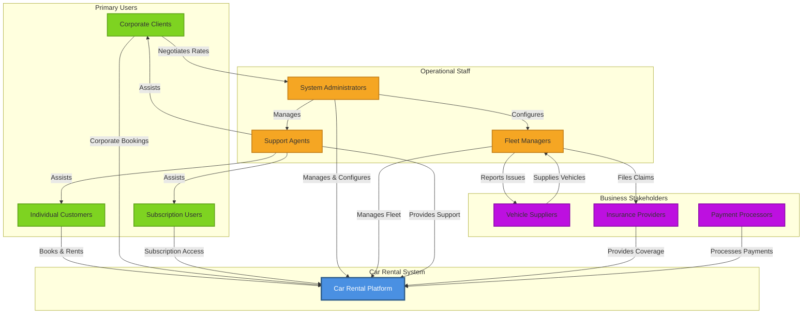
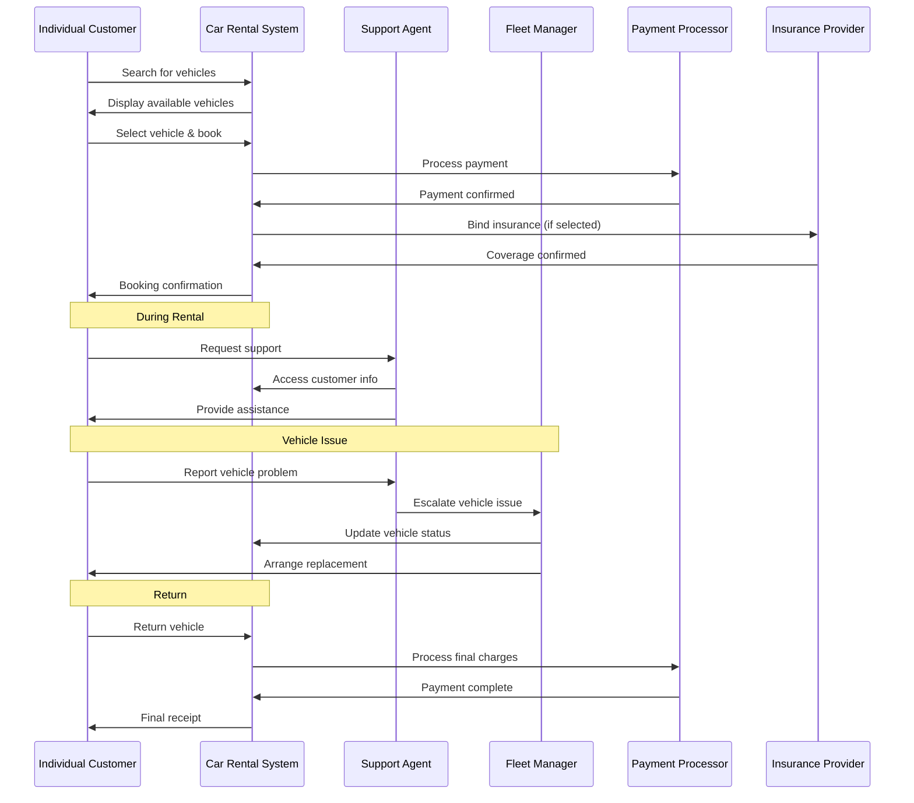
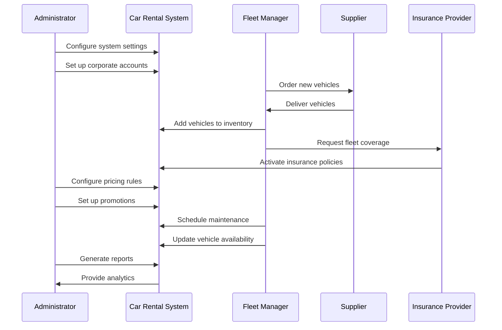

# Stakeholder Mapping

## Overview

This document provides a comprehensive view of all stakeholders in the car rental system ecosystem, their relationships with each other, and their connections to system features and requirements. Understanding these relationships is critical for ensuring the system meets the needs of all stakeholder groups while balancing competing priorities.

## Stakeholder Ecosystem Diagram

The following diagram illustrates the relationships between all stakeholder groups and the car rental system:

## Stakeholder Classification

### Primary Stakeholders

Primary stakeholders directly interact with the car rental system and are essential to its core operations:

| Stakeholder | Type | Priority | Key Interactions |
|-------------|------|----------|------------------|
| **Individual Customers** | Primary User | Critical | Search, book, rent, return vehicles |
| **Corporate Clients** | Primary User | High | Bulk bookings, corporate accounts, reporting |
| **Subscription Users** | Primary User | High | Recurring access, flexible usage |
| **System Administrators** | Operational Staff | Critical | System configuration, user management |
| **Fleet Managers** | Operational Staff | Critical | Vehicle inventory, maintenance, utilization |

### Secondary Stakeholders

Secondary stakeholders have indirect relationships with the system through integrations, partnerships, or support roles:

| Stakeholder | Type | Priority | Key Interactions |
|-------------|------|----------|------------------|
| **Support Agents** | Operational Staff | High | Customer assistance, issue resolution |
| **Vehicle Suppliers** | Business Partner | Medium | Vehicle supply, buyback programs |
| **Insurance Providers** | Business Partner | High | Coverage, claims processing |
| **Payment Processors** | Business Partner | Critical | Transaction processing, fraud prevention |

## Stakeholder-to-Feature Mapping

### User-Facing Features

| Feature Category | Individual Customers | Corporate Clients | Subscription Users |
|------------------|---------------------|-------------------|-------------------|
| **Search & Discovery** | ✓✓✓ Critical | ✓✓ Important | ✓✓ Important |
| **Booking Management** | ✓✓✓ Critical | ✓✓✓ Critical | ✓✓ Important |
| **Payment Processing** | ✓✓✓ Critical | ✓✓✓ Critical | ✓✓✓ Critical |
| **Account Management** | ✓✓ Important | ✓✓✓ Critical | ✓✓✓ Critical |
| **Mobile App** | ✓✓✓ Critical | ✓✓ Important | ✓✓✓ Critical |
| **Corporate Portal** | - | ✓✓✓ Critical | - |
| **Subscription Management** | - | - | ✓✓✓ Critical |
| **Loyalty Programs** | ✓✓ Important | ✓ Nice-to-have | ✓✓ Important |

### Administrative Features

| Feature Category | Administrators | Fleet Managers | Support Agents |
|------------------|----------------|----------------|----------------|
| **User Management** | ✓✓✓ Critical | - | ✓✓ Important |
| **Fleet Management** | ✓✓ Important | ✓✓✓ Critical | ✓ Nice-to-have |
| **Booking Management** | ✓✓✓ Critical | ✓ Nice-to-have | ✓✓✓ Critical |
| **Pricing Management** | ✓✓✓ Critical | ✓✓ Important | - |
| **Reporting & Analytics** | ✓✓✓ Critical | ✓✓✓ Critical | ✓✓ Important |
| **Support Tools** | ✓✓ Important | - | ✓✓✓ Critical |
| **System Configuration** | ✓✓✓ Critical | - | - |
| **Maintenance Scheduling** | - | ✓✓✓ Critical | - |

### Integration Features

| Feature Category | Suppliers | Insurance Providers | Payment Processors |
|------------------|-----------|--------------------|--------------------|
| **API Integration** | ✓✓ Important | ✓✓✓ Critical | ✓✓✓ Critical |
| **Data Exchange** | ✓✓ Important | ✓✓✓ Critical | ✓✓✓ Critical |
| **Real-Time Processing** | - | ✓✓ Important | ✓✓✓ Critical |
| **Reporting** | ✓✓ Important | ✓✓✓ Critical | ✓✓✓ Critical |
| **Webhook Support** | ✓ Nice-to-have | ✓✓ Important | ✓✓✓ Critical |
| **Portal Access** | ✓✓ Important | ✓✓ Important | ✓✓ Important |

**Legend:**
- ✓✓✓ Critical: Essential for stakeholder's core needs
- ✓✓ Important: Significantly improves stakeholder experience
- ✓ Nice-to-have: Provides additional value but not essential
- \- Not applicable: Feature not relevant to this stakeholder

## Stakeholder-to-Requirement Mapping

### Functional Requirements

| Requirement Area | Primary Stakeholders | Secondary Stakeholders |
|------------------|---------------------|------------------------|
| **User Management** | Individual Customers, Corporate Clients, Subscription Users | Administrators, Support Agents |
| **Vehicle Search** | Individual Customers, Corporate Clients | Administrators |
| **Booking Management** | All Primary Users | Administrators, Support Agents |
| **Payment Processing** | All Primary Users | Payment Processors, Administrators |
| **Fleet Management** | - | Fleet Managers, Administrators, Suppliers |
| **Reporting & Analytics** | Corporate Clients | Administrators, Fleet Managers |
| **Support Tools** | - | Support Agents, Administrators |
| **Subscription Management** | Subscription Users | Administrators |

### Non-Functional Requirements

| Requirement Area | Impacted Stakeholders |
|------------------|----------------------|
| **Performance** | All Primary Users, Support Agents |
| **Scalability** | All Stakeholders |
| **Security** | All Primary Users, Payment Processors, Insurance Providers |
| **Usability** | All Primary Users, Operational Staff |
| **Reliability** | All Stakeholders |
| **Compliance** | Corporate Clients, Insurance Providers, Payment Processors |

### Integration Requirements

| Integration Type | Primary Stakeholders | Integration Partners |
|------------------|---------------------|---------------------|
| **Payment Gateways** | All Primary Users | Payment Processors |
| **Insurance Systems** | Individual Customers, Corporate Clients | Insurance Providers |
| **Supplier Systems** | - | Vehicle Suppliers, Fleet Managers |
| **Mapping Services** | All Primary Users | Third-party mapping providers |
| **Notification Services** | All Primary Users | Email/SMS service providers |
| **Corporate Travel Systems** | Corporate Clients | Travel management platforms |

## Stakeholder Interaction Patterns

### Customer Journey Touchpoints

### Administrative Workflow

## Stakeholder Priority Matrix

### Impact vs. Influence

| Stakeholder | Business Impact | System Influence | Priority Level |
|-------------|----------------|------------------|----------------|
| **Individual Customers** | Very High | High | P0 - Critical |
| **Payment Processors** | Very High | High | P0 - Critical |
| **System Administrators** | High | Very High | P0 - Critical |
| **Fleet Managers** | Very High | High | P0 - Critical |
| **Corporate Clients** | High | Medium | P1 - High |
| **Insurance Providers** | High | Medium | P1 - High |
| **Subscription Users** | Medium | Medium | P1 - High |
| **Support Agents** | Medium | Medium | P2 - Medium |
| **Vehicle Suppliers** | Medium | Low | P2 - Medium |

**Priority Definitions:**
- **P0 - Critical**: System cannot function without meeting their needs
- **P1 - High**: Significant impact on business success and user satisfaction
- **P2 - Medium**: Important for operational efficiency and partnerships

## Stakeholder Communication Plan

### Communication Frequency

| Stakeholder Group | Communication Type | Frequency | Channel |
|-------------------|-------------------|-----------|---------|
| **Individual Customers** | Transactional | Per booking | Email, SMS, App |
| **Individual Customers** | Marketing | Weekly/Monthly | Email, Push |
| **Corporate Clients** | Account Management | Monthly | Email, Phone |
| **Corporate Clients** | Reporting | Monthly | Portal, Email |
| **Subscription Users** | Usage Updates | Monthly | Email, App |
| **Subscription Users** | Billing | Monthly | Email |
| **Administrators** | System Updates | As needed | Email, Portal |
| **Fleet Managers** | Performance Reports | Weekly | Portal, Email |
| **Support Agents** | Training | Quarterly | In-person, Video |
| **Suppliers** | Order Updates | Per order | Email, Portal |
| **Insurance Providers** | Claims Updates | Per claim | API, Email |
| **Payment Processors** | Technical Updates | As needed | Email, API |

## Cross-References

### Related Documentation

- **Primary Users**:
  - [Individual Customers](./primary-users/individual-customers.md)
  - [Corporate Clients](./primary-users/corporate-clients.md)
  - [Subscription Users](./primary-users/subscription-users.md)

- **Operational Staff**:
  - [System Administrators](./operational-staff/administrators.md)
  - [Fleet Managers](./operational-staff/fleet-managers.md)
  - [Customer Support Agents](./operational-staff/support-agents.md)

- **Business Stakeholders**:
  - [Vehicle Suppliers](./business-stakeholders/suppliers.md)
  - [Insurance Providers](./business-stakeholders/insurance-providers.md)
  - [Payment Processors](./business-stakeholders/payment-processors.md)

### Related Requirements

- **Requirement 3.1**: Primary user stakeholder identification
- **Requirement 3.2**: Operational staff stakeholder identification
- **Requirement 3.3**: Business stakeholder identification
- **Requirement 3.4**: Stakeholder goals and pain points documentation
- **Requirement 3.5**: Primary vs. secondary stakeholder classification
- **Requirement 3.6**: Stakeholder relationship mapping

### Related Workflows

All workflows documented in the [Workflows](../workflows/) section are designed to serve specific stakeholder needs:

- **Core Rental Workflows**: Primarily serve individual customers and subscription users
- **Administrative Workflows**: Serve administrators and fleet managers
- **Exceptional Workflows**: Involve support agents, customers, and administrators

### Related Features

All features documented in the [Features](../features/) section are mapped to stakeholder needs:

- **User-Facing Features**: Serve primary user stakeholders
- **Administrative Features**: Serve operational staff stakeholders
- **Integration Features**: Enable business stakeholder partnerships

## Stakeholder Success Criteria

### Overall System Success

The car rental system is successful when:

1. **Customer Satisfaction**: >4.5/5 rating from all primary user groups
2. **Operational Efficiency**: &lt;5 minutes average task completion time for staff
3. **Business Viability**: Positive ROI for all stakeholder partnerships
4. **System Reliability**: >99.9% uptime for all stakeholder interactions
5. **Compliance**: 100% adherence to regulatory requirements affecting all stakeholders
6. **Scalability**: System supports 10x growth without degradation for any stakeholder group

### Balanced Stakeholder Needs

The system must balance potentially competing stakeholder needs:

- **Speed vs. Security**: Fast transactions (customers) vs. fraud prevention (payment processors)
- **Flexibility vs. Control**: Easy modifications (customers) vs. policy enforcement (administrators)
- **Cost vs. Quality**: Low prices (budget customers) vs. premium experience (luxury customers)
- **Automation vs. Human Touch**: Self-service (efficiency) vs. personal support (satisfaction)
- **Innovation vs. Stability**: New features (competitive advantage) vs. reliability (operational staff)

## Conclusion

This stakeholder mapping provides a comprehensive view of the car rental system ecosystem. Understanding these relationships ensures that:

1. **Feature Development**: Prioritizes features based on stakeholder impact
2. **Requirement Gathering**: Captures needs from all stakeholder perspectives
3. **Workflow Design**: Creates processes that serve multiple stakeholder groups efficiently
4. **Communication**: Establishes appropriate channels and frequency for each stakeholder
5. **Success Measurement**: Defines metrics that reflect all stakeholder interests
6. **Conflict Resolution**: Identifies and addresses competing stakeholder needs

By maintaining this holistic view of stakeholders, the car rental system can deliver value to all parties while achieving business objectives.
