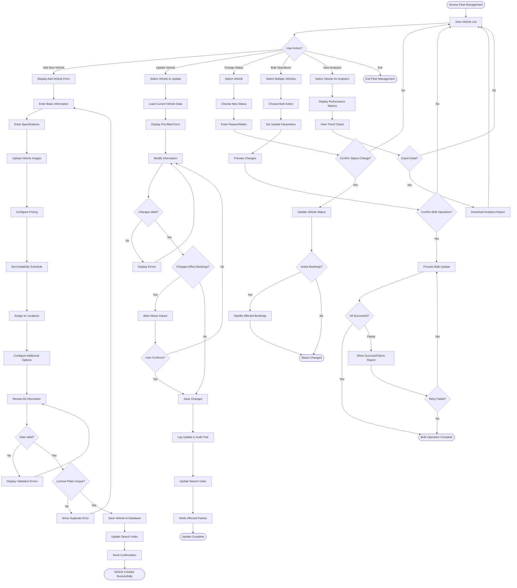

# Fleet Management Workflow

## Overview

The fleet management workflow enables administrators and fleet managers to maintain the vehicle inventory that forms the core of the rental business. This workflow covers adding new vehicles, updating vehicle information, managing availability, setting pricing, and deactivating vehicles. Effective fleet management ensures customers see accurate vehicle information and availability while enabling data-driven fleet optimization decisions.

## Stakeholder

**Primary**: Fleet Managers, System Administrators

**Secondary**: Suppliers (in multi-supplier mode), Pricing Managers

## Goal

Maintain accurate, complete, and up-to-date vehicle inventory information in the system, ensuring vehicles are properly configured with specifications, pricing, images, and availability to support customer bookings and operational efficiency.

## Preconditions

### System State
- Admin panel is accessible
- User has fleet management permissions
- Vehicle categories and types are configured
- Locations are set up in system
- Pricing structures are defined

### User State
- User is logged in with admin or fleet manager role
- User has necessary vehicle information (specifications, photos, pricing)
- User understands vehicle classification standards (ACRISS codes, categories)

## Workflow Steps

### 1. Access Fleet Management Interface

**User Action**: Navigate to fleet management section

**System Response**:
- Display vehicle inventory list
- Show vehicle count and status summary
- Provide search and filter controls
- Display action buttons (Add Vehicle, Bulk Import, Export)
- Show quick stats (total vehicles, available, rented, maintenance)

**Interface Elements**:
- Vehicle list with key information (name, license plate, status, location)
- Status indicators (available, rented, maintenance, inactive)
- Search bar for finding specific vehicles
- Filters (location, type, supplier, status)
- Sort options (name, date added, utilization, revenue)

### 2. Add New Vehicle

**User Action**: Click "Add Vehicle" or "New Vehicle" button

**System Response**:
- Display vehicle creation form
- Organize form into logical sections
- Provide field validation and help text
- Show required vs optional fields
- Enable image upload interface

**Required Information**:
- **Basic Details**:
  - Vehicle name (make and model)
  - License plate number
  - Year of manufacture
  - Vehicle category (economy, compact, SUV, luxury, etc.)
  - Supplier (in multi-supplier mode)
- **Specifications**:
  - Number of seats
  - Number of doors
  - Transmission type (manual/automatic)
  - Fuel type (gasoline, diesel, electric, hybrid)
  - Fuel policy (full-to-full, prepaid, like-for-like)
- **Pricing**:
  - Daily rate (base price)
  - Optional: Hourly, weekly, bi-weekly, monthly rates
- **Location**:
  - Primary location assignment
  - Optional: Additional locations

**Optional Information**:
- **Features**:
  - Air conditioning
  - Multimedia system (Bluetooth, touchscreen, smartphone integration)
  - Safety features (ABS, airbags, backup camera)
  - Comfort features (leather seats, sunroof, heated seats)
- **Mileage Policy**:
  - Unlimited or limited mileage
  - Mileage limit per day
  - Overage charge per mile/kilometer
- **Insurance Options**:
  - Theft protection cost
  - Collision damage waiver cost
  - Full insurance cost
- **Additional Services**:
  - GPS rental fee
  - Child seat availability and fee
  - Additional driver fee
- **Images**:
  - Multiple vehicle photos (exterior, interior, features)
  - Primary image for search results
- **Description**:
  - Detailed vehicle description
  - Special features or notes
- **Environmental Data**:
  - CO2 emissions per kilometer

**Validation Rules**:
- License plate must be unique
- All required fields must be completed
- Pricing must be positive numbers
- Seats and doors must be realistic numbers (2-9 seats, 2-5 doors)
- Year must be valid (not future, not too old)
- At least one location must be assigned
- At least one image should be uploaded

### 3. Upload Vehicle Images

**User Action**: Upload photos of vehicle

**Image Requirements**:
- **Minimum**: 1 image (exterior view)
- **Recommended**: 5-10 images showing:
  - Exterior front view
  - Exterior side view
  - Exterior rear view
  - Interior dashboard and front seats
  - Interior rear seats
  - Trunk/cargo space
  - Special features (multimedia system, etc.)

**System Processing**:
- Accept common image formats (JPEG, PNG, WebP)
- Validate image size (typically 5-10MB max per image)
- Automatically resize/optimize images for web display
- Generate thumbnails for list views
- Allow drag-and-drop upload
- Support multiple file selection
- Show upload progress
- Allow image reordering
- Set primary image for search results

**Image Management**:
- Preview uploaded images
- Delete or replace images
- Reorder images (drag and drop)
- Set primary/featured image
- Add image captions or descriptions

### 4. Configure Pricing

**User Action**: Set rental rates for different durations

**Pricing Structure**:
- **Base Rates**:
  - Hourly rate (for short-term rentals)
  - Daily rate (standard rental period)
  - Weekly rate (7-day discount)
  - Bi-weekly rate (14-day discount)
  - Monthly rate (30-day discount)

**Discounted Rates** (optional):
- Promotional pricing for specific periods
- Long-term rental discounts
- Corporate or loyalty member rates

**System Features**:
- Calculate discount percentages automatically
- Show price comparison (e.g., "Save 20% on weekly rentals")
- Copy pricing from similar vehicles
- Bulk pricing updates across multiple vehicles
- Seasonal pricing configuration
- Dynamic pricing rules (future enhancement)

**Pricing Validation**:
- Longer rental periods should have lower per-day rates
- Discounted rates must be less than base rates
- All rates must be positive numbers
- System warns if pricing seems unusual

### 5. Set Vehicle Availability

**User Action**: Configure when vehicle is available for rental

**Availability Options**:
- **Always Available**: Vehicle bookable at all times
- **Seasonal Availability**: Available only during specific date ranges
- **Custom Schedule**: Define specific available/unavailable periods
- **Maintenance Windows**: Block dates for scheduled maintenance

**Calendar Interface**:
- Visual calendar showing availability
- Click to block/unblock date ranges
- Color coding (available, booked, blocked, maintenance)
- View existing bookings
- Set recurring availability patterns

**Availability Rules**:
- Cannot block dates with existing bookings
- System warns if blocking high-demand periods
- Minimum rental duration enforcement
- Buffer time between bookings (optional)

**System Processing**:
- Update availability calendar
- Recalculate available inventory for search
- Notify customers on waitlist if vehicle becomes available
- Update fleet utilization metrics

### 6. Assign Vehicle to Locations

**User Action**: Specify which locations offer this vehicle

**Location Assignment**:
- **Single Location**: Vehicle available at one location only
- **Multiple Locations**: Vehicle can be picked up at multiple locations
- **Primary Location**: Main location for vehicle storage
- **One-Way Rentals**: Enable pickup at one location, drop-off at another

**System Processing**:
- Validate locations exist and are active
- Update location-vehicle associations
- Recalculate vehicle availability per location
- Update search results for each location

**Location Management**:
- Add or remove location assignments
- Set primary location
- Configure one-way rental rules
- Set location-specific pricing (optional)

### 7. Configure Additional Options

**User Action**: Set up insurance, equipment, and service options

**Insurance Configuration**:
- Theft protection (daily cost)
- Collision damage waiver (daily cost)
- Personal accident insurance (daily cost)
- Full insurance package (daily cost)
- Coverage limits and deductibles

**Equipment Rental**:
- GPS navigation system (daily fee)
- Child safety seats (infant, toddler, booster) with daily fees
- Ski racks, bike racks (daily fees)
- Snow chains (daily or flat fee)
- WiFi hotspot (daily fee)

**Additional Services**:
- Additional driver (daily or flat fee)
- Fuel service options (prepaid fuel, fuel service charge)
- Toll pass (daily fee)
- Delivery/pickup service (fee based on distance)

**System Processing**:
- Store option pricing
- Calculate total cost including options
- Display options during booking process
- Track option utilization for inventory management

### 8. Save and Activate Vehicle

**User Action**: Review information and save vehicle

**System Validation**:
- Check all required fields completed
- Validate data formats and ranges
- Verify license plate uniqueness
- Confirm at least one image uploaded
- Validate pricing structure

**Validation Errors**:
- Highlight missing or invalid fields
- Display specific error messages
- Prevent saving until errors corrected
- Preserve entered data for correction

**Successful Save**:
- Create vehicle record in database
- Generate unique vehicle ID
- Set initial status (available or coming soon)
- Index vehicle for search
- Update fleet inventory count
- Send confirmation notification

**Post-Save Options**:
- View created vehicle
- Add another vehicle
- Return to vehicle list
- Share vehicle link

### 9. Update Existing Vehicle

**User Action**: Modify vehicle information

**Update Scenarios**:
- **Specification Changes**: Update seats, features, or description
- **Pricing Updates**: Adjust rates for market conditions
- **Image Updates**: Add, remove, or replace photos
- **Availability Changes**: Modify availability schedule
- **Location Changes**: Add or remove location assignments
- **Status Changes**: Mark as maintenance, unavailable, or retired

**System Processing**:
- Retrieve current vehicle data
- Display pre-filled form
- Track changes made
- Validate updated information
- Save changes with timestamp
- Log update in audit trail
- Update search index
- Notify affected bookings if necessary

**Change Impact Analysis**:
- **Pricing Changes**: Affect future bookings only, not existing
- **Availability Changes**: May conflict with existing bookings
- **Location Changes**: Update search results immediately
- **Status Changes**: May require booking modifications

**Validation**:
- Cannot remove locations with active bookings
- Cannot change license plate if bookings exist
- Pricing changes require confirmation
- Major changes may require manager approval

### 10. Manage Vehicle Status

**User Action**: Change vehicle operational status

**Status Options**:
- **Available**: Ready for booking
- **Unavailable**: Temporarily not bookable
- **Maintenance**: Undergoing service or repairs
- **Coming Soon**: Visible but not yet bookable
- **Retired**: Removed from active fleet

**Status Change Process**:
1. Select vehicle from list
2. Click status change button
3. Select new status
4. Provide reason/notes (for maintenance or retirement)
5. Set expected return date (for maintenance)
6. Confirm status change

**System Processing**:
- Update vehicle status
- Block/unblock from search results
- Cancel or modify affected bookings (if necessary)
- Send notifications to affected customers
- Update fleet availability metrics
- Log status change with reason

**Status-Specific Actions**:
- **Maintenance**: Create maintenance work order, set return date
- **Retired**: Trigger disposition workflow, remove from search
- **Unavailable**: Optionally set automatic reactivation date

### 11. Bulk Operations

**User Action**: Perform actions on multiple vehicles simultaneously

**Bulk Operation Types**:
- **Bulk Pricing Update**: Apply percentage increase/decrease to multiple vehicles
- **Bulk Location Assignment**: Add or remove locations for multiple vehicles
- **Bulk Status Change**: Change status for multiple vehicles
- **Bulk Availability Update**: Set availability for multiple vehicles
- **Bulk Image Upload**: Upload images for multiple vehicles
- **Bulk Export**: Download vehicle data for external analysis
- **Bulk Import**: Upload vehicle data from spreadsheet

**Bulk Update Process**:
1. Select vehicles (checkboxes or filters)
2. Choose bulk action from menu
3. Specify update parameters
4. Preview changes
5. Confirm bulk operation
6. Monitor progress
7. Review results and errors

**System Processing**:
- Validate bulk operation feasibility
- Process updates in batches
- Show progress indicator
- Handle errors gracefully
- Generate summary report
- Log bulk operation in audit trail

**Error Handling**:
- Skip invalid records
- Report errors with specific details
- Allow retry of failed updates
- Rollback option for critical errors

### 12. Vehicle Performance Monitoring

**User Action**: Review vehicle metrics and analytics

**Performance Metrics**:
- **Utilization Rate**: Percentage of days vehicle is rented
- **Revenue Generated**: Total and average revenue per day
- **Booking Count**: Number of completed rentals
- **Average Rental Duration**: Mean length of rentals
- **Customer Rating**: Average rating from renters
- **Maintenance Costs**: Total service and repair expenses
- **Profitability**: Revenue minus costs

**Analytics Features**:
- **Trend Charts**: Visualize metrics over time
- **Comparison**: Compare vehicle to fleet average
- **Ranking**: Top and bottom performers
- **Forecasting**: Predict future utilization and revenue
- **Alerts**: Notifications for underperforming vehicles

**System Processing**:
- Calculate metrics from booking and financial data
- Generate visualizations (charts, graphs)
- Identify trends and anomalies
- Provide actionable recommendations
- Export data for external analysis

**Decision Support**:
- Identify vehicles for price adjustments
- Flag vehicles for maintenance or retirement
- Suggest optimal locations for vehicles
- Recommend fleet composition changes

## Outcome

### Successful Outcome
- Vehicle added or updated in system
- All required information complete and accurate
- Vehicle visible in search results (if available status)
- Pricing configured correctly
- Images uploaded and displayed
- Availability calendar set
- Locations assigned
- Vehicle ready for customer bookings

### Alternative Outcomes
- **Validation Errors**: User must correct information before saving
- **Duplicate Vehicle**: System prevents duplicate license plates
- **Incomplete Information**: Vehicle saved as draft for later completion
- **Bulk Operation Partial Success**: Some vehicles updated, others failed

## Exceptions and Error Handling

### Exception 1: Duplicate License Plate

**Trigger**: User enters license plate that already exists

**System Response**:
- Display error message: "Vehicle with this license plate already exists"
- Highlight license plate field
- Provide link to existing vehicle
- Prevent saving until resolved

**User Options**:
- Correct license plate
- View existing vehicle
- Contact support if legitimate duplicate

### Exception 2: Invalid Pricing Structure

**Trigger**: Pricing violates business rules (e.g., weekly rate higher than daily)

**System Response**:
- Display warning message
- Highlight problematic pricing fields
- Explain pricing rule
- Allow override with confirmation (if permitted)

**User Options**:
- Correct pricing
- Override warning (if authorized)
- Copy pricing from similar vehicle

### Exception 3: Image Upload Failure

**Trigger**: Image file too large, wrong format, or upload error

**System Response**:
- Display error message with specific reason
- Show file size/format requirements
- Preserve other uploaded images
- Allow retry

**User Options**:
- Resize/compress image
- Convert to supported format
- Try different image
- Skip image upload (if optional)

### Exception 4: Location Assignment Conflict

**Trigger**: Attempting to remove location with active bookings

**System Response**:
- Display error message: "Cannot remove location with active bookings"
- Show list of affected bookings
- Suggest alternative actions

**User Options**:
- Wait until bookings complete
- Reassign bookings to different vehicles
- Contact customers to modify bookings
- Keep location assignment

### Exception 5: Bulk Operation Failure

**Trigger**: Bulk update fails for some vehicles

**System Response**:
- Display summary of results (successful vs failed)
- List failed vehicles with error reasons
- Provide option to download error report
- Offer to retry failed updates

**User Options**:
- Review and fix errors
- Retry failed updates
- Skip failed vehicles
- Rollback successful updates (if critical)

## Workflow Diagram

## Performance Metrics

### Operational Metrics
- **Vehicle Addition Time**: Average time to add new vehicle (target: &lt;10 minutes)
- **Update Frequency**: Average updates per vehicle per month (track trend)
- **Data Completeness**: Percentage of vehicles with all optional fields (target: >80%)
- **Image Quality**: Percentage of vehicles with 5+ images (target: >90%)

### Data Quality Metrics
- **Duplicate Rate**: Vehicles with duplicate information (target: 0%)
- **Validation Error Rate**: Percentage of save attempts with errors (target: &lt;5%)
- **Pricing Accuracy**: Vehicles with correct pricing structure (target: 100%)
- **Information Currency**: Days since last vehicle update (track average)

### Business Impact Metrics
- **Search Visibility**: Percentage of fleet visible in search (target: >85%)
- **Booking Conversion**: Bookings per vehicle view (track by vehicle)
- **Fleet Utilization**: Average utilization across fleet (target: >75%)
- **Revenue Per Vehicle**: Average daily revenue (track trend)

## Related Workflows

- **Pricing Updates Workflow**: Detailed pricing management
- **Maintenance Scheduling Workflow**: Vehicle service planning
- **Vehicle Acquisition Workflow**: Purchasing and onboarding new vehicles
- **Vehicle Disposition Workflow**: Selling and removing vehicles
- **Reporting Workflow**: Fleet performance analysis

## Related Requirements

- **Requirement 4.1**: User scenario documentation
- **Requirement 4.2**: Workflow with Mermaid flowchart
- **Requirement 4.4**: Administrative operations
- **Requirement 4.6**: Exception handling
- **Requirement 4.7**: Pandoc-compatible format

## Related Stakeholders

- **Fleet Managers**: Primary users of fleet management
- **System Administrators**: Configure fleet settings
- **Pricing Managers**: Set and update vehicle pricing
- **Suppliers**: Manage their vehicle inventory (multi-supplier mode)
- **Individual Customers**: View accurate vehicle information

## Related Features

- **Vehicle Inventory Management**: Core fleet CRUD operations
- **Dynamic Pricing Management**: Flexible pricing configuration
- **Vehicle Availability Scheduler**: Calendar-based availability
- **Vehicle Status Management**: Operational status tracking
- **Vehicle Performance Analytics**: Metrics and insights
- **Bulk Operations**: Efficient multi-vehicle management
- **Image Management**: Vehicle photo upload and organization
