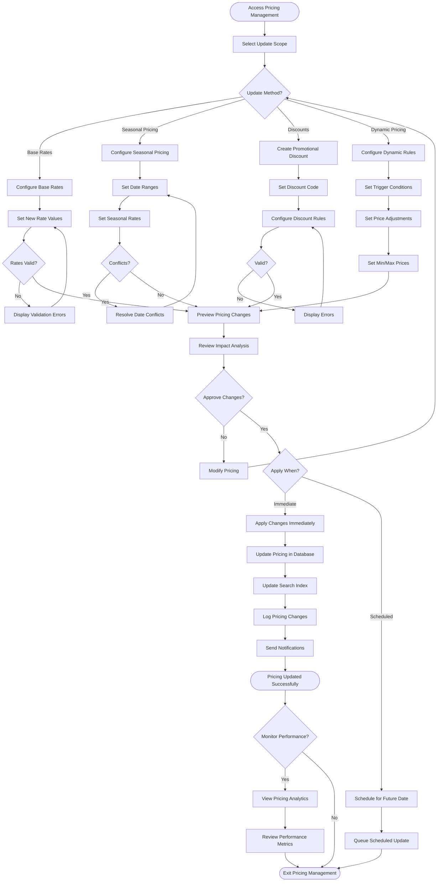

# Pricing Updates Workflow

## Overview

The pricing updates workflow enables administrators and pricing managers to adjust rental rates dynamically based on market conditions, seasonal demand, and business strategy. This workflow supports base rate updates, seasonal pricing configuration, promotional discounts, and bulk pricing adjustments across the fleet.

## Stakeholder

**Primary**: Pricing Managers, System Administrators, Fleet Managers

**Secondary**: Finance Teams, Marketing Teams

## Goal

Update vehicle rental pricing to optimize revenue, remain competitive, respond to market conditions, and support promotional campaigns while maintaining pricing consistency and accuracy across the platform.

## Preconditions

### System State
- Vehicles exist in inventory with current pricing
- Pricing structure is configured (hourly, daily, weekly, monthly)
- Admin panel is accessible
- Pricing permissions are configured

### User State
- User has pricing management permissions
- User understands pricing strategy and market conditions
- User has access to competitive pricing data (if applicable)

## Workflow Steps

### 1. Access Pricing Management

**User Action**: Navigate to pricing management interface

**System Response**:
- Display pricing dashboard with current rates
- Show pricing summary statistics
- Provide vehicle filters and search
- Display pricing update options
- Show recent pricing changes

### 2. Select Pricing Update Scope

**User Action**: Choose what to update

**Update Scope Options**:
- **Single Vehicle**: Update one vehicle's pricing
- **Vehicle Category**: Update all vehicles in category (e.g., all SUVs)
- **Location**: Update all vehicles at specific location
- **Supplier**: Update all vehicles from supplier (multi-supplier mode)
- **Entire Fleet**: Update all vehicles

**System Response**:
- Display selected vehicles
- Show current pricing for selection
- Calculate total vehicles affected
- Provide pricing update interface

### 3. Configure Base Rate Updates

**User Action**: Modify base rental rates

**Rate Types**:
- Hourly rate
- Daily rate
- Weekly rate (7-day)
- Bi-weekly rate (14-day)
- Monthly rate (30-day)

**Update Methods**:
- **Absolute Values**: Set specific dollar amounts
- **Percentage Change**: Increase/decrease by percentage
- **Copy From**: Copy pricing from another vehicle
- **Formula-Based**: Calculate based on rules (e.g., weekly = daily × 6)

**System Processing**:
- Validate new rates are positive
- Check rate relationships (longer periods should be cheaper per day)
- Calculate discount percentages
- Preview pricing changes
- Show before/after comparison

### 4. Configure Seasonal Pricing

**User Action**: Set date-based pricing variations

**Seasonal Pricing Features**:
- **Peak Season**: Higher rates for high-demand periods
- **Off-Peak Season**: Lower rates to stimulate demand
- **Holiday Pricing**: Special rates for holidays
- **Event-Based Pricing**: Rates for local events (conferences, festivals)
- **Day-of-Week Pricing**: Different rates for weekdays vs weekends

**Configuration**:
- Select date range
- Set pricing multiplier or absolute rates
- Define priority for overlapping periods
- Set automatic activation/deactivation

**System Processing**:
- Validate date ranges don't conflict
- Calculate effective rates for each period
- Update pricing calendar
- Display pricing preview by date

### 5. Create Promotional Discounts

**User Action**: Configure discount codes and promotions

**Discount Types**:
- **Percentage Discount**: X% off rental
- **Fixed Amount**: $X off rental
- **Free Days**: Book X days, get Y free
- **Free Upgrades**: Automatic upgrade to higher category
- **Package Deals**: Discounted insurance or add-ons

**Discount Configuration**:
- Discount code (e.g., "SUMMER2024")
- Discount value (percentage or amount)
- Valid date range
- Applicable vehicles or categories
- Usage limits (total uses, per-customer uses)
- Minimum rental duration
- Stackability with other discounts

**System Processing**:
- Generate unique discount code
- Validate code doesn't conflict with existing codes
- Set up discount rules
- Enable code for customer use
- Track discount usage

### 6. Configure Dynamic Pricing Rules

**User Action**: Set up automated pricing adjustments

**Dynamic Pricing Factors**:
- **Demand-Based**: Increase prices when demand is high
- **Availability-Based**: Increase prices when inventory is low
- **Advance Booking**: Lower prices for early bookings
- **Last-Minute**: Discount prices for same-day bookings
- **Competitor-Based**: Match or beat competitor pricing

**Rule Configuration**:
- Define trigger conditions
- Set pricing adjustment (percentage or amount)
- Set minimum and maximum prices
- Define update frequency
- Enable/disable rules

**System Processing**:
- Monitor trigger conditions
- Automatically adjust prices when conditions met
- Log all dynamic pricing changes
- Notify pricing managers of adjustments
- Respect minimum/maximum price bounds

### 7. Preview Pricing Changes

**User Action**: Review proposed pricing updates

**Preview Display**:
- **Before/After Comparison**: Current vs new pricing
- **Impact Analysis**: Revenue impact estimate
- **Affected Bookings**: Existing bookings (not affected) vs future bookings
- **Competitive Position**: Comparison to market rates (if available)
- **Discount Calculations**: Effective discounts for longer rentals

**System Calculations**:
- Calculate percentage changes
- Estimate revenue impact based on historical bookings
- Identify pricing anomalies or errors
- Show vehicles with largest price changes

**User Options**:
- Modify pricing before applying
- Apply to subset of vehicles
- Schedule pricing changes for future date
- Cancel and return to editing

### 8. Apply Pricing Updates

**User Action**: Confirm and apply pricing changes

**Application Options**:
- **Immediate**: Apply changes now
- **Scheduled**: Apply at specific date/time
- **Gradual**: Phase in changes over time

**System Processing**:
- Validate final pricing
- Update vehicle pricing in database
- Update search index with new prices
- Recalculate booking costs for future reservations
- Log pricing changes in audit trail
- Send notifications (if configured)

**Confirmation**:
- Display success message
- Show number of vehicles updated
- Provide link to updated vehicles
- Offer to create another pricing update

### 9. Monitor Pricing Performance

**User Action**: Review pricing effectiveness

**Performance Metrics**:
- **Booking Conversion**: Bookings per vehicle view
- **Revenue Per Vehicle**: Average daily revenue
- **Utilization Rate**: Percentage of days rented
- **Competitive Position**: Pricing vs competitors
- **Discount Usage**: Redemption rates for promo codes
- **Price Elasticity**: Booking response to price changes

**Analytics Features**:
- Trend charts showing metrics over time
- Comparison before/after pricing changes
- A/B testing results (if applicable)
- Revenue optimization recommendations

**System Processing**:
- Calculate metrics from booking data
- Generate visualizations
- Identify pricing opportunities
- Provide actionable insights

## Outcome

### Successful Outcome
- Pricing updated for selected vehicles
- New rates visible in search results
- Future bookings use new pricing
- Existing bookings unaffected
- Pricing changes logged and auditable
- Revenue optimization goals supported

### Alternative Outcomes
- **Validation Errors**: Pricing corrections needed before applying
- **Scheduled Update**: Changes queued for future application
- **Partial Update**: Some vehicles updated, others failed
- **Rollback**: Changes reverted due to errors

## Exceptions and Error Handling

### Exception 1: Invalid Pricing Structure

**Trigger**: New pricing violates business rules

**System Response**:
- Display specific validation errors
- Highlight problematic rates
- Explain pricing rules
- Prevent application until corrected

**User Options**:
- Correct pricing
- Override validation (if authorized)
- Cancel update

### Exception 2: Pricing Conflict

**Trigger**: Seasonal pricing or discounts overlap

**System Response**:
- Display conflict details
- Show overlapping periods
- Explain priority rules
- Suggest resolution

**User Options**:
- Adjust date ranges
- Set priority order
- Remove conflicting pricing

### Exception 3: Bulk Update Failure

**Trigger**: Pricing update fails for some vehicles

**System Response**:
- Show success/failure summary
- List failed vehicles with reasons
- Offer error report download
- Provide retry option

**User Options**:
- Fix errors and retry
- Apply to successful vehicles only
- Cancel entire update

## Workflow Diagram

## Performance Metrics

### Pricing Effectiveness
- **Revenue Per Vehicle**: Average daily revenue (track trend)
- **Booking Conversion Rate**: Percentage of views resulting in bookings (target: >15%)
- **Utilization Rate**: Percentage of days rented (target: >75%)
- **Average Booking Value**: Revenue per reservation (track trend)

### Operational Metrics
- **Pricing Update Frequency**: Updates per month (track trend)
- **Update Processing Time**: Time to apply pricing changes (target: <5 minutes)
- **Pricing Accuracy**: Percentage of updates without errors (target: >98%)
- **Discount Redemption Rate**: Percentage of codes used (track by campaign)

## Related Workflows

- **Fleet Management Workflow**: Vehicle pricing configuration
- **Reporting Workflow**: Revenue and pricing analysis
- **Booking Creation Workflow**: Pricing applied to bookings
- **Promotional Campaign Workflow**: Discount code management

## Related Requirements

- **Requirement 4.1**: User scenario documentation
- **Requirement 4.2**: Workflow with Mermaid flowchart
- **Requirement 4.4**: Administrative operations
- **Requirement 4.6**: Exception handling
- **Requirement 4.7**: Pandoc-compatible format

## Related Stakeholders

- **Pricing Managers**: Primary pricing decision makers
- **Fleet Managers**: Coordinate pricing with fleet strategy
- **Finance Teams**: Monitor revenue impact
- **Marketing Teams**: Create promotional campaigns
- **Individual Customers**: Affected by pricing changes

## Related Features

- **Dynamic Pricing Management**: Flexible pricing engine
- **Seasonal Pricing**: Date-based rate variations
- **Promotional Discounts**: Discount code system
- **Bulk Pricing Updates**: Efficient multi-vehicle updates
- **Pricing Analytics**: Performance monitoring and optimization
