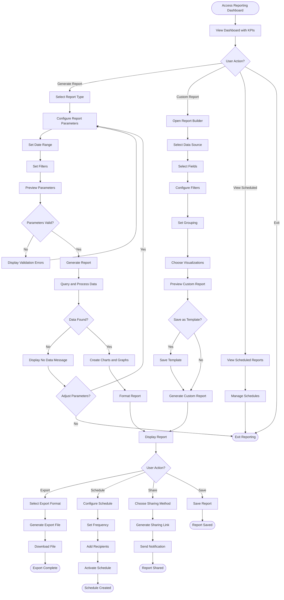

# Reporting Workflow

## Overview

The reporting workflow enables administrators, managers, and executives to generate insights from platform data through pre-built reports, custom queries, and data exports. This workflow supports operational monitoring, financial analysis, performance tracking, and strategic decision-making through comprehensive reporting capabilities.

## Stakeholder

**Primary**: System Administrators, Fleet Managers, Finance Teams, Executives

**Secondary**: Marketing Teams, Support Managers, Pricing Managers

## Goal

Generate accurate, timely reports that provide actionable insights into business performance, operational efficiency, customer behavior, and financial metrics to support data-driven decision-making and regulatory compliance.

## Preconditions

### System State
- Reporting system is operational
- Data is current and accurate
- User has reporting permissions
- Report templates are configured

### User State
- User understands reporting needs
- User has access to required data
- User knows how to interpret reports

## Workflow Steps

### 1. Access Reporting Dashboard

**User Action**: Navigate to reporting interface

**System Response**:
- Display reporting dashboard
- Show key performance indicators (KPIs)
- Provide report categories
- Display recent reports
- Show scheduled reports
- Provide quick report actions

**Dashboard Sections**:
- **KPI Summary**: Real-time key metrics
- **Report Library**: Available report templates
- **Recent Reports**: Recently generated reports
- **Scheduled Reports**: Automated report schedule
- **Custom Reports**: User-created reports
- **Data Exports**: Export history

### 2. Select Report Type

**User Action**: Choose report category

**Report Categories**:

**Operational Reports**:
- Fleet utilization and availability
- Booking volume and trends
- Vehicle performance metrics
- Location performance
- Maintenance schedules and costs
- Customer service metrics

**Financial Reports**:
- Revenue by period, location, vehicle
- Payment transaction reports
- Refund and cancellation reports
- Tax collection reports
- Supplier commission reports
- Profitability analysis

**Customer Reports**:
- Customer acquisition and retention
- Customer lifetime value
- Booking patterns and preferences
- Customer satisfaction scores
- Demographic analysis
- Loyalty program metrics

**Marketing Reports**:
- Campaign performance
- Discount code usage
- Conversion funnel analysis
- Traffic source analysis
- Booking channel distribution
- Seasonal demand patterns

**Compliance Reports**:
- Audit trail reports
- Data access logs
- Security incident reports
- Regulatory compliance reports
- Privacy request tracking

### 3. Configure Report Parameters

**User Action**: Set report criteria

**Common Parameters**:
- **Date Range**: Start and end dates
- **Location Filter**: Specific locations or all
- **Vehicle Filter**: Specific vehicles, categories, or all
- **Supplier Filter**: Specific suppliers (multi-supplier mode)
- **Customer Segment**: All customers or specific segments
- **Status Filter**: Active, completed, cancelled, etc.
- **Grouping**: By day, week, month, quarter, year
- **Comparison**: Compare to previous period

**Advanced Parameters**:
- **Custom Filters**: Complex filter combinations
- **Calculated Fields**: Custom metrics
- **Aggregation Level**: Summary or detailed
- **Sort Order**: Sort by specific columns
- **Limit**: Top N results

**System Response**:
- Display parameter selection interface
- Provide date picker for date ranges
- Show available filter options
- Validate parameter combinations
- Preview estimated report size

### 4. Generate Report

**User Action**: Click "Generate Report" or "Run Report"

**System Processing**:
1. Validate report parameters
2. Query database with filters
3. Aggregate data as specified
4. Calculate metrics and KPIs
5. Apply formatting and styling
6. Generate visualizations (charts, graphs)
7. Create report document

**Processing Indicators**:
- Display progress bar
- Show estimated completion time
- Allow cancellation of long-running reports
- Queue large reports for background processing

**System Response**:
- Display generated report
- Show report metadata (date generated, parameters used)
- Provide export options
- Enable report actions (save, schedule, share)

### 5. Review Report Results

**User Action**: Analyze report data

**Report Display**:
- **Summary Section**: Key findings and highlights
- **Data Tables**: Detailed data in tabular format
- **Visualizations**: Charts, graphs, and diagrams
- **Trends**: Time-series analysis
- **Comparisons**: Period-over-period comparisons
- **Insights**: Automated insights and recommendations

**Visualization Types**:
- Line charts (trends over time)
- Bar charts (comparisons)
- Pie charts (distribution)
- Heat maps (patterns)
- Scatter plots (correlations)
- Gauges (KPI status)

**Interactive Features**:
- Drill-down into details
- Filter data dynamically
- Sort columns
- Expand/collapse sections
- Hover for additional information

### 6. Export Report

**User Action**: Download report in desired format

**Export Formats**:
- **PDF**: Formatted document for printing/sharing
- **Excel (XLSX)**: Spreadsheet for further analysis
- **CSV**: Raw data for import into other systems
- **JSON**: Structured data for API consumption
- **HTML**: Web-viewable report

**Export Options**:
- Include/exclude visualizations
- Include/exclude raw data
- Page orientation (portrait/landscape)
- Paper size (letter, A4, etc.)
- Include report parameters
- Include generation timestamp

**System Processing**:
- Generate export file
- Apply formatting for selected format
- Compress large files
- Provide download link
- Store export in history

### 7. Schedule Recurring Reports

**User Action**: Set up automated report generation

**Scheduling Options**:
- **Frequency**: Daily, weekly, monthly, quarterly, annually
- **Day/Time**: Specific day and time for generation
- **Recipients**: Email addresses for delivery
- **Format**: Export format for delivery
- **Parameters**: Fixed or dynamic parameters
- **Retention**: How long to keep generated reports

**Schedule Configuration**:
1. Select report template
2. Configure parameters
3. Set frequency and timing
4. Add recipient email addresses
5. Choose delivery format
6. Set retention policy
7. Activate schedule

**System Processing**:
- Create scheduled job
- Generate reports automatically
- Email reports to recipients
- Store generated reports
- Log delivery status
- Handle failures with retry

### 8. Create Custom Report

**User Action**: Build report from scratch

**Custom Report Builder**:
- **Data Source Selection**: Choose tables/entities
- **Field Selection**: Select columns to include
- **Filter Configuration**: Define filter criteria
- **Grouping**: Group by specific fields
- **Aggregation**: Sum, average, count, etc.
- **Sorting**: Define sort order
- **Visualization**: Choose chart types
- **Layout**: Arrange report sections

**System Features**:
- Drag-and-drop interface
- Formula builder for calculated fields
- Preview as you build
- Save as template for reuse
- Share with other users

**System Processing**:
- Validate custom report configuration
- Generate SQL query from configuration
- Execute query and retrieve data
- Apply formatting and visualizations
- Save custom report definition

### 9. Share Reports

**User Action**: Distribute report to stakeholders

**Sharing Methods**:
- **Email**: Send report as attachment
- **Link**: Generate shareable link
- **Dashboard**: Add to shared dashboard
- **Embed**: Embed in external system
- **Print**: Print physical copy

**Sharing Options**:
- Set expiration date for links
- Require authentication for access
- Allow/prevent downloads
- Track views and downloads
- Revoke access

**System Processing**:
- Generate secure sharing link
- Set access permissions
- Send email notifications
- Track sharing activity
- Log access attempts

### 10. Monitor Report Performance

**User Action**: Review reporting system health

**Performance Metrics**:
- **Report Generation Time**: Average time to generate reports
- **Report Usage**: Most frequently generated reports
- **Export Volume**: Number of exports per period
- **Scheduled Report Success Rate**: Percentage delivered successfully
- **Data Freshness**: Time lag between data and reports
- **System Load**: Resource usage during report generation

**System Monitoring**:
- Track slow-running reports
- Identify optimization opportunities
- Monitor database query performance
- Alert on failed scheduled reports
- Track storage usage for reports

**Optimization Actions**:
- Cache frequently accessed data
- Optimize slow queries
- Archive old reports
- Adjust scheduling to off-peak hours
- Implement data aggregation tables

## Outcome

### Successful Outcome
- Report generated with accurate data
- Insights clearly presented
- Report exported in desired format
- Stakeholders receive report (if shared)
- Report saved for future reference
- Scheduled reports automated

### Alternative Outcomes
- **No Data**: Report parameters return no results
- **Timeout**: Report too complex, requires optimization
- **Partial Data**: Some data unavailable
- **Scheduled Failure**: Automated report fails to generate

## Exceptions and Error Handling

### Exception 1: Report Timeout

**Trigger**: Report takes too long to generate

**System Response**:
- Display timeout message
- Suggest narrowing date range or filters
- Offer to queue report for background processing
- Provide estimated completion time

**User Options**:
- Adjust parameters to reduce scope
- Queue for background processing
- Schedule for off-peak hours
- Contact support for optimization

### Exception 2: No Data Available

**Trigger**: Report parameters return zero results

**System Response**:
- Display "No data found" message
- Show applied filters
- Suggest adjusting parameters
- Provide example of valid parameters

**User Options**:
- Adjust date range
- Remove or modify filters
- Try different report type
- Verify data exists in system

### Exception 3: Export Failure

**Trigger**: Error generating export file

**System Response**:
- Display error message
- Log error details
- Offer to retry
- Suggest alternative format

**User Options**:
- Retry export
- Try different format
- Reduce report size
- Contact support

### Exception 4: Scheduled Report Failure

**Trigger**: Automated report fails to generate or deliver

**System Response**:
- Log failure details
- Send failure notification to admin
- Attempt retry (configurable)
- Disable schedule after repeated failures

**Admin Actions**:
- Review error logs
- Fix underlying issue
- Manually generate and send report
- Adjust schedule or parameters
- Re-enable schedule

## Workflow Diagram

## Performance Metrics

### Report Generation Metrics
- **Average Generation Time**: Time to create reports (target: <30 seconds)
- **Report Success Rate**: Percentage generated without errors (target: >98%)
- **Timeout Rate**: Percentage of reports timing out (target: <2%)
- **Data Freshness**: Time lag between data and reports (target: <1 hour)

### Usage Metrics
- **Reports Generated**: Total reports per period (track trend)
- **Most Popular Reports**: Frequently generated report types (track for optimization)
- **Export Volume**: Number of exports per period (track trend)
- **Scheduled Report Delivery Rate**: Percentage delivered successfully (target: >95%)

### User Engagement Metrics
- **Active Report Users**: Percentage of admins using reports (target: >80%)
- **Report Views**: Average views per report (track engagement)
- **Custom Report Creation**: Number of custom reports created (track adoption)
- **Sharing Activity**: Reports shared per period (track collaboration)

## Related Workflows

- **Fleet Management Workflow**: Fleet performance reports
- **Pricing Updates Workflow**: Pricing and revenue reports
- **User Management Workflow**: User activity reports
- **Booking Management Workflow**: Booking and revenue reports

## Related Requirements

- **Requirement 4.1**: User scenario documentation
- **Requirement 4.2**: Workflow with Mermaid flowchart
- **Requirement 4.4**: Administrative operations
- **Requirement 4.6**: Exception handling
- **Requirement 4.7**: Pandoc-compatible format

## Related Stakeholders

- **System Administrators**: Generate operational reports
- **Fleet Managers**: Monitor fleet performance
- **Finance Teams**: Analyze financial metrics
- **Executives**: Review business performance
- **Marketing Teams**: Track campaign effectiveness

## Related Features

- **Business Intelligence Dashboard**: Real-time KPIs
- **Report Templates**: Pre-built report library
- **Custom Report Builder**: Create ad-hoc reports
- **Scheduled Reports**: Automated report generation
- **Data Export**: Multiple export formats
- **Report Sharing**: Distribute reports to stakeholders
- **Performance Analytics**: Track reporting system health
