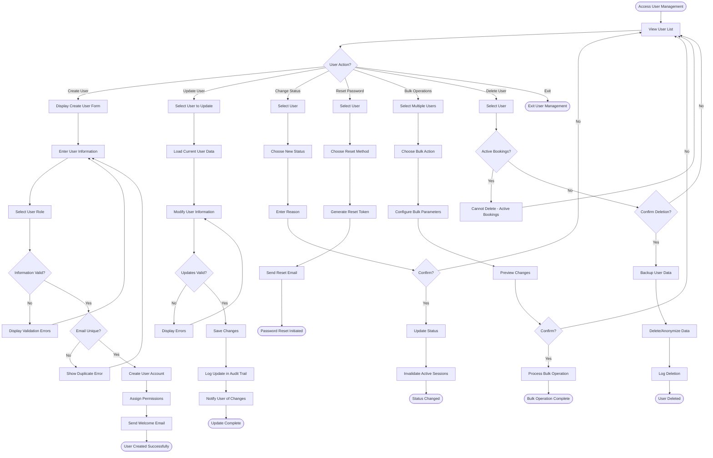

# User Management Workflow

## Overview

The user management workflow enables administrators to create, update, and manage user accounts across the platform. This includes customer accounts, administrator accounts, role assignments, permission management, and account status changes. Effective user management ensures proper access control, security, and customer service capabilities.

## Stakeholder

**Primary**: System Administrators, User Administrators

**Secondary**: Support Agents, Security Teams

## Goal

Maintain accurate user accounts with appropriate permissions and status, ensuring customers can access their accounts, administrators have necessary privileges, and the platform remains secure through proper access control.

## Preconditions

### System State
- Admin panel is accessible
- User roles and permissions are configured
- User has user management permissions

### User State
- User is logged in with admin role
- User understands role-based access control
- User has necessary information for account creation/updates

## Workflow Steps

### 1. Access User Management Interface

**User Action**: Navigate to user management section

**System Response**:
- Display user list with key information
- Show user count by type (customers, admins, suppliers)
- Provide search and filter controls
- Display action buttons (Add User, Bulk Operations, Export)
- Show user status summary

### 2. Create New User Account

**User Action**: Click "Add User" button

**Account Types**:
- **Customer Account**: For renters
- **Administrator Account**: For staff
- **Supplier Account**: For suppliers (multi-supplier mode)

**Required Information**:
- Full name (first and last)
- Email address
- Phone number
- Date of birth (for customers)
- Account type/role
- Initial password (or send activation email)

**Optional Information**:
- Profile photo
- Address
- Driver's license information
- Language preference
- Communication preferences

**System Processing**:
- Validate email uniqueness
- Validate email format
- Validate phone format
- Calculate age from birth date
- Hash password securely
- Generate activation token (if email activation)
- Create user record
- Send welcome email

### 3. Assign User Roles and Permissions

**User Action**: Configure user access level

**Role Types**:
- **Customer**: Standard rental customer
- **Administrator**: Full system access
- **Supplier**: Manage own vehicles and bookings
- **Fleet Manager**: Manage fleet operations
- **Support Agent**: Handle customer issues
- **Pricing Manager**: Manage pricing
- **Read-Only Admin**: View-only access

**Permission Granularity**:
- Module-level (fleet, bookings, users, reports)
- Action-level (create, read, update, delete)
- Data-level (own data, location data, all data)

**System Processing**:
- Apply role-based permissions
- Validate permission combinations
- Log permission assignments
- Update user access immediately

### 4. Update User Information

**User Action**: Modify existing user account

**Updatable Fields**:
- Personal information (name, phone, address)
- Email address (with verification)
- Password (with current password check)
- Profile photo
- Language and currency preferences
- Communication preferences
- Driver's license information

**System Processing**:
- Validate updated information
- Send verification for email changes
- Hash new passwords
- Update user record
- Log changes in audit trail
- Send confirmation notification

### 5. Manage User Status

**User Action**: Change user account status

**Status Options**:
- **Active**: Normal account access
- **Inactive**: Temporarily disabled
- **Suspended**: Disabled due to policy violation
- **Blacklisted**: Permanently banned
- **Pending Verification**: Awaiting email/phone verification
- **Locked**: Temporarily locked due to failed login attempts

**Status Change Process**:
1. Select user
2. Choose new status
3. Provide reason/notes
4. Set duration (for temporary status)
5. Confirm status change

**System Processing**:
- Update user status
- Block/unblock login access
- Cancel active sessions (if disabling)
- Send notification to user (if appropriate)
- Log status change with reason

### 6. Reset User Password

**User Action**: Initiate password reset for user

**Reset Methods**:
- **Email Reset Link**: Send password reset email
- **Temporary Password**: Generate and provide temporary password
- **Admin Reset**: Set new password directly (with notification)

**System Processing**:
- Generate secure reset token
- Send reset email with expiring link
- Log password reset request
- Invalidate old passwords after reset
- Require password change on next login (for admin resets)

### 7. Manage User Bookings

**User Action**: View and modify user's booking history

**Booking Management**:
- View all user bookings (past, current, future)
- Modify booking details
- Cancel bookings
- Process refunds
- Add notes to bookings
- View payment history

**System Processing**:
- Retrieve user's booking records
- Display booking details
- Enable booking modifications
- Process cancellations and refunds
- Update booking status
- Send notifications

### 8. Handle User Verification

**User Action**: Verify user identity or information

**Verification Types**:
- **Email Verification**: Confirm email address
- **Phone Verification**: Confirm phone number
- **Identity Verification**: Verify driver's license or ID
- **Payment Verification**: Verify payment method
- **Address Verification**: Confirm physical address

**Verification Process**:
1. Review verification request
2. Check provided documentation
3. Approve or reject verification
4. Update user verification status
5. Notify user of result

**System Processing**:
- Store verification documents securely
- Update verification flags
- Log verification actions
- Enable features requiring verification

### 9. Manage User Communications

**User Action**: Send messages to users

**Communication Types**:
- **Individual Email**: Send email to specific user
- **Bulk Email**: Send to multiple users
- **SMS Notification**: Send text message
- **In-App Notification**: Send platform notification
- **Announcement**: Broadcast to all users

**Communication Features**:
- Email templates for common messages
- Personalization (merge fields)
- Scheduling (send at specific time)
- Tracking (open rates, click rates)
- Opt-out respect (honor preferences)

**System Processing**:
- Validate recipient list
- Apply email templates
- Personalize content
- Queue for delivery
- Track delivery status
- Log communications

### 10. Bulk User Operations

**User Action**: Perform actions on multiple users

**Bulk Operations**:
- **Bulk Status Change**: Activate/deactivate multiple users
- **Bulk Role Assignment**: Assign roles to multiple users
- **Bulk Email**: Send message to user segment
- **Bulk Export**: Download user data
- **Bulk Import**: Upload user data from file
- **Bulk Delete**: Remove multiple accounts (with safeguards)

**System Processing**:
- Validate bulk operation
- Process in batches
- Show progress indicator
- Handle errors gracefully
- Generate summary report
- Log bulk operation

### 11. Monitor User Activity

**User Action**: Review user actions and behavior

**Activity Monitoring**:
- **Login History**: Track login times and locations
- **Booking Activity**: View booking patterns
- **Payment History**: Review transactions
- **Support Interactions**: See support tickets
- **System Usage**: Track feature usage
- **Security Events**: Monitor suspicious activity

**Analytics Features**:
- User engagement metrics
- Retention analysis
- Churn prediction
- Lifetime value calculation
- Behavior segmentation

**System Processing**:
- Aggregate user activity data
- Generate activity reports
- Identify patterns and anomalies
- Provide insights and recommendations

### 12. Handle User Deletion Requests

**User Action**: Process account deletion request

**Deletion Types**:
- **Soft Delete**: Mark as deleted, retain data
- **Hard Delete**: Permanently remove data
- **Anonymize**: Remove personal information, keep records

**Deletion Process**:
1. Verify deletion request
2. Check for active bookings
3. Process refunds if necessary
4. Backup user data
5. Delete or anonymize data
6. Send confirmation
7. Log deletion

**System Processing**:
- Validate no active bookings
- Cancel future bookings
- Process refunds
- Remove personal data (GDPR compliance)
- Retain transaction records (legal requirement)
- Log deletion with reason

## Outcome

### Successful Outcome
- User account created or updated
- Appropriate permissions assigned
- Account status reflects current state
- User can access system (if active)
- Changes logged in audit trail
- User notified of changes (if appropriate)

### Alternative Outcomes
- **Validation Errors**: Information corrections needed
- **Duplicate Account**: Email already exists
- **Permission Conflict**: Invalid permission combination
- **Deletion Blocked**: Active bookings prevent deletion

## Exceptions and Error Handling

### Exception 1: Duplicate Email Address

**Trigger**: Email already exists in system

**System Response**:
- Display error message
- Show link to existing account
- Suggest password reset if user forgot account

**User Options**:
- Use different email
- Merge accounts (if authorized)
- Contact existing account owner

### Exception 2: Invalid Permission Assignment

**Trigger**: Permission combination not allowed

**System Response**:
- Display error explaining conflict
- Suggest valid permission combinations
- Prevent saving until resolved

**User Options**:
- Adjust permissions
- Choose different role
- Request permission policy change

### Exception 3: Account Deletion with Active Bookings

**Trigger**: Attempting to delete user with future bookings

**System Response**:
- Display error message
- List active bookings
- Suggest alternatives

**User Options**:
- Cancel bookings first
- Wait until bookings complete
- Suspend account instead of deleting

## Workflow Diagram

## Performance Metrics

### Operational Metrics
- **Account Creation Time**: Average time to create user (target: <3 minutes)
- **Password Reset Time**: Time to process reset request (target: <1 minute)
- **Bulk Operation Speed**: Users processed per minute (target: >100)
- **Search Performance**: Time to find user (target: <2 seconds)

### Security Metrics
- **Failed Login Rate**: Percentage of failed login attempts (track for security)
- **Account Lockout Rate**: Accounts locked due to failed logins (target: <1%)
- **Unauthorized Access Attempts**: Blocked access attempts (target: 0 successful)
- **Password Reset Frequency**: Resets per user per year (track trend)

### Data Quality Metrics
- **Email Verification Rate**: Percentage with verified emails (target: >95%)
- **Profile Completeness**: Percentage with complete profiles (target: >80%)
- **Duplicate Accounts**: Accounts with same email (target: 0%)
- **Inactive Accounts**: Accounts not used in 12+ months (track for cleanup)

## Related Workflows

- **Booking Management Workflow**: View and modify user bookings
- **Support Workflow**: Handle user issues and complaints
- **Security Audit Workflow**: Review user access and activity
- **Compliance Workflow**: Handle data deletion requests

## Related Requirements

- **Requirement 4.1**: User scenario documentation
- **Requirement 4.2**: Workflow with Mermaid flowchart
- **Requirement 4.4**: Administrative operations
- **Requirement 4.6**: Exception handling
- **Requirement 4.7**: Pandoc-compatible format

## Related Stakeholders

- **System Administrators**: Primary user managers
- **Support Agents**: Handle user account issues
- **Security Teams**: Monitor user access and security
- **Individual Customers**: Managed user accounts
- **Corporate Clients**: Managed corporate accounts

## Related Features

- **User Account Management**: CRUD operations for users
- **Role-Based Access Control**: Permission management
- **User Authentication**: Login and security
- **User Verification**: Identity and information verification
- **Audit Logging**: Track all user management actions
- **Bulk Operations**: Efficient multi-user management
