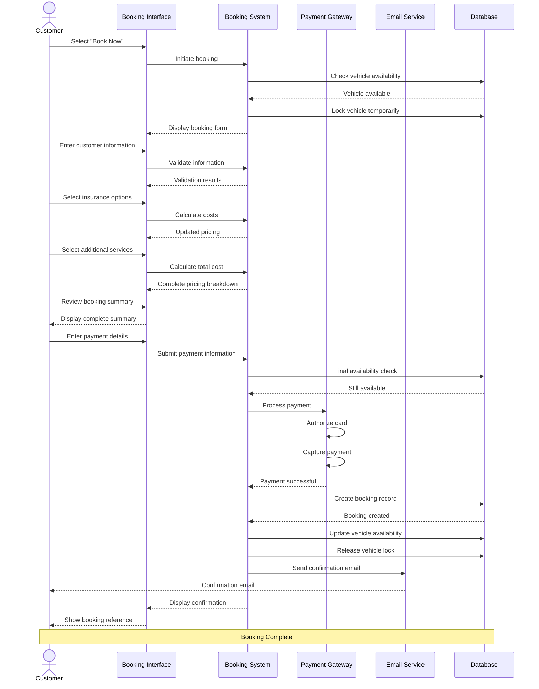

# Booking Creation Workflow

## Overview

The booking creation workflow transforms a customer's vehicle selection into a confirmed reservation. This critical workflow handles customer information collection, optional service selection, payment processing, and confirmation delivery. Optimization of this workflow directly impacts conversion rates and revenue generation.

## Stakeholder

**Primary**: Individual Customers, Corporate Clients, Subscription Users

**Secondary**: Payment Processors, Insurance Providers, Fleet Managers

## Goal

Complete a vehicle reservation by providing required information, selecting optional services, processing payment, and receiving booking confirmation with all necessary details for vehicle pickup.

## Preconditions

### System State
- Vehicle is available for selected dates and location
- Pricing information is current and accurate
- Payment gateway is operational
- Email/SMS notification services are functional
- Booking system can create and store reservations

### User State
- User has selected a specific vehicle from search results
- User has valid payment method
- User meets age and license requirements
- User has internet connectivity
- User may or may not have an existing account

## Workflow Steps

### 1. Initiate Booking

**User Action**: Click "Book Now" or "Reserve" on selected vehicle

**System Response**:
- Verify vehicle availability for selected dates
- Lock vehicle temporarily (5-15 minutes) to prevent double-booking
- Display booking form with vehicle summary
- Show rental period and location details
- Display base price and rental duration
- Indicate required vs optional fields

**Data Carried Forward**:
- Vehicle selection
- Pickup/return dates and times
- Pickup/return locations
- Search criteria

### 2. Customer Information Collection

**User Action**: Provide personal and contact information

**Required Information**:
- Full name (first and last)
- Email address
- Phone number
- Date of birth
- Driver's license number
- Driver's license issuing country/state
- Driver's license expiration date

**Optional Information**:
- Secondary phone number
- Special requests or notes
- Preferred communication method

**System Response**:
- Pre-fill information for logged-in users
- Validate email format in real-time
- Validate phone number format
- Calculate age from birth date
- Verify driver's license expiration is after rental period
- Show validation errors inline

**For Logged-In Users**:
- Display saved information with edit option
- Offer to update profile with changes
- Show saved payment methods

**For Guest Users**:
- Offer optional account creation
- Explain benefits of creating account
- Allow booking without account

**Validation Rules**:
- Email must be valid format
- Phone must be valid format for selected country
- Age must meet minimum requirement (typically 21+)
- Driver's license must be valid during entire rental period
- All required fields must be completed

### 3. Additional Driver Information (Optional)

**User Action**: Add additional authorized drivers

**Information Per Additional Driver**:
- Full name
- Date of birth
- Driver's license number
- Driver's license issuing location
- Driver's license expiration date
- Relationship to primary renter (optional)

**System Response**:
- Calculate additional driver fee
- Update total cost
- Validate each driver's information
- Check age requirements for additional drivers
- Allow multiple additional drivers (typically up to 3-4)

**Pricing**:
- Display per-driver fee (daily or flat rate)
- Show total additional driver cost
- Update booking total

### 4. Insurance and Protection Selection

**User Action**: Select insurance and protection options

**Insurance Options**:
- **Collision Damage Waiver (CDW)**: Reduces liability for vehicle damage
- **Theft Protection (TP)**: Covers vehicle theft
- **Personal Accident Insurance (PAI)**: Covers medical expenses
- **Supplemental Liability Insurance (SLI)**: Additional liability coverage
- **Full Protection**: Comprehensive coverage package

**For Each Option**:
- Clear description of coverage
- Coverage limits and deductibles
- Cost per day and total cost
- What's included and excluded
- Comparison with other options

**System Response**:
- Display insurance options with clear explanations
- Show recommended options based on rental value
- Calculate costs for rental duration
- Update total booking cost
- Allow selection of multiple options
- Highlight mandatory vs optional coverage

**Default Behavior**:
- Basic coverage may be included in base price
- Additional coverage is optional
- No pre-selection of optional insurance (user must actively choose)

### 5. Additional Services and Equipment

**User Action**: Select optional services and equipment

**Available Services**:
- **GPS Navigation System**: Daily rental fee
- **Child Safety Seats**: Infant, toddler, or booster seats with daily fee
- **Additional Equipment**: Ski racks, bike racks, snow chains
- **Fuel Options**: Prepaid fuel, fuel service charge
- **Toll Passes**: Electronic toll collection devices
- **WiFi Hotspot**: Mobile internet device

**For Each Service**:
- Description and specifications
- Daily or flat rate cost
- Availability confirmation
- Quantity selection (for items like child seats)

**System Response**:
- Display available services with images
- Calculate costs based on rental duration
- Update total booking cost
- Confirm availability of requested items
- Show quantity limits where applicable

### 6. Review Booking Summary

**User Action**: Review complete booking details before payment

**Summary Display**:
- **Vehicle Information**: Make, model, category, features
- **Rental Period**: Pickup and return dates/times with duration
- **Locations**: Pickup and return addresses
- **Customer Information**: Name, email, phone
- **Additional Drivers**: Names and fees
- **Insurance**: Selected coverage options and costs
- **Additional Services**: Equipment and services with costs
- **Pricing Breakdown**:
  - Base rental rate (with per-day breakdown)
  - Insurance costs
  - Additional driver fees
  - Equipment rental fees
  - Taxes and fees (itemized)
  - Airport surcharges (if applicable)
  - **Total Amount Due**

**User Options**:
- Edit any section (returns to relevant step)
- Apply discount or promo code
- Proceed to payment
- Save booking for later (if logged in)
- Cancel booking

**System Response**:
- Display complete, itemized cost breakdown
- Highlight total amount prominently
- Show currency
- Display cancellation policy
- Show modification policy
- Provide terms and conditions link

### 7. Apply Discount Code (Optional)

**User Action**: Enter promotional or discount code

**System Response**:
- Validate discount code
- Check code eligibility (dates, vehicle types, user eligibility)
- Apply discount to appropriate items
- Recalculate total cost
- Display discount amount saved
- Show updated pricing breakdown

**Error Handling**:
- Invalid code: Show error message
- Expired code: Explain expiration
- Ineligible booking: Explain requirements
- Already used: Indicate one-time use limit

### 8. Payment Method Selection

**User Action**: Choose payment method and provide payment details

**Payment Options**:
- **Credit Card**: Visa, Mastercard, American Express, Discover
- **Debit Card**: With sufficient funds
- **Digital Wallets**: Apple Pay, Google Pay, PayPal
- **Pay at Counter**: Reserve now, pay at pickup (if enabled)

**For Card Payments**:
- Card number
- Cardholder name
- Expiration date
- CVV/CVC security code
- Billing address (if required)

**For Digital Wallets**:
- One-click authentication
- Saved payment information from wallet

**System Response**:
- Display accepted payment methods with logos
- Show secure payment indicators (SSL, PCI compliance)
- Validate card number format in real-time
- Validate expiration date
- Encrypt payment information
- For logged-in users: Show saved payment methods
- Option to save payment method for future use

**Payment Timing Options**:
- **Pay in Full**: Complete payment now
- **Pay Deposit**: Pay percentage now, remainder at pickup
- **Pay at Counter**: No payment now (if enabled)

### 9. Terms and Conditions Acceptance

**User Action**: Review and accept terms

**Required Acceptances**:
- Rental agreement terms and conditions
- Cancellation and modification policies
- Privacy policy
- Age and license requirements confirmation
- Insurance coverage understanding

**System Response**:
- Display checkboxes for each required acceptance
- Provide links to full terms documents
- Prevent booking completion without acceptance
- Record acceptance timestamp and IP address

### 10. Process Payment

**User Action**: Click "Complete Booking" or "Confirm Reservation"

**System Processing**:
1. Final availability check for vehicle
2. Validate all required information
3. Process payment through payment gateway
4. Create booking record in database
5. Generate unique booking reference number
6. Update vehicle availability
7. Send confirmation email
8. Send confirmation SMS (if enabled)
9. Release temporary vehicle lock

**Payment Processing**:
- Authorize payment amount
- Capture payment (or schedule capture for pay-later options)
- Handle 3D Secure authentication if required
- Process payment through secure gateway
- Receive payment confirmation

**System Response During Processing**:
- Display loading indicator
- Show "Processing payment..." message
- Prevent duplicate submissions
- Maintain session state

### 11. Booking Confirmation

**User Action**: View confirmation page

**Confirmation Display**:
- Success message
- Booking reference number (prominently displayed)
- Complete booking summary
- Pickup instructions and location details
- What to bring (ID, credit card, license)
- Contact information for questions
- Cancellation and modification links
- Add to calendar button
- Print confirmation button
- Download PDF option

**System Response**:
- Display confirmation page
- Send confirmation email immediately
- Send confirmation SMS (if enabled)
- For logged-in users: Add booking to account history
- Offer to create account (for guest bookings)
- Suggest related services (insurance upgrades, etc.)

### 12. Post-Booking Actions

**User Options**:
- View booking details
- Modify booking
- Cancel booking
- Add to calendar
- Share booking details
- Contact customer support
- Return to homepage
- Search for another vehicle

**System Actions**:
- Store booking in database
- Update vehicle availability calendar
- Schedule reminder notifications
- Create customer service ticket (if needed)
- Update analytics and reporting
- Process loyalty points (if applicable)

## Outcome

### Successful Outcome
- Booking created and confirmed
- Payment processed successfully
- Customer receives confirmation via email/SMS
- Booking reference number generated
- Vehicle reserved for specified dates
- Customer has all information needed for pickup

### Alternative Outcomes
- **Payment Declined**: User must provide alternative payment method
- **Vehicle Unavailable**: User must select different vehicle or dates
- **Validation Errors**: User must correct information before proceeding
- **Session Timeout**: User must restart booking process
- **User Abandonment**: Booking not completed, vehicle lock released

## Exceptions and Error Handling

### Exception 1: Payment Declined

**Trigger**: Payment processor rejects payment

**System Response**:
- Display payment declined message
- Explain reason if provided by processor
- Maintain booking information
- Offer to try different payment method
- Extend vehicle lock temporarily
- Provide customer support contact

**User Options**:
- Try different card
- Use alternative payment method
- Contact bank
- Pay at counter (if available)
- Cancel booking

### Exception 2: Vehicle Becomes Unavailable

**Trigger**: Vehicle booked by another user during checkout

**System Response**:
- Display "Vehicle no longer available" message
- Apologize for inconvenience
- Suggest similar available vehicles
- Offer discount on alternative vehicle
- Preserve customer information for rebooking

**User Options**:
- Select alternative vehicle
- Modify dates
- Return to search
- Contact support for assistance

### Exception 3: Session Timeout

**Trigger**: User inactive for extended period

**System Response**:
- Display session timeout warning before expiration
- Save entered information if possible
- Release vehicle lock
- Offer to restore session
- Provide option to start over

**User Options**:
- Restore session and continue
- Start new booking
- Contact support

### Exception 4: Validation Errors

**Trigger**: Required information missing or invalid

**System Response**:
- Highlight fields with errors
- Display specific error messages
- Prevent proceeding to next step
- Preserve valid information
- Provide examples of correct format

**Common Validation Errors**:
- Invalid email format
- Invalid phone number
- Expired driver's license
- Age below minimum requirement
- Missing required fields
- Invalid payment card

### Exception 5: Discount Code Issues

**Trigger**: Invalid or ineligible discount code

**System Response**:
- Display error message explaining issue
- Maintain booking without discount
- Suggest alternative promotions
- Allow proceeding without code

**User Options**:
- Try different code
- Proceed without discount
- Contact support for code assistance

### Exception 6: Payment Processing Error

**Trigger**: Technical error during payment processing

**System Response**:
- Display error message
- Do not charge customer
- Preserve booking information
- Offer to retry
- Provide support contact

**User Options**:
- Retry payment
- Try different payment method
- Contact support
- Save booking for later

## Workflow Diagram

## Performance Metrics

### Conversion Metrics
- **Booking Completion Rate**: Percentage of initiated bookings completed (target >70%)
- **Payment Success Rate**: Percentage of payment attempts successful (target >95%)
- **Abandonment Rate**: Percentage of bookings abandoned at each step (track for optimization)
- **Time to Complete**: Average time from initiation to confirmation (target &lt;5 minutes)

### User Experience Metrics
- **Form Completion Time**: Time spent on each step (track for friction points)
- **Error Rate**: Percentage of bookings with validation errors (target &lt;10%)
- **Retry Rate**: Percentage of users retrying after errors (track for UX issues)
- **Guest vs Account**: Percentage of guest vs logged-in bookings (track for account value)

### Business Metrics
- **Average Booking Value**: Revenue per booking (track trend)
- **Upsell Acceptance**: Percentage accepting insurance and add-ons (target >30%)
- **Discount Usage**: Percentage of bookings using promo codes (track for marketing)
- **Payment Method Distribution**: Usage of different payment methods (track for optimization)

## Related Workflows

- **Vehicle Search Workflow**: Precedes booking creation
- **Payment Processing Workflow**: Detailed payment handling
- **Booking Modification Workflow**: Changes to existing bookings
- **Booking Cancellation Workflow**: Canceling reservations
- **Vehicle Pickup Workflow**: Next step after booking confirmation

## Related Requirements

- **Requirement 4.1**: User scenario documentation
- **Requirement 4.2**: Workflow with Mermaid sequence diagram
- **Requirement 4.3**: Core rental operations
- **Requirement 4.6**: Exception handling
- **Requirement 4.7**: Pandoc-compatible format

## Related Stakeholders

- **Individual Customers**: Primary booking creators
- **Corporate Clients**: Bulk bookings with special requirements
- **Payment Processors**: Handle payment transactions
- **Insurance Providers**: Provide coverage options
- **Fleet Managers**: Manage vehicle availability

## Related Features

- **Multi-Step Checkout Process**: Guided booking workflow
- **Multiple Payment Methods**: Various payment options
- **Transparent Pricing**: Clear cost breakdown
- **Booking Confirmation & Documentation**: Confirmation materials
- **Insurance and Protection Selection**: Coverage options
- **Additional Services and Equipment**: Optional add-ons
