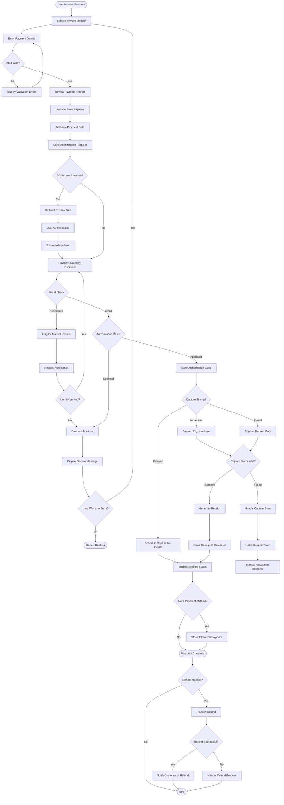

# Payment Processing Workflow

## Overview

The payment processing workflow handles all financial transactions within the car rental system, including payment authorization, capture, refunds, and payment method management. This workflow must balance security, user experience, and business requirements while maintaining PCI-DSS compliance and fraud prevention.

## Stakeholder

**Primary**: Individual Customers, Corporate Clients

**Secondary**: Payment Processors, Finance Teams, Administrators

## Goal

Process rental payments securely and efficiently, ensuring funds are authorized, captured at appropriate times, and refunded when necessary, while maintaining compliance with payment industry standards and providing transparent transaction records.

## Preconditions

### System State
- Payment gateway integration is operational
- PCI-DSS compliant payment infrastructure is in place
- SSL/TLS encryption is active
- Payment processor accounts are configured
- Fraud detection systems are enabled
- Database can securely store tokenized payment data

### User State
- User has valid payment method (credit card, debit card, or digital wallet)
- User has sufficient funds or credit limit
- User's payment method is not expired
- User has completed booking information
- User has reviewed and accepted total amount

## Workflow Steps

### 1. Payment Method Selection

**User Action**: Choose payment method from available options

**Available Payment Methods**:
- **Credit Cards**: Visa, Mastercard, American Express, Discover
- **Debit Cards**: With sufficient funds
- **Digital Wallets**: Apple Pay, Google Pay, PayPal, Link
- **Corporate Cards**: For business bookings
- **Pay at Counter**: Reserve without immediate payment (if enabled)

**System Response**:
- Display payment method options with logos
- Show security badges (PCI-DSS, SSL)
- For logged-in users: Display saved payment methods
- Indicate which methods support instant confirmation
- Show any method-specific fees or restrictions

**User Experience**:
- Clear visual distinction between payment types
- One-click selection for saved methods
- Option to add new payment method
- Security reassurance messaging

### 2. Payment Information Entry

**User Action**: Provide payment details

**For Credit/Debit Cards**:
- Card number (16-19 digits)
- Cardholder name (as appears on card)
- Expiration date (MM/YY)
- CVV/CVC security code (3-4 digits)
- Billing address (if required)
- ZIP/postal code

**For Digital Wallets**:
- One-click authentication
- Biometric verification (fingerprint, Face ID)
- Wallet-stored payment information

**System Response**:
- Mask card number as user types (show only last 4 digits)
- Validate card number using Luhn algorithm
- Detect card type from number prefix
- Validate expiration date (must be future date)
- Validate CVV length based on card type
- Show real-time validation feedback
- Display card brand logo

**Security Measures**:
- HTTPS encryption for all payment data transmission
- No storage of raw card numbers (tokenization only)
- No storage of CVV codes
- PCI-DSS compliant form fields
- Secure iframe for payment input (if using hosted fields)
- Auto-clear sensitive fields on page navigation

**Validation Rules**:
- Card number must pass Luhn check
- Expiration date must be in future
- CVV must be 3-4 digits
- Cardholder name must match billing information
- Billing address must be valid (if required)

### 3. Payment Amount Confirmation

**User Action**: Review final payment amount

**Display Information**:
- **Itemized Breakdown**:
  - Base rental cost
  - Insurance charges
  - Additional driver fees
  - Equipment rental fees
  - Taxes (itemized by type)
  - Airport or location surcharges
  - Discount or promotional savings
- **Total Amount**: Prominently displayed
- **Currency**: Clearly indicated
- **Payment Timing**: When charge will occur
- **Refund Policy**: Cancellation terms

**System Response**:
- Calculate final total including all fees and taxes
- Apply any discount codes
- Convert to selected currency if applicable
- Display payment schedule (full payment, deposit, or pay-later)
- Show what will be charged now vs at pickup/return

**User Confirmation**:
- Explicit confirmation of amount
- Checkbox or button acknowledging charge
- Clear "Complete Payment" or "Confirm Booking" button

### 4. Payment Authorization

**User Action**: Click "Complete Payment" or "Confirm Booking"

**System Processing**:
1. Validate all payment information one final time
2. Tokenize payment details (convert to secure token)
3. Send authorization request to payment gateway
4. Include transaction details (amount, currency, merchant ID)
5. Wait for authorization response

**Payment Gateway Processing**:
1. Validate payment method with issuing bank
2. Check for sufficient funds/credit
3. Perform fraud checks
4. Apply 3D Secure authentication if required
5. Return authorization code or decline reason

**3D Secure Authentication** (if required):
- Redirect user to bank's authentication page
- User enters password, SMS code, or biometric
- Bank validates identity
- Return to merchant site with authentication result

**System Response**:
- Display loading indicator during processing
- Show "Processing payment..." message
- Prevent duplicate submissions (disable button)
- Handle authentication redirects seamlessly
- Maintain session state during authentication

**Authorization Hold**:
- Place hold on customer's payment method
- Hold amount may include estimated charges
- Hold typically lasts 7-30 days
- Actual capture occurs later (immediate or at pickup)

### 5. Authorization Response Handling

**Successful Authorization**:

**System Actions**:
- Receive authorization code from gateway
- Store authorization code with booking
- Store tokenized payment method
- Update booking status to "Confirmed"
- Proceed to payment capture (if immediate) or schedule capture
- Generate booking reference number
- Send confirmation notifications

**User Experience**:
- Display success message
- Show booking confirmation
- Provide booking reference number
- Send confirmation email
- Display next steps

**Failed Authorization**:

**Common Decline Reasons**:
- Insufficient funds
- Expired card
- Incorrect CVV
- Card reported lost/stolen
- Suspected fraud
- Issuer decline (various reasons)
- Technical error

**System Actions**:
- Receive decline reason from gateway
- Log decline for fraud analysis
- Do not create booking
- Preserve user's entered information
- Display user-friendly error message

**User Experience**:
- Show decline reason (if appropriate to share)
- Suggest corrective actions
- Offer to try different payment method
- Provide customer support contact
- Maintain booking details for retry

### 6. Payment Capture

**Timing Options**:

**Immediate Capture** (most common):
- Capture payment immediately after authorization
- Used for pay-in-full bookings
- Funds transferred to merchant account
- Customer charged immediately

**Delayed Capture**:
- Capture payment at pickup time
- Used for pay-at-counter or deposit bookings
- Authorization hold maintained until capture
- Allows for booking modifications before charge

**Partial Capture**:
- Capture deposit amount immediately
- Capture remaining balance at pickup
- Used for deposit payment option

**System Processing**:
1. Send capture request to payment gateway
2. Include authorization code
3. Specify capture amount (may differ from authorization)
4. Receive capture confirmation
5. Update booking payment status
6. Generate receipt

**Capture Scenarios**:
- **Full Capture**: Entire authorized amount captured
- **Partial Capture**: Less than authorized amount (e.g., after discount)
- **Multiple Captures**: Deposit now, balance later
- **Void**: Cancel authorization without capture (for cancellations)

### 7. Receipt Generation

**System Actions**:
- Generate detailed receipt
- Include transaction ID
- Itemize all charges
- Show payment method (last 4 digits)
- Include merchant information
- Add timestamp and authorization code
- Create PDF version

**Receipt Contents**:
- **Transaction Details**: Date, time, transaction ID
- **Payment Information**: Last 4 digits of card, card type
- **Booking Reference**: Link to booking
- **Itemized Charges**: All fees and taxes
- **Total Amount**: Amount charged
- **Merchant Information**: Company name, address, contact
- **Refund Policy**: Terms and conditions

**Delivery**:
- Display receipt on confirmation page
- Email receipt to customer
- Store in customer account (if logged in)
- Provide download PDF option
- Provide print option

### 8. Payment Method Storage (Optional)

**User Action**: Choose to save payment method for future use

**System Processing**:
- Tokenize payment method with payment gateway
- Store token in database (never store raw card data)
- Associate token with user account
- Store card type and last 4 digits for display
- Store expiration date for validation
- Set as default payment method (if user chooses)

**Security Measures**:
- Use payment gateway tokenization
- Encrypt tokens in database
- Never store CVV
- Never store full card number
- Implement access controls
- Log all access to payment data

**User Benefits**:
- Faster checkout on future bookings
- No need to re-enter card details
- Manage multiple payment methods
- Set default payment method

### 9. Fraud Detection and Prevention

**Automated Checks**:
- **AVS (Address Verification System)**: Match billing address with card issuer
- **CVV Verification**: Validate security code
- **Velocity Checks**: Detect multiple rapid transactions
- **Geolocation**: Flag mismatched IP and billing locations
- **Device Fingerprinting**: Identify suspicious devices
- **Blacklist Checking**: Check against known fraud patterns

**Risk Scoring**:
- Assign risk score to each transaction
- Flag high-risk transactions for review
- Automatically decline very high-risk transactions
- Require additional verification for medium-risk

**Manual Review** (for flagged transactions):
- Hold booking pending review
- Contact customer for verification
- Request additional documentation
- Verify identity through alternative means
- Approve or decline after review

**System Actions for Suspected Fraud**:
- Decline transaction
- Log incident for analysis
- Notify fraud prevention team
- Block payment method if confirmed fraud
- Report to payment processor

### 10. Refund Processing

**Refund Triggers**:
- Booking cancellation
- Overcharge correction
- Service failure compensation
- Dispute resolution
- Promotional refund

**Refund Types**:
- **Full Refund**: Entire payment amount
- **Partial Refund**: Portion of payment (e.g., after cancellation fee)
- **Automatic Refund**: System-initiated based on policy
- **Manual Refund**: Administrator-initiated

**System Processing**:
1. Validate refund eligibility
2. Calculate refund amount based on policy
3. Send refund request to payment gateway
4. Include original transaction ID
5. Specify refund amount
6. Receive refund confirmation
7. Update booking status
8. Notify customer

**Refund Timeline**:
- Refund processed immediately by system
- Appears on customer statement in 5-10 business days
- Timing depends on card issuer
- Faster for digital wallets (1-3 days)

**Refund Notification**:
- Email confirmation of refund
- Include refund amount
- Explain refund timeline
- Provide transaction reference
- Include customer support contact

## Outcome

### Successful Outcome
- Payment authorized and captured successfully
- Booking confirmed and paid
- Customer receives receipt and confirmation
- Funds transferred to merchant account
- Transaction recorded in system
- Customer has clear payment record

### Alternative Outcomes
- **Payment Declined**: User must provide alternative payment method
- **Fraud Detected**: Transaction blocked, user must verify identity
- **Technical Error**: Payment not processed, user must retry
- **Partial Payment**: Deposit captured, balance due at pickup
- **Refund Issued**: Payment returned to customer

## Exceptions and Error Handling

### Exception 1: Payment Declined

**Trigger**: Payment processor rejects transaction

**System Response**:
- Display user-friendly decline message
- Explain reason if appropriate (insufficient funds, expired card)
- Preserve booking information
- Offer to try different payment method
- Provide customer support contact
- Log decline for analysis

**User Options**:
- Try different card
- Use alternative payment method
- Contact card issuer
- Pay at counter (if available)
- Cancel booking attempt

**Decline Reason Handling**:
- **Insufficient Funds**: "Payment declined due to insufficient funds. Please try a different card or contact your bank."
- **Expired Card**: "This card has expired. Please use a different payment method."
- **Incorrect CVV**: "Security code is incorrect. Please verify and try again."
- **Generic Decline**: "Payment could not be processed. Please try a different payment method or contact your bank."

### Exception 2: Fraud Detection

**Trigger**: Transaction flagged as high-risk

**System Response**:
- Hold transaction for review
- Do not complete booking immediately
- Send verification request to customer
- Log incident for fraud team
- Set booking status to "Pending Verification"

**Customer Communication**:
- Email explaining verification needed
- Request additional information or documentation
- Provide verification deadline
- Offer phone verification option
- Explain security measures

**Resolution**:
- **Verified Legitimate**: Complete booking, process payment
- **Confirmed Fraud**: Decline transaction, block payment method
- **No Response**: Cancel booking after deadline

### Exception 3: Payment Gateway Timeout

**Trigger**: No response from payment gateway within timeout period

**System Response**:
- Display timeout error message
- Do not charge customer
- Do not create booking
- Preserve entered information
- Log timeout for monitoring
- Offer to retry

**User Options**:
- Retry payment immediately
- Try different payment method
- Contact support for assistance
- Save booking for later

**System Recovery**:
- Check for orphaned authorizations
- Void any successful authorizations
- Ensure no duplicate charges
- Monitor gateway status

### Exception 4: Duplicate Transaction

**Trigger**: Same payment submitted multiple times

**System Response**:
- Detect duplicate based on amount, card, and timing
- Block duplicate submission
- Process only first transaction
- Prevent multiple charges
- Display message to user

**Prevention**:
- Disable submit button after click
- Show loading indicator
- Implement idempotency keys
- Check for recent identical transactions

### Exception 5: Refund Failure

**Trigger**: Refund request rejected by payment gateway

**System Response**:
- Log refund failure
- Notify finance team
- Create manual refund task
- Update booking with refund status
- Communicate with customer

**Common Refund Failure Reasons**:
- Original payment method no longer valid
- Refund exceeds original charge
- Too much time elapsed since original transaction
- Technical error with payment processor

**Resolution**:
- Retry refund
- Issue refund to alternative payment method
- Process manual refund (check, bank transfer)
- Escalate to payment processor support

### Exception 6: Currency Conversion Error

**Trigger**: Error converting between currencies

**System Response**:
- Display error message
- Offer to process in original currency
- Provide current exchange rate
- Allow user to choose currency
- Log error for investigation

**User Options**:
- Accept original currency
- Try different currency
- Contact support
- Cancel transaction

## Workflow Diagram

## Performance Metrics

### Transaction Metrics
- **Authorization Success Rate**: Percentage of authorizations approved (target >90%)
- **Capture Success Rate**: Percentage of captures successful (target >99%)
- **Refund Success Rate**: Percentage of refunds processed successfully (target >98%)
- **Average Transaction Time**: Time from submission to confirmation (target &lt;5 seconds)

### Security Metrics
- **Fraud Detection Rate**: Percentage of fraudulent transactions caught (target >95%)
- **False Positive Rate**: Legitimate transactions flagged as fraud (target &lt;5%)
- **Chargeback Rate**: Disputed transactions (target &lt;0.5%)
- **PCI Compliance Score**: Compliance audit results (target: 100%)

### User Experience Metrics
- **Payment Completion Rate**: Percentage completing payment after starting (target >85%)
- **Decline Recovery Rate**: Percentage retrying after decline (target >40%)
- **Saved Payment Usage**: Percentage using saved methods (track for convenience)
- **Payment Method Distribution**: Usage across different payment types (track for optimization)

### Financial Metrics
- **Average Transaction Value**: Revenue per transaction (track trend)
- **Refund Rate**: Percentage of transactions refunded (target &lt;5%)
- **Processing Costs**: Payment gateway fees per transaction (optimize)
- **Settlement Time**: Time to receive funds (track for cash flow)

## Related Workflows

- **Booking Creation Workflow**: Includes payment processing
- **Booking Cancellation Workflow**: Triggers refund processing
- **Booking Modification Workflow**: May require additional payment or refund
- **Dispute Resolution Workflow**: Handles payment disputes and chargebacks

## Related Requirements

- **Requirement 4.1**: User scenario documentation
- **Requirement 4.2**: Workflow with Mermaid flowchart
- **Requirement 4.3**: Core rental operations
- **Requirement 4.6**: Exception handling
- **Requirement 4.7**: Pandoc-compatible format

## Related Stakeholders

- **Individual Customers**: Primary payment makers
- **Corporate Clients**: Business payment processing
- **Payment Processors**: Handle transactions
- **Finance Teams**: Monitor and reconcile payments
- **Administrators**: Handle payment issues and refunds

## Related Features

- **Multiple Payment Methods**: Various payment options
- **Secure Payment Processing**: PCI-DSS compliance
- **Payment History & Receipts**: Transaction records
- **Saved Payment Methods**: Stored payment information
- **Transparent Pricing**: Clear cost breakdown
- **Refund Processing**: Automated refund handling
