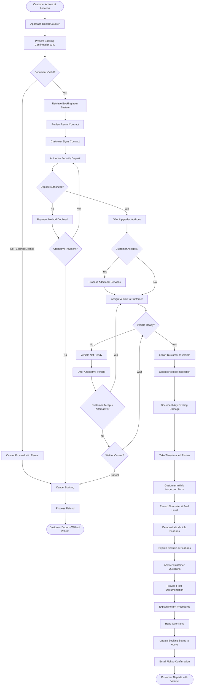

# Vehicle Pickup Workflow

## Overview

The vehicle pickup workflow represents the critical transition from reservation to active rental. This workflow encompasses customer check-in, identity verification, contract signing, vehicle inspection, and departure. The pickup experience significantly impacts customer satisfaction and sets expectations for the entire rental period.

## Stakeholder

**Primary**: Individual Customers, Corporate Clients

**Secondary**: Fleet Managers, Support Agents, Insurance Providers

## Goal

Complete the vehicle pickup process efficiently and professionally, ensuring the customer receives the correct vehicle in expected condition, understands rental terms, has all necessary documentation, and departs confidently with keys and instructions.

## Preconditions

### System State
- Booking is confirmed and paid (or payment authorized)
- Vehicle is available and prepared for pickup
- Vehicle has passed pre-rental inspection
- Vehicle is clean and fueled per policy
- Rental contract is generated and ready
- Location is operational during pickup time

### User State
- Customer has valid booking confirmation
- Customer has valid driver's license
- Customer has credit card for security deposit
- Customer arrives at pickup location during operating hours
- Customer has required identification documents
- Customer meets age requirements

### Vehicle State
- Vehicle is clean (interior and exterior)
- Vehicle is fueled per policy (typically full tank)
- Vehicle has passed safety inspection
- Vehicle has no damage or damage is documented
- Vehicle has all required equipment (spare tire, jack, manual)
- Vehicle registration and insurance documents are current

## Workflow Steps

### 1. Customer Arrival

**User Action**: Arrive at pickup location

**Customer Preparation**:
- Bring booking confirmation (email, SMS, or app)
- Bring valid driver's license
- Bring credit card used for booking (or alternative for deposit)
- Bring additional driver licenses (if applicable)
- Arrive during operating hours
- Allow time for pickup process (typically 15-30 minutes)

**System Response** (if digital check-in available):
- Send arrival notification
- Display check-in instructions
- Show counter location or kiosk directions
- Provide queue status or wait time estimate
- Offer mobile check-in option

**Location Signage**:
- Clear directional signs to rental counter
- Parking instructions for arriving customers
- Operating hours displayed
- Contact information for assistance

### 2. Check-In at Counter

**User Action**: Approach rental counter with documents

**Staff Action**: Greet customer and request information

**Required Documents**:
- Booking confirmation (reference number)
- Valid driver's license (government-issued)
- Credit card for security deposit
- Additional driver licenses (if applicable)
- Corporate account information (for business rentals)

**System Processing**:
- Retrieve booking by reference number or customer name
- Verify booking status (confirmed, paid)
- Validate customer identity matches booking
- Check driver's license validity and expiration
- Verify customer age meets requirements
- Confirm payment method for deposit
- Display booking details on counter terminal

**Staff Verification**:
- Inspect driver's license for authenticity
- Verify license is not expired
- Confirm customer name matches booking
- Check for any booking notes or special requests
- Verify additional drivers if applicable

### 3. Contract Review and Signing

**Staff Action**: Review rental agreement with customer

**Contract Contents**:
- **Rental Period**: Pickup and return dates/times
- **Vehicle Details**: Make, model, license plate
- **Pricing**: Daily rate, total cost, taxes, fees
- **Insurance Coverage**: Selected coverage options
- **Additional Services**: GPS, child seats, etc.
- **Fuel Policy**: Full-to-full, prepaid, etc.
- **Mileage Limits**: Unlimited or daily limit with overage fees
- **Geographic Restrictions**: Allowed driving areas
- **Additional Drivers**: Names and fees
- **Deposit Amount**: Security deposit held
- **Late Return Fees**: Charges for late return
- **Damage Policy**: Customer liability and reporting requirements
- **Roadside Assistance**: Contact information and coverage
- **Terms and Conditions**: Full rental agreement

**Staff Explanation**:
- Review key terms verbally
- Explain fuel policy clearly
- Clarify mileage limits and overage charges
- Explain damage reporting process
- Provide roadside assistance contact
- Answer customer questions
- Highlight return procedures

**Customer Action**: Review and sign contract

**Signature Methods**:
- Electronic signature on tablet
- Physical signature on paper contract
- Digital acceptance via mobile app

**System Processing**:
- Store signed contract in database
- Associate contract with booking
- Generate contract copy for customer
- Email contract to customer
- Update booking status to "Active"

### 4. Security Deposit Authorization

**Staff Action**: Process security deposit hold

**Deposit Amount**:
- Typically $200-$500 for standard vehicles
- Higher for luxury or specialty vehicles
- May vary based on insurance coverage selected
- Covers potential damage, fuel, tolls, or late fees

**System Processing**:
- Authorize deposit amount on customer's credit card
- Place hold (not charge) on card
- Store authorization code
- Display hold confirmation
- Explain hold will release after return (typically 7-14 days)

**Customer Communication**:
- Explain deposit is authorization hold, not charge
- Clarify when hold will be released
- Explain what deposit covers
- Provide receipt showing deposit authorization
- Confirm final charges will be processed at return

**Alternative Payment Methods**:
- Debit cards may require higher deposit
- Cash deposits may be accepted with restrictions
- Corporate accounts may waive deposit

### 5. Upsell Opportunities (Optional)

**Staff Action**: Offer upgrades or additional services

**Upsell Options**:
- **Vehicle Upgrade**: Larger or premium vehicle for additional fee
- **Insurance Upgrade**: Enhanced coverage options
- **Fuel Service**: Prepaid fuel to avoid refueling
- **Toll Pass**: Electronic toll collection device
- **GPS Navigation**: If not already included
- **Child Safety Seats**: If not already reserved
- **Additional Driver**: Add driver not on original booking
- **Extended Protection**: Roadside assistance, tire protection

**Best Practices**:
- Offer relevant upgrades based on customer needs
- Explain value proposition clearly
- Respect customer's decision if declined
- No aggressive or pressure tactics
- Document any accepted upgrades in system

**System Processing**:
- Calculate additional costs
- Update booking with new services
- Process additional payment or authorization
- Update contract with changes
- Generate updated receipt

### 6. Vehicle Assignment and Preparation

**Staff Action**: Assign specific vehicle to customer

**System Processing**:
- Select available vehicle matching booking category
- Verify vehicle is ready for pickup
- Check vehicle status (clean, fueled, inspected)
- Assign vehicle to booking
- Generate vehicle keys or access code
- Print vehicle location map (if large lot)
- Update vehicle status to "Rented"

**Vehicle Preparation Check**:
- Vehicle is clean inside and out
- Fuel level matches policy
- All equipment present (spare tire, jack, manual)
- No warning lights on dashboard
- Registration and insurance documents in vehicle
- Any requested equipment installed (child seat, GPS)

**Staff Communication**:
- Provide vehicle location (parking spot number)
- Describe vehicle appearance (color, model)
- Provide keys or access instructions
- Explain how to locate vehicle
- Offer to escort customer to vehicle

### 7. Vehicle Inspection Walk-Around

**Staff Action**: Conduct inspection with customer

**Inspection Process**:
1. Walk around vehicle with customer
2. Document existing damage on inspection form
3. Take photos of any damage
4. Check all sides, roof, and undercarriage
5. Inspect tires for condition and pressure
6. Check windshield for cracks or chips
7. Test all lights (headlights, brake lights, turn signals)
8. Verify license plate matches contract

**Damage Documentation**:
- Mark damage on vehicle diagram
- Take timestamped photos
- Note damage severity (scratch, dent, crack)
- Customer initials damage documentation
- Store photos with booking record
- Provide copy to customer

**Interior Inspection**:
- Check seats, dashboard, and upholstery
- Verify cleanliness
- Test air conditioning and heating
- Check fuel gauge reading
- Verify odometer reading
- Test radio and controls

**Customer Participation**:
- Customer observes entire inspection
- Customer can point out additional damage
- Customer signs or initials inspection form
- Customer receives copy of inspection documentation
- Customer takes own photos (recommended)

**System Processing**:
- Store inspection form digitally
- Upload damage photos
- Record odometer reading
- Record fuel level
- Associate inspection with booking
- Timestamp all documentation

### 8. Vehicle Orientation

**Staff Action**: Demonstrate vehicle features and controls

**Key Demonstrations**:
- **Starting Vehicle**: Key, push-button, or keyless start
- **Fuel Door**: Location and how to open
- **Trunk/Cargo**: How to open and close
- **Lights**: Headlights, high beams, fog lights, turn signals
- **Wipers**: Controls and washer fluid
- **Climate Control**: Heating, air conditioning, defrost
- **Mirrors**: Adjustment and folding
- **Seats**: Adjustment and folding
- **Bluetooth/Audio**: Pairing phone and using system
- **GPS**: If included, how to use
- **Safety Features**: Airbags, ABS, traction control, backup camera

**Important Information**:
- Fuel type (regular, premium, diesel, electric charging)
- Tire pressure monitoring system
- Warning light meanings
- Emergency equipment location (spare tire, jack, first aid)
- Owner's manual location
- Roadside assistance contact information

**Customer Questions**:
- Allow time for customer questions
- Demonstrate any unclear features
- Provide written instructions if needed
- Ensure customer comfortable with vehicle

### 9. Final Documentation and Departure

**Staff Action**: Provide final documents and instructions

**Documents Provided**:
- Signed rental contract (copy)
- Vehicle inspection form (copy)
- Receipt showing charges and deposit
- Roadside assistance card with contact number
- Return instructions and location
- Fuel policy reminder
- Emergency contact information
- Vehicle registration and insurance (in vehicle)

**Return Instructions**:
- Return location address and hours
- After-hours return procedures
- Fuel requirements before return
- Where to park vehicle
- What to do with keys
- Grace period for return time
- Late return fees

**System Processing**:
- Email all documents to customer
- Update booking status to "Active - Vehicle Out"
- Set return reminder notifications
- Log pickup completion time
- Update vehicle status in fleet management
- Record staff member who completed pickup

**Customer Departure**:
- Customer receives keys
- Customer has all documents
- Customer knows return procedures
- Customer has emergency contacts
- Customer departs with vehicle

## Outcome

### Successful Outcome
- Customer receives correct vehicle in expected condition
- All documentation completed and signed
- Security deposit authorized
- Vehicle inspection documented with photos
- Customer understands rental terms and return procedures
- Customer departs confidently with vehicle
- Booking status updated to active rental

### Alternative Outcomes
- **Vehicle Not Ready**: Customer waits or receives alternative vehicle
- **Upgrade Accepted**: Customer receives better vehicle at additional cost
- **Documentation Issues**: Delays while resolving license or payment issues
- **Customer Declines**: Customer cancels at pickup (rare)

## Exceptions and Error Handling

### Exception 1: Vehicle Not Ready

**Trigger**: Assigned vehicle not clean, fueled, or available

**Staff Response**:
- Apologize for delay
- Explain situation honestly
- Provide wait time estimate
- Offer alternative vehicle if available
- Offer upgrade at no charge if appropriate
- Provide compensation (discount, free day, etc.)

**System Actions**:
- Flag vehicle as not ready
- Assign alternative vehicle
- Update booking with new vehicle
- Log incident for quality review
- Apply compensation to booking

**Customer Options**:
- Wait for original vehicle
- Accept alternative vehicle
- Accept upgrade
- Cancel booking with full refund

### Exception 2: Invalid or Expired License

**Trigger**: Customer's driver's license is expired or invalid

**Staff Response**:
- Explain license requirement
- Cannot proceed with rental
- Offer to reschedule when license renewed
- Process cancellation and refund per policy

**System Actions**:
- Cancel booking
- Process refund based on cancellation policy
- Log reason for cancellation
- Update vehicle availability
- Send cancellation confirmation

**Customer Options**:
- Return with valid license
- Add different driver with valid license
- Cancel and receive refund

### Exception 3: Payment Method Declined

**Trigger**: Credit card declined for security deposit

**Staff Response**:
- Explain deposit requirement
- Request alternative payment method
- Explain deposit is hold, not charge
- Cannot proceed without valid payment method

**System Actions**:
- Attempt alternative payment method
- If no valid payment: cancel booking
- Process refund of rental payment
- Update vehicle availability
- Log payment issue

**Customer Options**:
- Provide different credit card
- Contact bank to resolve issue
- Cancel booking

### Exception 4: Significant Pre-Existing Damage

**Trigger**: Vehicle has damage not previously documented

**Staff Response**:
- Thoroughly document all damage
- Take extensive photos
- Explain damage will not be customer's responsibility
- Offer alternative vehicle if customer uncomfortable
- Apologize for vehicle condition

**System Actions**:
- Document damage in detail
- Flag vehicle for repair assessment
- Assign alternative vehicle if requested
- Log incident for quality review
- Update vehicle damage records

**Customer Options**:
- Accept vehicle with documented damage
- Request alternative vehicle
- Upgrade to different vehicle

### Exception 5: Customer Arrives Outside Operating Hours

**Trigger**: Customer arrives when location is closed

**Staff Response** (if after-hours pickup available):
- Provide self-service pickup instructions
- Vehicle keys in lockbox with code
- Contract pre-signed electronically
- Inspection photos taken by customer via app
- Deposit pre-authorized online

**System Actions**:
- Send after-hours pickup instructions
- Provide lockbox code
- Enable mobile inspection app
- Process pickup automatically when customer retrieves keys
- Send confirmation and documents via email

**Customer Options** (if no after-hours service):
- Return during operating hours
- Contact emergency support line
- Reschedule pickup

### Exception 6: Booking Not Found

**Trigger**: Cannot locate booking in system

**Staff Response**:
- Request alternative information (email, phone, name)
- Search by multiple criteria
- Check for booking under different name
- Contact support to locate booking
- Verify booking confirmation details

**System Actions**:
- Search across all booking fields
- Check for recent cancellations
- Verify booking date and location
- Contact technical support if needed

**Resolution**:
- Locate booking and proceed
- Create new booking if original lost
- Cancel and refund if cannot resolve

## Workflow Diagram

## Performance Metrics

### Efficiency Metrics
- **Average Pickup Time**: Time from check-in to departure (target <15 minutes)
- **Wait Time**: Time customer waits before being served (target <5 minutes)
- **Queue Length**: Number of customers waiting (target <3)
- **Staff Utilization**: Percentage of time staff actively serving customers (track for staffing)

### Quality Metrics
- **Pickup Satisfaction**: Customer rating of pickup experience (target >4.5/5)
- **Vehicle Condition Score**: Customer rating of vehicle cleanliness (target >4.7/5)
- **Documentation Accuracy**: Percentage of pickups with complete documentation (target >98%)
- **Damage Dispute Rate**: Percentage of returns with disputed damage (target <2%)

### Operational Metrics
- **Vehicle Ready Rate**: Percentage of vehicles ready at scheduled pickup time (target >95%)
- **Upsell Acceptance**: Percentage of customers accepting upgrades (target >20%)
- **Payment Decline Rate**: Percentage of deposits declined (target <5%)
- **Cancellation at Pickup**: Percentage canceling at counter (target <1%)

## Related Workflows

- **Booking Creation Workflow**: Precedes pickup
- **Vehicle Return Workflow**: Follows pickup
- **Vehicle Inspection Workflow**: Part of pickup process
- **Payment Processing Workflow**: Deposit authorization
- **Roadside Assistance Workflow**: May be needed during rental

## Related Requirements

- **Requirement 4.1**: User scenario documentation
- **Requirement 4.2**: Workflow with Mermaid flowchart
- **Requirement 4.3**: Core rental operations
- **Requirement 4.6**: Exception handling
- **Requirement 4.7**: Pandoc-compatible format

## Related Stakeholders

- **Individual Customers**: Primary pickup participants
- **Corporate Clients**: Business rental pickups
- **Fleet Managers**: Ensure vehicles ready for pickup
- **Support Agents**: Handle pickup issues
- **Insurance Providers**: Coverage verification

## Related Features

- **Digital Check-In**: Pre-arrival processing
- **Vehicle Inspection Documentation**: Damage recording
- **Security Deposit Authorization**: Payment hold
- **Contract Management**: Digital signing
- **Mobile App**: Pickup notifications and instructions
- **After-Hours Pickup**: Self-service options
