# Vehicle Return Workflow

## Overview

The vehicle return workflow concludes the rental experience and determines the customer's final impression of the service. This workflow encompasses vehicle return, inspection for damage, fuel verification, final billing, security deposit release, and checkout. Efficient, fair return processing builds trust and encourages repeat business.

## Stakeholder

**Primary**: Individual Customers, Corporate Clients

**Secondary**: Fleet Managers, Support Agents, Finance Teams, Insurance Providers

## Goal

Complete the vehicle return process efficiently and fairly, ensuring the vehicle is inspected for damage, fuel level verified, final charges calculated accurately, security deposit released appropriately, and customer departs with clear understanding of all charges and next steps.

## Preconditions

### System State
- Active rental booking exists
- Original pickup inspection is documented
- Security deposit is authorized
- Billing system is operational
- Return location is operational
- Staff available to process return

### User State
- Customer returns to designated return location
- Customer returns during operating hours (or uses after-hours drop-off)
- Customer has vehicle keys
- Customer has rental contract and documentation
- Vehicle is returned by scheduled return time (or customer aware of late fees)

### Vehicle State
- Vehicle is drivable and safe
- Vehicle has no new damage (or damage is minor/documented)
- Fuel level meets policy requirements (or customer accepts fuel charges)
- Vehicle is reasonably clean (excessive dirt may incur cleaning fee)
- All equipment and accessories are present

## Workflow Steps

### 1. Customer Arrival at Return Location

**User Action**: Drive to return location

**Customer Preparation**:
- Navigate to return location address
- Arrive during operating hours (or use after-hours drop-off)
- Bring all vehicle keys and documents
- Ensure fuel level meets policy
- Remove all personal belongings
- Note any damage that occurred during rental

**Location Signage**:
- Clear directional signs to return area
- Designated return parking spots
- After-hours drop-off instructions (if available)
- Contact information for assistance

**System Response** (if mobile app available):
- Send return location directions
- Display return instructions
- Show operating hours
- Provide after-hours drop-off procedures
- Estimate wait time

### 2. Initial Check-In

**User Action**: Park vehicle in designated return area

**Staff Action**: Greet customer and initiate return process

**Initial Information Collection**:
- Customer name
- Booking reference number
- Return time
- Odometer reading
- Fuel level observation
- General vehicle condition observation

**System Processing**:
- Retrieve booking by reference number or license plate
- Display rental details and pickup inspection
- Calculate rental duration
- Check for late return
- Display expected charges
- Prepare return inspection form

**Staff Verification**:
- Confirm customer identity
- Verify vehicle matches booking
- Check license plate
- Note return time
- Begin return inspection process

### 3. Exterior Vehicle Inspection

**Staff Action**: Conduct thorough exterior inspection

**Inspection Process**:
1. Walk around entire vehicle with customer
2. Compare current condition to pickup inspection
3. Check all sides, roof, and undercarriage
4. Inspect for new damage (scratches, dents, cracks)
5. Check tires for damage or excessive wear
6. Inspect windshield and windows for new damage
7. Verify all lights functional
8. Check for missing parts or accessories

**Damage Assessment**:
- **No New Damage**: Proceed to interior inspection
- **Minor Damage**: Document and photograph
- **Significant Damage**: Document extensively, may require incident report
- **Pre-Existing Damage**: Verify against pickup inspection

**Documentation**:
- Mark any new damage on vehicle diagram
- Take timestamped photos of damage
- Note damage type, size, and location
- Estimate repair cost (if possible)
- Customer acknowledges damage documentation
- Compare to pickup inspection photos

**Customer Participation**:
- Customer observes entire inspection
- Customer can dispute damage claims
- Customer can reference pickup inspection
- Customer signs or initials inspection form
- Customer receives copy of inspection

### 4. Interior Vehicle Inspection

**Staff Action**: Inspect vehicle interior

**Interior Checks**:
- Seats, dashboard, and upholstery condition
- Cleanliness level
- Check for stains, tears, or burns
- Verify all equipment present (spare tire, jack, manual)
- Check for personal belongings left behind
- Verify GPS, child seats, or other rentals returned
- Check for excessive dirt or odors
- Verify fuel level on gauge

**Cleanliness Assessment**:
- **Acceptable**: Normal wear and tear
- **Requires Cleaning**: Excessive dirt, stains, or odors (may incur fee)
- **Requires Detailing**: Severe soiling (higher cleaning fee)

**Missing Equipment**:
- Check for all original equipment
- Verify rented equipment returned (GPS, child seats)
- Note any missing items
- Calculate replacement or cleaning fees

### 5. Fuel Level Verification

**Staff Action**: Verify fuel level meets policy

**Fuel Policy Types**:

**Full-to-Full** (most common):
- Customer must return with full tank
- Staff verifies fuel gauge shows full
- If not full: Calculate fuel charge based on missing amount
- Fuel charge typically higher than local gas station prices

**Prepaid Fuel**:
- Customer paid for full tank at pickup
- Can return with any fuel level
- No refund for unused fuel
- No additional fuel charges

**Like-for-Like**:
- Return with same fuel level as pickup
- Compare to pickup inspection fuel level
- Charge or credit based on difference

**Fuel Verification**:
- Check fuel gauge reading
- Compare to pickup fuel level
- Calculate fuel needed to refill (if applicable)
- Apply fuel charges per policy
- Explain charges to customer

**Fuel Charge Calculation**:
- Determine gallons/liters missing
- Apply per-gallon/liter rate (typically $8-12/gallon)
- Add fuel service fee if applicable
- Display total fuel charge

### 6. Odometer Reading and Mileage Verification

**Staff Action**: Record final odometer reading

**Mileage Calculation**:
- Record current odometer reading
- Subtract pickup odometer reading
- Calculate total miles/kilometers driven
- Compare to mileage allowance

**Mileage Policy Enforcement**:

**Unlimited Mileage**:
- No additional charges regardless of distance
- Most common for daily rentals

**Limited Mileage**:
- Specified daily or total mileage allowance
- Overage charges for exceeding limit
- Typical overage: $0.25-0.50 per mile

**Overage Calculation**:
- Total miles driven minus allowance
- Multiply overage by per-mile rate
- Add to final charges
- Explain charges to customer

**System Processing**:
- Record final odometer reading
- Calculate total mileage
- Calculate overage charges if applicable
- Update vehicle mileage in fleet system

### 7. Damage Assessment and Charges

**Staff Action**: Assess any damage and determine charges

**Damage Categories**:

**No Charge Damage**:
- Normal wear and tear
- Pre-existing damage from pickup inspection
- Minor scratches under threshold (e.g., &lt;2 inches)

**Minor Damage** (covered by deposit):
- Small scratches or scuffs
- Minor dents
- Small windshield chips
- Typical cost: $50-200

**Major Damage** (may exceed deposit):
- Large dents or scratches
- Windshield cracks
- Body panel damage
- Mechanical damage
- Typical cost: $200-5,000+

**Total Loss**:
- Vehicle not repairable or unsafe
- Insurance claim required
- Customer liable up to policy limits

**Damage Charge Process**:
1. Assess damage severity
2. Estimate repair cost (or use standard pricing)
3. Check insurance coverage
4. Calculate customer liability
5. Explain charges to customer
6. Process charge against deposit or additional payment
7. Provide damage report and photos

**Insurance Coverage Application**:
- Check customer's selected insurance
- Apply deductible if applicable
- Calculate customer's out-of-pocket cost
- Explain coverage and charges
- Process insurance claim if needed

### 8. Calculate Final Charges

**System Processing**: Calculate all charges

**Charge Components**:
- **Base Rental**: Already paid or authorized
- **Additional Days**: If returned late
- **Fuel Charges**: If not returned full
- **Mileage Overage**: If exceeded allowance
- **Damage Charges**: For new damage
- **Cleaning Fees**: If excessively dirty
- **Toll Charges**: If toll pass used
- **Traffic Violations**: If tickets received
- **Late Return Fees**: If returned after grace period
- **Missing Equipment**: If items not returned
- **Taxes**: On additional charges

**Charge Calculation**:
- Sum all additional charges
- Apply taxes where applicable
- Compare to security deposit amount
- Determine if additional payment needed or refund due

**Display to Customer**:
- Itemized list of all charges
- Explanation of each charge
- Total additional amount due or refund amount
- Comparison to original booking cost

### 9. Payment Processing

**Staff Action**: Process final payment

**Payment Scenarios**:

**Scenario 1: No Additional Charges**
- Release full security deposit
- No additional payment needed
- Provide final receipt
- Deposit hold released in 7-14 days

**Scenario 2: Additional Charges Less Than Deposit**
- Capture additional charges from deposit authorization
- Release remaining deposit amount
- Provide itemized receipt
- Remaining deposit released in 7-14 days

**Scenario 3: Additional Charges Equal to Deposit**
- Capture full deposit amount
- No additional payment needed
- Provide itemized receipt
- No deposit refund

**Scenario 4: Additional Charges Exceed Deposit**
- Capture full deposit amount
- Request additional payment for overage
- Process additional payment
- Provide itemized receipt

**System Processing**:
- Calculate final charges
- Capture appropriate amount from deposit authorization
- Process additional payment if needed
- Generate final receipt
- Update booking status to "Completed"
- Schedule deposit release
- Send final receipt via email

**Customer Payment**:
- Review final charges
- Provide additional payment if needed (same or different card)
- Receive final receipt
- Understand deposit release timeline

### 10. Dispute Handling (If Applicable)

**Customer Action**: Dispute charges or damage assessment

**Staff Response**:
- Listen to customer concerns
- Review inspection documentation
- Show pickup and return photos
- Explain damage assessment process
- Review insurance coverage
- Offer to escalate to manager if needed

**Dispute Resolution Options**:
- **Agree with Customer**: Remove or reduce charges
- **Partial Agreement**: Adjust charges to fair amount
- **Disagree**: Maintain charges, explain appeal process
- **Escalate**: Manager reviews and makes final decision

**System Processing**:
- Flag booking for dispute review
- Attach customer comments
- Hold final charges pending resolution
- Create customer service ticket
- Document resolution

**Appeal Process**:
- Customer can submit formal dispute
- Provide additional evidence (photos, receipts)
- Review by management or claims team
- Final decision communicated within specified timeframe
- Charges adjusted or maintained based on review

### 11. Final Documentation and Checkout

**Staff Action**: Provide final documents and complete checkout

**Documents Provided**:
- Final receipt with itemized charges
- Return inspection form (copy)
- Damage report (if applicable)
- Insurance claim form (if applicable)
- Deposit release confirmation
- Customer satisfaction survey (optional)

**System Processing**:
- Update booking status to "Completed"
- Update vehicle status to "Returned - Pending Inspection"
- Release vehicle for cleaning and maintenance
- Send final receipt via email
- Schedule deposit release
- Update customer rental history
- Process loyalty points (if applicable)
- Trigger post-rental survey

**Customer Departure**:
- Customer returns keys
- Customer receives all documentation
- Customer understands all charges
- Customer knows deposit release timeline
- Customer has contact information for questions
- Customer departs from location

### 12. Post-Return Processing

**System Actions**:
- Release security deposit hold (7-14 days)
- Send deposit release confirmation email
- Update vehicle maintenance schedule if needed
- Flag vehicle for repairs if damaged
- Process insurance claims if applicable
- Update fleet availability
- Archive rental documentation

**Vehicle Processing**:
- Send vehicle for cleaning
- Schedule maintenance if needed
- Schedule repairs for damage
- Update vehicle status when ready
- Return to available inventory

**Customer Follow-Up**:
- Send thank you email
- Request review or feedback
- Offer discount for next rental
- Process loyalty rewards
- Handle any follow-up questions

## Outcome

### Successful Outcome
- Vehicle returned and inspected
- All charges calculated fairly and accurately
- Customer understands and accepts final charges
- Security deposit released appropriately
- Customer departs satisfied with return process
- Vehicle ready for cleaning and next rental
- Booking completed in system

### Alternative Outcomes
- **Damage Dispute**: Customer contests damage charges, requires resolution
- **Late Return**: Additional charges applied, customer may be dissatisfied
- **Missing Equipment**: Replacement charges applied
- **Excessive Damage**: Insurance claim required, extended resolution time

## Exceptions and Error Handling

### Exception 1: Late Return

**Trigger**: Vehicle returned after scheduled return time

**Grace Period**:
- Typically 29-59 minutes grace period
- No charges within grace period
- Charges apply after grace period

**Late Fee Calculation**:
- **Hourly Rate**: Charge per hour late (up to daily rate)
- **Daily Rate**: If more than few hours late, charge full day
- **Impact on Next Reservation**: May affect availability for next customer

**Staff Response**:
- Calculate late charges
- Explain late fee policy
- Apply charges to final bill
- Check if late return affected other bookings
- Document reason for late return (if provided)

**System Processing**:
- Calculate late charges automatically
- Add to final bill
- Update vehicle availability
- Notify next customer if pickup delayed
- Log late return for customer history

### Exception 2: Significant Damage

**Trigger**: Vehicle has major damage requiring extensive repairs

**Staff Response**:
- Document damage extensively
- Take multiple photos from all angles
- Complete incident report
- Obtain customer statement
- Explain insurance coverage and liability
- Provide claim forms
- Estimate repair timeline

**System Processing**:
- Flag vehicle as damaged
- Remove from available inventory
- Create insurance claim
- Calculate customer liability
- Hold security deposit
- Create repair work order
- Notify fleet manager

**Customer Communication**:
- Explain damage assessment
- Review insurance coverage
- Clarify customer liability
- Provide claim process information
- Set expectations for charge timeline
- Provide contact for questions

**Resolution Timeline**:
- Obtain repair estimates (1-3 days)
- Process insurance claim (7-14 days)
- Calculate final customer charges (14-30 days)
- Charge customer or release deposit

### Exception 3: Customer Disputes Damage

**Trigger**: Customer claims damage was pre-existing

**Staff Response**:
- Review pickup inspection documentation
- Compare pickup and return photos
- Listen to customer explanation
- Remain professional and objective
- Escalate to manager if needed

**Evidence Review**:
- Pickup inspection form and photos
- Return inspection form and photos
- Timestamp verification
- Damage location and type
- Customer's rental history

**Resolution Options**:
- **Clear Pre-Existing**: Remove charges, apologize
- **Clear New Damage**: Maintain charges, explain evidence
- **Unclear**: Split difference or waive charges for goodwill
- **Escalate**: Manager or claims team reviews

**System Processing**:
- Flag for dispute review
- Hold charges pending resolution
- Document all evidence
- Create customer service ticket
- Track resolution timeline

### Exception 4: Fuel Tank Not Full

**Trigger**: Vehicle returned without full tank (full-to-full policy)

**Staff Response**:
- Check fuel gauge reading
- Estimate fuel needed
- Calculate fuel charges
- Explain fuel policy
- Apply charges to final bill

**Fuel Charge Calculation**:
- Estimate gallons/liters missing
- Apply per-gallon rate (typically $8-12/gallon)
- Add fuel service fee ($5-15)
- Display total fuel charge

**Customer Response**:
- **Accept Charges**: Proceed with checkout
- **Dispute Amount**: Show fuel gauge, explain calculation
- **Offer to Refuel**: If gas station nearby and time permits

**System Processing**:
- Add fuel charges to final bill
- Document fuel level
- Process payment
- Update vehicle status (needs fueling)

### Exception 5: After-Hours Return

**Trigger**: Customer returns vehicle outside operating hours

**After-Hours Process**:
- Customer parks in designated after-hours spot
- Customer places keys in secure drop box
- Customer takes photos of vehicle condition (via app)
- Customer notes fuel level and odometer
- System records return time automatically

**Next-Day Processing**:
- Staff retrieves vehicle in morning
- Conducts full inspection
- Compares to customer photos
- Processes final charges
- Sends final receipt to customer

**Dispute Prevention**:
- Customer photos serve as evidence
- Timestamp verification
- Clear after-hours policy
- Customer acknowledgment of inspection delay

**System Processing**:
- Record return time when keys deposited
- Flag for morning inspection
- Send after-hours return confirmation
- Process final charges after inspection
- Email final receipt

### Exception 6: Missing Equipment

**Trigger**: Equipment missing from vehicle

**Missing Items**:
- Spare tire or jack
- Owner's manual
- Registration or insurance documents
- Rented equipment (GPS, child seat)
- Keys or key fobs
- Toll pass or parking pass

**Staff Response**:
- Verify item was present at pickup
- Check if item was rented or included
- Calculate replacement cost
- Explain charges to customer
- Check if item in customer's possession

**Replacement Charges**:
- Standard equipment: Actual replacement cost
- Rented equipment: Replacement cost plus rental fee
- Keys: Replacement and reprogramming cost ($100-500)
- Documents: Replacement fee ($25-100)

**System Processing**:
- Add replacement charges to final bill
- Flag vehicle for equipment replacement
- Order replacement items
- Update vehicle status

## Workflow Diagram

```mermaid
flowchart TD
    Start([Customer Arrives at Return Location]) --> ParkVehicle[Park in Designated Return Area]
    ParkVehicle --> StaffGreeting[Staff Greets Customer]
    StaffGreeting --> RetrieveBooking[Retrieve Booking Information]
    RetrieveBooking --> CheckReturnTime{On Time?}
    
    CheckReturnTime -->|Late| CalculateLateFee[Calculate Late Return Fees]
    CalculateLateFee --> ExteriorInspection
    CheckReturnTime -->|On Time or Grace Period| ExteriorInspection[Conduct Exterior Inspection]
    
    ExteriorInspection --> CompareDamage[Compare to Pickup Inspection]
    CompareDamage --> NewDamage{New Damage Found?}
    
    NewDamage -->|Yes| DocumentDamage[Document and Photograph Damage]
    DocumentDamage --> AssessDamage[Assess Damage Severity]
    AssessDamage --> CalculateDamageCharge[Calculate Damage Charges]
    CalculateDamageCharge --> InteriorInspection
    
    NewDamage -->|No| InteriorInspection[Conduct Interior Inspection]
    InteriorInspection --> CheckCleanliness{Acceptable Cleanliness?}
    
    CheckCleanliness -->|No| CalculateCleaningFee[Calculate Cleaning Fee]
    CalculateCleaningFee --> CheckEquipment
    CheckCleanliness -->|Yes| CheckEquipment[Verify All Equipment Present]
    
    CheckEquipment --> MissingItems{Items Missing?}
    MissingItems -->|Yes| CalculateReplacementFee[Calculate Replacement Fees]
    CalculateReplacementFee --> VerifyFuel
    MissingItems -->|No| VerifyFuel[Verify Fuel Level]
    
    VerifyFuel --> FuelCheck{Fuel Policy Met?}
    FuelCheck -->|No - Not Full| CalculateFuelCharge[Calculate Fuel Charges]
    CalculateFuelCharge --> RecordOdometer
    FuelCheck -->|Yes| RecordOdometer[Record Final Odometer Reading]
    
    RecordOdometer --> CheckMileage{Mileage Limit Exceeded?}
    CheckMileage -->|Yes| CalculateMileageCharge[Calculate Overage Charges]
    CalculateMileageCharge --> SumCharges
    CheckMileage -->|No| SumCharges[Calculate Total Final Charges]
    
    SumCharges --> DisplayCharges[Display Itemized Charges to Customer]
    DisplayCharges --> CustomerReview{Customer Accepts Charges?}
    
    CustomerReview -->|Disputes| HandleDispute[Handle Dispute]
    HandleDispute --> ReviewEvidence[Review Inspection Evidence]
    ReviewEvidence --> DisputeResolution{Resolution?}
    DisputeResolution -->|Adjust Charges| SumCharges
    DisputeResolution -->|Maintain Charges| ProcessPayment
    DisputeResolution -->|Escalate| ManagerReview[Manager Review]
    ManagerReview --> DisputeResolution
    
    CustomerReview -->|Accepts| ProcessPayment[Process Final Payment]
    ProcessPayment --> CompareToDeposit{Charges vs Deposit?}
    
    CompareToDeposit -->|Less Than Deposit| CapturePartial[Capture Partial Deposit]
    CapturePartial --> ReleaseRemaining[Schedule Release of Remaining Deposit]
    ReleaseRemaining --> GenerateReceipt
    
    CompareToDeposit -->|Equal to Deposit| CaptureFull[Capture Full Deposit]
    CaptureFull --> GenerateReceipt
    
    CompareToDeposit -->|Exceeds Deposit| CaptureFullAndMore[Capture Full Deposit]
    CaptureFullAndMore --> RequestAdditional[Request Additional Payment]
    RequestAdditional --> ProcessAdditional[Process Additional Payment]
    ProcessAdditional --> GenerateReceipt[Generate Final Receipt]
    
    GenerateReceipt --> ProvideDocs[Provide Final Documentation]
    ProvideDocs --> CollectKeys[Collect Vehicle Keys]
    CollectKeys --> UpdateSystem[Update Booking Status to Completed]
    UpdateSystem --> SendReceipt[Email Final Receipt]
    SendReceipt --> CustomerDeparts([Customer Departs])
    
    CustomerDeparts --> VehicleProcessing[Send Vehicle for Cleaning]
    VehicleProcessing --> ScheduleMaintenance{Maintenance Needed?}
    ScheduleMaintenance -->|Yes| CreateWorkOrder[Create Maintenance Work Order]
    ScheduleMaintenance -->|No| ReturnToFleet[Return to Available Inventory]
    CreateWorkOrder --> RepairComplete{Repairs Complete?}
    RepairComplete -->|Yes| ReturnToFleet
    RepairComplete -->|No| WaitRepair[Wait for Repairs]
    WaitRepair --> RepairComplete
    
    ReturnToFleet --> ReleaseDeposit[Release Security Deposit]
    ReleaseDeposit --> SendConfirmation[Send Deposit Release Confirmation]
    SendConfirmation --> End([Rental Complete])
```

## Performance Metrics

### Efficiency Metrics
- **Average Return Time**: Time from arrival to departure (target &lt;10 minutes)
- **Inspection Time**: Time to complete vehicle inspection (target &lt;5 minutes)
- **Queue Wait Time**: Time customer waits before being served (target &lt;3 minutes)
- **After-Hours Return Rate**: Percentage using after-hours drop-off (track for staffing)

### Quality Metrics
- **Return Satisfaction**: Customer rating of return experience (target >4.5/5)
- **Damage Dispute Rate**: Percentage of returns with disputed damage (target &lt;2%)
- **Billing Accuracy**: Percentage of returns with correct final charges (target >98%)
- **Deposit Release Time**: Days to release deposit (target &lt;7 days)

### Financial Metrics
- **Additional Charges Rate**: Percentage of returns with additional charges (track trend)
- **Average Additional Charges**: Amount of additional charges per return (track trend)
- **Fuel Charge Rate**: Percentage charged for fuel (target &lt;20%)
- **Damage Charge Rate**: Percentage charged for damage (target &lt;5%)

### Operational Metrics
- **Late Return Rate**: Percentage of returns past scheduled time (target &lt;10%)
- **Cleaning Fee Rate**: Percentage charged cleaning fees (target &lt;5%)
- **Missing Equipment Rate**: Percentage with missing items (target &lt;1%)
- **Vehicle Turnaround Time**: Time from return to available for next rental (track for optimization)

## Related Workflows

- **Vehicle Pickup Workflow**: Precedes return
- **Booking Creation Workflow**: Original reservation
- **Payment Processing Workflow**: Final charge processing
- **Damage Claims Workflow**: For significant damage
- **Dispute Resolution Workflow**: For contested charges

## Related Requirements

- **Requirement 4.1**: User scenario documentation
- **Requirement 4.2**: Workflow with Mermaid flowchart
- **Requirement 4.3**: Core rental operations
- **Requirement 4.6**: Exception handling
- **Requirement 4.7**: Pandoc-compatible format

## Related Stakeholders

- **Individual Customers**: Primary return participants
- **Corporate Clients**: Business rental returns
- **Fleet Managers**: Vehicle condition and availability
- **Support Agents**: Handle return issues and disputes
- **Finance Teams**: Process final charges and refunds
- **Insurance Providers**: Damage claims processing

## Related Features

- **Vehicle Inspection Documentation**: Damage recording and comparison
- **Security Deposit Management**: Deposit capture and release
- **Final Billing**: Charge calculation and processing
- **After-Hours Return**: Self-service drop-off
- **Dispute Resolution**: Charge contestation process
- **Mobile App**: Return instructions and photo documentation
