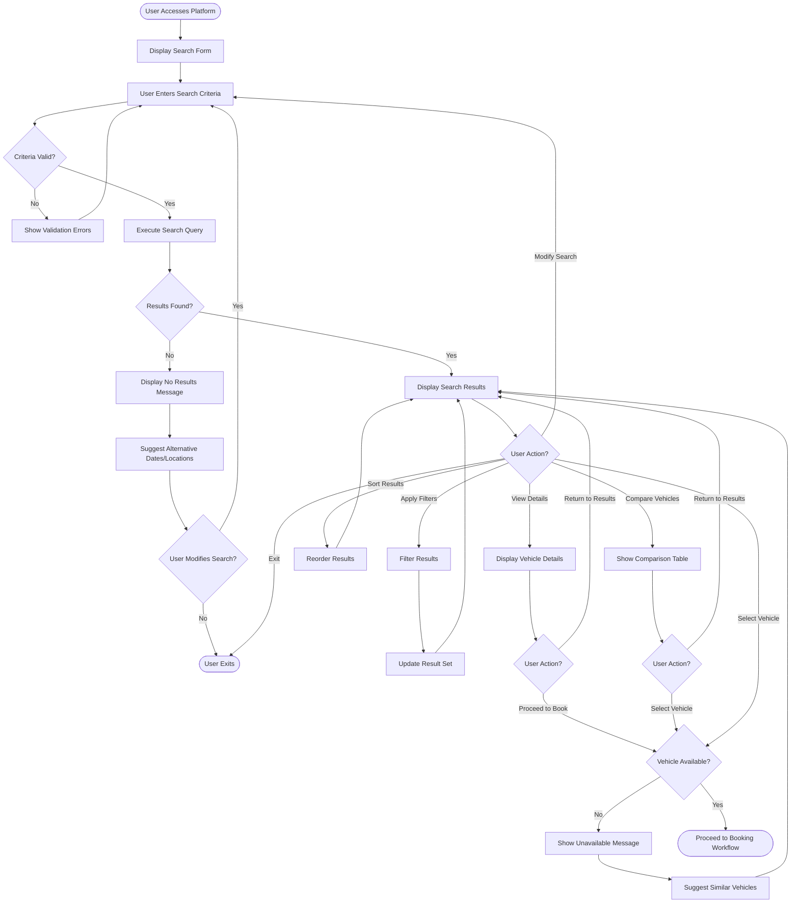

# Vehicle Search Workflow

## Overview

The vehicle search workflow represents the initial interaction between customers and the rental platform. This workflow enables users to discover available vehicles matching their requirements through location-based search, date selection, and multi-criteria filtering. Success in this workflow directly impacts booking conversion rates and customer satisfaction.

## Stakeholder

**Primary**: Individual Customers (leisure travelers, business travelers, temporary need users)

**Secondary**: Corporate Clients (searching for fleet options)

## Goal

Find available rental vehicles that match specific requirements (location, dates, vehicle type, features, and budget) efficiently and confidently.

## Preconditions

### System State
- Vehicle inventory is populated with available vehicles
- Location data is configured with pickup/return points
- Pricing information is current and accurate
- Search functionality is operational

### User State
- User has accessed the platform (web or mobile)
- User knows desired rental location and dates
- User may or may not have an account (guest search allowed)
- User has internet connectivity

## Workflow Steps

### 1. Access Search Interface

**User Action**: Navigate to platform homepage or search page

**System Response**:
- Display search form with location and date fields
- Pre-populate location based on user's geolocation (if permitted)
- Set default dates to current date + 1 day for pickup, +3 days for return
- Show popular locations or recent searches (for returning users)

**Validation**: None required at this stage

### 2. Specify Search Criteria

**User Action**: Enter or select search parameters

**Required Inputs**:
- Pickup location (country, city, or specific parking spot)
- Pickup date and time
- Return location (same as pickup or different for one-way rentals)
- Return date and time

**Optional Inputs**:
- Driver age (affects pricing and availability)
- Preferred vehicle type or category
- Number of passengers

**System Response**:
- Provide location auto-complete suggestions
- Display calendar picker for date selection
- Show time selection in 30-minute increments
- Validate that return date/time is after pickup date/time
- Calculate rental duration and display

**Validation**:
- Pickup date cannot be in the past
- Return date must be after pickup date
- Minimum rental period (typically 1 hour or 1 day)
- Maximum rental period (typically 30-90 days)
- Driver age meets minimum requirements (typically 21+)

### 3. Execute Search

**User Action**: Click "Search" or "Find Vehicles" button

**System Processing**:
- Query vehicle inventory for availability during specified period
- Filter vehicles available at selected locations
- Apply age-based restrictions if applicable
- Calculate pricing for rental duration
- Retrieve vehicle details, images, and specifications
- Load supplier information and ratings
- Sort results by default criteria (typically price or popularity)

**System Response**:
- Display loading indicator during search
- Show number of available vehicles found
- Present search results in grid or list view
- Display key information for each vehicle (image, name, price, features)
- Show applied search criteria with edit option
- Provide filtering and sorting controls

**Error Handling**:
- If no vehicles available: Suggest alternative dates or locations
- If search fails: Display error message and retry option
- If partial results: Show available vehicles with explanation

### 4. Review Search Results

**User Action**: Browse available vehicles

**Information Displayed Per Vehicle**:
- Vehicle image (exterior view)
- Make, model, and year
- Vehicle category (economy, compact, SUV, luxury, etc.)
- Passenger capacity and luggage space
- Transmission type (manual/automatic)
- Fuel type (gasoline, diesel, electric, hybrid)
- Key features (air conditioning, GPS, etc.)
- Daily rate and total rental cost
- Supplier name and rating
- Availability status

**User Options**:
- Scroll through results
- View more details for specific vehicles
- Compare multiple vehicles
- Apply filters to narrow results
- Change sort order
- Modify search criteria

### 5. Apply Filters (Optional)

**User Action**: Select filter criteria to narrow results

**Available Filters**:
- **Price Range**: Minimum and maximum daily rate
- **Vehicle Type**: Diesel, gasoline, electric, hybrid, plug-in hybrid
- **Transmission**: Manual or automatic
- **Vehicle Category**: Mini, midi, maxi, scooter, bus, truck, caravan
- **Capacity**: Number of seats (2, 4, 5, 7, 9+)
- **Features**: Air conditioning, Bluetooth, touchscreen, smartphone integration
- **Fuel Policy**: Like-for-like, free tank, full-to-full, full-to-empty
- **Mileage**: Unlimited or limited mileage
- **Supplier**: Specific rental suppliers
- **Doors**: Number of doors (2, 4, 5)

**System Response**:
- Apply filters in real-time
- Update result count
- Maintain search criteria and other filters
- Show active filters with remove option
- Preserve filter state if user navigates away and returns

**Filter Behavior**:
- Multiple filters within same category use OR logic (e.g., "Manual OR Automatic")
- Filters across categories use AND logic (e.g., "SUV AND Automatic AND Under $50/day")
- Removing all filters returns to full search results

### 6. Sort Results (Optional)

**User Action**: Select sort criteria

**Sort Options**:
- Price: Low to high or high to low
- Rating: Highest rated first
- Popularity: Most frequently booked
- Newest: Recently added vehicles
- Supplier: Alphabetical by supplier name

**System Response**:
- Reorder results based on selected criteria
- Maintain applied filters
- Indicate current sort order
- Preserve sort preference for session

### 7. View Vehicle Details (Optional)

**User Action**: Click on vehicle to view full details

**System Response**:
- Display comprehensive vehicle information page
- Show image gallery with multiple photos
- Present complete specifications and features
- Display pricing breakdown (daily, weekly, monthly rates)
- Show insurance options and costs
- List additional services (GPS, child seats, additional driver)
- Display supplier information and location details
- Show customer reviews and ratings
- Provide availability calendar
- Include environmental information (CO2 emissions)

**User Options**:
- Return to search results
- Proceed to booking
- Compare with other vehicles
- Share vehicle details
- Save vehicle to favorites (if logged in)

### 8. Compare Vehicles (Optional)

**User Action**: Select multiple vehicles for comparison

**System Response**:
- Display side-by-side comparison table
- Show key specifications for each vehicle
- Highlight differences between vehicles
- Display pricing comparison
- Show feature availability matrix
- Include supplier and rating comparison

**Comparison Limit**: Typically 2-4 vehicles maximum

**User Options**:
- Remove vehicles from comparison
- Add different vehicles
- Proceed to book selected vehicle
- Return to search results

### 9. Modify Search (Optional)

**User Action**: Change search criteria

**System Response**:
- Display search form with current criteria pre-filled
- Allow modification of any search parameter
- Re-execute search with new criteria
- Clear previous results
- Reset filters and sort order

**Use Cases**:
- Change dates to find better availability or pricing
- Try different locations
- Adjust rental duration
- Search for one-way vs round-trip rentals

### 10. Proceed to Booking

**User Action**: Select "Book Now" or "Reserve" for chosen vehicle

**System Response**:
- Verify vehicle still available for selected dates
- Transition to booking workflow
- Carry forward search criteria and vehicle selection
- Preserve pricing information
- Maintain session state

**Validation**:
- Confirm vehicle availability hasn't changed
- Verify pricing is still current
- Check for any booking restrictions

## Outcome

### Successful Outcome
- User identifies one or more suitable vehicles
- User has clear understanding of pricing and features
- User proceeds to booking workflow with confidence
- Search criteria and vehicle selection preserved for booking

### Alternative Outcomes
- **No Suitable Vehicles**: User modifies search criteria or exits
- **Price Too High**: User applies filters or changes dates to find better rates
- **Comparison Needed**: User saves vehicles for later comparison or consultation
- **Information Gathering**: User exits to research or compare with other platforms

## Exceptions and Error Handling

### Exception 1: No Vehicles Available

**Trigger**: Search returns zero results

**System Response**:
- Display "No vehicles available" message
- Suggest alternative dates (show availability calendar)
- Suggest nearby locations with availability
- Offer to notify user when vehicles become available
- Provide contact information for assistance

**User Options**:
- Modify search dates
- Try different location
- Sign up for availability alerts
- Contact customer support

### Exception 2: Search Timeout or Failure

**Trigger**: Search query fails or times out

**System Response**:
- Display error message explaining the issue
- Preserve user's search criteria
- Offer retry option
- Provide alternative search method (simplified search)
- Show customer support contact

**User Options**:
- Retry search
- Simplify search criteria
- Contact support
- Try again later

### Exception 3: Invalid Search Criteria

**Trigger**: User enters invalid or conflicting criteria

**System Response**:
- Highlight invalid fields with specific error messages
- Prevent search execution until corrected
- Provide examples of valid input
- Suggest corrections (e.g., "Did you mean [location]?")

**Common Invalid Criteria**:
- Past pickup date
- Return before pickup
- Invalid location
- Rental period too short or too long
- Driver age below minimum

### Exception 4: Pricing Discrepancy

**Trigger**: Price changes between search and booking

**System Response**:
- Display notification of price change
- Show old and new prices
- Explain reason for change (if known)
- Allow user to accept new price or cancel

**User Options**:
- Accept new price and continue
- Return to search to find alternatives
- Contact support for explanation

### Exception 5: Vehicle Becomes Unavailable

**Trigger**: Selected vehicle booked by another user during search session

**System Response**:
- Display "Vehicle no longer available" message
- Suggest similar vehicles still available
- Offer to return to search results
- Preserve search criteria for new search

**User Options**:
- Select alternative vehicle
- Return to search results
- Modify search criteria
- Exit workflow

## Workflow Diagram

## Performance Metrics

### Search Performance
- **Search Execution Time**: Target &lt;2 seconds for results display
- **Filter Application Time**: Target &lt;500ms for filter updates
- **Page Load Time**: Target &lt;3 seconds for initial search page

### User Engagement
- **Search to View Rate**: Percentage of searches resulting in vehicle detail views (target >60%)
- **Search to Booking Rate**: Percentage of searches resulting in bookings (target >15%)
- **Filter Usage Rate**: Percentage of users applying filters (track for UX insights)
- **Average Vehicles Viewed**: Number of vehicle details viewed per search (track for engagement)

### Search Quality
- **Zero Results Rate**: Percentage of searches returning no results (target &lt;10%)
- **Search Refinement Rate**: Percentage of users modifying search criteria (track for usability)
- **Average Results Per Search**: Number of vehicles returned (track for inventory health)

## Related Workflows

- **Booking Creation Workflow**: Next step after vehicle selection
- **Vehicle Comparison Workflow**: Detailed comparison of multiple vehicles
- **Availability Notification Workflow**: Alert users when vehicles become available
- **Saved Search Workflow**: Save and reuse search criteria

## Related Requirements

- **Requirement 4.1**: User scenario documentation with stakeholder, goal, preconditions, steps, and outcome
- **Requirement 4.2**: Workflow documentation with Mermaid diagrams
- **Requirement 4.3**: Core rental operations workflows
- **Requirement 4.6**: Workflow exception handling
- **Requirement 4.7**: Pandoc-compatible markdown format

## Related Stakeholders

- **Individual Customers**: Primary users of search functionality
- **Corporate Clients**: Search for fleet vehicles with specific requirements
- **Fleet Managers**: Ensure vehicle inventory is searchable and well-categorized
- **Administrators**: Configure search parameters and location data

## Related Features

- **Advanced Search & Filtering**: Core search functionality
- **Real-Time Availability**: Accurate vehicle availability checking
- **Transparent Pricing**: Clear price display in search results
- **Vehicle Details & Specifications**: Comprehensive vehicle information
- **Supplier Directory**: Filter and search by supplier
- **Multi-Language Interface**: Search in user's preferred language
- **Responsive Design**: Search on any device
