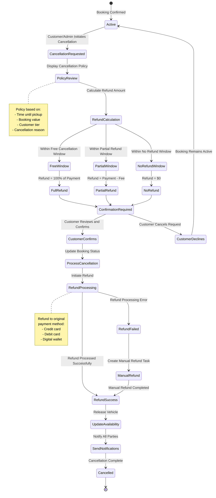

# Booking Cancellation Workflow

## Overview

The booking cancellation workflow handles customer and administrator-initiated cancellations of rental reservations. This workflow enforces cancellation policies, calculates refunds, processes payments, updates vehicle availability, and communicates changes to all affected parties. Proper cancellation handling balances customer flexibility with business revenue protection.

## Stakeholder

**Primary**: Individual Customers, Corporate Clients, System Administrators

**Secondary**: Fleet Managers, Finance Teams, Support Agents

## Goal

Process booking cancellations efficiently and fairly, applying appropriate cancellation policies, calculating accurate refunds, releasing vehicle inventory, and maintaining clear communication with customers while protecting business interests.

## Preconditions

### System State
- Booking exists and is cancellable
- Cancellation policies are configured
- Payment system is operational
- Refund processing is enabled

### User State
- Customer or admin has access to booking
- Booking is not yet completed (vehicle not yet returned)
- Customer understands cancellation policy

## Workflow Steps

### 1. Initiate Cancellation

**Customer Action**: Request booking cancellation

**Initiation Methods**:
- **Self-Service**: Customer cancels via website or mobile app
- **Phone/Email**: Customer contacts support to cancel
- **Admin-Initiated**: Administrator cancels on behalf of customer

**System Response**:
- Retrieve booking details
- Display booking summary
- Show cancellation policy
- Calculate potential refund
- Display cancellation confirmation interface

### 2. Review Cancellation Policy

**System Display**: Show applicable cancellation terms

**Policy Components**:
- **Free Cancellation Window**: Time period for full refund (e.g., 48 hours before pickup)
- **Partial Refund Window**: Time period for partial refund (e.g., 24-48 hours before)
- **No Refund Window**: Time period with no refund (e.g., <24 hours before)
- **Cancellation Fees**: Fixed or percentage-based fees
- **Non-Refundable Items**: Deposits or fees that are never refunded

**Policy Factors**:
- Time until pickup
- Booking value
- Customer tier (loyalty status)
- Reason for cancellation (if applicable)
- Supplier-specific policies (multi-supplier mode)

**System Calculation**:
- Determine which policy window applies
- Calculate refund amount
- Calculate cancellation fee (if applicable)
- Display breakdown to customer

### 3. Confirm Cancellation Intent

**Customer Action**: Review and confirm cancellation

**Confirmation Display**:
- **Booking Details**: Vehicle, dates, location
- **Original Cost**: Total amount paid
- **Cancellation Fee**: Fee amount (if applicable)
- **Refund Amount**: Amount to be refunded
- **Refund Timeline**: When refund will be processed
- **Refund Method**: How refund will be issued

**Customer Options**:
- **Confirm Cancellation**: Proceed with cancellation
- **Modify Instead**: Change booking instead of cancelling
- **Cancel Request**: Keep booking active

**System Validation**:
- Verify booking is still cancellable
- Confirm booking hasn't already been cancelled
- Check for any restrictions (e.g., pickup already occurred)

### 4. Process Cancellation

**System Actions**:
1. Update booking status to "Cancelled"
2. Record cancellation timestamp
3. Log cancellation reason (if provided)
4. Calculate final refund amount
5. Release vehicle from booking
6. Update vehicle availability
7. Cancel any scheduled reminders

**Booking Status Transition**:
```
Confirmed → Cancelled
Pending → Cancelled
Reserved → Cancelled
```

**System Processing**:
- Mark booking as cancelled in database
- Store cancellation details (who, when, why)
- Update booking history
- Trigger refund workflow
- Update analytics and reporting

### 5. Calculate Refund Amount

**System Calculation**:

**Full Refund Scenario**:
- Cancellation within free cancellation window
- Refund = Total amount paid
- No cancellation fee

**Partial Refund Scenario**:
- Cancellation within partial refund window
- Refund = Total amount - Cancellation fee
- Cancellation fee = Fixed amount or percentage

**No Refund Scenario**:
- Cancellation within no-refund window
- Refund = $0
- Customer forfeits entire payment

**Special Cases**:
- **Promotional Bookings**: May have different cancellation terms
- **Corporate Accounts**: May have negotiated cancellation policies
- **Force Majeure**: Exceptional circumstances (natural disasters, etc.)
- **Service Failures**: Full refund regardless of timing

**Refund Components**:
- Base rental cost (refundable)
- Insurance charges (refundable)
- Additional services (refundable)
- Taxes and fees (refundable)
- Non-refundable deposit (not refundable)
- Processing fees (typically not refundable)

### 6. Process Refund

**System Actions**:
1. Initiate refund through payment gateway
2. Refund to original payment method
3. Generate refund transaction record
4. Update booking payment status
5. Send refund confirmation

**Refund Methods**:
- **Credit Card**: Refund to original card (5-10 business days)
- **Debit Card**: Refund to original card (5-10 business days)
- **Digital Wallet**: Refund to wallet (1-3 business days)
- **Cash/Check**: Manual refund process (if original payment was cash)

**Refund Processing**:
- Capture refund authorization
- Process through payment gateway
- Handle refund confirmation
- Update financial records
- Log refund transaction

**Refund Timeline Communication**:
- Immediate: Refund processed by system
- 5-10 business days: Appears on customer statement
- Varies by bank/card issuer

### 7. Update Vehicle Availability

**System Actions**:
- Remove booking from vehicle calendar
- Mark dates as available
- Update vehicle utilization metrics
- Recalculate fleet availability
- Enable vehicle for new bookings

**Availability Updates**:
- Vehicle immediately available for rebooking
- Search results updated in real-time
- Waitlist customers notified (if applicable)
- Dynamic pricing adjusted (if enabled)

### 8. Send Cancellation Notifications

**System Communications**:

**To Customer**:
- Cancellation confirmation email
- Refund details and timeline
- Booking reference number
- Customer service contact information
- Invitation to rebook

**To Internal Teams**:
- Fleet manager notification (vehicle now available)
- Finance team notification (refund processed)
- Support team notification (if customer-initiated)

**Notification Content**:
- Booking details
- Cancellation date and time
- Refund amount and timeline
- Reason for cancellation (if provided)
- Next steps or actions required

### 9. Handle Cancellation Exceptions

**Exception Scenarios**:

**Late Cancellation**:
- Customer cancels after pickup time
- No refund typically issued
- May charge no-show fee
- Document reason for late cancellation

**Partial Service Cancellation**:
- Customer wants to shorten rental period
- Treat as modification, not full cancellation
- Recalculate charges
- Process partial refund if applicable

**Force Majeure Cancellation**:
- Natural disaster, pandemic, government restrictions
- Full refund regardless of policy
- Waive cancellation fees
- Document exceptional circumstances

**Service Failure Cancellation**:
- Vehicle not available at pickup
- Vehicle condition unacceptable
- Full refund plus compensation
- Document service failure

**Disputed Cancellation**:
- Customer disputes cancellation fee
- Review cancellation policy
- Escalate to manager if needed
- Document resolution

### 10. Post-Cancellation Actions

**System Actions**:
- Archive cancelled booking
- Update customer booking history
- Update vehicle rental history
- Adjust revenue forecasts
- Update cancellation rate metrics

**Analytics Updates**:
- Cancellation rate by vehicle, location, time
- Revenue impact of cancellations
- Refund volume and amounts
- Cancellation reasons (if collected)
- Policy effectiveness analysis

**Customer Relationship**:
- Offer incentive to rebook
- Send targeted promotions
- Track cancellation patterns
- Identify at-risk customers

## Outcome

### Successful Outcome
- Booking cancelled in system
- Refund processed according to policy
- Vehicle availability updated
- Customer notified of cancellation and refund
- All parties informed of changes
- Financial records updated

### Alternative Outcomes
- **Modification Instead**: Customer modifies booking instead of cancelling
- **Refund Dispute**: Customer contests refund amount
- **Refund Failure**: Technical issue processing refund
- **Partial Cancellation**: Only part of booking cancelled

## Exceptions and Error Handling

### Exception 1: Refund Processing Failure

**Trigger**: Payment gateway rejects refund

**System Response**:
- Log refund failure
- Create manual refund task
- Notify finance team
- Send customer notification explaining delay

**Resolution**:
- Retry refund automatically
- Process manual refund if needed
- Issue refund via alternative method
- Update customer on resolution

### Exception 2: Cancellation After Pickup

**Trigger**: Customer attempts to cancel after pickup time

**System Response**:
- Display error message
- Explain cancellation not possible after pickup
- Suggest early return instead
- Provide customer support contact

**User Options**:
- Contact support for assistance
- Return vehicle early (may receive partial refund)
- Complete rental as booked

### Exception 3: Disputed Cancellation Fee

**Trigger**: Customer contests cancellation charges

**System Response**:
- Display cancellation policy
- Show policy acceptance from booking
- Calculate refund breakdown
- Provide dispute resolution process

**Resolution Options**:
- Uphold policy (no adjustment)
- Partial fee waiver (goodwill gesture)
- Full fee waiver (exceptional circumstances)
- Escalate to manager for decision

## Workflow Diagram



## Performance Metrics

### Cancellation Metrics
- **Cancellation Rate**: Percentage of bookings cancelled (track trend, target: <10%)
- **Cancellation Lead Time**: Average days before pickup (track trend)
- **Refund Rate**: Percentage of cancellations with refunds (track by policy window)
- **Average Refund Amount**: Mean refund per cancellation (track trend)

### Processing Metrics
- **Cancellation Processing Time**: Time from request to completion (target: <5 minutes)
- **Refund Processing Time**: Time to issue refund (target: <24 hours)
- **Refund Success Rate**: Percentage of refunds processed successfully (target: >98%)
- **Manual Intervention Rate**: Percentage requiring manual processing (target: <5%)

### Customer Impact Metrics
- **Cancellation Satisfaction**: Customer rating of cancellation experience (target: >4.0/5)
- **Dispute Rate**: Percentage of cancellations disputed (target: <5%)
- **Rebook Rate**: Percentage who rebook after cancelling (track for retention)
- **Cancellation Reason Distribution**: Track reasons to identify patterns

## Related Workflows

- **Booking Creation Workflow**: Original booking process
- **Booking Modification Workflow**: Alternative to cancellation
- **Payment Processing Workflow**: Refund processing
- **Vehicle Return Workflow**: Early return handling
- **Dispute Resolution Workflow**: Handling contested cancellations

## Related Requirements

- **Requirement 4.1**: User scenario documentation
- **Requirement 4.2**: Workflow with Mermaid state diagram
- **Requirement 4.5**: Exceptional case workflows
- **Requirement 4.6**: Exception handling
- **Requirement 4.7**: Pandoc-compatible format

## Related Stakeholders

- **Individual Customers**: Primary cancellation initiators
- **Corporate Clients**: Business booking cancellations
- **System Administrators**: Process cancellations on behalf of customers
- **Fleet Managers**: Manage released vehicle availability
- **Finance Teams**: Process refunds and track revenue impact
- **Support Agents**: Handle cancellation requests and disputes

## Related Features

- **Booking Cancellation**: Self-service cancellation
- **Cancellation Policy Engine**: Policy enforcement
- **Refund Processing**: Automated refund handling
- **Payment Gateway Integration**: Refund transaction processing
- **Notification System**: Cancellation communications
- **Analytics Dashboard**: Cancellation metrics and trends
