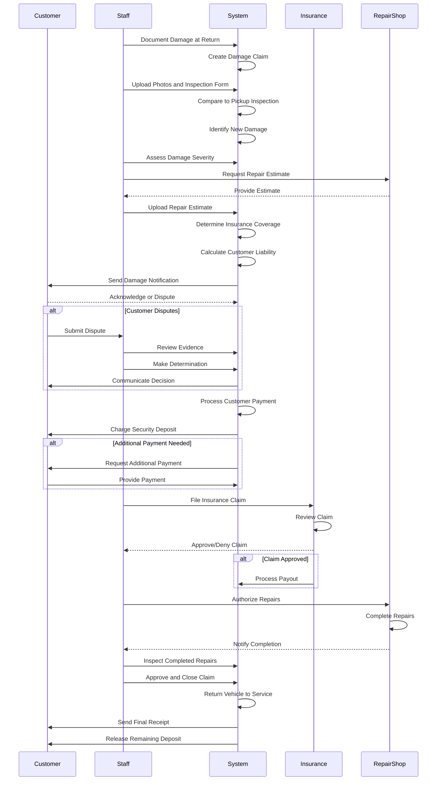

# Damage Claim Processing Workflow

## Overview

The damage claim processing workflow handles the documentation, assessment, and resolution of vehicle damage discovered during or after rentals. This workflow involves damage inspection, cost estimation, insurance coverage determination, customer liability calculation, payment processing, and dispute resolution. Proper damage claim handling protects business assets while treating customers fairly.

## Stakeholder

**Primary**: Fleet Managers, System Administrators, Support Agents

**Secondary**: Individual Customers, Insurance Providers, Finance Teams, Repair Vendors

## Goal

Document and resolve vehicle damage claims accurately and fairly, determining responsibility, calculating costs, applying insurance coverage, charging appropriate parties, processing repairs, and maintaining clear communication throughout the resolution process.

## Preconditions

### System State
- Booking exists with completed or active rental
- Vehicle inspection records available (pickup and return)
- Insurance policies are configured
- Payment system is operational
- Damage assessment tools are available

### User State
- Staff has damage assessment training
- Customer has been notified of damage
- Damage has been documented with photos
- Vehicle is available for inspection

## Workflow Steps

### 1. Damage Discovery

**Discovery Scenarios**:
- **Return Inspection**: Damage found during return inspection
- **During Rental**: Customer reports damage during rental
- **Post-Return**: Damage discovered after customer departure
- **Third-Party Report**: Accident reported by police or other party

**Initial Actions**:
1. Document damage immediately
2. Take timestamped photos
3. Record odometer reading
4. Note customer statement (if present)
5. Secure vehicle from further use
6. Create damage claim record

**System Response**:
- Create damage claim in system
- Link to booking record
- Assign claim number
- Set initial status (reported)
- Notify relevant parties

### 2. Document Damage

**Documentation Requirements**:

**Photographic Evidence**:
- Multiple angles of damage
- Close-up and wide shots
- Surrounding area for context
- Timestamp and location metadata
- Comparison to pickup inspection photos

**Written Description**:
- Damage type (scratch, dent, crack, etc.)
- Damage location (front bumper, driver door, etc.)
- Damage size (length, width, depth)
- Severity assessment (minor, moderate, major)
- Apparent cause (if determinable)

**Inspection Form**:
- Vehicle identification
- Booking reference
- Customer information
- Inspector name and signature
- Date and time of inspection
- Damage diagram with markings

**System Processing**:
- Upload photos to claim record
- Store inspection form
- Link to booking and vehicle records
- Timestamp all documentation
- Generate claim documentation package

### 3. Compare to Pickup Inspection

**Comparison Process**:
1. Retrieve pickup inspection photos and form
2. Compare pickup vs return condition
3. Identify new damage
4. Verify pre-existing damage was documented
5. Determine if damage occurred during rental

**Comparison Outcomes**:
- **New Damage**: Not present at pickup, customer potentially liable
- **Pre-Existing**: Documented at pickup, customer not liable
- **Unclear**: Cannot definitively determine timing

**System Display**:
- Side-by-side photo comparison
- Pickup inspection form
- Return inspection form
- Highlighted differences
- Damage timeline

**Dispute Prevention**:
- Clear documentation at pickup prevents disputes
- Timestamped photos provide evidence
- Customer signature on pickup inspection
- System-generated comparison report

### 4. Assess Damage Severity

**Severity Categories**:

**Minor Damage**:
- Small scratches (&lt;2 inches)
- Minor scuffs or marks
- Small chips or dings
- Typical cost: $50-$200
- May be covered by wear-and-tear policy

**Moderate Damage**:
- Larger scratches or dents
- Cracked mirrors or lights
- Windshield chips
- Typical cost: $200-$1,000
- Usually covered by insurance with deductible

**Major Damage**:
- Body panel damage
- Windshield cracks
- Mechanical damage
- Typical cost: $1,000-$5,000
- Requires insurance claim

**Severe Damage**:
- Multiple panels damaged
- Frame damage
- Total loss
- Typical cost: $5,000+
- Major insurance claim

**Assessment Factors**:
- Repair complexity
- Parts availability
- Labor requirements
- Vehicle downtime
- Diminished value

### 5. Obtain Repair Estimates

**Estimation Process**:
1. Take vehicle to approved repair shop
2. Obtain detailed repair estimate
3. Get parts and labor breakdown
4. Estimate repair timeline
5. Determine if vehicle drivable

**Estimate Components**:
- **Parts**: Replacement parts needed
- **Labor**: Hours and hourly rate
- **Paint**: Painting and finishing
- **Taxes**: Applicable taxes
- **Total**: Complete repair cost

**Multiple Estimates**:
- Obtain 2-3 estimates for major damage
- Compare costs and timelines
- Select most reasonable estimate
- Document selection rationale

**System Processing**:
- Upload repair estimates
- Store vendor information
- Calculate average estimate
- Flag unusually high/low estimates
- Link to claim record

### 6. Determine Insurance Coverage

**Insurance Review**:
1. Check customer's selected insurance
2. Review coverage limits and deductibles
3. Determine what is covered
4. Calculate customer liability
5. Calculate insurance payout

**Insurance Types**:

**No Insurance**:
- Customer liable for full repair cost
- No deductible
- Customer pays 100% of damage

**Collision Damage Waiver (CDW)**:
- Reduces customer liability
- Deductible applies (e.g., $500)
- Customer pays deductible, insurance covers rest

**Full Insurance**:
- Comprehensive coverage
- Low or no deductible
- Customer pays minimal amount

**Third-Party Insurance**:
- Customer's personal auto insurance
- Requires claim with customer's insurer
- May have different deductible

**Coverage Calculation**:
```
Total Repair Cost: $2,500
Insurance: CDW with $500 deductible
Customer Liability: $500
Insurance Coverage: $2,000
```

**System Processing**:
- Retrieve insurance details from booking
- Apply coverage rules
- Calculate customer liability
- Calculate insurance claim amount
- Generate coverage summary

### 7. Notify Customer

**Notification Content**:
- Damage description and photos
- Repair estimate
- Insurance coverage details
- Customer liability amount
- Payment timeline
- Dispute process

**Notification Methods**:
- Email with detailed claim information
- Phone call for major damage
- Certified mail for legal documentation
- In-app notification

**Customer Communication**:
- Explain damage clearly
- Show comparison photos
- Provide repair estimate
- Explain insurance coverage
- Clarify customer responsibility
- Offer payment options

**System Actions**:
- Send automated notification email
- Create customer service ticket
- Log notification in claim record
- Set response deadline
- Track customer acknowledgment

### 8. Process Customer Payment

**Payment Scenarios**:

**Charge to Security Deposit**:
- Capture from authorized deposit
- If liability < deposit, capture partial amount
- If liability > deposit, request additional payment
- Release remaining deposit

**Additional Payment Required**:
- Request payment for amount exceeding deposit
- Charge to booking payment method
- Offer payment plan for large amounts
- Send invoice if immediate payment not possible

**No Payment Required**:
- Damage covered by insurance
- Damage below deductible threshold
- Damage determined not customer's fault

**Payment Processing**:
1. Calculate final customer liability
2. Capture from security deposit
3. Request additional payment if needed
4. Process payment through gateway
5. Generate receipt
6. Update claim status

**System Processing**:
- Calculate payment amount
- Authorize payment
- Capture payment
- Generate receipt
- Update financial records
- Log payment in claim record

### 9. File Insurance Claim

**Insurance Claim Process**:
1. Prepare claim documentation
2. Submit to insurance provider
3. Provide required evidence
4. Follow up on claim status
5. Receive insurance payout

**Claim Documentation**:
- Damage photos and inspection forms
- Repair estimates
- Police report (if applicable)
- Customer statement
- Rental agreement
- Insurance policy details

**Insurance Communication**:
- Submit claim electronically or by mail
- Provide claim number to customer
- Track claim status
- Respond to insurance inquiries
- Receive claim decision

**System Processing**:
- Generate insurance claim package
- Track claim submission
- Monitor claim status
- Record insurance payout
- Update claim record

### 10. Authorize Repairs

**Repair Authorization**:
1. Review and approve repair estimate
2. Select repair vendor
3. Schedule repair appointment
4. Authorize repair work
5. Set vehicle status to "In Repair"

**Repair Tracking**:
- Monitor repair progress
- Track estimated completion date
- Receive updates from repair shop
- Inspect completed repairs
- Approve final work

**System Processing**:
- Create repair work order
- Link to claim record
- Update vehicle status
- Block vehicle from bookings
- Track repair costs
- Monitor completion timeline

### 11. Handle Disputes

**Dispute Scenarios**:
- Customer contests liability
- Customer disputes damage amount
- Customer claims pre-existing damage
- Customer disputes insurance coverage

**Dispute Resolution Process**:
1. Review customer dispute
2. Examine all evidence
3. Compare pickup/return inspections
4. Consult with manager
5. Make fair determination
6. Communicate decision
7. Adjust charges if warranted

**Evidence Review**:
- Pickup inspection photos
- Return inspection photos
- Customer statements
- Witness statements (if any)
- Police reports (if applicable)
- Repair estimates

**Resolution Options**:
- **Uphold Charges**: Evidence supports original assessment
- **Reduce Charges**: Partial liability or goodwill adjustment
- **Waive Charges**: Insufficient evidence or company error
- **Escalate**: Complex cases to legal or management

**System Processing**:
- Flag claim as disputed
- Store dispute details
- Track resolution timeline
- Update claim status
- Log final decision
- Adjust charges if needed

### 12. Close Claim

**Claim Closure**:
1. Verify all payments received
2. Confirm repairs completed
3. Return vehicle to service
4. Archive claim documentation
5. Update vehicle history
6. Close claim record

**Final Actions**:
- Release security deposit (if not fully captured)
- Send final receipt to customer
- Update vehicle maintenance records
- Return vehicle to available inventory
- Generate claim summary report
- Archive all documentation

**System Processing**:
- Update claim status to "Closed"
- Release vehicle from repair status
- Update vehicle availability
- Archive claim documents
- Update analytics and reporting
- Generate closure notification

## Outcome

### Successful Outcome
- Damage documented thoroughly
- Liability determined fairly
- Customer charged appropriately
- Insurance claim processed
- Repairs completed
- Vehicle returned to service
- Claim closed and archived

### Alternative Outcomes
- **Disputed Claim**: Customer contests charges, requires resolution
- **Insurance Denial**: Insurance doesn't cover damage, customer liable for full amount
- **Total Loss**: Vehicle not repairable, insurance total loss claim
- **Third-Party Liability**: Other party responsible, pursue their insurance

## Exceptions and Error Handling

### Exception 1: Customer Disputes Damage

**Trigger**: Customer claims damage was pre-existing

**System Response**:
- Flag claim as disputed
- Retrieve pickup inspection evidence
- Generate comparison report
- Escalate to manager review

**Resolution Process**:
- Review all evidence
- Compare photos carefully
- Consider customer history
- Make fair determination
- Document decision rationale

### Exception 2: Insurance Claim Denied

**Trigger**: Insurance provider denies coverage

**System Response**:
- Notify customer of denial
- Explain reason for denial
- Calculate full customer liability
- Request payment from customer
- Provide appeal process

**Customer Options**:
- Pay full amount
- Appeal insurance decision
- Set up payment plan
- Dispute liability

### Exception 3: Repair Cost Exceeds Estimate

**Trigger**: Actual repair cost higher than estimate

**System Response**:
- Obtain revised estimate
- Notify customer of increase
- Recalculate customer liability
- Request additional payment if needed

**Approval Process**:
- Review reason for increase
- Approve additional cost
- Update claim amount
- Process additional payment

## Workflow Diagram



## Performance Metrics

### Claim Processing Metrics
- **Average Claim Resolution Time**: Days from damage discovery to closure (target: &lt;14 days)
- **Claim Volume**: Number of claims per 1000 rentals (track trend, target: &lt;5)
- **Average Claim Cost**: Mean cost per claim (track trend)
- **Customer Liability Rate**: Percentage of cost charged to customers (track trend)

### Dispute Metrics
- **Dispute Rate**: Percentage of claims disputed (target: &lt;10%)
- **Dispute Resolution Time**: Days to resolve disputes (target: &lt;7 days)
- **Dispute Overturn Rate**: Percentage of disputes resulting in charge adjustment (track for fairness)
- **Customer Satisfaction**: Rating of claim handling (target: >4.0/5)

### Financial Metrics
- **Insurance Recovery Rate**: Percentage of costs recovered from insurance (track trend)
- **Collection Rate**: Percentage of customer charges collected (target: >95%)
- **Average Repair Cost**: Mean cost per repair (track trend)
- **Vehicle Downtime Cost**: Revenue lost during repairs (track for optimization)

## Related Workflows

- **Vehicle Return Workflow**: Damage discovery during return
- **Vehicle Inspection Workflow**: Documentation at pickup and return
- **Payment Processing Workflow**: Charging customers for damage
- **Insurance Claim Workflow**: Filing and tracking insurance claims
- **Dispute Resolution Workflow**: Handling contested claims

## Related Requirements

- **Requirement 4.1**: User scenario documentation
- **Requirement 4.2**: Workflow with Mermaid sequence diagram
- **Requirement 4.5**: Exceptional case workflows
- **Requirement 4.6**: Exception handling
- **Requirement 4.7**: Pandoc-compatible format

## Related Stakeholders

- **Fleet Managers**: Oversee damage claims and repairs
- **System Administrators**: Process claims in system
- **Support Agents**: Handle customer communications and disputes
- **Individual Customers**: Potentially liable for damage
- **Insurance Providers**: Process insurance claims
- **Finance Teams**: Track claim costs and collections
- **Repair Vendors**: Provide estimates and complete repairs

## Related Features

- **Damage Documentation**: Photo upload and inspection forms
- **Insurance Coverage Calculation**: Determine liability
- **Payment Processing**: Charge customers for damage
- **Claim Tracking**: Monitor claim status and progress
- **Dispute Management**: Handle contested claims
- **Repair Management**: Track repair work orders
- **Analytics Dashboard**: Claim metrics and trends
