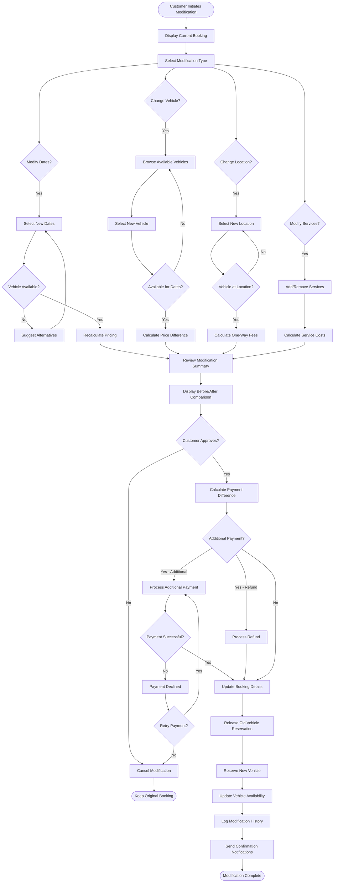

# Booking Modification Workflow

## Overview

The booking modification workflow enables customers and administrators to change existing reservations without cancelling and rebooking. This workflow handles date changes, vehicle swaps, location changes, and service additions/removals while recalculating pricing, checking availability, and processing payment adjustments. Flexible modification capabilities improve customer satisfaction and reduce cancellations.

## Stakeholder

**Primary**: Individual Customers, Corporate Clients, System Administrators

**Secondary**: Fleet Managers, Support Agents, Payment Processors

## Goal

Modify existing bookings efficiently and accurately, checking availability for requested changes, recalculating pricing, processing payment adjustments, and updating all affected systems while maintaining clear communication with customers.

## Preconditions

### System State
- Booking exists and is modifiable
- Modification policies are configured
- Vehicle inventory is available
- Payment system is operational

### User State
- Customer or admin has access to booking
- Booking has not been completed
- Requested changes are within modification policy

## Workflow Steps

### 1. Initiate Modification

**Customer Action**: Request booking modification

**Modification Types**:
- **Date Change**: Modify pickup or return dates/times
- **Vehicle Change**: Switch to different vehicle
- **Location Change**: Change pickup or return location
- **Service Addition**: Add insurance, GPS, child seats, etc.
- **Service Removal**: Remove previously added services
- **Duration Change**: Extend or shorten rental period

**System Response**:
- Display current booking details
- Show modification options
- Display modification policy
- Provide modification interface

### 2. Select Modification Type

**User Action**: Choose what to modify

**System Display**:
- Current booking summary
- Available modification options
- Modification restrictions (if any)
- Potential cost impact

### 3. Modify Dates

**User Action**: Change pickup or return dates/times

**Date Modification Options**:
- **Extend Rental**: Later return date
- **Shorten Rental**: Earlier return date
- **Shift Dates**: Move entire rental period
- **Change Pickup Time**: Different pickup time same day
- **Change Return Time**: Different return time same day

**System Processing**:
1. Check vehicle availability for new dates
2. Calculate new rental duration
3. Recalculate pricing based on new duration
4. Check for rate changes (seasonal pricing)
5. Calculate price difference
6. Display new total cost

**Availability Check**:
- Verify vehicle available for new dates
- Check for conflicts with other bookings
- Suggest alternative dates if unavailable
- Show alternative vehicles if needed

**Pricing Recalculation**:
- Apply current rates for new dates
- Calculate discount for longer rentals
- Apply seasonal pricing if applicable
- Calculate additional charges or refunds
- Display before/after comparison

### 4. Change Vehicle

**User Action**: Switch to different vehicle

**Vehicle Change Scenarios**:
- **Upgrade**: Switch to higher category
- **Downgrade**: Switch to lower category
- **Same Category**: Switch to different vehicle in same category
- **Feature-Based**: Switch for specific features

**System Processing**:
1. Display available vehicles for booking dates
2. Show vehicles in same and different categories
3. Calculate price difference
4. Check availability of requested vehicle
5. Display vehicle comparison

**Price Adjustment**:
- Calculate difference in daily rates
- Multiply by rental duration
- Add/subtract from original total
- Display new total cost
- Show savings or additional cost

**Vehicle Availability**:
- Show only available vehicles
- Filter by location and dates
- Display vehicle features and specifications
- Show customer reviews and ratings

### 5. Change Location

**User Action**: Modify pickup or return location

**Location Change Types**:
- **Pickup Location**: Different pickup location
- **Return Location**: Different return location (one-way rental)
- **Both Locations**: Change both pickup and return

**System Processing**:
1. Display available locations
2. Check vehicle availability at new location
3. Calculate one-way fees (if applicable)
4. Recalculate total cost
5. Update booking locations

**One-Way Rental Fees**:
- Calculate distance between locations
- Apply one-way rental fee
- Add to total cost
- Display fee breakdown

**Location Restrictions**:
- Some vehicles may not be available at all locations
- One-way rentals may have restrictions
- International one-way may not be allowed

### 6. Add or Remove Services

**User Action**: Modify additional services

**Service Modifications**:
- **Add Insurance**: Upgrade coverage
- **Remove Insurance**: Downgrade coverage
- **Add Equipment**: GPS, child seats, etc.
- **Remove Equipment**: Cancel equipment rental
- **Add Additional Driver**: Add authorized driver
- **Remove Additional Driver**: Remove driver

**System Processing**:
1. Display current services
2. Show available services to add
3. Calculate cost for new services
4. Calculate refund for removed services
5. Recalculate total cost
6. Update booking services

**Service Pricing**:
- Daily rate × rental duration
- One-time fees (where applicable)
- Prorated refunds for removed services
- Display itemized cost breakdown

### 7. Review Modification Summary

**System Display**: Show complete modification details

**Summary Components**:
- **Original Booking**: Initial details and cost
- **Requested Changes**: What is being modified
- **New Booking Details**: Updated information
- **Price Comparison**:
  - Original total cost
  - New total cost
  - Additional charges or refund amount
- **Modification Policy**: Any fees or restrictions
- **Availability Confirmation**: New dates/vehicle available

**User Review**:
- Review all changes
- Verify new details are correct
- Understand price impact
- Confirm availability

### 8. Process Payment Adjustment

**System Calculation**:

**Additional Payment Required**:
- New cost > Original cost
- Charge difference to payment method
- Process additional payment
- Update booking total

**Refund Due**:
- New cost < Original cost
- Refund difference to original payment method
- Process refund
- Update booking total

**No Payment Change**:
- New cost = Original cost
- No payment processing needed
- Update booking details only

**Payment Processing**:
1. Calculate payment difference
2. Authorize additional payment or refund
3. Process through payment gateway
4. Update payment records
5. Generate updated receipt

### 9. Update Booking

**System Actions**:
1. Update booking with new details
2. Release old vehicle reservation (if vehicle changed)
3. Reserve new vehicle (if vehicle changed)
4. Update vehicle availability calendars
5. Recalculate booking metrics
6. Log modification in booking history
7. Update search index

**Booking History**:
- Record original booking details
- Record modification details
- Timestamp modification
- Log who made modification
- Store reason for modification (if provided)

### 10. Send Modification Confirmations

**System Communications**:

**To Customer**:
- Modification confirmation email
- Updated booking details
- New pickup/return information
- Payment adjustment details
- Updated booking reference

**To Internal Teams**:
- Fleet manager (if vehicle changed)
- Location staff (if location changed)
- Finance team (if payment adjusted)

**Confirmation Content**:
- Original vs new booking details
- Modification date and time
- Payment adjustment amount
- New total cost
- Updated pickup instructions

## Outcome

### Successful Outcome
- Booking modified successfully
- New details confirmed and available
- Payment adjustment processed
- Vehicle availability updated
- Customer notified of changes
- All systems updated

### Alternative Outcomes
- **Unavailable**: Requested changes not available
- **Price Increase**: Customer declines due to cost
- **Payment Failure**: Additional payment declined
- **Partial Modification**: Only some changes applied

## Exceptions and Error Handling

### Exception 1: Vehicle Unavailable for New Dates

**Trigger**: Requested vehicle not available for modified dates

**System Response**:
- Display unavailability message
- Suggest alternative dates
- Suggest alternative vehicles
- Show availability calendar

**User Options**:
- Choose different dates
- Choose different vehicle
- Keep original booking
- Cancel booking

### Exception 2: Payment Declined for Additional Charges

**Trigger**: Additional payment authorization fails

**System Response**:
- Display payment declined message
- Preserve modification request
- Request alternative payment method
- Provide customer support contact

**User Options**:
- Try different payment method
- Cancel modification
- Contact support

### Exception 3: Modification Not Allowed

**Trigger**: Modification violates policy or restrictions

**System Response**:
- Display restriction message
- Explain why modification not allowed
- Suggest alternatives
- Provide cancellation option

**Common Restrictions**:
- Too close to pickup time
- Booking already started
- Special rate restrictions
- Corporate account limitations

## Workflow Diagram

## Performance Metrics

### Modification Metrics
- **Modification Rate**: Percentage of bookings modified (track trend)
- **Modification Lead Time**: Average days before pickup (track trend)
- **Modification Type Distribution**: Most common modification types (track for insights)
- **Modification Success Rate**: Percentage completed successfully (target: >90%)

### Processing Metrics
- **Modification Processing Time**: Time from request to completion (target: <5 minutes)
- **Payment Processing Time**: Time to process payment adjustments (target: <30 seconds)
- **Availability Check Time**: Time to verify availability (target: <2 seconds)
- **Price Recalculation Time**: Time to calculate new pricing (target: <1 second)

### Business Impact Metrics
- **Modification vs Cancellation**: Modifications preventing cancellations (track ratio)
- **Average Price Change**: Mean price difference per modification (track trend)
- **Upgrade Rate**: Percentage of modifications that are upgrades (track for revenue)
- **Customer Satisfaction**: Rating of modification experience (target: >4.5/5)

## Related Workflows

- **Booking Creation Workflow**: Original booking process
- **Booking Cancellation Workflow**: Alternative to modification
- **Payment Processing Workflow**: Payment adjustments
- **Vehicle Search Workflow**: Finding alternative vehicles
- **Vehicle Availability Management**: Checking and updating availability

## Related Requirements

- **Requirement 4.1**: User scenario documentation
- **Requirement 4.2**: Workflow with Mermaid flowchart
- **Requirement 4.5**: Exceptional case workflows
- **Requirement 4.6**: Exception handling
- **Requirement 4.7**: Pandoc-compatible format

## Related Stakeholders

- **Individual Customers**: Primary modification requesters
- **Corporate Clients**: Business booking modifications
- **System Administrators**: Process modifications on behalf of customers
- **Fleet Managers**: Manage vehicle availability changes
- **Support Agents**: Handle modification requests and issues
- **Payment Processors**: Process payment adjustments

## Related Features

- **Booking Modification**: Self-service modification
- **Dynamic Pricing**: Recalculate pricing for changes
- **Vehicle Availability**: Real-time availability checking
- **Payment Processing**: Handle payment adjustments
- **Notification System**: Modification confirmations
- **Booking History**: Track modification history
